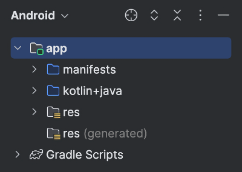
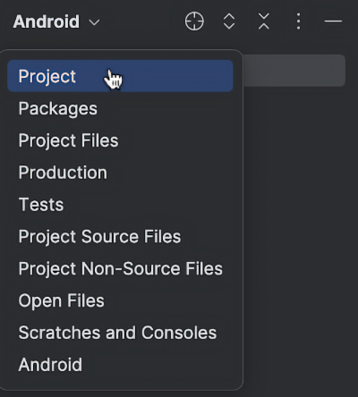
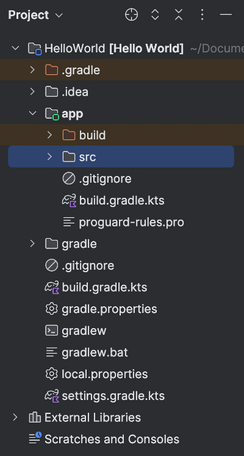
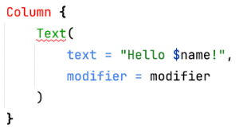
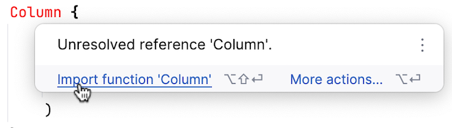
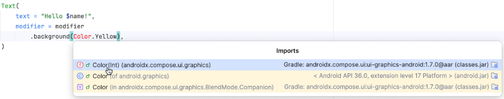
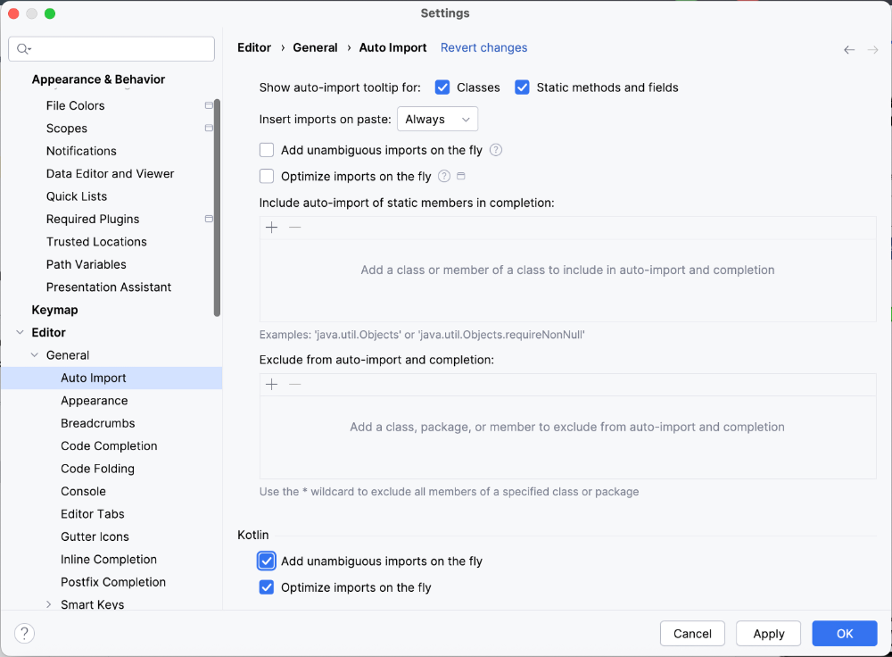
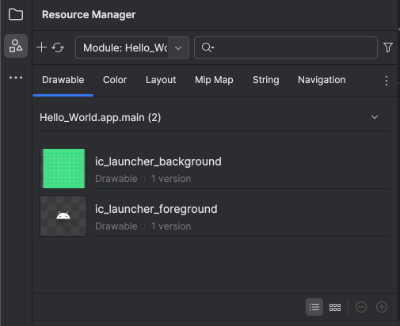
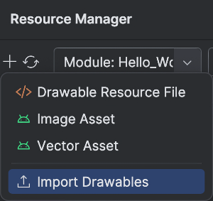
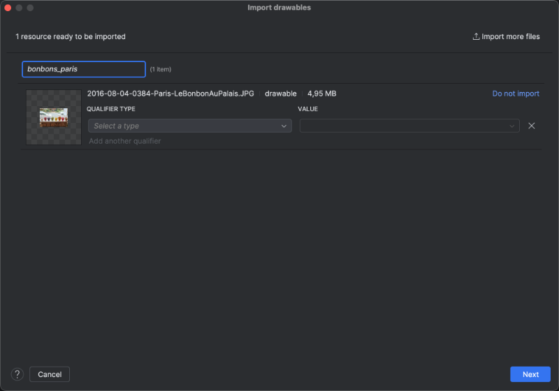

# Android Studio et gestionnaire de ressources


### 13.1 Les raccourcis-clavier d'Android Studio


Puisque Android Studio est basé sur IntelliJ, plusieurs raccourcis-clavier utilisés par les habitués de Jetbrains sont disponibles dans Android Studio.


Voici les principaux raccourcis-clavier que vous utiliserez lors de vos séances de programmation.


### Recheche


#### Raccourci Windows
Rôle
Équivalent Mac


#### Rechercher un nom de fichier dans tout le projet


#### Ctrl + Maj + N


#### Permet d'ouvrir un fichier beaucoup plus
rapidement que s'il fallait rechercher dans toute la
hiérarchie de fichiers.


#### ⌘ Cmd + ⇧ Maj + O


#### Afficher la liste des derniers fichiers consultés


#### Ctrl + E


#### ⌘ Cmd + E


#### Permet donc d'ouvrir rapidement un fichier déjà
consulté, en cliquant sur son nom.


#### Rechercher un mot - boîte de dialogue avancée.
Permet notamment de rechercher un mot dans
tout le projet.


#### Ctrl + Maj + F


#### ⌘ Cmd + ⇧ Maj + F


#### Ctrl + F
Rechercher un mot dans le document actif
⌘ Cmd + F


#### Maj - Maj
Rechercher partout (un menu, une action, un
symbole)


#### ⇧ Maj - ⇧ Maj


#### Ctrl + N
Rechercher une classe dans tout le projet
⌘ Cmd + O


#### Ctrl + Maj + N :numéro Rechercher un nom de fichier dans tout le projet


#### ou l'ouvrir directement à la ligne demandée
.


#### Mettre en surbrillance toutes les occurrences d'un
mot dans la page actuelle (F3 pour passer à
l'occurence suivante, Esc pour enlever la
surbrillance)
Permet notamment de voir rapidement tous les
points de sortie d'une fonction (tous les return).


#### ⌘ Cmd + ⇧ Maj + F7 (selon le clavier, peut
nécessiter la touche Fn pour accéder aux
touches de fonction)


#### Ctrl + Maj + F7


#### Rechercher une option de menu ou une action de
la barre d'outils (ex : pour retrouver l'option
permettant de réaligner le code, entrez
« reformat »)


#### Ctrl + Maj + A


#### ⌘ Cmd + ⇧ Maj + A


#### Ctrl + Maj + Alt + N
Rechercher un symbole. Utile pour retrouver une
méthode par son nom.
.


#### .
.
.


### Commentaires


#### Raccourci
Windows
Rôle
Équivalent Mac


#### Ctrl + /
Mettre en commentaire ou enlever les marques de
commentaires


#### ⌘ Cmd + / (selon le clavier, pourrait être
plutôt ⌘ Cmd + É )


#### .
.
.


### Édition


#### Raccourci Windows
Rôle
Équivalent Mac


#### Ctrl + Espace
Complétion de code (fonctionne dans l'édition
d'un fichier et dans la zone de recherche)


#### ⌃ Ctrl + Espace


#### Ctrl + Maj + Entrée
Complétion d'une instruction comme if, while, try-
catch, etc.


#### ⌘ Cmd + ⇧ Maj + ↵ Entrée


#### Ctrl + Y
Supprimer une ligne
⌘ Cmd + ⌫ Retour arrière


#### Ctrl + D
Dupliquer une ligne
⌘ Cmd + D


Shift + Alt + Flèche haut


⇧ Maj + ⌥ Option + Flèche haut


#### Déplacer une ligne


ou


ou


Shift + Alt + Flèche bas


⇧ Maj + ⌥ Option + Flèche bas


#### Ctrl + Alt + L
Refaire l'alignement du code (reformat)
⌘ Cmd + ⌥ Option + L


#### Ctrl + W
Étendre la sélection
.


#### Ctrl + Alt + Maj +Sélection Sélectionner une colonne sur plusieurs lignes


#### ⌥ Option + ⇧ Maj +Sélection


#### (sélection rectangulaire)


#### Ctrl + Alt + V
Extraire le code sélectionné pour en faire une
variable
.


#### Ctrl + Alt + M
Extraire le code sélectionné pour en faire une
méthode
.


#### Ctrl + Maj + V
Coller à partir d'une sélection précédente
.


#### Afficher tous les endroits où une classe, une
méthode ou une fonction est utilisée dans le
projet (find in usages)


#### ⌥ Option + F7 (selon le clavier, peut
nécessiter la touche Fn pour accéder aux
touches de fonction)


#### Alt + F7


Sélecteur multiple : permet d'éditer plusieurs lignes
simultanément. Cette fonctionnalité s'appelle également
curseurs mutiples.


Par exemple, pour modifier un mot à plusieurs endroits dans le
fichier, faire un Ctrl + F  (Windows) ou Cmd + F (Mac) sur
ce mot puis faites Alt +Clic à chaque endroit où la
modification doit être apportée.


Une fois qu'un mot est sélectionné, il est également possible de
faire Alt + J (Windows) ou Ctrl + G (Mac) pour
sélectionner automatiquement l'occurence suivante.


#### Alt +Clic


#### ⌥ Option +Clic


Vous pouvez ensuite entrer les modifications désirées : chaque
lettre sera écrite à chaque endroit où il y a un curseur.


!!! warning "Note : Lorsqu'on a d"
    Note : Lorsqu'on a des curseurs mutiples, Alt +Clic
directement sur un des curseurs (et non n'importe où sur un
mot sélectionné) supprimera ce curseur.


Pour sortir du mode Sélection multiple, appuyez sur Esc  (Mac
ou Windows).


Parfois, il faut plutôt appuyer sur  Maj + Cmd + 8 (Mac).


#### Sélectionner la prochaine occurence du mot
actuellement sélectionné, créant une sélection
multiple (peut être fait à répétition pour
sélectionner toutes les occurences dans la page).


#### Ceci permet donc de faire automatiquement
l'équivalent d'un Alt +Clic sur la prochaine


#### Alt + J


#### ⌃ Ctrl + G


#### occurence du mot puis de modifier l'ensemble de
ces mots.


!!! warning "Note : Lorsqu'on a d"
    Note : Lorsqu'on a des curseurs mutiples, Alt +Clic sous
Windows ou


⌥ Option +Clic sous Mac, directement sur un des curseurs (et
non n'importe où sur un mot sélectionné) supprimera ce
curseur.


#### Ctrl + B ou Ctrl +Clic
Atteint la définition d'une méthode
⌘ Cmd + B ou ⌘ Cmd +Clic


#### Alt + Entrée
Affiche la définition d'une méthode dans un
popup


#### ⌥ Option + ↵ Entrée


#### Place le curseur à la dernière ligne où une
modification a été effectuée, sans défaire cette
modification.


#### Ctrl + Maj + Retour arrière


#### .


#### Lorsque le curseur est entre les parenthèses de
l'appel d'une fonction, affiche les paramètres à
entrer.


#### Ctrl + P


#### .


#### Ctrl + Maj + J
Joindre les lignes sélectionnées et enlever les
espaces superflus (Smart Line Join).


#### ⌃ Ctrl + ⇧ Maj + J


#### Entourer le code sélectionné à l'aide d'une
structure de code suggérée par PhpStorm selon
le contexte.


#### Ctrl + Alt + T


#### .


#### Ctrl + Alt + J
 Entourer le code sélectionné à l'aide d'un Live
Template.
.


Sur la ligne qui précède la définition d'une fonction : ajoute
automatiquement l'en-tête standard de la fonction avec la
syntaxe KDoc.


#### /** suivi de Entrée


#### /** suivi de ↵ Entrée


Il ne vous reste plus qu'à compléter l'en-tête.


#### .
.
.


### Gestion de versions


#### Raccourci
Windows
Rôle
Équivalent
Mac


#### Alt + Maj + C
Obtenir la liste des modifications récentes dans le projet
.


#### Alt + 9
Ouvrir la fenêtre "Local Changes" qui liste tous les fichiers ajoutés, modifiés ou
supprimés et qui permet d'effectuer la gestion des versions


#### ⌘ Cmd + 9


#### .
.
.


### Navigation


#### Raccourci
Windows
Rôle
Équivalent
Mac


Alt + flèche haut


#### Passer à la méthode précédente ou suivante
.


ou


Alt + flèche bas


#### Aller à la prochaine erreur ou au prochain avertissement détecté par l'analyseur de code
(si un icône de point d'exclamation rouge ou un carré jaune apparaît dans le coin
supérieur droit de la fenêtre d'édition). Vous pouvez faire un clic droit sur le point
d'exclamation rouge et choisir « Go to high priority problems only » pour que F2 n'arrête
que sur les erreurs et non sur les avertissements.


#### .


F2


#### Alt + 7
Afficher la liste des méthodes de la classe dans la zone de gauche de l'éditeur (on pourra
cliquer sur le nom d'une méthode pour y accéder directement)


#### ⌘ Cmd + 7


#### Alt + 1
Affiche la liste des fichiers du projet
⌘ Cmd + 1


#### Ctrl +Clic sur le


#### Place le curseur sur la définition de la fonction
.


#### nom d'une
fonction


Afficher la liste des membres de la classe présentement éditée.


#### Ctrl + F12


#### Pour atteindre une méthode, commencer à taper son nom puis quand le nom apparaît, appuyer sur Enter .
.


#### .
.
.


### Autres


#### Raccourci Windows
Rôle
Équivalent Mac


#### Entourer le code sélectionné. Un menu contextuel offrira différentes options,
dont les très intéressantes régions qui permettent de "replier" et de "déplier"
des sections du code pour faciliter la navigation dans de longs fichiers.


#### Ctrl + Alt + T


⌘ Cmd + ⌥ Option + T


#### Alt + F12
Ouvrir le terminal
.


#### (Quick definition viewer) Afficher les détails de la définition d'une fonction
sans changer de page ou afficher l'image référencée par la balise HTML sous
le curseur.


#### Ctrl + Maj + I


#### .


#### Pointer une fonction et
appuyer sur Ctrl
Afficher la définition de la fonction sans se déplacer vers cette définition.
.


#### .
.
.


#### .
.
.


#### .
.
.


#### .
.
.


#### Pour plus d'information


### « Keyboard shortcuts ». Android Developers. https://developer.android.com/studio/intro/keyboard-shortcuts
13.2 Certains dossiers ne s'affichent pas dans Android Studio


Android Studio vous offre plusieurs modes pour afficher les fichiers du projet.


Selon le mode choisi, il est possible de ne voir que certains dossiers.


<div style="text-align: center; margin: 1.5em 0;">
  
</div>


Si certains fichiers ou dossiers ne sont pas visibles, par exemple le dossier src , c'est que le mode d'affichage réorganise les fichiers plutôt que de les montrer tels
qu'ils sont dans le système de fichiers du système d'exploitation.


Par exemple, dans le mode Android, les fichiers du dossier  /app/src/main/res/drawable apparaissent sous app/res/drawable .


Si vous préférez l'affichage qui correspond au système d'exploitation, cliquez sur la liste déroulante dans le haut de la zone qui affiche les fichiers du projet puis
sélectionnez Project  ou Project Files .


<div style="text-align: center; margin: 1.5em 0;">
  
</div>


Vous verrez désormais l'intégralité des fichiers et dossiers.


<div style="text-align: center; margin: 1.5em 0;">
  
</div>


### 13.3 Renommer un projet


Voici les étapes pour renommer un projet dans Android Studio sans laisser de traces de l'ancien nom.


#### Refermez le projet dans Android Studio.


#### Renommez le dossier principal du projet (ex : MonNouveauProjet).


#### Supprimez le fichier .idea .


#### Dans votre système de fichiers, renommez le dossier du projet
en  app/src/main/java/com/mondomaine/ monnouveauprojet .


#### Réouvrez le projet dans Android Studio.


#### Dans le fichier settings.gradle.kts , entrez le nom du projet avec les espaces et accents requis à la ligne
rootProjetc.name.


```kotlin title="Fichier settings.gradle.kts"
rootProject.name = " Mon nouveau projet "
```


#### Dans le fichier build.gradle.kts du dossier app , ajustez le namespace et le applicationId.


```kotlin title="Fichier app/build.gradle.kts"
android {
    namespace = "com.mondomaine. monnouveauprojet "
    ...
   defaultConfig {
      applicationId = "com.mondomaine. monnouveauprojet "
      ...
   }
}
```


#### Faites une recherche sur l'ancien namespace dans tout le projet. Sous Windows :  Ctrl + Maj + F . Sous
Mac : ⌘ Cmd + ⇧ Maj + F . Vous devrez le corriger partout où il était utilisé comme nom de package, par exemple


#### dans les fichiers :


#### MainActivity.kt


#### Theme.kt


#### Color.kt,


#### Type.kt


#### ExampleUnitTest.kt


#### Dans le fichier Theme.kt, modifiez le nom de la fonction du thème.


```kotlin title="Fichier Theme.kt"
@Composable
fun MonNouveauProjetTheme (
    ...
}
```


#### Dans le fichier MainActivity.kt , corrigez le nom dans l'instruction import puis modifiez le nom de la fonction du thème.


```kotlin title="Fichier MainActivity.kt"
...
import com.mondomaine. monnouveauprojet .ui.theme. MonNouveauProjetTheme
...
class MainActivity : ComponentActivity() {
    ...
    setContent {
         MonNouveauProjetTheme {
        ...
    }
}
@Preview(showBackground = true)
@Composable
fun Preview() {
    MonNouveauProjetTheme {
        MainScreen()
    }
}
```


### Pour retirer toute trace de l'ancien nom, faites également les ajustements appropriés dans les fichiers themes.xml,
AndroidMansifest.xml et strings.xml.
13.4 Ajout automatique des import


Quand on code avec Jetpack Compose, il faut ajouter de nombreuses instructions import pour que le code reconnaisse les éléments que l'on utilise.


Par exemple, si vous ajoutez une colonne, le mot Column ne sera à prime abord pas reconnu alors il apparaîtra en rouge.


<div style="text-align: center; margin: 1.5em 0;">
  
</div>


Il faut alors ajouter une instruction import. Ceci est possible entre autres en pointant la souris sur le mot Column puis en cliquant sur « Import function 'Column' ».


<div style="text-align: center; margin: 1.5em 0;">
  
</div>


Cette manipulation devra être effectuée à de très nombreuses reprises pendant que vous codez.


Parfois, l'instruction import est ambigüe, c'est-à-dire qu'il faut choisir parmi plusieurs instructions import celle qui convient à votre besoin.


Quand c'est le cas, le bon choix est souvent celui qui parle de compose ou de material3.


<div style="text-align: center; margin: 1.5em 0;">
  
</div>


### Automatiser les import


Afin de faciliter votre tâche, il est possible de configurer Android Studio pour qu'il ajoute automatiquement les instructions import quand elles ne sont pas ambigües.


Dans Android Studio, rendez-vous dans le menu  File  / Settings / Editor / General / Auto Import  (Windows) ou  Android Studio / Settings / Editor / General /


Auto Import  (macOS).


Dans la zone Kotlin au bas de l'écran, cochez Add unambiguous imports on the fly .


Il est également possible de demander à Android Studio, de retirer les instructions import qui ne sont pas utile en cochant Optimize imports on the fly .


<div style="text-align: center; margin: 1.5em 0;">
  
</div>


## 14. Prévisualiser vs lancer l'application dans émulateur


---


### 16.1 Les ressources dans Jetpack Compose


Lorsque vous désirez afficher une image dans votre application Kotlin, vous devez ajouter une ressource.


Avec Android Studio, le gestionnaire de ressources est disponible à partir du menu View / Tool Windows / Resource Manager .


Pour ajouter une image à votre projet :


#### Tout d'abord, assurez-vous que l'image ne soit pas plus lourde que nécessaire. Au besoin, modifiez sa résolution à
l'aide d'un logiciel de traitement d'images. Si vous tentez d'afficher une image trop lourde, vous obtiendrez un
plantage avec le message « trying to draw too large bitmap. ».


#### Dans Android Studio, rendez-vous dans le gestionnaire de ressources : View / Tool Windows / Resource Manager .


<div style="text-align: center; margin: 1.5em 0;">
  
</div>


#### Vous pouvez ajouter une image en la faisant glisser directement dans la fenêtre Resource Manager ou encore en


#### cliquant sur le + dans le coin supérieur gauche de la fenêtre et en choisissant  Import Drawables .


<div style="text-align: center; margin: 1.5em 0;">
  
</div>


#### Une fois l'image choisie ou glissée, la fenêtre Import Drawables montre l'image que vous êtes sur le point d'importer.


#### Prenez soin d'entrer un nom clair et concis dans la case au-dessus de la vignette car c'est ce nom qui sera utilisé par
programmation.


### Les normes de programmation demandent d'utiliser la **casse
serpent]** pour nommer les ressources.


<div style="text-align: center; margin: 1.5em 0;">
  
</div>


#### Pour l'instant, cliquez simplement sur Next puis sur Import . L'image est importée dans le dossier


#### /app/src/main/res/drawable .


Si le dossier src n'est pas visible dans Android Studio, cliquez sur la liste déroulante dans le haut de la zone qui affiche les fichiers du projet puis
sélectionnez Project .


<div style="text-align: center; margin: 1.5em 0;">
  
</div>


#### Pour plus d'information


« Gérer les ressources d'UI de votre application avec le gestionnaire de ressources ». Android Developers. https://developer.android.com/studio/write/resource-
manager?hl=fr


### « Android Resources Naming Convention ». Softeq Development Corp. https://softeq.github.io/XToolkit.WhiteLabel/articles/practices/android-res-naming.html
17. Instructions import


---
