# Débogage et dépannage (Troubleshooting)


### 7.1 Failed to start monitoring emulator - 5554


### Problème :


Lorsque vous tentez de lancer l'émulateur Android sous IntelliJ, vous obtenez le message « Failed to start monitoring emulator - 5554 ».


<div style="text-align: center; margin: 1.5em 0;">
  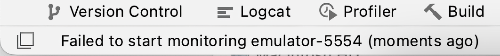
</div>


### Contexte :


#### IntelliJ IDEA 2023.1.1 Ultimate


### Cause possible :


L'éditeur croit que l'émulateur est déjà en cour d'exécution.


Vous saurez que c'est le cas quand vous lancez l'émulateur en ligne de commande et que vous obtenez le message « Running multiple emulators with the same AVD
is an experimental feature. ».


#### Ouvrez une fenêtre Terminal.


#### Placez-vous dans le dossier de l'émulateur


```kotlin title="Terminal"
cd /Users/monnom/Library/Android/sdk/emulator
```


#### Vérifiez le nom des émulateurs disponibles.


```kotlin title="Terminal"
./emulator -list-avds
```


```kotlin title="Résultat à l'écran"
monnom@MacBook-Pro-de-MonNom emulator %./emulator -list-avds
Pixel_2_API_33_2
```


#### Lancez l'émulateur en ligne de commande.


```kotlin title="Terminal"
./emulator -avd Pixel_2_API_33_2 -netdelay none -netspeed full
```


```kotlin title="Résultat à l'écran"
monnom@MacBook-Pro-de-MonNom emulator %./emulator -avd Pixel_2_API_33_2 -netdelay none -netspeed full
INFO | Android emulator version 32.1.13.0 (build_id 10086546) (CL:N/A)
INFO | Found systemPath /Users/christianelagace/Library/Android/sdk/system-images/android-
33/google_apis_playstore/x86_64/
INFO | Storing crashdata in: /tmp/android-christianelagace/emu-crash.db, detection is enabled
INFO | Duplicate loglines will be removed, if you wish to see each indiviudal line launch with the -log-nofilter
flag.
ERROR | Running multiple emulators with the same AVD
ERROR | is an experimental feature.
ERROR | Please use -read-only flag to enable this feature.
```


### Solution proposée :


Supprimez les fichiers .lock dans le dossier de l'émulateur ( /Users/monnom/.android/avd/Nom_de_l_emulateur.avd ).


Ceci peut être réalisé dans une fenêtre Terminal :


```kotlin title="Terminal"
cd /Users/monnom/.android/avd/Pixel_2_API_33_2.avd
rm *.lock
```


ou encore à partir d'IntelliJ  :


#### Rendez-vous dans le menu View / Tool Windows / Device Manager .


#### Cliquez sur les trois points verticaux à droite de l'émulateur en question puis choisissez Show on Disk .


#### Une fois le dossier de l'émulateur affiché dans le gestionnaire de fichiers de votre ordinateur, vous pouvez retrouver
le ou les fichiers .lock et les suprpimer.


<div style="text-align: center; margin: 1.5em 0;">
  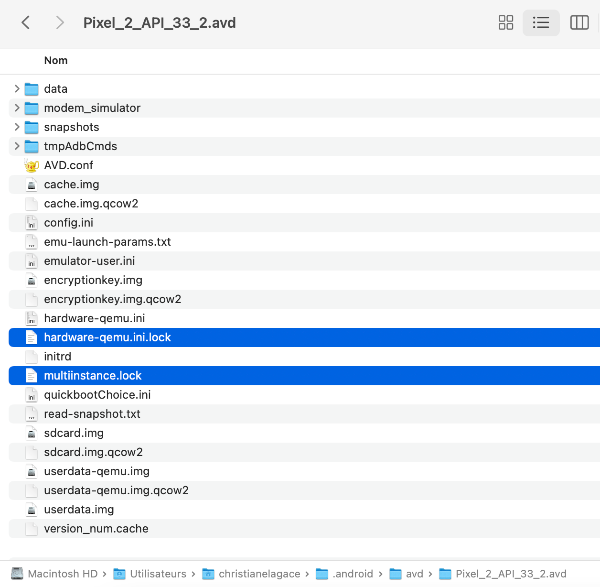
</div>


### 7.2 Erreur « The emulator process for AVD has terminated »


### Problème :


Lorsque vous tentez de lancer l'émulateur Android, vous obtenez le message « Device Manager - The emulator process for AVD has terminated ».


<div style="text-align: center; margin: 1.5em 0;">
  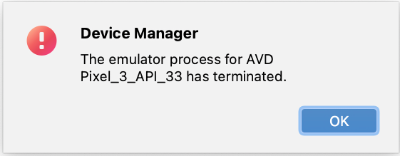
</div>


### Contexte :


#### IntelliJ IDEA 2023.1.1 Ultimate


### Cause possible :


IntelliJ (ou Android Studio) ne réussit pas à lancer l'émulateur parce qu'il n'y a pas suffisamment d'espace disque disponible sur votre ordinateur.


### Solution proposée :


Libérez de l'espace disque.


### Autre cause possible :


Un problème inconnu empêche le lancement de l'émulateur.


### Solution proposée :


Voici quelques pistes  de solution.


#### Tentez de lancer l'émulateur directement dans le gestionnaire de périphériques d'Android Studio : View /


#### Tool Windows / Device Manager / Clic sur Play devant l'émulateur.


#### Vérifiez s'il y a des indices sur ce qui pose problème dans le fichier
journal  C:\Users\MonNom\AppData\Local\Google\AndroidStudio4.2\log\idea.log .


#### Essayez de désinstaller puis réinstaller Android Emulator dans le menu SDK Manager .


#### Essayez de supprimer l'émulateur puis d'en créer un nouveau avec un différent modèle de téléphone ou une
différente version du système d'exploitation.


#### Vérifiez si l'émulateur est connecté en lançant cette commande dans une fenêtre Terminal à partir du dossier de
l'application :


```kotlin title="Terminal"
adb devices
```


#### Si vous ne trouvez pas de pistes et que toutes les configurations ont été vérifiées et revérifiées, il reste l'option de
travailler avec un vrai téléphone Android branché à l'ordinateur.


### 7.3 Erreur « This material API is experimental and is likely to change or to be removed in the future »


### Problème :


Lorsque vous utilisez une fonctionnalité expérimentale, vous obtenez le message « This material API is experimental and is likely to change or to be removed in the
future. ».


<div style="text-align: center; margin: 1.5em 0;">
  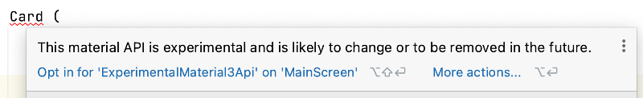
</div>


### Contexte :


#### IntelliJ IDEA 2023.1.1 Ultimate


#### Jetpack Compose (kotlinCompilerExtensionVersion) version 1.2.0


#### Android 7.0 (API 24)


#### Material Design 3


### Cause possible :


Vous utilisez une fonctionnalité expérimentale et Jetpack Compose vous empêche de poursuivre sans que vous ayiez donné votre consentement.


### Solution proposée :


Ajoutez une instruction @OptIn
 en haut de la fonction modulable qui utilise la fonctionnalité expérimentale.


C'est par cette instruction que vous donnez votre consentement.


```kotlin title="Jetpack Compose"
@OptIn(ExperimentalMaterial3Api::class) // pour retirer le message vis-à-vis Card : "This material API is experimental and
is likely to change or to be removed in the future"
@Composable
fun ...() {
    ...
}
```


### 7.4 Erreur « jvm target compatibility should be set to the same Java version »


### Problème :


Lorsque vous tentez de lancer dans l'émulateur une application Android qui utilise Room, vous obtenez le message « 'compileDebugJavaWithJavac' task (current
target is 1.8) and 'kspDebugKotlin' task (current target is 17) jvm target compatibility should be set to the same Java version. ».


### Contexte :


#### IntelliJ IDEA 2023.2.2 Ultimate


#### Kotlin 1.8.10


#### Émulateur avec l'API 33 (Tiramisu)


#### Jetpack Compose (kotlinCompilerExtensionVersion) version 1.4.3


#### Gradle 8.0


### Cause possible :


Il y a une incompatibilité entre la version de com.google.devtools.ksp et un autre paquet utilisé par l'application.


### Solution proposée :


Modifiez la version de ksp pour une moins récente. J'ai fait le test avec 1.8.0-1.0.8 et l'application pouvait travailler avec une base de données Room sans problème.


```kotlin title="Kotlin"
plugins {
    ...
    // pour Room
    id ("com.google.devtools.ksp") version " 1.8.0-1.0.8 " apply false}
```


### Autre cause possible :


Ce problème semble lié à un bogue de Gradle.


### Autre solution proposée :


Voici une solution temporaire si vous n'arrivez pas à faire fonctionner l'application par un simple changement de version de ksp.


Le problème avec cette solution, c'est qu'il faudra réeffectuer une série d'étapes à chaque fois qu'il faut recompiler l'application après y avoir apporté des
modifications.


Voilà pourquoi le code déclare une variable qu'il suffira de mettre à true puis à false dans la liste d'étapes plus bas (merci Carlos pour le truc de la variable!).


D'abord, modifiez le fichier  build.gradle.kts  qui se trouve dans le dossier  app  comme ceci.


```kotlin title="Fichier app/build.gradle.kts"
android {
    val java_1_8 = true
    ...
    compileOptions {
        if (java_1_8 == true) {
            sourceCompatibility = JavaVersion.VERSION_1_8
            targetCompatibility = JavaVersion.VERSION_1_8
        }
        else {
            sourceCompatibility = JavaVersion.VERSION_17
            targetCompatibility = JavaVersion.VERSION_17
        }
    }    
    kotlinOptions {
         if (java_1_8 == true) {
            jvmTarget = "1.8"
        }
        else {
            jvmTarget = "17"
        }
    }
    ...
}
```


Maintenant, vous aurez à réaliser ces étapes à chaque vous que vous recompilez l'application :


#### Mettez la variable java_1_8 à false.


#### Synchronisez la solution en appuyant sur  ⌘ Cmd + ⇧ Maj + I   (macOS) ou  Ctrl + Maj + O  (Windows/Linux).


#### Lancez l'application.


#### Lorsque votre projet utilisera du code qui n'est pas compatible avec cette version, par exemple lorsque vous définirez
une classe qui hérite de RoomDatabase, vous obtiendrez un message du genre « jlink executable C:\Program
Files\JetBrains\IntelliJ IDEA 2023.2.2\jbr\bin\jlink.exe does not exist », ce qui est normal.


#### Remettez la variable java_1_8 à true.


#### Synchronisez la solution.


#### Lancez l'application.


Tout devrait être entré dans l'ordre.


### 7.5 Erreur « Unresolved reference » avec Modifier


### Problème :


Lorsque vous développez un module composable qui utilise un modifieur, par exemple Modifier.weight(1f) ou Modifier.fillMaxSize(), vous obtenez un message
« Unresolved reference » sans possibilité d'ajouter un import pour régler le problème.


### Contexte :


#### IntelliJ IDEA 2023.1.1 Ultimate


#### Jetpack Compose (kotlinCompilerExtensionVersion) version 1.2.0


### Cause possible :


Vous avez importé le mauvais paquet pour l'objet companion Modifier. Ce sera le cas par exemple si vous avez l'instruction import java.lang.reflect.Modifier.


### Solution proposée :


Dans la liste des import, retirez l'importation qui se termine par Modifier.


Ajoutez ceci à la place :


```kotlin title="Kotlin"
import androidx.compose.ui.Modifier
```


### 7.6 Erreur « Cannot Delete Running AVD »


### Problème :


Lorsque vous tentez de supprimer un périphérique virtuel Android sous IntelliJ, vous obtenez le message « Cannot Delete Running AVD ».


### Contexte :


#### IntelliJ IDEA 2023.1.1 Ultimate


### Cause possible :


Un processus roule toujours pour ce périphérique.


### Solution proposée :


Dans IntelliJ, ouvrez le Device Manager.


Cliquez sur les trois points verticaux vis-à-vis le périphérique virtuel désiré puis choisissez Cold Boot Now .


Notez que parfois, il faut d'abord supprimer les fichiers .lock dans le dossier de l'émulateur ( /Users/monnom/.android/avd/Nom_de_l_emulateur.avd ).  Pour atteindre
rapidement ce dossier à partir d'IntelliJ, cliquez sur les trois points verticaux vis-à-vis le périphérique virtuel désiré puis choisissez  Show on Disk .


### 7.7 Erreur « Dependency 'androidx.navigation:navigation-common:2.7.3' requires... »


### Problème :


Lorsque vous tentez de compiler votre application Android bâtie avec Jetpack Compose, vous obtenez le message « Dependency 'androidx.navigation:navigation-
common:2.7.3' requires libraries and applications that depend on it to compile against version 34 or later of the Android APIs. ».


### Contexte :


#### IntelliJ IDEA 2023.2.2 Ultimate


#### Kotlin 1.8.10


#### Jetpack Compose (kotlinCompilerExtensionVersion) version 1.4.3


#### Gradle 8.0


### Cause possible :


Vous tentez d'utiliser une bibliothèque qui requiert une version plus récente du SDK Android que celle utilisée par votre projet (targetSdk).


### Solution proposée :


Si vous travaillez avec Android Studio, utilisez le Android SDK Upgrade Assistant
 pour passer à une version plus récente du SDK.


Si vous travaillez avec IntelliJ, cet outil n'est pas disponible. Le plus simple est de créer un nouveau projet basé sur le SDK désiré.


### 7.8 Erreur « Cannot find a parameter with this name: items »


### Problème :


Lorsque vous tentez d'ajouter un LazyColumn dans un composable, le mot items à l'intérieur des parenthèse n'est pas reconnu.


Vous obtenez le message « Cannot find a parameter with this name: items ».


```kotlin title="Jetpack Compose (Kotlin)"
LazyColumn {
    items( items = listeCategories.value) {
        Text(text=it.titre)
    }
}
```


### Contexte :


#### Kotlin 1.8.10


#### Jetpack Compose (kotlinCompilerExtensionVersion) version 1.4.3


#### Gradle 8.0


### Cause possible :


Il manque une instruction import.


### Solution proposée :


Ajoutez ceci à votre fichier.


```kotlin title="Jetpack Compose (Kotlin)"
import androidx.compose.foundation.lazy.items
```


### Autre cause possible :


Si le paramètre items n'est toujours pas reconnu, c'est peut-être parce qu'il y a une erreur de syntaxe (ex : pas de parenthèse fermante).


### Autre solution proposée :


### Vérifiez votre syntaxe!
7.9 Erreur « Dependency 'androidx.emoji2:emoji2:1.4.0'... »


### Problème :


Lorsque vous tentez de synchroniser votre application Android Jetpack Compose, vous obtenez l'erreur « Dependency 'androidx.emoji2:emoji2:1.4.0' requires
libraries and applications that depend on it to compile against version 34 or later of the Android APIs. ».


### Contexte :


#### Kotlin 1.8.10


#### Jetpack Compose (kotlinCompilerExtensionVersion) version 1.4.3


#### Gradle 8.0


### Cause possible :


Une des bibliothèques fait appel à androidx.emoji2:emoji2 et cette bibliothèque est en incohérence avec certaines versions que vous utilisez et ce, même si vous
n'utilisez pas androidx.emoji2:emoji2.


### Solution proposée :


Puisque vous n'avez pas besoin de androidx.emoji2:emoji2, vous pouvez ajouter ceci au fichier  build.gradle.kts  qui se trouve dans le dossier  app .


```kotlin title="Fichier app/build.gradle.kts"
android {
    namespace = "..."
    compileSdk = 33
    defaultConfig {
        configurations.all {
            resolutionStrategy {
                force("androidx.emoji2:emoji2-views-helper:1.3.0")
                force("androidx.emoji2:emoji2:1.3.0")
            }
        }
        applicationId "..."  
        ...  
    }
}
```


### 7.10 Erreur « Duplicate class »


### Problème :


Lorsque vous tentez de lancer votre application Android Jetpack Compose, vous obtenez une erreur du genre « Duplicate class
kotlin.collections.jdk8.CollectionsJDK8Kt found in modules kotlin-stdlib-1.8.10 (org.jetbrains.kotlin:kotlin-stdlib:1.8.10) and kotlin-stdlib-jdk8-1.7.20
(org.jetbrains.kotlin:kotlin-stdlib-jdk8:1.7.20) ».


### Contexte :


#### Kotlin 1.8.10


#### Jetpack Compose (kotlinCompilerExtensionVersion) version 1.4.3


#### Gradle 8.0


### Cause possible :


Il y a un conflit dû à certaines dépendances.


### Solution proposée :


Ajoutez cette ligne de code dans le fichier build.gradle.kts de l'application.


```kotlin title="Fichier app/build.gradle.kts"
...
dependencies {
    implementation(platform("org.jetbrains.kotlin:kotlin-bom:1.8.0"))
}
```


### 7.11 Erreur « Could not read workspace metadata from C:\...\metadata.bin »


### Problème :


Lorsque vous tentez de lancer votre application Android Jetpack Compose, vous obtenez une erreur du genre « Could not read workspace metadata from
C:\...\metadata.bin  ».


### Contexte :


#### Android Studio 2024.1.1 Patch 1


#### Jetpack Compose (kotlinCompilerExtensionVersion) version 1.5.1


### Cause possible :


Des fichiers de cache de Gradle sont corrompus.


### Solution proposée :


#### Refermez Android Studio.


#### Détruisez tout le contenu du fichier C:\Users\monnom\.gradle\caches.


#### Redémarrez Android Studio.


#### Recompilez l'application.


### 7.12 Erreur « Error running 'app' »


### Problème :


Lorsque vous tentez de lancer l'émulateur Android sous Android Studio, vous obtenez le message « Error running 'app'. ... is already running. If that is not the case,
delete ...\.lock and try again. ».


<div style="text-align: center; margin: 1.5em 0;">
  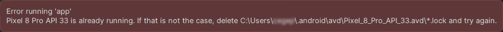
</div>


### Contexte :


#### Android Studio 2024.1.1 Patch 1


### Cause possible :


L'éditeur croit que l'émulateur est déjà en cour d'exécution.


### Solution proposée :


Supprimez les fichiers .lock dans le dossier de l'émulateur ( C:\Users\monnom\.android\avd\Nom_de_l_emulateur.avd ).


Ceci peut être réalisé dans l'explorateur de fichiers ou encore dans une fenêtre Terminal :


```kotlin title="Terminal"
cd C:\Users\monnom\.android\avd\Nom_de_l_emulateur.avd
rm *.lock
```


### 7.13 L'application se referme sans préavis


### Problème :


Lorsque vous testez votre application dans le simulateur d'Android Studio, l'application se referme sans préavis.


### Contexte :


#### Android Studio 2024.1.1 Patch 1


### Cause possible :


Quelque chose a causé un plantage de l'application.


### Solution proposée :


Pour avoir un indice sur ce qui s'est passé, ouvrez le Logcat d'Android Studio. S'il n'est pas affiché, rendez-vous dans le menu View / Tool Windows / Logcat .


En faisant défiler l'écran, vous verrez une indication FATAL EXCEPTION qui donne des détails sur ce qui a fait planter l'application.


<div style="text-align: center; margin: 1.5em 0;">
  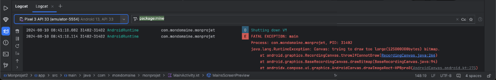
</div>


### 7.14 Erreur « Contenu non autorisé dans le prologue »


### Problème :


Lorsque vous tentez de compiler votre application dans Android Studio, vous obtenez le message « Contenu non autorisé dans le prologue. » ou, en anglais,
« Content is not allowed in prolog. ».


<div style="text-align: center; margin: 1.5em 0;">
  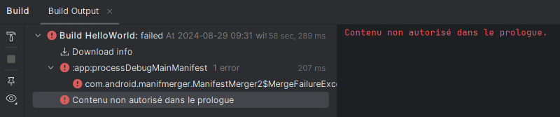
</div>


### Contexte :


#### Android Studio 2024.1.1 Patch 1


### Cause possible :


Un des fichiers XML du projet contient des caractères avant la première balise.


### Solution proposée :


Dans chacun des fichiers XML du projet, par exemple app/src/main/AndroidManifest.xml , assurez-vous qu'il n'y ait aucun caractère avant la balise


<?xml.


### Autre cause possible :


Un fichier du projet est corrompu.


### Solution proposée :


Parfois, il faut procéder à la création d'un nouveau projet, à la réinstallation d'Android Studio ou même à la réinstallation du système d'exploitation :-(


### 7.15 Erreur « UI système ne répond pas »


### Problème :


Lorsque vous testez votre application dans un émulateur avec Android Studio, vous obtenez le message « UI système ne répond pas » ou, en anglais, « System UI
isn't responding » et ce, sans arrêt dans une fenêtre popup.


<div style="text-align: center; margin: 1.5em 0;">
  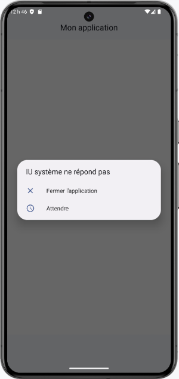
</div>


### Contexte :


#### Android Studio 2024.1.1 Patch 1


### Cause possible :


Il y a un problème avec l'émulateur.


### Solution proposée :


#### Rendez-vous dans le menu View / Tool Windows / Device Manager .


#### Si l'émulateur est en cours d'exécution, arrêtez-le en cliquant sur le carré vis-à-vis son nom.


#### Cliquez sur les trois points verticaux vis-à-vis son nom puis choisissez Cold Boot .


### Relancez l'application. Vous ne devriez plus être importunés par la fenêtre popup.
7.16 Erreur « Looks like you've changed schema but forgot to update the version number »


### Problème :


Lorsque lancez votre application dans dans Android Studio, vous obtenez un message du genre « Looks like you've changed schema but forgot to update the
version number. You can simply fix this by increasing the version number. Expected identity hash: fc52a3aea54e62ca9d025b65d3f27132, found:
c9a7d3438fa6436ca51c76b3571e7cd7 ».


### Contexte :


#### Kotlin 1.9.0


#### Room 2.6.1


### Cause possible :


Vous avez modifié la structure de la base de données après avoir exécuté l'application alors Room n'arrive plus à faire le lien entre les classes d'entité et la base de
données.


### Solution proposée :


Si la base de données ne contient que des données de test, il est possible de demander à ce que la base de données soit complètement détruite puis recréée avec
la nouvelle structure.


Ceci sera réalisé comme suit :


```kotlin title="Fichier data/MonprojetDatabase.kt"
@Database(
    entities = [
        Categorie::class,
        Item::class,
    ],
    version = 2,
    exportSchema = false
)
...
fun getDatabase(context: Context): MonprojetDatabase {
    return Instance ?: synchronized(this) {
        Room.databaseBuilder(context, MonprojetDatabase::class.java, "monprojet_database")
        .fallbackToDestructiveMigration()
        .build()
        .also { Instance = it }
    }
}
```


## 8. Situation du cours dans le programme d'études


---


### 25.1 Atteindre rapidement la ligne qui cause une erreur de compilation


Quand votre application ne compile pas, Andoid Studio vous présente à prime abord un écran qui donne de l'information sur l'erreur. Il s'agit de l'onglet Build .


Il est possible à ce stade de cliquer sur une flèche pour déployer une section puis de double-cliquer sur une ligne pour atteindre directement le code en erreur.


<div style="text-align: center; margin: 1.5em 0;">
  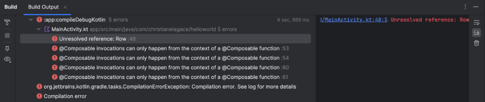
</div>


### 25.2 Le débogueur d'Android Studio


Pour trouver ce qui ne fonctionne pas dans une application, il n'y a rien comme un débogueur. Et celui d'Android Studio travaille très bien!


### Démarrer l'application en mode débogage


Vous pouvez placer un point d'arrêt dans votre code à l'endroit désiré en cliquant dans la marge gauche.


<div style="text-align: center; margin: 1.5em 0;">
  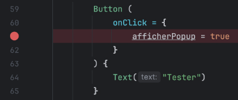
</div>


Pour que l'application puisse s'arrêter sur un point d'arrêt, elle doit avoir été lancée en mode débogage.


Une fois que vous avez **configuré un périphérique virtuel]**, démarrez l'application en
cliquant sur l'icône Debug .


<div style="text-align: center; margin: 1.5em 0;">
  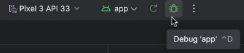
</div>


Lorsque le programme atteint le point d'arrêt, vous pouvez :


#### Consulter la valeur des variables dans la fenêtre Debug (si elle n'apparaît pas automatiquement, vous pouvez l'ouvrir
par View / Tool Windows / Debug ).


<div style="text-align: center; margin: 1.5em 0;">
  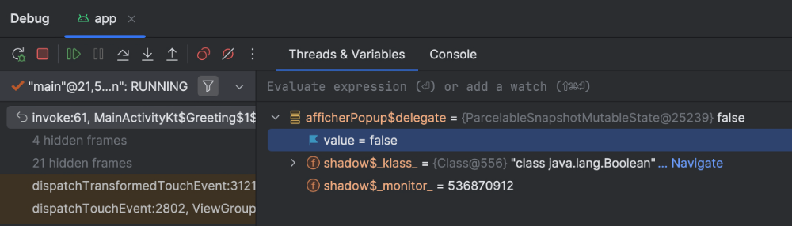
</div>


#### Entrer une expression à évaluer dans la zone Evaluate expression or add a watch .


#### Exécuter les lignes une à la fois à l'aide des icônes Step Over , Step Into et Step Out .


#### Modifier la valeur d'une variable.


#### etc.


### Connaître la valeur d'une variable


Dans certaines situations, le débogueur ne vous affichera pas la valeur d'une variable.


### Variables hors de portée


Comme dans tous les langages de programmation, le débogueur ne montrera que les variables visibles à l'endroit où le code s'est arrêté.


Même les variables d'état n'échappent pas à cette règle.


Si vous demandez d'évaluer une variable dans la zone Evaluate expression or add a watch  et que cette variable est hors de portée, vous obtiendrez le message
« Unresolved reference » ou « Cannot find local variable » ou encore « org.jetbrains.kotlin.backend.common.BackendException : Backend Internal error ».


### Variables avec un lien get()


Dans certaines situations, le débogueur vous affichera un lien get() à côté de la valeur d'une variable.


<div style="text-align: center; margin: 1.5em 0;">
  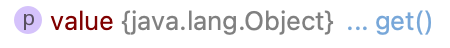
</div>


Cliquez sur ce lien afin d'obtenir la valeur.


#### Pour plus d'information


### « Debugging Jetpack Compose ». Youtube. https://www.youtube.com/watch?v=Kp-aiSU8qCU
25.3 Écrire dans Logcat


Pour afficher une information dans la console d'Android Studio, la meilleure technique consiste à utiliser le système de journalisation (log).


Ceci permet de spécifier le niveau d'information (ex : DEBUG, INFO, WARNING, ERROR). De plus, il est possible de spécifier une étiquette (tag) qui sera affichée
avant l'information afin de faciliter son repérage.


Vous utiliserez une de ces fonctions :


#### Log.d()
 : niveau débogage


#### Log.i()
 : niveau information


#### Log.w()
 : niveau avertissement (Warning)


#### Log.e()
 : niveau erreur


#### Log.v()
 : niveau verbose


#### Log.wtf()
 : niveau problème terrible (What a Terrible Failure)


Dans cet exemple, on utilise l'étiquette MainActivity pour afficher en mode débogage la valeur de la variable.


```kotlin title="Kotlin"
import android.util.Log
...
Log. d (" MainActivity ", maVariable )
```


Petit truc : pour mes informations de débogage, j'ajoute des astérisques devant l'étiquette pour que l'information soit plus facilement repérable.


```kotlin title="Kotlin"
import android.util.Log
...
Log. d (" *************** MainActivity ", maVariable )
```


Ouvrez l'onglet Logcat à l'aide du menu View / Tool Windows / Logcat ou en cliquant sur l'icône de chat au bas de l'écran.


Parmi toutes les informations journalisées, vous trouverez une ligne de ce genre :


```kotlin title="Résultat à l'écran (fenêtre Logcat)"
2025-08-25 11:47:40.977 8345-8365 EGL_emulation                 com.mondomaine.monapplication D app_time_stats: avg=29.85ms
min=2.16ms max=378.46ms count=27
2025-08-25 11:47:41.755 8345-8378 ProfileInstaller              com.mondomaine.monapplication D Installing profile for
com.mondomaine.devinette2025
2025-08-25 11:47:42.278 8345-8365 EGL_emulation                 com.mondomaine.monapplication D app_time_stats: avg=183.01ms
min=4.28ms max=516.29ms count=7
2025-08-25 11:47:43.607 8345-8365 EGL_emulation                 com.mondomaine.monapplication D app_time_stats: avg=442.87ms
min=332.95ms max=498.08ms count=3
2025-08-25 11:47:43.677 8345-8345  *************** MainActivity  com.mondomaine.monapplication D valeurDeMaVariable
2025-08-25 11:47:43.731 8345-8345 ImeTracker                   
com.mondomaine.monapplication I com.mondomaine.monapplication:f8b10efb: onRequestHide
at ORIGIN_CLIENT_HIDE_SOFT_INPUT reason HIDE_SOFT_INPUT_BY_INSETS_API
```


#### Pour plus d'information


### « How to Debug Jetpack Compose Recomposition with Logging? ». Vincent Tsen - AndroidDev Blog. https://vtsen.hashnode.dev/how-to-debug-jetpack-compose-
recomposition-with-logging
25.4 Déboguer une application qui se referme sans préavis


Pendant le développement de votre application Android avec Jetpack Compose, il peut arriver que lors de vos tests dans le simulateur, l'application se referme sans
préavis.


Que faire alors pour trouver ce qui a causé le plantage?


La préponse se trouve dans le Logcat d'Android Studio. S'il n'est pas affiché, rendez-vous dans le menu View / Tool Windows / Logcat .


En faisant défiler l'écran, vous verrez une indication FATAL EXCEPTION qui donne des détails sur ce qui a fait planter l'application.


<div style="text-align: center; margin: 1.5em 0;">
  
</div>


### 25.5 Layout Inspector


Quand vous développez une interface utilisateur avec Jetpack Compose, plusieurs facteurs peuvent venir influencer l'apparence et l'alignement des composables,
par exemple :


#### L'utilisation de composables d'alignement comme Row(), Column() ou Box()


#### Les modifieurs appliqués aux composables d'alignement (ex : verticalAlignment = Alignment.Bottom)


#### L'ordre dans lequel les modifieurs sont appliqués à un composable (ex : border avant ou après padding)


#### Les espacements (ex : modifieurs des composables d'alignement, Spacer)


Afin de mieux visualiser l'emplacement de chaque composable, vous pouvez travailler avec le Layout Inspector d'Android Studio.


#### Lancez l'application dans l'émulateur.


#### Rendez-vous dans le menu Tools / Layout Inspector .


#### Un rectangle gris apparaîtra alentour de chaque composable afin d'indiquer ses limites. De plus, si vous sélectionnez
un composable dans la hiérarchie présentée sous l'aperçu, vous le verrez entouré de bleu et ses attributs seront
affichés.


<div style="text-align: center; margin: 1.5em 0;">
  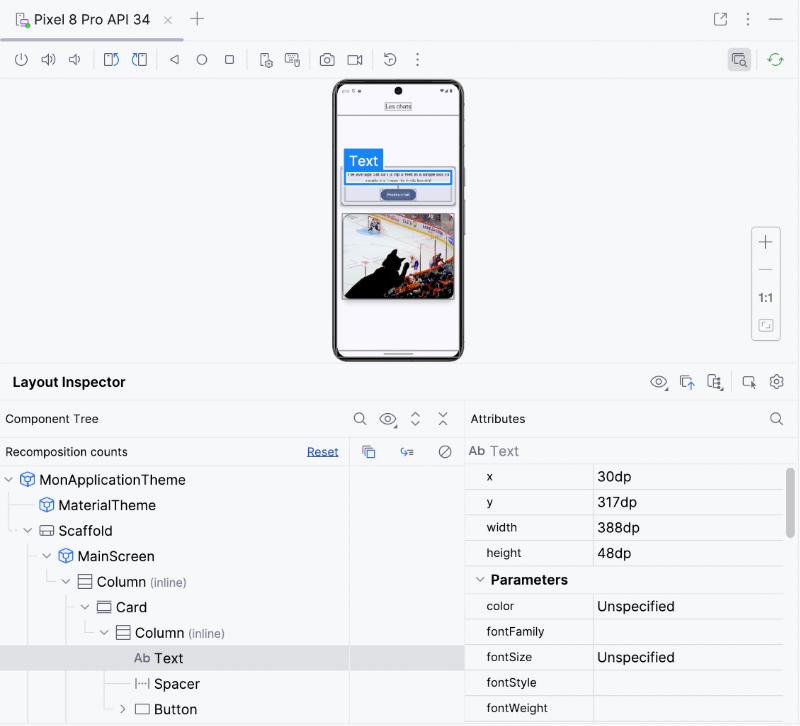
</div>


#### Pour revenir à l'affichage normal dans l'émulateur, refaites  Tools / Layout Inspector .


#### Pour plus d'information


### « Déboguer votre mise en page avec l'outil d'inspection de la mise en page ». Android Developer. https://developer.android.com/studio/debug/layout-inspector?
hl=fr
26. Le clavier virtuel


---
