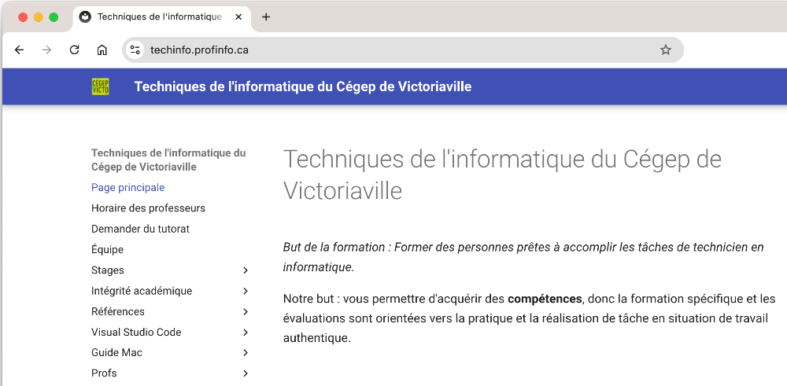
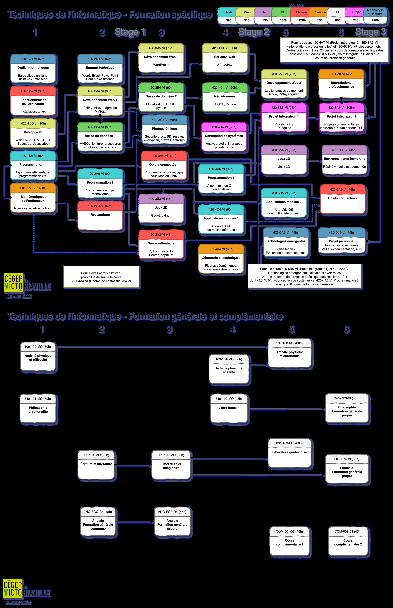

# Introduction et vue d'ensemble du cours

### 60. Liens hypertexte
61. Exercice 10
62. Pour le prochain cours
63. Application avec plusieurs écrans (navigation)
64. Exercice 11

### 65. Pour le prochain cours
────────── Semaine 8 ──────────
66. Formulaire d'ajout de données
67. Effets secondaires (side effects)
68. Formulaire de modification de données
69. Amélioration du ViewModel

### 70. Exercice 12
71. Pour le prochain cours (deux cours)
────────── Semaine 9 ──────────
72. Données distantes (API)
73. Exercice 13

### 74. Pour le prochain cours (deux cours)
────────── Semaine 10 ──────────
75. Les capteurs
76. Exercice 14
77. Pour le prochain cours

### 78. Examen 2
────────── Chapitres supplémentaires à utiliser au besoin ──────────
79. Aller plus loin avec les variables d'état (suite)
80. Optimiser l'application
81. La programmation asynchrone
82. Les notifications

## 1. Où trouver de l'aide

### 1.1 Horaire et coordonnées de Christiane Lagacé - session d'automne

### Christiane Lagacé, Automne 2025
Bureau : C-207 au pavillon central
Courriel : lagace.christiane@cegepvicto.ca

#### Lundi
Mardi
Mercredi
Jeudi
Vendredi

8h15
à
9h05
Objets connectés 1
C-

Objets connectés 1
C-

#### 209
 Réunion

Objets connectés 1
C-

Objets connectés 1
C-

#### 9h15
à
10h05
Programmation

#### 209
 Réunion

#### 10h15
à
11h05
Programmation
 Disponible
Trou horaire
Disponible

#### 11h15
à
12h05
Programmation
Disponible
Trou horaire
Disponible

12h15
à
13h05

13h15
à
14h05
 App. mobiles 2
C-209

#### 14h15
à
15h05
Programmation
 App. mobiles 2
C-209
Disponible
Disponible

#### 15h15
à
16h05
Programmation
Disponible 
Disponible 
 App. mobiles 2
C-209

16h15
à
17h05
Programmation
 App. mobiles 2
C-209

17h15
à
18h05

Je suis très souvent à mon bureau entre mes cours, même en dehors des périodes marquées « Disponible ».

Vous pouvez simplement passer me voir ou encore me contacter via Teams, ça me fera plaisir de vous aider!

### 1.2 Plan de cours

#### Programme
420 : Techniques de l'informatique

#### Profil
B0 : Profil par défaut

#### Composante de la formation
Spécifique

#### Sanction
diplôme d'études collégiales (DEC)

#### Cours préalables
420-2A6-VI : Programmation 2

#### Pondération
2-2-2

#### Durée
60 heures

#### Unités
2

#### Adoption par le département
18 août 2025

### Enseignantes et enseignants

#### Nom
Bureau
Courriel

#### Christiane Lagacé
C-207
lagace.christiane@cegepvicto.ca

### Référence aux devis ministériels

#### Compétence
Éléments de compétence

#### 00SS : Effectuer le développement d’applications
natives avec base de données

#### 1 - Analyser le projet de développement de l’application
2 - Préparer l’environnement de développement informatique
3 - Préparer la ou les bases de données
4 - Générer ou programmer l’interface graphique
5 - Programmer la logique applicative
6 - Contrôler la qualité de l’application
7 - Participer à la mise en service de l’application
8 - Rédiger la documentation

### Notes préliminaires

Le cours 420-5B4-VI : Applications mobiles 2 fait partie de la formation menant au diplôme d'études collégiales (DEC) dans le programme 420.B0 : Techniques de
l'informatique .

e

Il est offert en 5 session.

L'atteinte de la compétence 00SS : Effectuer le développement d’applications natives avec base de données est complétée dans ce cours.

e

Son acquisition a débuté dans le cours 420-4D4-VI : Applications mobiles 1 à la 4 session.

Le choix des technologies est à la discrétion de l'enseignante ou de l'enseignant mais doit être approuvé en département au début de la session.

Programmation native avec Jetpack Compose et programmation multi-plateformes avec React Native.

### Cible de formation

À la fin de ce cours, l'élève sera capable d'effectuer le développement d’applications mobiles avec bases de données dans l'environnement Android. Le
développement sera réalisé à l'aide de programmation native et à l'aide de programmation multi-plateformes.

### Démarche pédagogique

Courtes périodes d’enseignement théorique suivies d’application au fur et à mesure à l’aide d’exercices formatifs.

Des références de sites Web seront fournies par le professeur. L’élève devra enrichir ces sources d’information par ses propres recherches.

Des activités en classe seront proposées pour favoriser la coopération entre les élèves, l’échange des connaissances et la prise en charge de son apprentissage par
l'élève.

Certaines évaluations formatives peuvent être auto-corrigées par l’élève ou encore co-corrigées par un collègue de la classe.

Bien que certains travaux ne fassent pas l’objet d’évaluation sommative, les élèves doivent absolument les compléter afin d’être prêts pour l’épreuve finale.

### Séquences d'apprentissage

### 00SS - 1 : Analyser le projet de développement de l’application

Durée : 2 heures

#### Habiletés
Contenu
Activités
d'enseignement

#### Activités
d'apprentissage

#### Activités
d'évaluation

#### Critères
d'évaluation

#### Programmation
native
vs
multi-
plateformes

Théorie parfois
accompagnée d'une
démonstration

Exercices formatifs
obligatoires (F)

1 - Analyse juste des
documents de
conception
2 - Détermination
correcte des tâches à
effectuer

#### Choisir
un
environnement

#### Lectures

#### Mise en
pratique
des

#### de
développement

#### Environnements
de
développement
Android
Studio,
VS
Code,
IntelliJ
etc.

#### notions
au fur et
à mesure

#### Choisir
entre
base de
données
locale,
base de
données
distante
ou les
deux

#### Mise en
place des
éléments
nécessaires
à la
production
d’un
exercice
sommatif
qui
s’échelonnera
sur
plusieurs
semaines

#### Mécanismes
d'enregistrement
de
données
locales
et
distantes

### 00SS - 2 : Préparer l’environnement de développement informatique

Durée : 1 heures

#### Habiletés
Contenu
Activités
d'enseignement

#### Activités
d'apprentissage

#### Activités
d'évaluation

#### Critères
d'évaluation

#### Procédures
d'installation

Installer les logiciels et
les bibliothèques

Théorie parfois
accompagnée d'une
démonstration

1 - Installation
correcte des logiciels
et des bibliothèques
sur la plateforme hôte
2 - Configuration
appropriée de la
plateforme cible
3 - Configuration
appropriée du système
de gestion de versions
4 - Importation
correcte du code
source

#### Lectures

#### Exercices
formatifs
obligatoires
(F)

#### Mise en
pratique
des
notions
au fur et
à mesure

Configurer le système
de gestion de versions

#### Environnement
réel vs
environnement
simulé
dans
l'IDE

Importer du code
source

#### Examens
1, 2 et 3
(S)

#### Mise en
place des
éléments
nécessaires
à la
production
d’un
exercice
sommatif
qui
s’échelonnera
sur
plusieurs
semaines

#### Examen
formatif
formel
(FF)

### 00SS - 3 : Préparer la ou les bases de données

Durée : 4 heures

#### Habiletés
Contenu
Activités
d'enseignement

#### Activités
d'apprentissage

#### Activités
d'évaluation

#### Critères
d'évaluation

#### Création
et
manipulation
d'une
base
de
données
locale

Créer et adapter la
base de données à
partir d'un modèle de
données

Théorie parfois
accompagnée d'une
démonstration

1 - Création ou
adaptation correctes
de la base de données
locale ou de la base de
données distante
2 - Insertion correcte
des données initiales
ou des données de
tests
3 - Respect du modèle
de données

#### Lectures

#### Exercices
formatifs
obligatoires
(F)

#### Mise en
pratique
des
notions
au fur et
à mesure

Insérer les données
initiales ou les
données de tests

#### Examens
1, 2 et 3
(S)

#### Création
et
manipulation
d'une
base
de
données
distante

#### Mise en
place des
éléments
nécessaires
à la
production
d’un
exercice
sommatif
qui
s’échelonnera
sur
plusieurs
semaines

#### Examen
formatif
formel
(FF)

### 00SS - 4 : Générer ou programmer l’interface graphique

Durée : 6 heures

#### Habiletés
Contenu
Activités
d'enseignement

#### Activités
d'apprentissage

#### Activités
d'évaluation

#### Critères
d'évaluation

En programmation
native ET en
programmation multi-
plateforme :

Théorie parfois
accompagnée d'une
démonstration

1 - Choix et utilisation
appropriés des
éléments graphiques
pour l’affichage et la
saisie
2 - Intégration
correcte des images
3 - Adaptation de
l’interface en fonction
du format d’affichage
et de la résolution

#### Prendre
connaissance
de
l'existence
d'outils
pour
créer les
interfaces

#### Lectures

#### Exercices
formatifs
obligatoires
(F)

#### Mise en
pratique
des
notions
au fur et
à mesure

#### Composants
disponibles

#### Examens
1, 2 et 3
(S)

#### Adaptation
selon
l'orientation
et la
taille
de
l'appareil

#### Mise en
place des
éléments
nécessaires
à la
production
d’un
exercice
sommatif
qui
s’échelonnera
sur
plusieurs
semaines

#### Examen
formatif
formel
(FF)

#### Intégrer
des
composants

#### Appliquer
les
principes
de mise
en page
et de
disposition

### 00SS - 5 : Programmer la logique applicative

Durée : 40 heures

#### Habiletés
Contenu
Activités
d'enseignement

#### Activités
d'apprentissage

#### Activités
d'évaluation

#### Critères
d'évaluation

En programmation
native ET en
programmation multi-
plateforme :

Théorie parfois
accompagnée d'une
démonstration

1 - Programmation ou
intégration correctes
de mécanismes
d’authentification et
d’autorisation
2 - Programmation
correcte des
interactions entre
l’interface graphique
et l’utilisatrice ou
l’utilisateur
3 - Choix approprié
des clauses, des
opérateurs, des
commandes ou des
paramètres dans les
requêtes à la base de
données
4 - Manipulation
correcte des données

#### Programmer
l'application

#### Lectures

#### Exercices
formatifs
obligatoires
(F)

#### Mise en
pratique
des
notions
au fur et
à mesure

#### Mécanismes
d'authentification
sur un
serveur
distant

#### Examens
1, 2 et 3
(S)

#### Mise en
place des
éléments
nécessaires
à la

#### Examen
formatif
formel
(FF)

#### Mécanismes
d'autorisation
pour
accéder
aux

de la base de données
5 - Programmation
correcte de la
synchronisation des
données
6 - Utilisation
appropriée des
services d’échange de
données
7 - Application
correcte des
techniques
d’internationalisation
8 - Application
rigoureuse des
techniques de
programmation
sécurisée

#### périphériques
de
l'appareil

#### production
d’un
exercice
sommatif
qui
s’échelonnera
sur
plusieurs
semaines

#### Utilisation
des
capteurs

#### Opérations
CRUD
sur les
données

#### Synchronisation
des
bases
de
données
locale
et
distante

#### Techniques
d'internationalisation

#### Techniques
de
programmation
sécurisée

### 00SS - 6 : Contrôler la qualité de l’application

Durée : 4 heures

#### Habiletés
Contenu
Activités
d'enseignement

#### Activités
d'apprentissage

#### Activités
d'évaluation

#### Critères
d'évaluation

En programmation
native ET en
programmation multi-
plateforme :

Théorie parfois
accompagnée d'une
démonstration

1 - Application
rigoureuse des plans
de tests sur
l’émulateur et sur la
plateforme cible
2 - Revues de code et
de sécurité
rigoureuses
3 - Pertinence des
correctifs
4 - Respect des
procédures de suivi
des problèmes et de
gestion des versions
5 - Respect des
documents de
conception

#### Appliquer
les plans
de tests

#### Lectures

#### Exercices
formatifs
obligatoires
(F)

#### Mise en
pratique
des
notions
au fur et
à mesure

#### Tests
fonctionnels

#### Effectuer
le suivi
des
versions

#### Au moins
un
examen
(à
déterminer)
(S)

#### Suivi
des
versions

#### Mise en
place des
éléments
nécessaires
à la
production
d’un
exercice
sommatif
qui
s’échelonnera
sur
plusieurs
semaines

### 00SS - 7 : Participer à la mise en service de l’application

Durée : 2 heures

#### Habiletés
Contenu
Activités
d'enseignement

#### Activités
d'apprentissage

#### Activités
d'évaluation

#### Critères
d'évaluation

En programmation
native ET en
programmation multi-
plateforme :

Théorie parfois
accompagnée d'une
démonstration

1 - Préparation
appropriée de
l’application en vue de
son déploiement ou de
son installation
2 - Déploiement ou
installation corrects de
l’application

#### Déployer
l'application
directement
sur un
appareil
mobile

#### Lectures

#### Exercices
formatifs
obligatoires
(F)

#### Mise en
pratique
des
notions
au fur et
à mesure

#### Processus
de
déploiement
direct
sur
l'appareil

#### Expliquer
les
concepts
de
publication
d'une
application
sur
Google
Play

#### Mise en
place des
éléments
nécessaires
à la
production
d’un
exercice
sommatif
qui
s’échelonnera
sur
plusieurs
semaines

#### Processus
de
publication
sur
Google
Play

### 00SS - 8 : Rédiger la documentation

Durée : 1 heures

#### Habiletés
Contenu
Activités
d'enseignement

#### Activités
d'apprentissage

#### Activités
d'évaluation

#### Critères
d'évaluation

#### Générateurs
de
documentation

Théorie parfois
accompagnée d'une
démonstration

1 - Détermination
correcte de
l’information à rédiger
2 - Notation claire du
travail effectué

#### Rédiger
la
documentation

#### Lectures

#### Exercices
formatifs
obligatoires
(F)

#### Mise en
pratique
des
notions
au fur et
à mesure

#### Examens
1, 2 et 3
(S)

#### Mise en
place des
éléments
nécessaires
à la
production
d’un
exercice
sommatif
qui
s’échelonnera
sur
plusieurs
semaines

#### Examen
formatif
formel
(FF)

### Évaluations sommatives

#### Évaluation
Pondération
Échéancier

#### Examen 1 - Ensemble de la compétence - natif
25 %
Vers la semaine 5
Examen 2 - Ensemble de la compétence, plus
approfondi - natif (l'épreuve finale sera en
programmation multi-plateforme)

#### 35 %
Vers la semaine 10

### Épreuve finale

#### Pondération :

#### 40 %

#### Performance finale exigée

L'élève produira une application mobile répondant à un devis. L'application mobile aura une quantité définie d'écrans à réaliser et interagira avec une base de
données.

#### Contexte de réalisation

#### Sous forme d'examen pratique individuel à la semaine 15

#### À l'aide d'outils de programmation native ou multi-plateformes, au choix de l'enseignante ou de l'enseignant

#### À partir du devis fourni par l'enseignante ou l'enseignant

#### À l'aide de la documentation existante : notes de cours, sites Web, etc.

#### Sur ordinateur

#### En présence de l'enseignante ou de l'enseignant

#### D'une durée de 2 heures

#### Critères d'évaluation

#### Création ou adaptation correctes de la base de données

#### Choix et utilisation appropriés des éléments graphiques pour l’affichage et la saisie

#### Programmation correcte de l'application

#### Manipulation correcte des données de la ou des bases de données

#### Application rigoureuse des techniques de programmation sécurisée

### Politique départementale d'évaluation des apprentissages

### Département : Informatique

## 2. Présence aux cours

2.1. La présence aux cours est obligatoire. En cas d’absence prévue ou de départ prématuré, l’élève doit toujours informer son enseignante ou son enseignant. En
cas d’absence non prévue, il ou elle doit justifier son absence dans un délai de 2 jours ouvrables, sinon l’absence est considérée non justifiée.

## 5. Évaluations sommatives

5.1. Lors d’une absence ou d’un retard pour une épreuve sommative, aucune reprise ni prolongation n’est possible sauf lorsqu’une justification acceptable est
présentée à l’enseignante ou à l’enseignant (billet médecin, mortalité dans la famille immédiate, etc.). La justification doit être transmise à l’enseignante ou à
l’enseignant dans un délai de 2 jours ouvrables.

5.2. Un élève qui oublie son matériel essentiel devra réaliser l’épreuve avec les moyens dont il dispose. L’enseignant ou l’enseignante n’a aucune obligation de lui
fournir le matériel manquant. Le fait de retourner chercher ledit matériel n’est pas considéré comme une justification acceptable de retard.

5.3. Aucune reprise n’est possible pour un échec lors d’une épreuve sommative.

5.4. Les élèves peuvent consulter les documents contenant leurs épreuves sommatives (ex: questionnaire) mais l’enseignante ou l’enseignant les conserve après la
consultation.

5.5. L’élève est responsable de la remise de ses travaux. Il doit vérifier s’il a remis les bons documents, que les documents sont lisibles et qu’il a bien confirmé la
remise selon les modalités de la plateforme utilisée.

### 5.6 En cas d’erreur lors de la remise d’une évaluation sommative, une récidive, tous cours d’informatique confondus, entraînera la note de 0 pour l’évaluation
concernée. Aucun document altéré après la date de remise ne sera accepté.

Texte complet de la PDEA

### Conditions pédagogiques particulières

Au meilleur se son jugement, l'enseignante ou l'enseignant créera les conditions nécessaires pour que l'élève typique consacre en moyenne le temps requis pondéré
pour ce cours.

L'élève doit comprendre que si les heures travaillées en classe ne sont pas de qualité, le temps perdu devra être repris hors classe en plus des heures prévues à la
pondération.

Si un élève croit que le nombre d'heures de travail hors classe est trop élevé, il est de sa responsabilité d'aviser l'enseignante ou l'enseignant qui jugera de l'action
pédagogique à réaliser.

### Environnement numérique d’apprentissage (plateforme)

Apical, Teams

### Médiagraphie

Android Jetpack, [https://developer.android.com/jetpack](https://developer.android.com/jetpack)
 (Page consultée le 7 juillet 2021)
React Native, [https://reactnative.dev/](https://reactnative.dev/)
 (Page consultée le 29 avril 2024)

### Matériel requis

Ordinateur portable
Au moins un appareil mobile Android fourni par le département, partagé par les élèves.

### 1.3 Site Web du département

Une foule de renseignements ont été consignés à votre intention sur le site [https://techinfo.profinfo.ca](https://techinfo.profinfo.ca)
.

## 2. Installation sur votre portable

---

### 8.1 Grille de cours du programme Techniques de l'informatique

## 9. Extraits de code tirés des notes de cours ou du Web

---

### 10.1 Écouter le prof sans cellulaire

Pendant que je vous donne des explications en début de période, vous devez placer votre cellulaire sur la table, face cachée.

De cette façon, vous serez plus disponibles pour recevoir ce que je vous communique.

Image générée à l'aide de l'intelligence artificielle

## 11. Outils pour développer une application mobile Android

---
