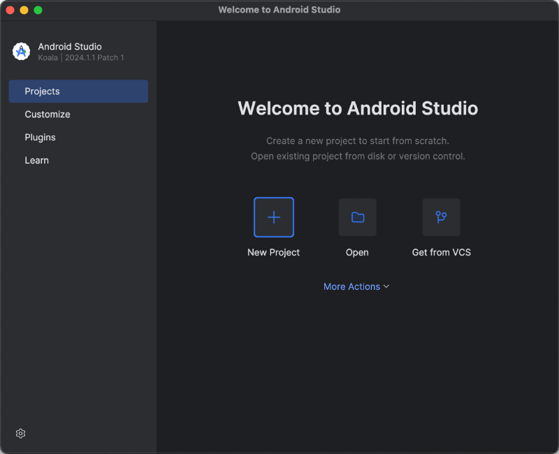
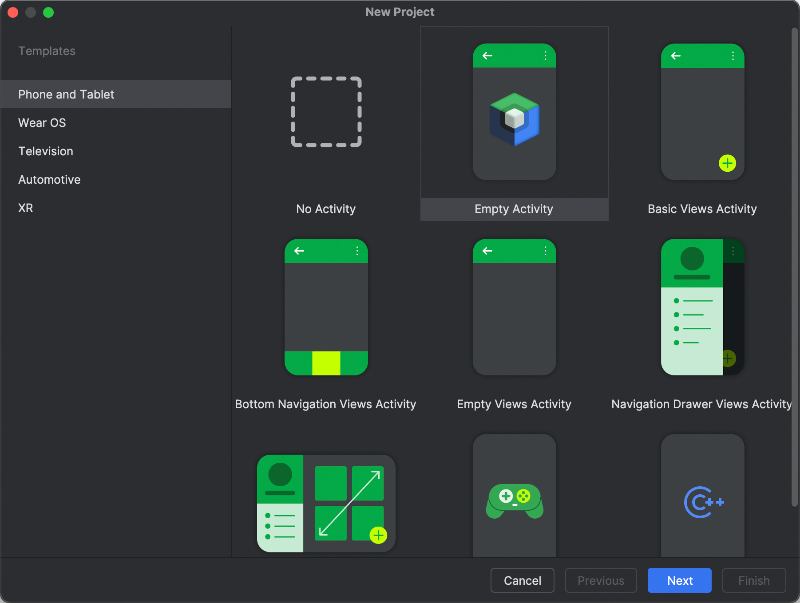
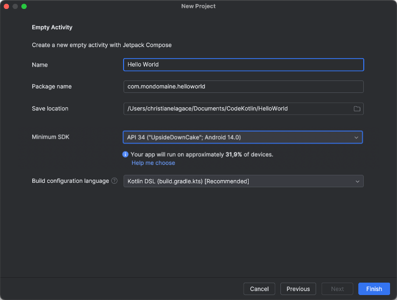
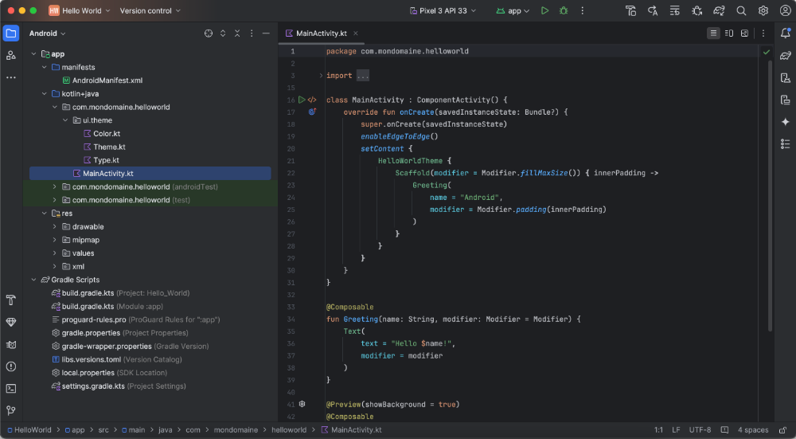
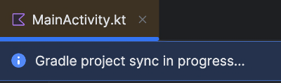
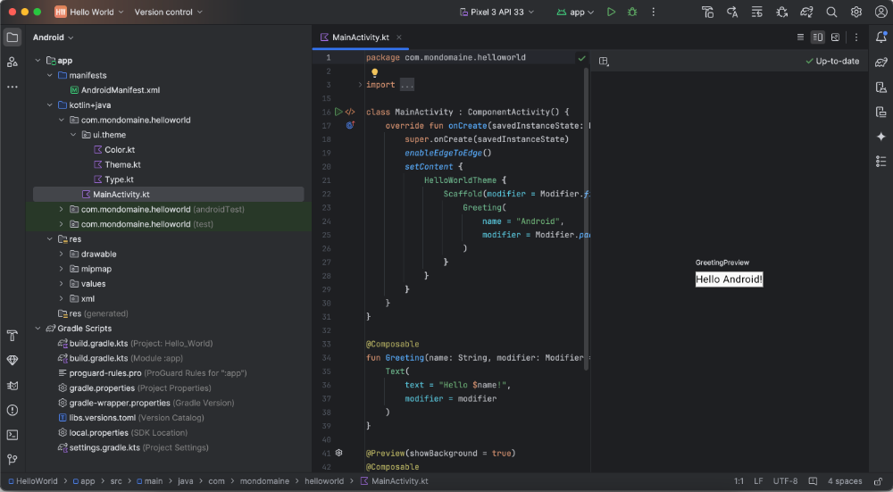
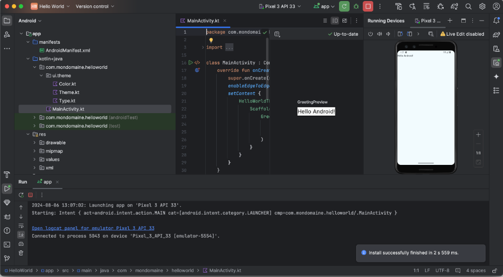
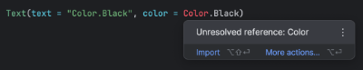
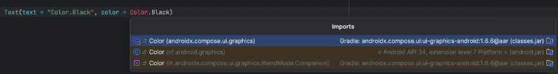

# Création d'un premier projet Android


### 12.1 Mon premier projet Android avec Kotlin, Jetpack Compose et Android Studio


Comme première application Android, comme le veut la tradition, nous allons afficher Hello Android! à l'écran.


#### Installez l'application Android Studio puis ouvrez-la.


#### Dans l'écran d'accueil d'Android Studio, cliquez sur New Project .





#### Dans la zone de gauche, sélectionnez Phone and Tablet . Dans la zone de droite, choisissez Empty Activity .





#### Configurez votre projet en suivant ces consignes :


#### Name  : nom de l'application tel qu'il apparaîtra sur le téléphone. Le nom peut contenir des espaces et des
caractères accentués.


#### Package name  : nom qui identifie l'application de façon unique dans l'écosystème Android.


Entrez votre nom de domaine en format inverse (en anglais : reverse domain name service notation ou reverse-DNS notation) suivi du nom de l'application sans espaces ni accents, par exemple com.mondomaine.monapplication.


Si vous ne possédez pas de nom de domaine, entrez une chaine du genre com.nomfamilleprenom.monapplication.


#### Save location  : entrez le chemin du dossier dans lequel le projet sera enregistré.


#### Minimum SDK  : entrez la version d'Android minimale désirée.


Notez que cette configuration modifie le niveau de SDK minimal pour que l'application puisse fonctionner et non le niveau de SDK


ciblé par l'application.


La documentation Android et différents sites Web mentionnent qu'il faut au moins l'API 21 pour travailler avec Jetpack Compose et au moins l'API 35 pour qu'une application puisse être publiée sur Google Play . Il s'agit du niveau de SDK ciblé.


Dans le cas présent, pour le niveau de SDK minimal, vous pouvez entrer la valeur désirée en considérant que plus la version minimale est récente, plus de fonctionnalités seront disponibles mais moins d'appareils pourront supporter votre application. Android Studio vous indiquera le pourcentage d'appareils qui supportent la version choisie.


Je vous suggère d'utiliser l'API 34 puisqu'il est le premier à supporter OpenJDK 17 .


#### Build configuration language  : entrez Kotlin DSL.





#### Quand vous cliquez sur Create , Android Studio télécharge les bibliothèques requises et crée les fichiers de base.





#### Même lorsque le projet semble prêt, vous devez continuer à patienter.





#### Quand le projet est prêt, vous pouvez obtenir un aperçu de l'application. Cliquez sur Split dans le coin supérieur


#### droit. Un message vous indique que vous devez d'abord compiler l'application. Cliquez sur le lien Build & Refresh .


#### Une prévisualisation de l'écran apparaît dans la zone de droite.





#### Pour voir l'application telle qu'elle apparaîtra sur un téléphone, cliquez sur l'icône  Run dans la barre d'outils (icône
de triangle vers la droite ou de flèche circulaire). Si aucun périphérique virtuel n'est configuré, Android Studio en créera un.


#### À chaque fois que vous cliquez sur l'icône  Run dans la barre d'outils, vous voyez l'application telle qu'elle sera sur le


#### téléphone. Le visuel est beaucoup plus intéressant qu'avec la simple prévisualisation.





#### Pour plus d'information


### * [« Démarrage rapide » - Android Developers](https://developer.android.com/jetpack/compose/setup?hl=fr)
13. Android Studio


---


### 17.1 Régler une erreur Unresolved reference


Lorsque vous codez en Kotlin, vous devez importer les bibliothèques requises pour utiliser différentes classes.


Si vous ne le faites pas, Android Studio mettra le nom de la classe en rouge pour signifier qu'il manque une référence.


### Ajouter automatiquement l'instruction import manquante


Vous pouvez placer la souris sur le mot en rouge pour voir ce que l'éditeur propose. Un clic sur import vous permettra d'ajouter l'instruction manquante.





Au lieu de pointer le mot en rouge, vous pouvez cliquer dessus. Vous pourrez alors appuyer sur Alt + Entrée (Windows) ou ⌥ Option + Entrée (Mac) pour ajouter l'instruction import manquante.





Dans les deux cas, si plusieurs options sont disponibles, vous serez invités à choisir celle qui vous convient.


Prenez note qu'il est possible de **configurer Android Studio pour ajouter automatiquement les instructions import non ambiguës**.


## 18. Structurer une application Android avec Kotlin et Jetpack Compose

### 18.1 Comment nommer la fonction modulable de base


Dans l'application de base obtenue lorsqu'on crée un nouveau projet Android avec Kotlin et Jetpack Compose, la classe MainActivity appelle une fonction nommée Greeting().


Ce nom est correct pour une application qui ne fait qu'une salutation mais il n'est pas approprié pour la majorité des applications que vous développerez.


Alors, comment nommer cette fonction pour qu'elle ait du sens peu importe l'application?


Je vous propose de l'appeler simplement MainScreen(). Ce nom sera toujours le même, peu importe le projet en cours.


J'ai aussi vu que plusieurs développeurs utilisaient un nom sous la forme MonApplicationApp(). Par exemple, si l'application s'appelle TicTacToe, la fonction s'appellera TicTacToeApp().


À vous de choisir l'appellation qui vous convient!


```kotlin title="Kotlin"
class MainActivity : ComponentActivity() {
    override fun onCreate(savedInstanceState: Bundle?) {
        super.onCreate(savedInstanceState)
        setContent {
            MonApplicationTheme {
                Scaffold(modifier = Modifier.fillMaxSize()) { innerPadding ->
                    MainScreen (
                        modifier = Modifier.padding(innerPadding)
                    )
                }
            }
        }
    }
}
@Composable
fun MainScreen (modifier: Modifier = Modifier) {
    ...
}
```


### 18.2 À quel endroit peut-on appeler une fonction modulable


L'interface d'une application Android avec Jetpack Compose est définie en appelant différentes **fonctions modulables**.


Il est important que Jetpack Compose sache dès le chargement de l'application quels éléments doivent être affichés. C'est pourquoi les fonctions modulables ne peuvent pas être appelées dans un gestionnaire d'événement.


```kotlin title="Jetpack Compose (Kotlin)"
Button(
    onClick = {
        Text(...)
    }
) {
    ...
}
```


Si vous appelez une fonction modulable dans un gestionnaire d'événement, vous obtiendrez à la compilation le message d'erreur ` @Composable invocations can only happen from the context of a @Composable function `.


Dans un autre contexte, le composable doit être déclaré directement dans la fonction composable ou encore dans un autre composable, en autant que ce ne soit pas dans un gestionnaire d'événement.


```kotlin title="Jetpack Compose (Kotlin)"
@Composable
fun MainScreen() {
    Column {
        Text(...)
    }
}
```


Au besoin, il peut être placé dans une condition.


```kotlin title="Jetpack Compose (Kotlin)"
@Composable
fun MainScreen() {
    Column {
        if (...) {
            Text(...)
        }
    }
}
```

