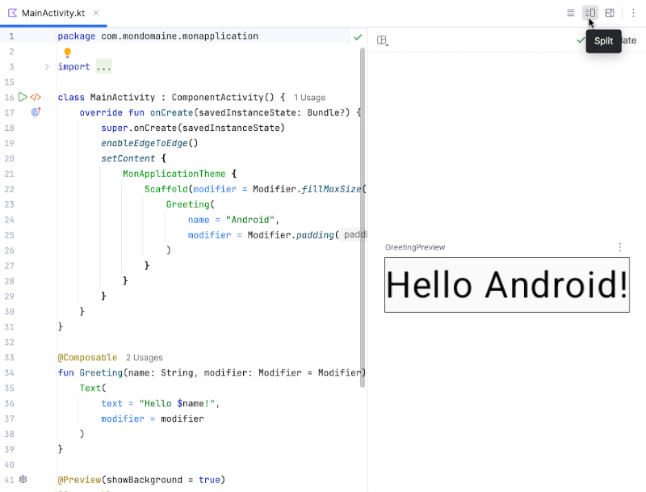
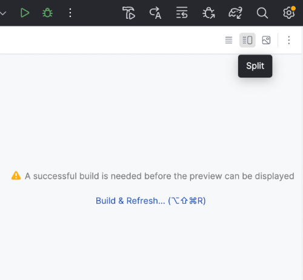
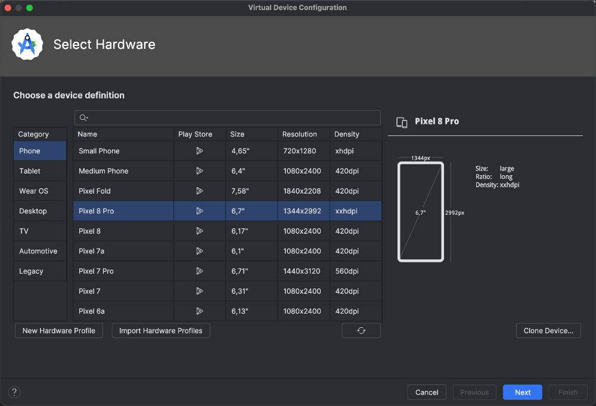
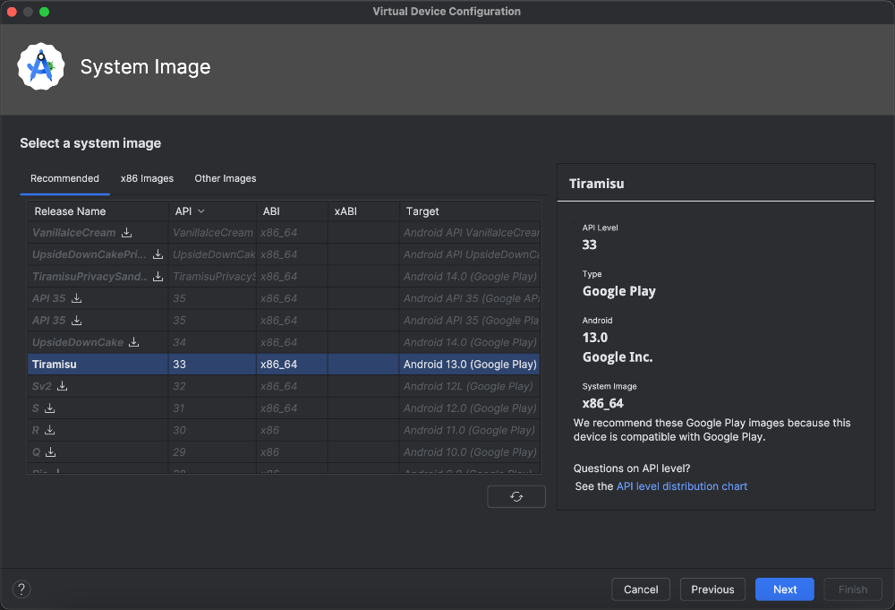
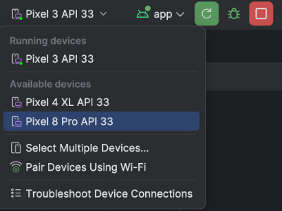
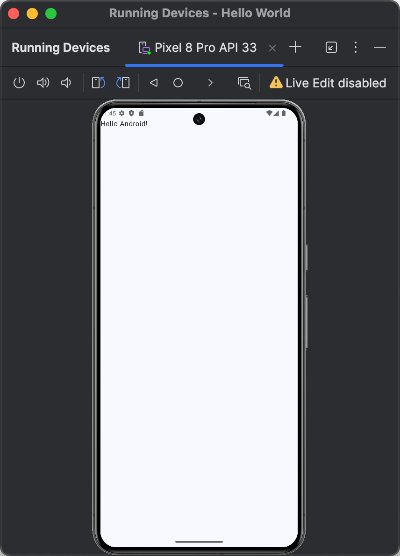
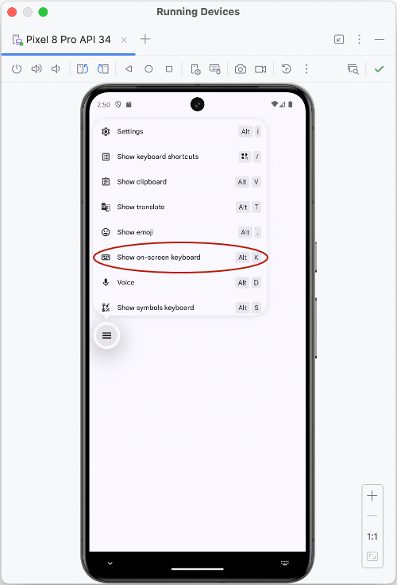

# Prévisualisation vs Émulateur Android


### 14.1 Prévisualisation de l'interface utilisateur


Pendant que vous développez votre application Android avec Kotlin dans Android Studio, vous pouvez avoir en tout temps un aperçu de cette interface.


#### Ouvrez le fichier qui contient l'interface utilisateur, par exemple MainActivity.kt .


#### Pour qu'une prévisualisation soit possible, l'application doit contenir une **fonction modulable** précédée de l'annotation @Preview
.


Cette fonction modulable ne peut pas recevoir de paramètre. C'est pourquoi on nommera généralement cette fonction DefaultPreview(). Elle pourra au besoin se charger d'appeler une fonction modulable avec paramètres.


Pour que la prévisualisation corresponde à ce que vous êtes en train de coder, la fonction modulable appelée dans DefaultPreview() devra être la même que dans MainActivity.


```kotlin title="Kotlin"
@Preview(showBackground = true)
@Composable
fun DefaultPreview() {
    MonApplicationTheme {
        MaFonctionModulable()
    }
}
```


#### Dans le haut de la zone d'édition du code :


#### Cliquez le second icône ( Split ) pour voir côte-à-côte le code Kotlin et l'aperçu de l'interface.


#### Cliquez sur le troisième icône ( Design ) pour que l'aperçu prenne toute la place.


#### Cliquez sur le premier icône ( Code ) pour fermer l'aperçu et redonner toute la place au code.





#### Notez que si vous n'avez pas encore compilé votre application lorsque vous cliquez sur Split , vous verrez le message


#### « A successful build is needed before the preview can be displayed ». Cliquez sur le lien pour compiler l'application.





### 14.2 Configurer un périphérique virtuel (émulateur)


Il n'est pas nécessaire d'avoir en votre possession un téléphone Android pour tester une application.


Il est possible d'exécuter vos applications Android directement sur votre ordinateur à l'aide d'un périphérique virtuel (AVD - Android Virtual Device), aussi appelé Émulateur ou parfois Simulateur.


Dans Android Studio, vous pouvez configurer un périphérique virtuel comme suit :


#### Rendez-vous dans le menu View / Tool Windows / Device Manager .


#### Cliquez sur le + puis sur Create Virtual Device .


#### Choisissez les spécifications du téléphone Android que vous désirez simuler puis cliquez sur Next .





#### Vous devez maintenant sélectionner la version Android qui sera émulée. Si la version désirée est suivie d'une l'icône
de téléchargement, il vous faudra cliquer sur l'icône pour la télécharger. Cliquez ensuite sur Next .





#### Vérifiez la configuration puis cliquez sur Finish .


#### Maintenant, pour exécuter votre application sur l'émulateur, sélectionnez l'émulateur dans la barre d'outils puis
cliquez sur le bouton vert  Run , toujours dans la barre d'outils. Le bouton peut être en forme de triangle vers la droite
ou en forme de flèche circulaire.





#### L'application apparaît désormais dans l'émulateur.





Notez que l'émulateur peut être configuré pour apparaître dans sa propre fenêtre afin de laisser plus de place au code dans la fenêtre principale :


#### Cliquez sur les trois points verticaux en haut de l'émulateur.


### Sélectionnez View Mode / Float .
14.3 Configurer l'émulateur en mode sombre ou clair


Quand on code une application pour appareil mobile, il est important de bien la tester en mode clair et en mode sombre puisque c'est l'usager qui contrôle le mode qui sera utilisé sur son téléphone.


L'émulateur d'Android Studio fonctionne un peu comme un téléphone physique pour modifier cette configuration.


- Lancez l'application dans l'émulateur.
- Dans le haut de la section qui affiche l'émulateur, cliquez sur le cercle (Home).
- À l'aide de la souris, faites glisser l'écran vers le haut.
- Cliquez sur Settings puis sur Display .
- Dans la zone Appearance, cochez ou décochez Dark theme .


### 14.4 Tester l'application Android sur un téléphone physique


Si vous avez en main un téléphone Android, il est possible de configurer Android Studio pour tester l'application directement sur cet appareil.


Même si vous avez l'habitude de tester vos applications **sur un périphérique virtuel**, il
faut prendre le temps de tester l'application sur un périphérique physique afin de s'assurer que tout fonctionnera correctement lorsque l'application sera déployée.


Pour tester une application sur un téléphone physique (notez que les options de menu peuvent être passablement différentes selon le modèle du téléphone) :


- Sur le téléphone, assurez-vous que les options de développeur sont activées : Paramètres (Settings)  /
- À propos du téléphone (About phone)  / Cliquer 7 fois sur  Numéro de version (Build number) .
- ou
- Paramètres (Settings)  / Dans la zone de recherche, entrer Options pour les développeurs (Developer options) /
- Taper sur l'option pour l'activer.
- Activez le débogage USB : Paramètres (Settings)  / Dans la zone de recherche, entrer Options pour les développeurs
(Developer options) / Activer Débogage USB (USB debugging) .
- Connectez le téléphone à votre ordinateur à l'aide d'un câble USB.
- Dans Android Studio, sélectionnez votre appareil dans la barre de titre, à gauche du bouton Run .


## Pour plus d'information


* [« Configurer les options pour les développeurs sur l'appareil » - Android Developer](https://developer.android.com/studio/debug/dev-options?hl=fr)


### * [« Exécuter des applications sur un appareil » - Android Developer](https://developer.android.com/studio/run/device?hl=fr)

14.5 Clavier virtuel de l'émulateur

Quand vous lancez une application dans l'émulateur d'Android Studio, il peut arriver que le clavier virtuel ne soit pas visible. À ce moment, seul le clavier physique de
votre ordinateur peut interagir avec l'émulateur.


Je vous présente ici deux techniques pour faire apparaître le clavier virtuel dans l'émulateur.


!!! warning "Attention : quand vo"
    Attention : quand vous testez une application, le clavier virtuel disparaîtra dès que vous appuyez sur une touche du clavier. Pour tester comme sur un téléphone
physique, vous devez utiliser exclusivement le clavier virtuel.


### Afficher le clavier virtuel automatiquement


Si vous souhaitez toujours tester votre application telle qu'elle apparaîtrait sur un téléphone physique, vous pouvez ajouter une configuration dans le fichier


AndroidManifest.xml .


```xml title="Fichier app/src/main/AndroidManifest.xml"
<manifest ...>
    <application ...>
        <activity
            android:name=".MainActivity"
            android:windowSoftInputMode="stateAlwaysVisible|adjustResize"
            ...>
        </activity>
    </application>
</manifest>
```


Le clavier virtuel apparaîtra automatiquement lorsque requis, par exemple quand l'usager mettra le focus dans une case de saisie.


### Afficher le clavier virtuel manuellement


Si vous souhaitez faire apparaître le clavier virtuel seulement au besoin, n'ajoutez pas l'instruction windowSoftInputMode dans le fichier AndroidManifest.xml .


Plutôt, quand vous lancerez l'application dans l'émulateur, vous cliquerez sur le menu rond qui apparaît au centre gauche de l'écran quand une case de saisie a le
focus.


L'option Show on-screen keyboard fera apparaître le clavier virtuel.





#### Pour plus d'information


### * [« Gérer la visibilité du mode de saisie » - Android Developer](https://developer.android.com/develop/ui/views/touch-and-input/keyboard-input/visibility?hl=fr)
15. Jetpack Compose


---
