# Publication d'une application Android


### 33.1 Icône d'application


Pour générer une icône pour votre application Android :


#### À l'aide de l'éditeur d'images de votre choix, créez ou ajustez l'image qui sera utilisée comme icône d'application
(AppIcon). Elle doit faire idéalement 512x512 px.


#### Rendez-vous sur le site Web IconKitchen : [https://icon.kitchen](https://icon.kitchen)
 (il s'agit du successeur d'Android Asset Studio).


#### Téléversez votre image puis ajustez les paramètres.


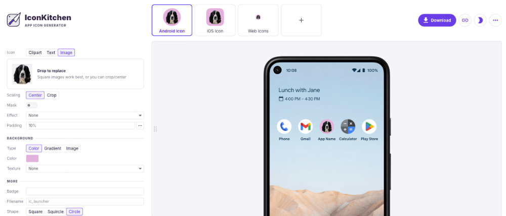


#### Quand le résultat est satisfaisant, téléchargez le résultat.


#### Décompressez le fichier. Les fichiers qui nous intéressent sont dans le dossier android/res .


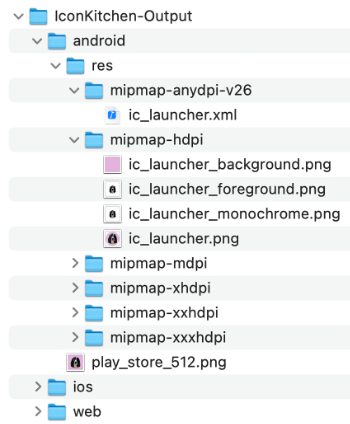


#### Placez votre gestionnaire de fichiers et Android Studio côte-à-côte et faites glisser les icônes dans les dossiers
correspondants sous app/src/main/res ( mipmap-hdpi , mipmap-mdpi , etc.).


#### Attention : un dossier ne peut pas contenir deux fichiers dont le nom diffère seulement par l'extension. Par exemple,
s'il y a déjà un fichier nommé ic_launcher.webp , il faut le détruire avant de copier le fichier ic_launcher.png .


#### Si le générateur d'icônes n'a pas généré de fichiers dont le nom se termine par _round, supprimez, dans chaque
sous-dossier, tous les fichiers qui correspondent à ce critère (ex :  ic_launcher_round.xml , ic_launcher_round.webp ).


#### Si vous n'avez plus de fichiers dont le nom se termine par _round, vous devez modifier le fichier


#### app/src/main/AndroidManifest.xml . Vous devez modifier la ligne android:roundIcon.


#### Première option : vous supprimez cette ligne.


#### Deuxième option : vous la modifiez pour qu'elle pointe vers l'icône que vous avez téléchargé.


```xml title="Fichier app/src/main/AndroidManifest.xml"
<application
    android:allowBackup="true"
    android:dataExtractionRules="@xml/data_extraction_rules"
    android:fullBackupContent="@xml/backup_rules"
    android:icon="@mipmap/ic_launcher"
    android:label="@string/app_name"
    android:roundIcon="@mipmap/ic_launcher"
    ...
</application>
```


### Vous pouvez maintenant lancer votre application dans l'émulateur, **tester l'application sur votre téléphone]** ou encore **installer le fichier APK directement sur le téléphone]**. Vous constaterez que l'application utilise désormais votre icône personnalisée.
33.2 Générer un fichier APK


Le fichier APK (Android Package Kit) permet de déployer une application Android.


Le fichier APK est constitué de plusieurs fichiers, par exemple :


#### Le code source compilé


#### Les ressources


#### AndroidManifest.xml


Il existe deux types de fichiers APK :


#### Le fichier de débogage, généralement nommé app-debug.apk .  Il ne peut pas être utilisé pour déployer l'application
sur Google Play Store ni sur la plupart des autres plateformes de distribution mais il peut être utilisé pour installer
manuellement l'application sur un téléphone pour des fins de tests.


#### Le fichier de production aussi appelé fichier APK signé ou fichier APK prêt à être publié. Il peut être généré à l'aide
d'Android Studio après avoir signé l'application.


### Générer un fichier APK de débogage


Lorsque vous lancez une application dans l'émulateur, un fichier APK de débogage est automatiquement généré.


Ce fichier sera utilisé si vous lancez l'application dans Android Studio en utilisant le téléphone comme cible plutôt qu'un émulateur.


Vous ne pouvez cependant pas copier ce fichier directement sur le téléphone puisqu'il requiert l'utilisation d'Android Studio. Si vous tentez de l'installer, vous
obtiendrez le message « L'application n'a pas été installée, car elle ne semble pas être valide. ».


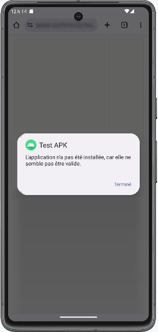


Pour générer un fichier APK de débogage qui pourra être installé sur le téléphone :


#### Dans Android Studio, rendez-vous dans le menu Build / Build App Bundle(s)/APK(s) / Build APK(s) .


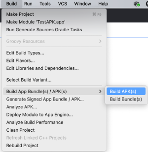


#### Ceci générera le fichier app-debug.apk dans le dossier app/build/outputs/apk/debug .


### Générer un fichier APK de production


Pour générer un fichier APK de production :


#### Dans Android Studio, cliquez sur l'icône d'authentification dans le coin supérieur droit afin d'associer Android Studio
avec votre compte Google.


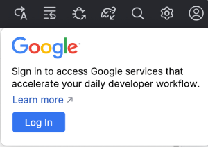


#### Rendez-vous dans le menu Build / Generate Signed App Bundle/APK .


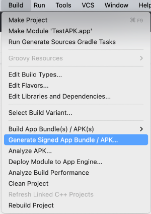


#### Dans la fenêtre qui suit, sélectionnez APK.


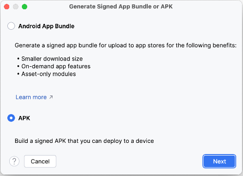


#### Cliquez sur Create New .


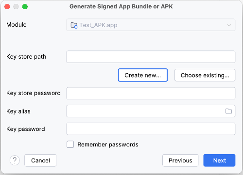


#### Remplissez les informations demandées :


#### Key store path : entrez le chemin et le nom du fichier qui contiendra les différentes clés générées.
Suggestion : placez-le dans un dossier différent de votre application car il pourra contenir les clés de
différentes applications. Ici, puisque je désire générer une clé qui servira à une version de production, j'ai
choisi d'appeler le gestionnaire de clés  release-key.jks .


#### Password : Le mot de passe qui permettra d'accéder au gestionnaire de clés.


#### Section Key  :


#### Alias : un simple alias pour faire référence à cette clé. Suggestion : utiliser le nom de


#### l'application suivi de release pour indiquer que c'est la clé pour la version de production.


#### Password : le mot de passe pour la clé de cette application. Il faut utiliser le même mot de


#### passe que pour le gestionnaire de clés
.


#### Section Certificate :


#### Remplissez les informations demandées. Les codes de pays peuvent être trouvés
ici : [https://countrycode.org](https://countrycode.org)
.


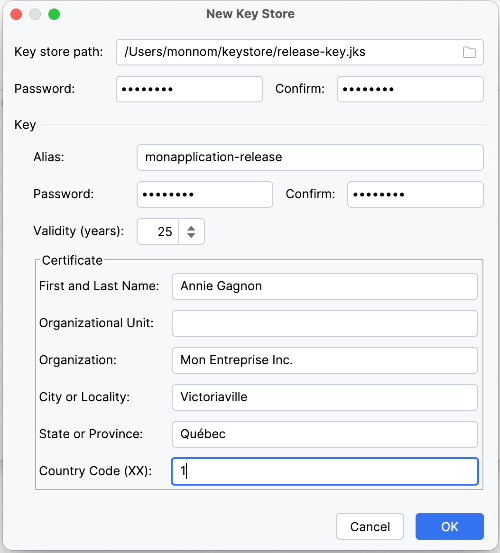


#### Dans le dernier écran, choisissez release  puis cliquez sur Create .


#### Le fichier généré s'appelle app-release.apk et il est placé dans le dossier  app/release .


### Installer l'application


Une fois le fichier APK généré, il est possible de l'installer **à partir de Google Play Store]** ou **en distribuant vous-mêmes le fichier APK]**.


#### Pour plus d'information


* [« Préparer la publication de votre application » - Android Developer](https://developer.android.com/studio/publish/preparing?hl=fr)


* [« Signer votre application en vue de sa publication sur Google Play » - Android Developer](https://developer.android.com/studio/publish/app-signing?hl=fr)


### * [« Methods of Generating APK of Android Application » - Geeks for Geeks](https://www.geeksforgeeks.org/methods-of-generating-apk-of-android-application/)
33.3 Publier une application sur Google Play Store


Publier une application Android sur Google Play Store permet de rendre cette application disponible à un nombre impressionnant d'utilisateurs. Intéressant!


D'abord, voyons quelles sont les exigences pour que Google Play Store accepte de publier votre application. Nous verrons ensuite les grandes lignes à suivre pour
publier l'application.


### Exigences de l'application


Google Play Store ne permet pas de publier n'importe quelle application.


Avant de vous lancer dans le processus de publication, assurez que votre application réponde aux exigences suivantes :


#### L'application doit respecter les règles de Google Play Store
, par exemple ne présenter aucun contenu nuisible ou
inapproprié, respecter la propriété intellectuelle ou encore être conforme aux exigences d'optimisation par défaut du
système Android


#### L'application doit être exempte de bogues


#### L'application doit offrir une bonne expérience utilisateur


#### Elle doit être signée à l'aide d'un certificat numérique : [https://developer.android.com/studio/publish/app-signing?](https://developer.android.com/studio/publish/app-signing?)
hl=fr


#### Elle doit également répondre à des exigences de tests : [https://support.google.com/googleplay/android-](https://support.google.com/googleplay/android-)
developer/answer/14151465?sjid=9146892187004698062-NC


### Publication sur Google Play Store


La publication d'une application sur Google Play Store passe par ces étapes :


#### **Générer un fichier APK de production]**


#### Créer un compte de développeur (coût : 25 USD, valide tant que le compte est actif
)


#### Remplir la fiche de l'application : description de l'application et de ses fonctionnalités, icône de l'application,
impressions d'écrans, catégorie, contact, etc.


#### Téléverser le fichier APK


#### Fixer le prix de l'application


#### Patienter!


Sachez que l'application pourrait être soumise à une vérification, ce qui peut entraîner des délais d'environ 7 jours. Sinon, la première application prendra environ 48
heures avant d'être disponible alors que les publications subséquentes ne nécessiteront que quelques heures.


Les étapes de publication sont bien détaillés dans cet article : Comment publier une application sur le Play Store de Google ?


#### Pour plus d'information


* [« Créer et configurer votre application » - Google](https://support.google.com/googleplay/android-developer/answer/9859152?hl=fr-CA)


### * [« Publier votre application » - Google](https://support.google.com/googleplay/android-developer/answer/9859751?hl=fr-CA)
33.4 Publier une application sans passer par Google Play Store


Il est possible de déployer une application sur un appareil Android sans passer par Google Play Store.


Ceci offre l'avantage de ne pas avoir à partager les profits avec Google via les commissions. Par contre, il sera plus difficile de rejoindre vos clients potentiels.


Sachez qu'il existe des plateformes de publications tierces, par exemple Amazon App Store ou SlideMe.


Dans cette fiche, je vous montre plutôt comment déployer directement une application. Le processus est connu sous le terme sideloading.


### Note : Google a annoncé  que dès 2027, la publication sans passer par Google Play Store nécessitera que les
développeurs soient authentifiés sur le Android Developer Console. À suivre...


Pour déployer une application directement :


#### **Générez le fichier APK de production]** (ou de
débogage si l'application est distribuée pour des fins de tests).


#### Distribuez le fichier APK à vos utilisateurs à l'aide de la méthode de votre choix, par exemple :


#### par courriel


#### sur un site Web


#### à l'aide d'un code QR
 publié sur un site Web


#### en transférant le fichier directement entre l'ordinateur et l'appareil Android


#### L'usager pourra alors cliquer sur le fichier afin d'installer l'application sur son appareil.


Pour que l'installation puisse être réalisée, l'usager devra autoriser l'installation d'une application provenant de source non reconnue.


Si vous tentez d'installer l'application alors que le téléphone n'est pas configuré à cet effet, une notification vous permettra d'activer l'installation d'applications en
provenance de sources inconnues.


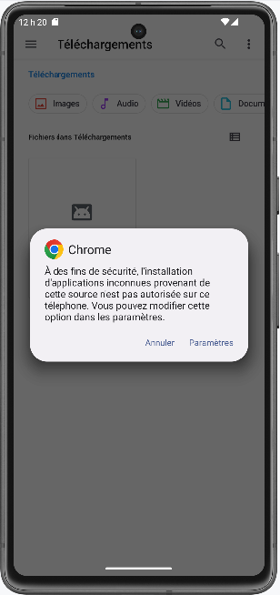


Vous pouvez aussi activer cette option manuellement :


#### Sur l'appareil Android, rendez-vous dans Paramètres / Applications / Accès spécial des applis /


#### Installer des applis inconnues .


#### Sélectionnez la source d'où provient l'application que vous désirez installer (ex : Chrome).


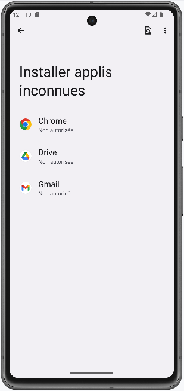


#### Cochez Autoriser à partir de cette source .


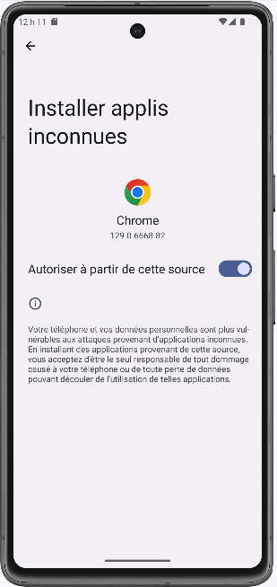


#### Pour plus d'information


* [« Différentes options de distribution » - Google Developer](https://developer.android.com/distribute/marketing-tools/alternative-distribution?hl=fr)


### * [« Comment installer des apps Android de sources inconnues ? » - Appaloosa](https://www.appaloosa.io/fr/blog/guides/comment-installer-app-source-inconnue-)
android
34. Exercice 4


---
