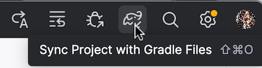
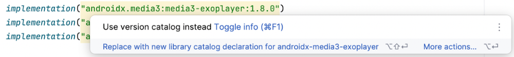
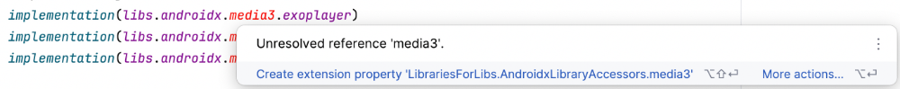

# Gestion de projet et dépendances avec Gradle


### 3.1 Qu'est-ce que Gradle?


Gradle est un outil de construction (build script) qui permet de compiler une application Kotlin.


Selon la documentation Android :


### Le système de compilation Android compile des ressources d'application et du code source, puis


### les empaquette dans des APK ou des Android App Bundles (AAB) que vous pouvez tester,
déployer, signer et distribuer.


### Android Studio utilise Gradle, une boîte à outils de compilation avancée, pour automatiser et gérer


### le processus de compilation, tout en vous permettant de définir des configurations de compilation
personnalisées flexibles.


Les scripts peuvent être écrits dans différents langages de scriptage, par exemple Groovy DSL ou Kotlin DSL. Ici, DSL signifie Domain Specific Language.


Les fichiers de configuration écrits en Groovy ne portent pas d'extension (ex : build.gradle ) alors que ceux écrits en Kotlin se terminent par .kts (ex :


build.gradle.kts ).


Un même projet peut contenir des fichiers de configurations dans l'un et l'autre de ces langages mais un même fichier ne peut utiliser qu'un seul langage.


> **Source** : 

## 1. * [« Configurer votre build » - Android Developers](https://developer.android.com/studio/build?hl=fr)


#### Pour plus d'information


* [« Conseils pratiques et recettes Gradle » - Android Developers](https://developer.android.com/studio/build/gradle-tips?hl=fr)


* [« Migrating build logic from Groovy to Kotlin » - Gradle](https://docs.gradle.org/current/userguide/migrating_from_groovy_to_kotlin_dsl.html#migrating_groovy_kotlin)


### * [« What is Gradle Kotlin DSL ? » - Medium](https://medium.com/@talhafaki/what-is-gradle-kotlin-dsl-a995aafc5e5c)
3.2 Fichier build.gradle ou build.gradle.kts


Le fichier build.gradle (écrit en Groovy) ou build.gradle.kts (écrit en Kotlin DSL) permet d'indiquer comment l'application Android sera compilée.


Ce fichier peut être présent en différents exemplaires.


#### Le fichier de compilation de premier niveau (top-level build file) est présent directement à la racine du projet. Il définit
les configurations générales de l'application.


```kotlin title="Fichier build.gradle.kts de premier niveau (Kotlin DSL)"
// Top-level build file where you can add configuration options common to all sub-projects/modules.
plugins {
    alias(libs.plugins.android.application) apply false
    alias(libs.plugins.jetbrains.kotlin.android) apply false
}
```


#### Le fichier de compilation de module (module-level build file) est présent dans le dossier app du projet ou dans un
sous-dossier d'un module lorsque le projet est organisé en plusieurs modules. Il permet de préciser des options de compilation du module et, au besoin, de modifier des options définies dans le fichier de compilation de premier niveau.


```kotlin title="Fichier build.gradle.kts de module (Kotlin DSL)"
plugins {
    alias(libs.plugins.android.application)
    alias(libs.plugins.jetbrains.kotlin.android)
}
android {
    namespace = "com.mondomaine.helloworld"
    compileSdk = 34
    defaultConfig {
        applicationId = "com.mondomaine.helloworld"
        minSdk = 33
        targetSdk = 34
        versionCode = 1
        versionName = "1.0"
        testInstrumentationRunner = "androidx.test.runner.AndroidJUnitRunner"
        vectorDrawables {
            useSupportLibrary = true
        }
    }
    buildTypes {
        release {
             isMinifyEnabled = false
             proguardFiles(
                 getDefaultProguardFile("proguard-android-optimize.txt"),
                 "proguard-rules.pro"
             )
        }
    }
    compileOptions {
        sourceCompatibility = JavaVersion.VERSION_1_8
        targetCompatibility = JavaVersion.VERSION_1_8
    }
    kotlinOptions {
        jvmTarget = "1.8"
    }
    buildFeatures {
        compose = true
    }
    composeOptions {
        kotlinCompilerExtensionVersion = "1.5.1"
    }
    packaging {
        resources {
             excludes += "/META-INF/{AL2.0,LGPL2.1}"
        }
    }
}
dependencies {
    implementation(libs.androidx.core.ktx)
    implementation(libs.androidx.lifecycle.runtime.ktx)
    implementation(libs.androidx.activity.compose)
    implementation(platform(libs.androidx.compose.bom))
    implementation(libs.androidx.ui)
    implementation(libs.androidx.ui.graphics)
    implementation(libs.androidx.ui.tooling.preview)
    implementation(libs.androidx.material3)
    testImplementation(libs.junit)
    androidTestImplementation(libs.androidx.junit)
    androidTestImplementation(libs.androidx.espresso.core)
    androidTestImplementation(platform(libs.androidx.compose.bom))
    androidTestImplementation(libs.androidx.ui.test.junit4)
    debugImplementation(libs.androidx.ui.tooling)
    debugImplementation(libs.androidx.ui.test.manifest)
} 
```


#### Pour plus d'information


* [« Configurer votre build » - Android Developers](https://developer.android.com/build?hl=fr)


### * [« Differences between CompileSDK,MinSDK and TargetSDK Version » - Medium](https://hey-agrawal.medium.com/differences-between-compilesdk-minsdk-and-)
targetsdk-version-6d5f720a6c8a 3.3 Ajouter une dépendance au projet


Plusieurs fonctionnalités nécessitent l'ajout de dépendances au projet.


Ceci est généralement réalisé en ajoutant une ligne dans le fichier build.gradle.kts  qui se trouve dans le dossier app .


```kotlin title="Fichier app/build.gradle.kts"
...
dependencies {
    ...
    implementation(...)
}
```


### Resynchroniser le projet


Une fois la dépendance ajoutée, il faut resynchroniser le projet pour qu'il tienne compte de l'ajout.


Ceci peut être réalisé de différentes façons :


#### en cliquant sur le lien Sync Now sur le bandeau qui apparaît.


#### en cliquant sur l'icône Sync Project with Gradle Files .





#### à partir de la fenêtre Build ( View / Tool Windows / Build ) en cliquant sur l'onglet Sync puis sur l'icône


#### Sync Gradle Project  en forme de flèches circulaires.


### Nettoyage et reconstruction


Dans certaines situations, une resynchronisation du projet pourrait ne pas être suffisante.


Si vous croyez que les modifications que vous avez apportées ne sont pas correctement prises en compte, effectuez ces étapes :


#### Resynchronisez le projet comme montré plus haut.


#### Rendez-vous ensuite dans le menu Build / Clean Project afin de nettoyer le projet.


#### Rendez-vous finalement dans le menu Files / Invalidate Caches  puis cochez la case


#### Clear file system cache and Local History . Cliquez ensuite sur Invalidate and Restart .


### 3.4 Use version catalog instead


Dans jetpack compose, quand vous ajoutez une dépendance dans le fichier build.gradle.kts , il peut arriver que vous obteniez un message du genre « Use version catalog instead. Replace with new library catalog declaration for ... ».





Ceci est dû au fait que votre projet utilise un catalogue de versions avec les numéros de versions configurés dans le fichier gradle/libs.versions.toml .


Voici le contenu de ce fichier au départ du projet (vos versions pourraient être différentes) :


```groovy title="Fichier gradle/libs.versions.toml"
[versions]
agp = "8.12.3"
kotlin = "2.0.21"
coreKtx = "1.17.0"
junit = "4.13.2"
junitVersion = "1.3.0"
espressoCore = "3.7.0"
lifecycleRuntimeKtx = "2.9.3"
activityCompose = "1.11.0"
composeBom = "2024.09.00"
[libraries]
androidx-core-ktx = { group = "androidx.core", name = "core-ktx", version.ref = "coreKtx" }
junit = { group = "junit", name = "junit", version.ref = "junit" }
androidx-junit = { group = "androidx.test.ext", name = "junit", version.ref = "junitVersion" }
androidx-espresso-core = { group = "androidx.test.espresso", name = "espresso-core", version.ref = "espressoCore" }
androidx-lifecycle-runtime-ktx = { group = "androidx.lifecycle", name = "lifecycle-runtime-ktx", version.ref =
"lifecycleRuntimeKtx" }
androidx-activity-compose = { group = "androidx.activity", name = "activity-compose", version.ref = "activityCompose" }
androidx-compose-bom = { group = "androidx.compose", name = "compose-bom", version.ref = "composeBom" }
androidx-ui = { group = "androidx.compose.ui", name = "ui" }
androidx-ui-graphics = { group = "androidx.compose.ui", name = "ui-graphics" }
androidx-ui-tooling = { group = "androidx.compose.ui", name = "ui-tooling" }
androidx-ui-tooling-preview = { group = "androidx.compose.ui", name = "ui-tooling-preview" }
androidx-ui-test-manifest = { group = "androidx.compose.ui", name = "ui-test-manifest" }
androidx-ui-test-junit4 = { group = "androidx.compose.ui", name = "ui-test-junit4" }
androidx-material3 = { group = "androidx.compose.material3", name = "material3" }
[plugins]
android-application = { id = "com.android.application", version.ref = "agp" }
kotlin-android = { id = "org.jetbrains.kotlin.android", version.ref = "kotlin" }
kotlin-compose = { id = "org.jetbrains.kotlin.plugin.compose", version.ref = "kotlin" }
```


Voici ce qui se passe lorsqu'on désire ajouter, par exemple, les dépendances pour faire jouer des sons.


Dans le fichier build.gradle.kts , vous devez entrer les lignes de code sans catalogue de versions.


```kotlin title="Fichier app/build.gradle.kts sans catalogue de versions"
implementation("androidx.media3:media3-exoplayer:1.8.0")
implementation("androidx.media3:media3-common:1.8.0")
implementation("androidx.media3:media3-ui:1.8.0")
```


Après avoir demandé de les remplacer avec la déclaration qui utilise le catalogue de version, on obtient :


```kotlin title="Fichier app/build.gradle.kts avec catalogue de versions"
implementation(libs.androidx.media3.exoplayer)
implementation(libs.androidx.media3.common)
implementation(libs.androidx.media3.ui)
```


Le fait d'avoir demandé à Android Studio de procéder au remplacement a permis d'ajuster automatiquement le fichier libs.versions.toml .


Voici le contenu de ce fichier après le remplacement.


```groovy title="Fichier gradle/libs.versions.toml"
[versions]
...
media3Exoplayer = "1.8.0"
[libraries]
androidx-core-ktx = { group = "androidx.core", name = "core-ktx", version.ref = "coreKtx" }
androidx-media3-common = { module = "androidx.media3:media3-common", version.ref = "media3Exoplayer" }
androidx-media3-exoplayer = { module = "androidx.media3:media3-exoplayer", version.ref = "media3Exoplayer" }
androidx-media3-ui = { module = "androidx.media3:media3-ui", version.ref = "media3Exoplayer" }
...
```


Un problème subsiste : un mot apparaît en rouge avec le message « Unresolved reference ».





### Le problème sera automatiquement réglé quand vous demanderez de **resynchroniser le
projet**.

