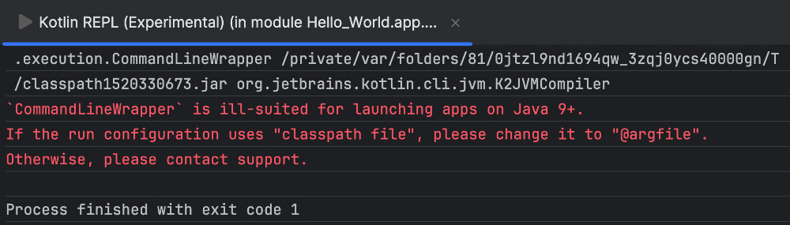
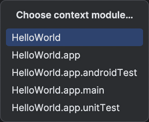
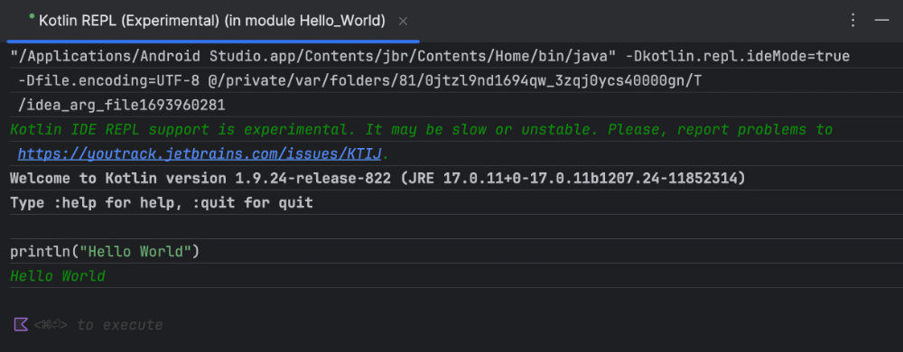

# Le langage Kotlin - Fondamentaux


### 4.1 Kotlin, le langage recommandé par Google pour Android


Kotlin est un langage de programmation orienté objet qui permet de développer différents types d'applications :


#### applications natives pour Android


#### applications multi-plateformes pour appareils mobiles


#### applications Web côté client (front-end)


#### applications Web côté serveur (back-end) et services Web


Il s'agit du langage de programmation recommandé par Google pour la programmation Android depuis 2019.


En effet, selon Wikipédia :


### Kotlin est un langage de programmation orienté objet et fonctionnel, avec un typage dynamique qui permet de compiler pour la machine virtuelle Java, JavaScript, et vers plusieurs plateformes en natif (grâce à LLVM). Son développement provient principalement d'une équipe de programmeurs
chez JetBrains basée à Saint-Pétersbourg en Russie (son nom vient de l'île de Kotline, près de St. Pétersbourg).


### Google annonce pendant la conférence Google I/O 2017 que Kotlin devient le second langage de programmation officiellement pris en charge par Android après Java. Le 8 mai 2019, toujours lors
de la conférence Google I/O, Kotlin devient officiellement le langage de programmation voulu et recommandé par le géant américain Google pour le développement des applications Android.


> **Source** : 

## 1. « Kotlin (langage) ». Wikipédia. [https://fr.wikipedia.org/wiki/Kotlin_(langage](https://fr.wikipedia.org/wiki/Kotlin_(langage))


#### Pour plus d'information


* [« Get started with Kotlin » - Kotlin](https://kotlinlang.org/docs/getting-started.html)


* [« Formation Kotlin pour les programmeurs » - Android Developers](https://developer.android.com/courses/kotlin-bootcamp/overview?hl=fr)


* [« Kotlin docs » - Kotlin](https://kotlinlang.org/docs/home.html)


* [« Kotlin quick reference » - Alvin Alexander](https://kotlin-quick-reference.com/)


* [« Keywords and operators » - Kotlin](https://kotlinlang.org/docs/keyword-reference.html)


* [« Guide de l'architecture des applications » - Android Developers](https://developer.android.com/topic/architecture?hl=fr)


* [« Principes de base d'Android avec Compose » - Android Developers](https://developer.android.com/courses/android-basics-compose/course?hl=fr)


### 4.2 Où sont les points-virgules?


Contrairement à plusieurs langages comme PHP, JavaScript, Java et C#, il n'y a pas de point-virgule à la fin d'une instruction Kotlin.


Ce sont les sauts de lignes qui lui permet de savoir où une instruction se termine.


Par contre, si vous ajoutez des points-virgules par habitude, Kotlin les acceptera sans se plaindre ;-)


### 4.3 Normes de programmation Kotlin


Voici un résumé des principales normes de programmation à respecter lorsque vous codez en Kotlin.


#### Norme
Exemple


#### Nom des variables
casse chameau var premiereLettre: Char


#### Nom des constantes
casse serpent majuscule const val NOMBRE_TOURS = 5


#### Nom des classes
casse Pascal, expression au singulier data class CategorieItem(...)


#### Nom des fonctions
casse chameau fun recommencerPartie() {...}


@Composable


#### Nom des fonctions modulables casse Pascal


fun ImageRonde(...) {...}


#### Nom des ressources
casse serpent bonne_reponse


#### Pour plus d'information


### * [« Coding conventions » - Kotlin](https://kotlinlang.org/docs/coding-conventions.html)
4.4 Variables et constantes


Dans cette fiche, je vais vous montrer comment déclarer des variables et des constantes dans le langage Kotlin.


### Types de données


Les principaux types de données sont :


#### String


#### Char


#### Int


#### Float


#### Double


#### Boolean


Le type Unit correspond au type void dans d'autres langages.


### Variables


En Kolin, la déclaration d'une variable se fait à l'aide du mot-clé var.


Le nom des variables doit utiliser **la casse chameau**.


```kotlin title="Kotlin"
var quantiteEnStock = 10
```


Il est possible de préciser le type de la variable lors de sa déclaration. Ceci est optionnel si la variable est immédiatement initialisée mais obligatoire si elle est déclarée sans valeur initiale.


```kotlin title="Kotlin"
var quantiteEnStock: Int = 10
var valeurMaximale = 5
var nom: String
```


Dans le cas d'une variable de type float, il faut mettre un f après sa valeur, sinon elle est considérée double.


```kotlin title="Jetpack Compose (Kotlin)"
var valeur = 0.0f
```


Dans le cas où vous précisez le type lors de la déclaration, il faut tout de même ajouter le f sans quoi vous obtiendrez l'erreur « The floating-point literal does not conform to the expected type Float ».


```kotlin title="Kotlin"
var valeur: Float = 0.0f
```


Les chaînes de caractères (String ) seront entourées de guillemets. Les apostrophes sont réservées aux caractères uniques (Char ).


```kotlin title="Kotlin"
var nom = "Annie Gagnon"
var premiereLettre = 'A'
```


### Constantes


La déclaration d'une constante se fait à l'aide du mot-clé val.


Dans les cas les plus simples, le nom de la constante sera entièrement en majuscules et utilisera **la casse serpent**.


```kotlin title="Kotlin"
val DATE_DU_JOUR = LocalDate.now()
```


!!! warning "Note : dans certains" Note : dans certains contextes, il est possible de déclarer une constante dont la valeur est connue au moment de la compilation (compile-time constant) en ajoutant le mot-clé const devant val.


Seuls les types primitifs peuvent initialiser ce type de constante. Il n'est pas possible de l'initialiser à l'aide d'une fonction, par exemple pour initialiser la date du jour.


```kotlin title="Kotlin"
const val QUANTITE_MINIMALE = 10
```


#### Pour plus d'information


* [« 2. Task: Learn about operators and types » - Android Developers](https://developer.android.com/codelabs/kotlin-bootcamp-basics#1)


### * [« Basic types » - Kotlin](https://kotlinlang.org/docs/basic-types.html)
4.5 Structures de contrôle en Kotlin (if, for, while, etc.)


Voici un court résumé des principales structures de contrôle en Kotlin.


### Conditions


La structure de contrôle if ressemble beaucoup à ce qu'on retrouve dans d'autres langages de programmation.


```kotlin title="Kotlin"
if (age < 18) {
    ...
} else if (age == 18) {
    ...
} else {
    ...
}
```


### Conditions à plusieurs branches


La structure de contrôle when est l'équivalent du switch dans d'autres langages.


Pour exécuter différentes branches selon la valeur d'une variable :


```kotlin title="Kotlin"
when (valeur) {
    1 -> ...
    2 -> ...
    3 -> ...
    else -> {
        ...
    }
}
```


Il est également possible d'utiliser des expressions pour sélectionner une branche :


```kotlin title="Kotlin"
when {
    age < 18 -> ...
    age < 21 -> ...
    age >= 21 -> ...
}
```


### Boucles for


L'instruction for permet de boucler un nombre défini de fois :


```kotlin title="Kotlin"
for (i in 1..3) {
    println(i)
}
```


Ou encore :


```kotlin title="Kotlin"
val nombre = 3
for (i in 0 ..< nombre) {
    println(i)
}
```


Pour boucler parmi les éléments d'un tableau :


```kotlin title="Kotlin"
val noms = arrayOf("Annie", "Jonathan", "Pierre-Luc" "Amélie")
for (nom in noms) {
    println(nom)
}
```


### Boucles while


Encore ici, le fonctionnement de while ressemble aux autres langages.


```kotlin title="Kotlin"
var i = 1
while (i <= 5) {
    println(i++)
}
```


autre exemple :


```kotlin title="Kotlin"
val maListe = listOf(1, 2, 3, 4)
var i = 0
val nombreElements = maListe.size
while (i < nombreElements) {
    Text(text = maListe[i].toString())
    i++
}
```


### Boucles forEach


Cette structure de contrôle permet de boucler dans les éléments d'un tableau.


Par défaut, on accède à l'élément en cours de traitement à l'aide du mot-clé **it**.


```kotlin title="Kotlin"
monTableau.forEach {
    Log.d("MainActivity", "Traitement de la valeur $it")
}
```


Il est possible de nommer l'élément en cours de traitement.


```kotlin title="Kotlin"
monTableau.forEach { valeur ->
    Log.d("MainActivity", "Traitement de la valeur $valeur")
}
```


### Boucle forEachIndexed


Ceci est l'équivalent du forEach sauf qu'on a en plus accès à l'index de l'élément en cours de traitement.


```kotlin title="Kotlin"
monTableau.forEachIndexed { index, valeur ->
    Log.d("MainActivity", "Traitement de la valeur $valeur à l'indice $index")
}
```


### Boucle repeat


Avec l'instruction repeat , il est possible de boucler un nombre défini de fois.


Il offre une syntaxe plus simple que for mais il est moins versatile. Par exemple, repeat ne peut pas boucler sur une collection et l'index de départ est toujours 0.


Sa syntaxe ne requiert qu'un seul paramètre : le nombre de fois qu'il faut boucler.


```kotlin title="Kotlin"
repeat(3) {
    Log.d("MainActivity", "Kotlin")   // Kotlin, Kotlin, Kotlin
}
```


Si on a besoin de connaître l'index, on réalise que l'index de départ est toujours 0 :


```kotlin title="Kotlin"
repeat(5) { index ->
    Log.d("MainActivity", "Traitement de l'index $index")  // 0, 1, 2, 3, 4
}
```


#### Pour plus d'information


* [« Conditions and loops » - Kotlin](https://kotlinlang.org/docs/control-flow.html)


* [« Basic syntax » - Kotlin](https://kotlinlang.org/docs/basic-syntax.html)


### * [« Idioms » - Kotlin](https://kotlinlang.org/docs/idioms.html)
4.6 Qu'est-ce que Unit?


En Kotlin, Unit est semblable à void dans d'autres langages.


Par exemple, pour déclarer une fonction qui n'a pas de valeur de retour :


```kotlin title="Kotlin"
fun faireQuelqueChose(): Unit {
    ...
}
```


Dans la plupart des cas, on précisera le type Unit simplement pour  clarifier le code puisque Kotlin saura l'inférer s'il n'est pas précisé.


```kotlin title="Kotlin"
// Kotlin saura que le type de retour est Unit
fun faireQuelqueChose() {
    ...
}
```


### 4.7 Les optionnels


Certaines variables peuvent prendre la valeur null. On dira de ces variables qu'elles sont optionnelles ou, en anglais, nullable.


Pour déclarer une variable optionnelle, on fait suivre son type par un point d'interrogation.


```kotlin title="Kotlin"
var nom: String ? = "Annie"
```


Il faudra ensuite prendre des précautions lors de l'utilisation de cette variable.


### Vérification explicite


Si on utilise un test qui vérifie si une variable est nulle avant de l'utiliser, le compilateur acceptera que la variable soit utilisée telle qu'elle.


```kotlin title="Kotlin"
var nom: String? = "Annie"
...
if (nom != null) {
    Text(text = nom)
}
```


### Opérateur !!


L'opérateur !!, que l'on appelle opérateur d'assertion non nul ou, en anglais, non-null assertion operator, permet de dire au compilateur qu'il est absolument certain que la variable n'a pas la valeur null.


Mais attention : si vous utilisez ce symbole alors que la variable est nulle, le programme plantera.


```kotlin title="Kotlin"
var nom: String? = "Annie"
...
Text(text = nom !! )
```


### Opérateur d'appel sécurisé (?.)


L'opérateur ?., que l'on appelle opérateur d'appel sécurisé ou, en anglais, safe-call operator, permet d'accéder aux proprités ou aux méthodes d'un objet sans que l'application ne plante si jamais l'objet était nul.


```kotlin title="Kotlin"
var nom: String? = "Annie"
...
val longueur = nom ?. length   // longueur aura la valeur null si le nom est nul
```


### Opérateur Elvis (?:)


L'opérateur ?:, que l'on appelle opérateur Elvis (puisqu'il ressemble à la coiffure d'Elvis ;-)), permet de préciser une valeur de remplacement si la variable est nulle.


```kotlin title="Kotlin"
var nom: String? = "Annie"
...
Text(text = nom?.length?.toString() ?: "0")
```


Source de l'image originale : [https://openclipart.org/download/232294/Elvis.svg](https://openclipart.org/download/232294/Elvis.svg)


#### Pour plus d'information


* [« Null safety » - Kotlin](https://kotlinlang.org/docs/null-safety.html)


### * [« Safe calls(?.) vs Null checks(!!) in Kotlin » - Ballu](https://agrawalsuneet.github.io/blogs/safe-calls-vs-null-checks-in-kotlin/)
4.8 Les modèles de chaîne (chaîne qui contient des variables)


Les modèles de chaînes, en anglais string templates, permettent d'utiliser une variable directement dans une chaîne de caractères.


Le concept des modèles de chaînes est parfois appelé interpolation de chaîne.


Pour créer un modèle de chaîne, il suffit d'ajouter du texte entre guillements et, dans ce texte, faire précéder les noms de variables du signe $. Les variables seront alors interprétées, comme en PHP.


```kotlin title="Kotlin"
var nom = "Annie"
Text(text = "Bonjour $nom ")
```


Dans le cas où la variable est une propriété d'un objet, il faudra l'entourer d'accolades.


```kotlin title="Kotlin"
Text(text = "Bonjour $ { ami.nom } ")
```


#### Pour plus d'information


* [« Strings - String templates » - Kotlin](https://kotlinlang.org/docs/strings.html#string-templates)


### 4.9 Les collections


Le langage Kotlin offre une foule de classes pour gérer des collections, par exemple List, Set, Map.


#### Pour plus d'information


* [« Collections overview » - Kotlin](https://kotlinlang.org/docs/collections-overview.html)


* [« Utiliser les collections en Kotlin » - Android Developers](https://developer.android.com/codelabs/basic-android-kotlin-collections?hl=fr#0)


### 4.10 Les tableaux


En Kotlin, les tableaux sont une structure de données de taille fixe.


Les éléments d'un tableau doivent être tous du même type.


```kotlin title="Kotlin"
val enfants = arrayOf("Loïc", "Ève", "Justin", "Axelle")
```


Pour les types élémentaires, on peut aussi utiliser cette syntaxe.


```kotlin title="Kotlin"
val valeurs = intArrayOf(1, 2, 3, 4)
```


Pour accéder à un élément :


```kotlin title="Kotlin"
val aine = enfants[0]
```


Pour modifier un élément :


```kotlin title="Kotlin"
enfants[2] = "Justinov-Popodov"
```


Boucler dans les éléments du tableau


```kotlin title="Kotlin"
Column() {
    for( enfant in enfants ){
        Text(text = enfant)
    }
}
```


#### Pour plus d'information


* [« Arrays » - Kotlin](https://kotlinlang.org/docs/arrays.html)


### 4.11 Les listes


L'interface List permet de créer une liste immuable. On crée une liste immuable avec la fonction listOf() .


```kotlin title="Kotlin"
val enfants = listOf("Loïc", "Ève", "Justin", "Axelle")
```


Pour déclarer une liste vide, il faut préciser le type de ses éléments puisque Kotlin ne peut pas le déduire :


```kotlin title="Kotlin"
val enfants: List<String> = emptyList()   // on ne pourra pas modifier la variable mais on pourra la réassigner à une autre
liste
```


Dans le cas où vous avez besoin de modifier la liste, il faut plutôt travailler avec une MutableList et la fonction mutableListOf() .


```kotlin title="Kotlin"
val amis = mutableListOf("Laury-Danielle", "Steven", "Élizabeth", "Frédérick")
```


Pour déclarer une liste vide :


```kotlin title="Kotlin"
var ennemis: MutableList<String> = mutableListOf()
```


ou


```kotlin title="Kotlin"
var ennemis = mutableListOf<String>()
```


### Accéder à un élément


Pour accéder à un élément :


```kotlin title="Kotlin"
val ami = amis[0]
```


Autres méthodes intéressantes :


```kotlin title="Kotlin"
val premier = amis.first()
val dernier = amis.last()
```


### Compter les éléments


Pour savoir combien d'éléments sont contenus dans la liste :


```kotlin title="Kotlin"
val nombre = amis.count()
```


ou


```kotlin title="Kotlin"
val nombre = amis.size
```


### Ajouter un élément


Pour ajouter un élément (liste muable seulement) :


```kotlin title="Kotlin"
amis.add
("Loïc")
```


### Retirer un élément


Pour retirer un élément à partir de son indice (liste muable seulement) :


```kotlin title="Kotlin"
amis.removeAt(4)
```


Pour retirer un élément à partir de sa valeur (liste muable seulement) :


```kotlin title="Kotlin"
amis.remove("Loïc")
```


Dans le cas d'une liste immuable, il est possible de travailler avec drop() . Lors de l'exécution du drop(), Kotlin crée une nouvelle liste temporaire à partir des informations de la liste immuable donc la liste originale n'est effectivement pas modifiée.


Il est nécessaire de réinitialiser la variable à partir du résultat pour que l'opération soit prise en compte.


```kotlin title="Kotlin"
enfants = enfants.drop(2)   // retire les deux premiers éléments
```


### Modifier un élément


Pour modifier un élément (liste muable seulement) :


```kotlin title="Kotlin"
amis[3] = "Fred"
```


### Boucle


Pour boucler dans les éléments de la liste :


```kotlin title="Kotlin"
Column() {
    for( ami in amis ){
        Text(text = ami)
    }
}
```


#### Pour plus d'information


* [« Utiliser les collections en Kotlin - Les listes » - Kotlin](https://developer.android.com/codelabs/basic-android-kotlin-collections?hl=fr#2)


### * [« Working With Lists in Kotlin » - Baeldung](https://www.baeldung.com/kotlin/lists)
4.12 Les fonctions


Les fonctions en Kotlin sont déclarées à l'aide du mot-clé fun.


```kotlin title="Kotlin"
fun maFonction(unParamatre: Int, unAutreParametre: String = "valeurParDefaut"): Int {
    ...
    return valeurDeRetour
}
```


#### Pour plus d'information


* [« Functions » - Kotlin](https://kotlinlang.org/docs/functions.html)


### 4.13 Read-Eval-Print Loop (REPL)


La console REPL (Read-Eval-Print Loop) permet d'exécuter du code Kotlin sans avoir à charger l'application entière.


Pour ouvrir la console REPL à partir d'Android Studio, rendez-vous dans le menu  Tools / Kotlin / Kotlin REPL .


Il se peut que vous obteniez le message « 'CommandLineWrapper' is ill-suited for lauhching apps on Java 9+. If the run configuration uses "classpath file", please change it to "@argfile". Otherwise, please contact support. ».





À ce moment, laissez la fenêtre ouverte et refaites  Tools / Kotlin / Kotlin REPL . Une fenêtre contextuelle vous demandera de choisir un module. Sélectionnez le tout premier, celui qui ne se termine pas par .app.





Cette fois, vous avez accès à la console REPL. Entrez une commande puis appuyez sur  Ctrl + Entrée (Windows) ou  ⌘ Cmd + ↵ Entrée (Mac) pour l'exécuter.





#### Pour plus d'information


* [« REPL in Kotlin » - Medium](https://medium.com/android-news/repl-in-kotlin-4d7091236961)


### * [« Run Kotlin in interactive console » - JetBrains](https://www.jetbrains.com/help/idea/kotlin-repl.html)
4.14 Les classes


Voici un exemple de déclaration d'une classe en Kotlin.


```kotlin title="Kotlin"
class Cercle(
    // paramètres du constructeur - seront automatiquement assignés aux propriétés du même nom, qui n'ont pas à être
redéclarées
    val coordX: Integer,
    val coordY: Integer,
    val rayon: Integer,
) {
    // propriétés
    private var _couleur: Color = Color.Black   // propriété dont la valeur est initialisée dès la déclaration
    // bloc d'initialisation - complément au constructeur
    init {
        ...
    }
    // méthodes
    fun dessiner() {
        ...
    }
}
```


### Il est d'usager de nommer la classe avec un nom au singulier.


Chaque classe devrait être dans son propre fichier et le fichier portera le même nom que la classe.


Il existe différentes façons de structurer les fichiers du projet. Dans la structure qui a été retenue ici, les classes qui représentent des données seront placées dans un dossier nommé models .


Ce dossier sera au même niveau que le fichier MainActiviy.kt , par exemple app/src/main/java/com/monnom/monprojet/models/MaClasse.kt .


Pour créer ce dossier dans Android Studio : Clic droit sur son dossier parent / New / Package .


### Instanciation


L'instanciation d'un objet est réalisée à l'aide du nom de la classe.


```kotlin title="Kotlin"
var monCercle = Cercle(10, 25, 5)
```


### Méthodes de classe


Une méthode de classe est une fonction qui, pour être exécutée, doit être précédée du nom de la classe plutôt que du nom d'un objet de cette classe.


Dans plusieurs langages de programmation orientés objet, les méthodes de classe sont déclarées à l'aide du mot-clé static.


En Kotlin, on marquera plutôt la méthode de classe à l'aide du mot-clé companion .


```kotlin title="Kotlin"
class MaClasse {
    ...
    companion object {
        fun maMethodeDeClasse() {
            ...
        }
    }
}
```


Pour utiliser cette méthode :


```kotlin title="Kotlin"
MaClasse.maMethodeDeClasse()
```


#### Pour plus d'information


* [« Classes » - Kotlin](https://kotlinlang.org/docs/classes.html)


* [« Kotlin Constructors » - Programiz](https://www.programiz.com/kotlin-programming/constructors)


### 4.15 Les énumérations


Une énumération est un modèle de données qui permet de définir un type de données qui comporte une liste définie de valeurs possibles, qu'on appellera constantes.


Par exemple, on pourrait avoir un type Categorie qui accepte les constantes ROUTE, HORS_PISTE et HYBRIDE.


Avec le langage Kotlin, l'énumération est un type particulier de classe.


Il est d'usage de nommer les constantes en lettres majuscules.


```kotlin title="Kotlin"
enum class Categorie {
    ROUTE, HORS_PISTE, HYBRIDE
}
```


Pour utiliser l'énumération :


```kotlin title="Kotlin"
val categorie: Categorie = Categorie.ROUTE
val position = categorie.ordinal   // 0
val nom = categorie.name   // ROUTE
```


Chaque constante peut également être rattachée à une valeur.


Vous pouvez utiliser le nom que vous désirez pour nommer cette valeur. Ici, j'ai choisi de l'appeler code.


```kotlin title="Kotlin"
enum class Categorie(val code : String) {
    ROUTE("route"),
    HORS_PISTE("hors piste"),
    HYBRIDE("hybride")
}
```


Et pour utiliser cette valeur :


```kotlin title="Kotlin"
val categorie: Categorie = Categorie.ROUTE
Text(text = categorie. code )
```


Pour l'utiliser dans un **modèle de chaîne**, il faut ajouter des accolades.


```kotlin title="Kotlin"
Text(text = "Vous avez choisi la catégorie ${categorie.code}")
```


#### Pour plus d'information


* [« Enum classes » - Kotlin](https://kotlinlang.org/docs/enum-classes.html)


* [« Enum classes in Kotlin » - Kt Academy](https://kt.academy/article/kfde-enum)


* [« A complete guide to enum classes in Kotlin » - LogRocket](https://blog.logrocket.com/kotlin-enum-classes-complete-guide/)


### 4.16 Flow : flux de données observable


Un flux de données observables, ou simplement flux (en anglais : flow), permet de recevoir une série de valeurs de façon séquentielle, par exemple à partir d'une base de données.


#### Pour plus d'information


* [« Kotlin Flow with Jetpack Compose » - Answertopia](https://www.answertopia.com/jetpack-compose/kotlin-flow-with-jetpack-compose/)


* [« Flux Kotlin sur Android » - Android Developers](https://developer.android.com/kotlin/flow?hl=fr)


### 4.17 Les expressions lambda


Dans le langage Kotlin, les expressions lambda offrent une syntaxe allégée pour définir des fonctions.


La syntaxe d'une expression lambda est la suivante :


```kotlin title="Kotlin"
val uneValeur: (Type_parametre_1, Type_paremetre_2) -> Type_retour = { parametre1:Type_parametre_1,
parametre2:Type_paremetre_2 -> traitement }
```


Par exemple, on pourrait avoir une expression Lambda qui additionne deux nombres.


```kotlin title="Kotlin"
val somme : (Int, Int) -> Int = { x: Int, y: Int -> x + y }
```


Cette expression lambda est l'équivalent de cette fonction :


```kotlin title="Kotlin"
fun somme ( x: Int, y: Int ) : Int {
    return x + y
}
```


Certaines parties de la syntaxe lambda sont optionnelles selon le contexte.


Ici, l'expression pourrait être simplifiée comme suit :


```kotlin title="Kotlin"
val somme = {x: Int, y: Int -> x + y}
```


ou encore :


```kotlin title="Kotlin"
val somme: (Int, Int) -> Int = {x, y -> x + y}
```


Pour utiliser cette expression lambda, on fait comme si c'était une fonction :


```kotlin title="Jetpack Compose (Kotlin)"
Text(text = somme(15, 20) .toString())
```


### Paramètre implicite it


Lorsqu'une expression lambda ne reçoit qu'un seul paramètre, il est possible d'omettre son nom. Il s'appelera alors it.


### Vous trouverez plus de détails sur cette fiche : « **parametre_implicite_it** ».
4.18 Paramètre implicite it


Dans le code Kotlin, il est fréquent de voir une variable qui s'appelle it . Mais d'où vient cette variable et que représente-t-elle?


Il s'agit du paramètre reçu dans une **expression lambda** qui ne contient qu'un seul paramètre.


On l'appellera paramètre implicite.


Par exemple,  on pourrait avoir cette expression lambda qui calcule le carré d'un nombre.


```kotlin title="Kotlin"
val valeurAuCarre = { nombre: Int -> nombre * nombre }
```


Puisqu'elle ne reçoit qu'un paramètre, on peut modifier la syntaxe comme suit :


```kotlin title="Kotlin"
val valeurAuCarre: (Int) -> Int = { it * it }
```


Remarquez qu'il a fallu ici spécifier le type du paramètre et de la valeur de retour puisque Kotlin n'avait aucun autre moyen de le deviner.


### Paramètre implicite dans une boucle


Voici une utilisation fréquente du paramètre implicite it.


```kotlin title="Jetpack Compose (Kotlin)"
val amis = arrayOf("Frédérick", "Élizabeth", "Justin", "Axelle")
 
Column {
    amis.forEach { Text( it ) }
}
```


Ceci est l'équivalent de :


```kotlin title="Jetpack Compose (Kotlin)"
val amis = arrayOf("Frédérick", "Élizabeth", "Justin", "Axelle")
 
Column {
    amis.forEach { ami -> Text( ami ) }
}
```


### Paramètre implicite d'un Scaffold


Lorsqu'on définit le contenu d'un **Scaffold**, le paramètre implicite est de type PaddingValues et il représente les marges verticales à respecter pour ne pas que le contenu se retrouve sous les zones réservées en haut et en bas de l'écran.


```kotlin title="Kotlin"
Scaffold(
    ...
) { 
    MainContent(innerPadding = it )
}
@Composable
fun MainContent(innerPadding: PaddingValues) {
    ...
}
```


On aurait pu nommer ce paramètre en utilisant cette syntaxe :


```kotlin title="Kotlin"
Scaffold(
    ...
) { innerPadding ->
    MainContent(innerPadding = innerPadding )
}
@Composable
fun MainContent(innerPadding: PaddingValues) {
    ...
}
```


### 4.19 Les dates


Dans tout langage de programmation, la manipulation des dates pose un défi.


Ce défi n'est pas si difficile à relever, en autant que les bases soient bien comprises.


Je vous propose ici quelques techniques de manipulation de dates en Kotlin.


Dans cette fiche :


#### Retrouver la date courante


#### Objet de type LocalDateTime


#### Objet de type Date


#### Représenter une date quelconque


#### Chaîne au format ISO 8601


#### Chaîne dans un autre format


#### Changer le format d'affichage de la date


#### Objet de type LocalDateTime


#### Objet de type Date


#### Soustraire des dates


#### Objets de type LocalDateTime


#### Objets de type Date


### Retrouver la date courante


Il existe deux principales classes pour représenter une date en Kotlin : LocalDateTime et Date.


### Objet de type LocalDateTime


Une technique largement répandue pour représenter la date courante consite à utiliser la classe LocalDateTime avec sa méthode now() :


```kotlin title="Jetpack Compose (Kotlin)"
import java.time.LocalDateTime
...
val dateActuelle = LocalDateTime.now()
Text("$dateActuelle")   // affichera la date au format 2025-08-23T09:26:46.714698
```


### Objet de type Date


Il est encore possible de travailler avec la classe Date même si cette technique n'est plus encouragée (le code est barré pour cette raison) :


```kotlin title="Jetpack Compose (Kotlin)"
import java.util.Date
...
val dateActuelleTypeDate = Date()
Text("$dateActuelleTypeDate")   // affichera la date au format Fri Aug 23 09:26:46 EDT 2025
```


### Représenter une date quelconque


La classe LocalDateTime , avec sa méthode parse() , permet de représenter une date donnée.


### Chaîne au format ISO 8601


La chaîne qui représente la date doit être au format ISO 8601 .


```kotlin title="Kotlin"
import java.time.LocalDateTime
...
val uneDate = LocalDateTime.parse("2002-07-15T13:55:00")
Text("$uneDate")   // affichera la date au format 2022-07-15T13:55
```


Si la chaîne représente une date sans heure, il faut plutôt utiliser LocalDate.parse() pour initialiser la date.


```kotlin title="Jetpack Compose (Kotlin)"
import java.time.LocalDate
...
val uneDate = LocalDate .parse("2002-07-15")
Text("$uneDate")   // affichera la date au format 2022-07-15
```


### Chaîne dans un autre format


Si on souhaite fournir une chaîne qui représente la date dans un format différent, un second paramètre permet de spécifier le format de la chaîne.


Ce paramètre sera initialisé avec DateTimeFormatter.ofPattern() .


```kotlin title="Jetpack Compose (Kotlin)"
import java.time.LocalDateTime
import java.time.format.DateTimeFormatter
...
val dateTimeFormatter = DateTimeFormatter.ofPattern(" yyyy MM dd 'à' H'h'mm ")
val uneDate = LocalDateTime.parse(" 1999 04 18 à 8h30 ", dateTimeFormatter)
Text("$uneDate")   // affichera la date au format 1999-04-18T08:30
```


Remarquez que si la chaîne ne correspond pas au format spécifié, l'application plantera avec le message « java.time.format.DateTimeParseException: Text '...' could not be parsed ... ».


Ici aussi, si la chaîne représente une date sans heure, il faut plutôt utiliser LocalDate.parse() pour initialiser la date. Le format sera tout de même spécifié avec DateTimeFormatter.


```kotlin title="Jetpack Compose (Kotlin)"
import java.time.LocalDate
import java.time.format.DateTimeFormatter
...
val dateTimeFormatter = DateTimeFormatter.ofPattern(" yyyy MM dd ")
val uneDate = LocalDate .parse(" 1999 04 18 ", dateTimeFormatter)
Text("$uneDate")   // affichera la date au format 1999-04-18
```


### Changer le format d'affichage de la date


Pour avoir un meilleur contrôle sur la façon dont la date est affichée, il est possible de spécifier le format souhaité.


La technique dépendra de la façon dont la date a été créée, ce qui influence le type d'objet qui représente la date.


### Objet de type LocalDateTime


Avec un objet de type LocalDateTime, il est possible de travailler avec un DateTimeFormatter .


Le plus simple consiste à utiliser un des styles prédéfinis .


```kotlin title="Jetpack Compose (Kotlin)"
import java.time.format.DateTimeFormatter
import java.time.LocalDateTime
...
val dateTimeFormatter = DateTimeFormatter. ISO_LOCAL_DATE
val dateActuelle = LocalDateTime.now()
Text(dateActuelle.format(dateTimeFormatter))   // affichera la date au format 2025-08-23
```


Il est également possible d'utiliser des styles qui tiennent compte de la localisation configurée sur le téléphone .


```kotlin title="Jetpack Compose (Kotlin)"
import java.time.format.DateTimeFormatter
import java.time.LocalDateTime
...
val dateTimeFormatter = DateTimeFormatter. ofLocalizedDateTime(FormatStyle.MEDIUM)
val dateActuelle = LocalDateTime.now()
Text(dateActuelle.format(dateTimeFormatter))   // affichera la date au format 23 août 2025, 09 h 26 min 46 s
                                               // ou, si le téléphone est en anglais, Aug 23, 2025, 09:26:46 AM
```


Toujours avec un objet de type LocalDateTime, il est possible de forcer le format à l'aide de DateTimeFormatter.ofPattern().


Cette technique est cependant à utiliser seulement pour les cas d'exception puisque la date ne répondra plus au format d'affichage configuré sur le téléphone.


```kotlin title="Jetpack Compose (Kotlin)"
import java.time.format.DateTimeFormatter
import java.time.LocalDateTime
...
val dateTimeFormatter = DateTimeFormatter.ofPattern("dd MMMM yyyy 'à' H'h'mm")
val dateActuelle = LocalDateTime.now()
Text(dateActuelle.format(dateTimeFormatter))   // affichera toujours la date au format 23 août 2025 à 9 h 26
```


Voici quelques autres exemples de formateurs.


```kotlin title="Jetpack Compose (Kotlin)"
val dateTimeFormatter1 = DateTimeFormatter.ISO_LOCAL_DATE   // date au format 2025-09-12
val dateTimeFormatter2 = DateTimeFormatter.ISO_TIME   // heure au format 10:56:15.862697
val dateTimeFormatter3 = DateTimeFormatter.ofLocalizedDate(FormatStyle.SHORT)   // date au format 9/12/25
val dateTimeFormatter4 = DateTimeFormatter.ofLocalizedTime(FormatStyle.SHORT)   // heure au format 10:56 AM
val dateTimeFormatter5 = DateTimeFormatter.ofLocalizedDateTime(FormatStyle.SHORT)   // date et heure au format 19/12/25, 10:56
AM
val dateTimeFormatter6 = DateTimeFormatter.ofPattern
("k:m:s - n 'nanosecondes'")  // heure au format 10:56:15 - 862697
nanosecondes
```


### Objet de type Date


Avec un objet de type Date, on travaillera avec DateFormat.getDateInstance().


```kotlin title="Jetpack Compose (Kotlin)"
import java.util.Date
...
val dateActuelleTypeDate = Date()
Text(DateFormat.getDateInstance().format(dateActuelleTypeDate))   // affichera la date au format 23 août 2025
                                                                  // ou, si le téléphone est en anglais, Aug 23, 2025
```


Toujours avec un objet de type Date, il est possible de forcer le format à l'aide d'un SimpleDateFormat .


Cette technique est cependant à utiliser seulement pour les cas d'exception puisque la date ne répondra plus au format d'affichage configuré sur le téléphone.


```kotlin title="Jetpack Compose (Kotlin)"
import java.util.Date
...
val dateActuelleTypeDate = Date()
val simpleDateFormat = SimpleDateFormat("dd/M/yyyy hh:mm:ss")
Text(simpleDateFormat.format(dateActuelleTypeDate))   // affichera toujours la date au format 23/8/2025 09:26:46
```


### Soustraire des dates


Il est possible de déterminer l'écart entre deux dates afin de calculer un délai.


### Objets de type LocalDateTime


La classe Duration permet d'instancier un objet qui représente le temps écoulé entre deux dates.


À partir d'un objet Duration, on pourra spécifier dans quelle unité on désire travailler.


```kotlin title="Jetpack Compose (Kotlin)"
val duree = Duration.between(date1, date2)
val heures = duree.toHours()
val millisecondes = duree.toMillis()
```


L'énumération ChronoUnit , quant à elle, permet de spécifier directement dans quelle unité la différence doit être calculée.


```kotlin title="Jetpack Compose (Kotlin)"
val days = ChronoUnit.MILLIS.between(date1, date2)
val millisecondes = ChronoUnit.MILLIS.between(date1, date2)
```


### Objets de type Date


Quand on a en main des dates de type Date, voici comment calculer la différence.


```kotlin title="Jetpack Compose (Kotlin)"
val difference = date2.time - date1.time
val jours = TimeUnit.MILLISECONDS.toDays(difference)
val secondes = TimeUnit.MILLISECONDS.toSeconds(difference)
```


#### Pour plus d'information


* [« Get the Current Date/Time in Kotlin » - Baeldung](https://www.baeldung.com/kotlin/current-date-time)


### * [« Mastering Date and Time Handling in Kotlin for Android Developers » - BugFender](https://bugfender.com/blog/kotlin-dates/)
4.20 Effectuer une pause


En Kotlin, il est possible d'effectuer une pause pendant un traitement en appelant la fonction asynchrone delay() .


L'appel de cette fonction devra donc être réalisé à l'intérieur d'un scope.launch() afin de ne pas bloquer le fil d'exécution. Sans cette précaution, vous obtiendrez l'erreur suivante lors de la compilation : « Suspend function 'delay' should be called only from a coroutine or another suspend function ».


```kotlin title="Jetpack Compose (Kotlin)"
val scope = rememberCoroutineScope()
Button(
    onClick = {
        scope.launch {    // dans un ViewModel, on pourra utiliser directement viewModelScope sans avoir à l'initialiser
            faireQuelqueChose()
            delay(500)
            faireAutreChose()
        }
    }
) {
    ...
}
```
