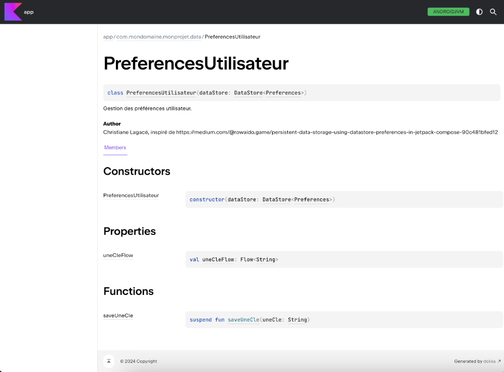
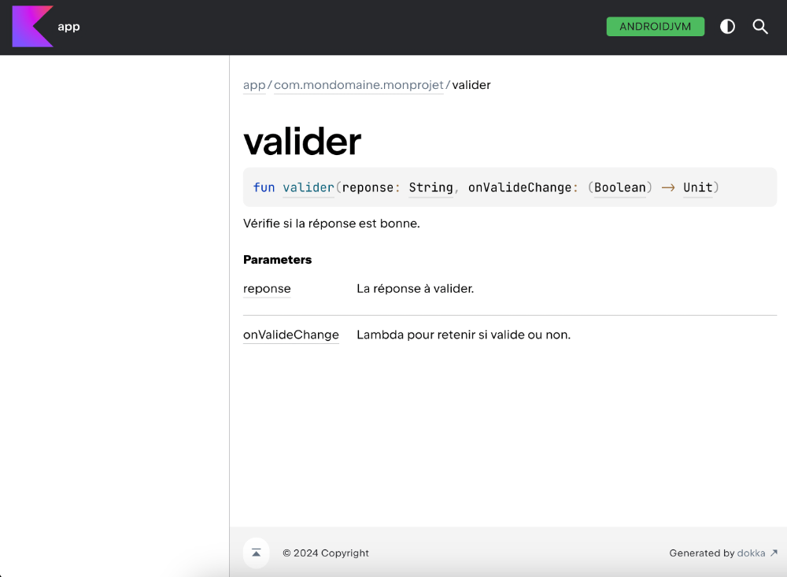

# Normes de code, KDoc et extraits de code


### 9.1 Est-ce que je peux utiliser du code emprunté?


Au fur et à mesure que vous progresserez dans votre formation, de nombreux exemples et extraits de code vous seront présentés.


Dans les notes de cours, des extraits de code sont parfois présentés pour illustrer un propos. Il s'agit d'exemples qui pourraient convenir à vos besoins... ou pas!


D'autres fois, il s'agit d'un algorithme ou d'un squelette qui assure que le code soit robuste, sécuritaire, performant, convivial, fonctionnel et clair (en PHP, voir « **les_qualites_d_un_bon_programme_php** » ; en WordPress, voir « **les_qualites_d_un_bon_programme_wordpress** »).


Intéressant! Ce serait dommage de réinventer la roue.


Que ce soit un extrait de code, un algorithme ou un squelette, si vous l'utilisez dans votre programme, on parlera de code emprunté, terme tiré du document « Comment réutiliser correctement du code source dans un cours de programmation » par Christopher Fuhrman et Frédérick Henri de l'École de Technologie Supérieure (ÉTS) .


Le code emprunté peut provenir de différentes sources :


#### Notes de cours


#### Web


#### Anciens travaux formatifs ou sommatifs


#### Documentation officielle


#### Générateur de code ou IA


#### ou ailleurs


La question qui tue : est-ce que vous avez le droit d'utiliser dans vos programmes du code emprunté des notes de cours ou d'autres sources?


La réponse est « ça dépend ».


### Présentation PowerPoint


Les concepts présentés sur cette fiche sont repris et complétés dans la présentation PowerPoint adoptée par le département d'informatique du cégep de Victoriaville, révision 2023.


### Conditions à respecter


### C'est l'enseignante ou l'enseignant qui décide s'il est permis d'utiliser dans vos programmes le code emprunté en
provenance de différentes sources. En cas de doute, demandez-lui.


Dans le cas où vous avez la permission d'utiliser du code emprunté, vous devez absolument respecter ces conditions :


#### Citer vos sources en précisant l'auteur et/ou l'URL où le code a été trouvé.


La technique est expliquée un peu plus bas.


#### Comprendre chacune des lignes de code.


Vous devez être prêt en tout temps à expliquer votre code à votre prof.


#### Au besoin, adapter le code emprunté à votre situation .


Sans une adaptation adéquate, le code risque de ne pas répondre à votre besoin.


### Citer la source du code emprunté


Il y a plusieurs buts à la citation des sources :


#### D'abord, ceci permet de rendre à César ce qui est à César.


#### Ensuite, il sera plus facile de retrouver le code original et d'en comprendre le contexte (« Ah, oui! C'est de là que
m'était venue cette idée! »).


#### De plus, si vous omettez de citer vos sources ou si vous utilisez du code emprunté sans en avoir l'autorisation, vous
vous exposez à des accusations de plagiat.


### Afin de mieux vous protéger contre d'éventuelles accusations de plagiat, dès que vous utilisez une structure de
code différente de ce qui a été enseigné, il faut citer vos sources, sauf bien sûr si vous avez développé l'algorithme vous-mêmes.


### Fonction empruntée


Lorsqu'une fonction complète est empruntée, la source peut être citée dans le commentaire de documentation de la fonction.


#### Lorsque le code est utilisé tel quel :


#### Il faut ajouter la mention « Source » suivie de l'URL. Vous devez conserver le nom de l'auteur original.


#### Dans le cas de code généré par une IA, si votre prof vous permet d'utiliser ce type d'outil , il faut ajouter la
mention « Code généré par » suivie de la référence au format Auteur. (Année). Nom de l’intelligence artificielle (version) [Type de modèle]. URL


Ex : Code généré par OpenAI. (2023). ChatGPT (version 15 mars 2023) [Modèle massif de langage]. [https://chat.openai.com/chat](https://chat.openai.com/chat)


ou encore : Code généré par Microsoft. (2024). Microsoft Copilot (version novembre 2024) [Modèle de langage basé sur l'IA]. [https://www.microsoft.com/copilot](https://www.microsoft.com/copilot)


ou encore : Code généré par Google AI. (2023). Gemini (version 1.2.3, 15 octobre 2023) [Modèle de langage de grande taille]. [https://gemini.google.com](https://gemini.google.com)


#### Si vous avez adapté le code :


#### La mention sera « Inspiré de » suivie de l'URL. Vous pouvez à ce moment indiquer votre nom comme nom
d'auteur.


#### Dans le cas de l'IA, ce sera « Code partiellement généré par » suivie de la référence. Vous pouvez indiquer
votre nom comme nom d'auteur.


```kotlin title="PHP"
/**
 * Vérifie si l'usager est authentifié.
 *
 * Utilisation : if !authentifier('$usager, $passecrypte) { (affiche le formulaire...) }
 * Suppositions critiques : Le formulaire doit avoir un champ nommé usager et un champ nommé motdepasse.
 *                          Le mot de passe doit être crypté dans la BD à l'aide de password_hash ('...', PASSWORD_DEFAULT ).
 *                          La variable de session usager sera initialisée si l'authentification fonctionne.
 *
 * @param string $usager Code d'usager
 * @param string $motDePasse Mot de passe crypté avec password_hash ('...', PASSWORD_DEFAULT )
 *
 * @author Christiane Lagacé <christiane.lagace@hotmail.com>
 * Inspiré de https://...
 * @return Boolean true si code d'usager et mot de passe valides, false si non valides
 *
 */
function authentifier(string $usager, string $motDePasse) : bool {
    ...
}
```


### Extrait de code emprunté


Si le code emprunté n'est pas une fonction complète, la citation peut être réalisée à l'aide d'un simple commentaire dans le code.


Dans leur document intitulé « Comment réutiliser correctement du code source dans un cours de programmation » , Christopher Fuhrman et Frédérick Henri de l'École de Technologie Supérieure (ÉTS) proposent une façon claire de citer les sources dans un programme.


Cette technique offre l'avantage d'identifier clairement quelle partie du code a été empruntée, ce qui est essentiel dans le cas où le code emprunté n'est pas une fonction complète.


Ici encore, la citation parlera de « Source » ou « Code généré par » lorsque le code est utilisé tel quel et de « Inspiré de » ou « Code partiellement généré par » lorsque le code a été modifié.


```kotlin title="PHP"
// gestion des erreurs
// Code emprunté. Source : https://apical.xyz/fiches/reutiliser_des_parties_de_code/fichier_configuration_inc
if (DEVEL === true) {
    // journalise et affiche tous les niveaux d'erreurs en mode développement
    error_reporting(E_ALL);
    ini_set('display_errors', '1');   // mettre à 0 si on ne veut pas voir les message à l'écran
}
else {
    // en mode production, ne journalise pas certains niveaux pour des raisons de performance
    error_reporting(E_ALL & ~E_STRICT & ~E_DEPRECATED);
    // aucun message ne sera affiché pour des raisons de sécurité
    ini_set('display_errors', '0');
}
// Fin du code emprunté
```


### Votre propre code tiré de travaux des sessions passées


Saviez-vous qu'il est possible de s'auto-plagier?


Selon l'UQAM , l'autoplagiat :


### C'est lorsqu’une étudiante ou un étudiant remet un travail, ou une partie de travail, qui a déjà été


### soumis à un enseignant pour évaluation. Autrement dit, c'est refiler le même travail dans deux cours
différents.


La PIEA du Cégep de Victoriaville est claire à ce sujet :


### Est considéré comme du plagiat, de la tricherie ou de la fraude (liste non exhaustive), peu importe


### le type d’évaluation : [...] Le fait de s’autoplagier, c’est-à-dire de remettre une évaluation ou une
partie d’évaluation déjà réalisée dans un cours, et ce, sans avoir obtenu au préalable l’autorisation explicite de l’enseignante ou de l’enseignant du ou des cours concernés ;


Afin d'éviter l'autoplagiat, vous devez obtenir la permission de l'enseignante ou de l'enseignant avant de réutiliser une partie du code que vous avez vous-même écrit ou co-écrit et qui a déjà été évalué de façon formative ou sommative.


### De plus, vous devez vous citer.


> **Source** : 

### 1. Christopher Fuhrman et Frédérick Henri, « Comment réutiliser correctement du code source dans un cours de programmation ». École de Technologie Supérieure.
[https://www.etsmtl.ca/docs/etudes/citer-pas-plagier/documents/programmation-plagiat-ets](https://www.etsmtl.ca/docs/etudes/citer-pas-plagier/documents/programmation-plagiat-ets)


## 2. * [« Tricherie et intégrité académique - Qu'est-ce que l'autoplagiat? » - UQAM](https://r18.uqam.ca/7-faq/13-qu-est-ce-que-l-autoplagiat.html)


#### Pour plus d'information


« Programmation et plagiat ». École de Technologie Supérieure. [https://cours.etsmtl.ca/log725/private/notes/plagiat.pdf](https://cours.etsmtl.ca/log725/private/notes/plagiat.pdf)


### * [« How open source licenses work and how to add them to your projects » - freeCodeCamp](https://www.freecodecamp.org/news/how-open-source-licenses-work-)
and-how-to-add-them-to-your-projects-34310c3cf94/
10. Pour vous aider dans ce cours


---


### 36.1 KDoc


Chaque langage de programmation propose ses propres normes de documentation.


Dans le mode de Kotlin, la documentation du code est réalisée à l'aide de KDoc .


Par exemple, pour documenter une fonction :


```kotlin title="KDoc"
/**
* Vérifie si la réponse est bonne.
*
* @param reponse La réponse à valider.
* @return true si valide.
*/
fun valider(reponse: String): Boolean {
    ...
}
```


Exemple avec hissage d'état :


```kotlin title="KDoc"
/**
 * Vérifie si la réponse est bonne.
 *
 * @param reponse La réponse à valider.
 * @param onValideChange Lambda pour retenir si valide ou non.
 */
fun valider(reponse: String, onValideChange: (Boolean) -> Unit) {
```


Exemple pour une fonction composable :


```kotlin title="KDoc"
/**
 * Écran principal.
 */
@Composable
fun MainScreen() {
```


ou encore :


```kotlin title="KDoc"
/**
 * Contenu principal.
 *
 * @param innerPadding Espace à appliquer pour que le contenu ne soit pas sous les barres d'application.
 */
@Composable
fun MainContent(innerPadding: PaddingValues) {
```


Et pour une classe :


```kotlin title="KDoc"
/**
 * Gestion des préférences utilisateur.
 *
 * @author Christiane Lagacé, inspiré de https://medium.com/@rowaido.game/persistent-data-storage-using-datastore-preferences-
in-jetpack-compose-90c481bfed12
 *
 * @property dataStore DataStore qui stocke les préférences utilisateur.
 */
class UserPreferences(private val dataStore: DataStore<Preferences>) {
    ...
}   
```


Autre exemple :


```kotlin title="KDoc"
/**
* État du UI de l'écran d'accueil.
*
* @author Christiane Lagacé
*
* @property _points Nombre de points obtenus
* @property _partieTerminee Indique si la partie est terminée
*/
data class HomeUiState(
    private val _points: Int = 0,
    private val _partieTerminee: Boolean = false
) {
    ...
}
```


### Génération de la documentation


Une fois que les classes et fonctions sont correctement documentées, il est possible de générer automatiquement la documentation au format HTML **à l'aide de Dokka**.


#### Pour plus d'information


* [« Document Kotlin code: KDoc » - Kotlin](https://kotlinlang.org/docs/kotlin-doc.html)


* [« Documentation with KDoc for Kotlin/Android » - Medium](https://medium.com/@drflakelorenzgerman/documentation-with-kdoc-for-kotlin-android-a93c99dfe74)


### 36.2 Plugin Android Studio / IntelliJ pour générer la structure des commentaires KDoc


KDoc-er est un plugin populaire pour Android Studio ou IntelliJ. Il permet de générer facilement la structure des commentaires KDoc.


Pour l'installer :


#### Dans Android Studio, rendez-vous dans le menu File / Settings / Plugins (Windows) ou Android Studio / Settings /


#### Plugins (macOS).


#### Dans l'onglet Marketplace , recherchez KDoc-er.


#### Cliquez sur Install .


Désormais, quand vous tapes /** au-dessus d'une fonction ou d'une classe, KDoc-er générera le squelette de la documentation. À vous de l'ajuster et de le compléter.


Voici par exemple ce qui est généré automatiquement pour cette fonction.


```kotlin title="KDoc"
/**
 * Color to string
 *
 * @param couleur
 * @return
 */
fun colorToString(couleur: Color) : String {
    ...
}
```


Et voici la documentation après qu'un développeur l'ait ajustée et complétée.


```kotlin title="KDoc"
/**
 * Convertit un objet de type Color en une chaîne qui représente cette couleur.
 *
 * @param couleur Objet Color. Valeurs supportées : Color.Blue, Color.Black, Color.White, Color.Red.
 * @return Chaîne qui représente la couleur. Valeurs possibles : Bleu, Noir, Blanc, Rouge. 
 */
fun colorToString(couleur: Color) : String {
    ...
}
```


### 36.3 Générer la documentation à l'aide de Dokka


Dokka est un outil qui permet de générer la documentation notamment à partir de **commentaires KDoc**.


### Variable d'environnement JAVA_HOME


Pour utiliser Dokka, vous aurez besoin d'une variable d'environnement nommée JAVA_HOME.


Ces manipulations permettront d'utiliser Dokka sur l'ensemble de vos projets.


Pour vérifier si JAVA_HOME existe sous Windows, ouvrez une fenêtre Terminal et entrez cette commande :


```kotlin title="Terminal (Windows)"
dir env:
```


Sous Mac, entrez plutôt ceci :


```kotlin title="Terminal (Mac)"
ENV
```


Si la variable n'existe pas ou si elle pointe sur une version de Java inférieure à 17, créez-la ou mettez-la à jour.


Notez qu'une version de Java a été installée avec Android Studio. Il s'agit de Java JBR (JetBrains Runtime), une version optimisée du JDK (Java Development Kit) et dont la version est suffisamment récente pour Dokka.


Pour créer la variable d'environnement JAVA_HOME sous Windows :


#### Appuyez sur les touches Windows + I .


#### Cliquez sur Système dans la zone de gauche.


#### Cliquez sur À propos de  (ou Informations système selon votre version de Windows) au bas de la zone de droite.


#### Cliquez sur Paramètres avancés du système .


#### Cliquez sur Variables d'environnement .


#### Dans la zone Variables système , cliquez sur Nouvelle .


#### Nom de la variable : entrez JAVA_HOME.


#### Valeur de la variable : entrez le chemin du dossier d'installation de Java. Typiquement, quand Java a été installé avec
Android Studio sous Windows, ce chemin est C:\Program Files\Android\Android Studio\jbr .


#### Enregistrez la configuration puis redémarrez votre ordinateur.


Sous macOS :


#### Pour trouver le chemin d'installation de Java avec une installation d'Android Studio, ouvrez le Finder puis faites un clic
droit sur le fichier Applications/Android Studio.app .


#### Choisissez Afficher le contenu du paquet .


#### Le chemin cherché devrait ressembler à  /Applications/Android Studio.app/Contents/jbr/Contents/Home . Pour copier ce
chemin, faites un clic droit sur le dossier puis, en appuyant sur la touche  ⌥ Option , choisissez


#### Copier en tant que nom de chemin .


#### Ouvrez maintenant une fenêtre Terminal.


#### Lancez cette commande pour éditer le fichier de configuration du shell :


```kotlin title="Terminal"
nano ~/.zshrc
```


#### Ajoutez cette ligne au bas du fichier en ajustant le nom du chemin à ce que vous avez trouvé plus haut. Notez l'ajout
d'une barre oblique inverse devant l'espace.


```kotlin title="Fichier ~/.zshrc"
export JAVA_HOME = /Applications/Android\ Studio.app/Contents/jbr/Contents/Home
```


#### Enregistrez le fichier puis redémarrez votre ordinateur.


### Configuration du projet


Maintenant que la variable d'environnement JAVA_HOME est correctement configurée, vous pouvez procéder aux configurations du projet.


#### Dans le fichier build.gradle.kts principal (aussi appelé top-level build.gradle file), soit celui présent directement à la
racine du projet, ajoutez ceci :


```kotlin title="Fichier build.gradle.kts principal"
plugins {
    ...
    // pour Dokka
    id("org.jetbrains.dokka") version "2.0.0" apply false
}
```


Ajoutez ceci dans le fichier build.gradle.kts  qui se trouve dans le dossier app .


```kotlin title="Fichier app/build.gradle.kts"
plugins {
    ...
    // pour Dokka
    id("org.jetbrains.dokka")
}
```


Une fois ces lignes ajoutées, il faut **resynchroniser le projet pour qu'il en tienne compte**.


### Génération de la documentation


Pour générer la documentation :


#### Ouvrez une fenêtre Terminal dans Android Studio : View / Tool Windows / Terminal .


#### Entrez-y la commande qui lance la génération :


```kotlin title="Terminal Android Studio"
./gradlew dokkaHtml
```


#### Ceci a généré le fichier  app/build/dokka/html/index.html . Ouvrez ce fichier dans un navigateur. En naviguant dans les
liens qu'il propose, vous reconnaîtrez la documentation KDoc que vous avez ajoutée à votre code et même plus!








## 37. La couleur de fond


---
