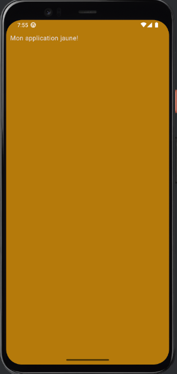
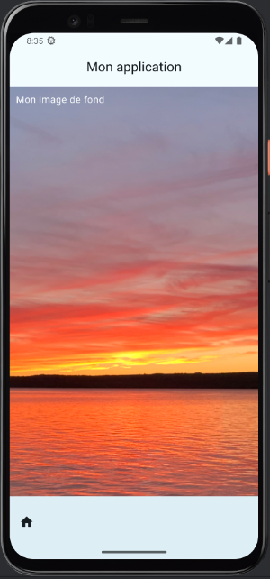
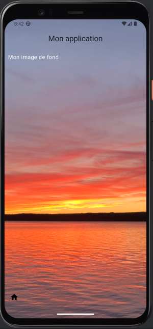

# Couleurs, thèmes et hasard


### 37.1 Changer le fond d'écran


Je vous présente ici quelques techniques pour modifier le fond de votre application Android avec Jetpack Compose.


Dans cette fiche :


#### Configurer une couleur de fond d'écran avec le thème


#### Couleur des barres d'application


#### Configurer une couleur de fond d'écran par programmation


#### Couleur des barres d'application - technique 1


#### Couleur des barres d'application - technique 2


#### Utiliser une image en fond d'écran


#### Image sous les barres d'application


### Configurer une couleur de fond d'écran avec le thème


La technique la plus intéressante pour modifier la couleur de fond consiste à travailler avec le thème de l'application.


Les fichiers du thème sont situés dans le dossier ui/theme , que vous retrouverez au même niveau que MainActivity.kt .


```kotlin title="Fichier Color.kt"
val Purple80 = Color(0xFFD0BCFF)
val PurpleGrey80 = Color(0xFFCCC2DC)
val Pink80 = Color(0xFFEFB8C8)
val JaunePale = Color(0xFFFFFF33)
 
val Purple40 = Color(0xFF6650a4)
val PurpleGrey40 = Color(0xFF625b71)
val Pink40 = Color(0xFF7D5260)
val JauneFonce = Color(0xFFB57A0D)
```


```kotlin title="Fichier Theme.kt"
private val DarkColorScheme = darkColorScheme(
    primary = Purple80,
    secondary = PurpleGrey80,
    tertiary = Pink80,
    background = JauneFonce,
)
private val LightColorScheme = lightColorScheme(
    primary = Purple40,
    secondary = PurpleGrey40,
    tertiary = Pink40,
    background = JaunePale,
)
@Composable
fun MonApplicationTheme(
    darkTheme: Boolean = isSystemInDarkTheme(),
    // Dynamic color is available on Android 12+
    dynamicColor: Boolean = false,
    content: @Composable () -> Unit
) {
    ...
}
```


Sans rien changer de plus, le fond d'écran sera jaune pâle ou jaune foncé selon que l'appareil est en mode clair ou en mode sombre.


<div style="text-align: center; margin: 1.5em 0;">
  
</div>


<div style="text-align: center; margin: 1.5em 0;">
  
</div>


### Couleur des barres d'application


Dans le cas où l'application comprend une barre de titre ou une barre de navigation, il faudra préciser que leur couleur de fond est transparente pour que la couleur
dictée par le thème les affecte.


```kotlin title="Jetpack Compose (Kotlin)"
Scaffold(
    modifier = Modifier
        .fillMaxSize(),
    topBar = {
        CenterAlignedTopAppBar(
            colors = TopAppBarDefaults.topAppBarColors(
                containerColor = Color.Transparent
            ),
            title = {
                Text(text = "Mon application")
            },
        )
    },
    bottomBar = {
        BottomAppBar(
            containerColor = Color.Transparent
        ) {
            //...
        }
    },
    content = {
        ...
    }
)
```


### Configurer une couleur de fond d'écran par programmation


Dans certaines applications, on voudra plutôt modifier la couleur dynamiquement. Ici, j'ai utilisé des couleurs codées en dur mais il serait facile d'adapter ce code
pour que les couleurs proviennent de variables.


Puisque, dans cet exemple, la couleur est spécifiée dans le contenu de l'application (paramètre content du Scaffold ou partie entre accolades), la couleur de fond
ne sera pas appliquée à la barre de titre ni à la barre de navigation.


Remarquez la condition pour spécifier la couleur en mode clair et en mode sombre.


```kotlin title="Jetpack Compose (Kotlin)"
Box(
    modifier = Modifier
        .fillMaxSize()
        .padding(innerPadding)
        .background(if (isSystemInDarkTheme()) Color.Gray else Color.LightGray)
) {
    Text(
        text = "Mon fond de couleur",
        modifier = Modifier
            .padding(10.dp)
    )
}
```


<div style="text-align: center; margin: 1.5em 0;">
  
</div>


### Couleur des barres d'application - technique 1


Pour appliquer une couleur de fond partout, il faut placer le Scaffold à l'intérieur du Box et préciser que la couleur de fond du Scaffold, de la barre de titre et de la
barre de navigation sont transparentes.


```kotlin title="Jetpack Compose (Kotlin)"
Box(
    modifier = Modifier
        .fillMaxSize()
        .background(if (isSystemInDarkTheme()) Color.Gray else Color.LightGray)
) {
    Scaffold(
        modifier = Modifier
            .fillMaxSize(),
         containerColor = Color.Transparent,
        topBar = {
            CenterAlignedTopAppBar(
                colors = TopAppBarDefaults.topAppBarColors(
                     containerColor = Color.Transparent
                ),
                title = {
                    Text(text = "Mon application")
                },
            )
        },
        bottomBar = {
            BottomAppBar(
                 containerColor = Color.Transparent
            ) {
                //...
            }
        },
        content = {
            ...
        }
    )
}
```


### Couleur des barres d'application - technique 2


Voici une autre technique qui permet de modifier le fond partout. Il s'agit de préciser la couleur directement dans les différentes sections du Scaffold.


Avec cette technique, on n'a plus besoin du Box.


```kotlin title="Jetpack Compose (Kotlin)"
Scaffold(
    modifier = Modifier
        .fillMaxSize(),
     containerColor = if (isSystemInDarkTheme()) Color.Gray else Color.LightGray,
    topBar = {
        CenterAlignedTopAppBar(
            colors = TopAppBarDefaults.topAppBarColors(
                containerColor = if (isSystemInDarkTheme()) Color.Gray else Color.LightGray,
            ),
            title = {
                Text(text = "Mon application")
            },
        )
    },
    bottomBar = {
        BottomAppBar(
            containerColor = containerColor = if (isSystemInDarkTheme()) Color.Gray else Color.LightGray,
        ) {
            //...
        }
    },
    content = {
        ...
    }
)
```


### Utiliser une image en fond d'écran


Ce code permet d'utiliser une image comme fond d'écran pour le contenu de l'application mais pas derrière la barre de titre ni la barre de navigation.


Remarquez que puisque l'image est la même en mode clair et en mode sombre, j'ai spécifié la couleur du texte afin qu'il soit toujours bien visible.


```kotlin title="Kotlin"
Box(
    modifier = Modifier
        .fillMaxSize()
        .padding(innerPadding)
        .paint(
            painterResource(id = R.drawable.coucher_soleil),
            contentScale = ContentScale.Crop
        )
) {
    Text(
        text = "Mon image de fond",
        color = Color.White,
        modifier = Modifier
            .padding(10.dp)
    )
}
```


<div style="text-align: center; margin: 1.5em 0;">
  
</div>


### Image sous les barres d'application


Ici encore, si on veut que l'image soit également derrière la barre de titre et la barre de navigation, il faut travailler au niveau du Scaffold. Cette fois, j'ai placé le
Scaffold dans un Box qui spécifie le fond d'écran et j'ai mis le fond en transparence pour le contenu, la barre de titre et la barre de navigation.


Plus besoin du Box dans le contenu.


Je n'ai pas modifié les couleurs dans la barre de titre ni dans la barre de navigation afin d'illustrer les dangers au niveau de la lisibilité lorsque l'image de fond couvre
tout l'écran.


```kotlin title="Jetpack Compose (Kotlin)"
Box(
    modifier = Modifier
        .fillMaxSize()
        .paint(
            painterResource(id = R.drawable.coucher_soleil),
            contentScale = ContentScale.Crop
        )
) {
    Scaffold(
        modifier = Modifier
            .fillMaxSize(),
         containerColor = Color.Transparent,
        topBar = {
            CenterAlignedTopAppBar(
                colors = TopAppBarDefaults.topAppBarColors(
                     containerColor = Color.Transparent
                ),
                title = {
                    Text(text = "Mon application")
                },
            )
        },
        bottomBar = {
            BottomAppBar(
                 containerColor = Color.Transparent
            ) {
                //...
            }
        },
        content = {
            ...
        }
    )
}
```


<div style="text-align: center; margin: 1.5em 0;">
  
</div>


## 38. Le hasard


---


### 38.1 Générer un nombre au hasard


Pour générer un nombre au hasard entre deux bornes incluses :


```kotlin title="Kotlin"
val nombre = (0..10).random()   // nombre entre 0 (inclus) et 10 (inclus)
```


Pour exclure la borne supérieure :


```kotlin title="Kotlin"
val nombre = (0..<10).random()   // nombre entre 0 (inclus) et 10 (exclu)
```


Pour générer un nombre au hasard parmi toutes les valeurs possibles d'un Integer :


```kotlin title="Kotlin"
val nombre = Random.nextInt()   // nombre entre Int.MIN_VALUE = -2147483648 (inclus) and Int.MAX_VALUE =2147483647 (inclus)
```


Avec cette technique, la borne supérieure est exclue :


```kotlin title="Kotlin"
val nombre = Random.nextInt(5, 10)   // nombre entre 5 (inclus) et 10 (exclu)
```


Si on ne précise qu'un seul chiffre, la borne inférieure est 0 et la borne supérieure est exclue :


```kotlin title="Kotlin"
val nombre = Random.nextInt(10)   // nombre entre 0 (inclus) et 10 (exclu)
```


#### Pour plus d'information


« Finding out random numbers in Kotlin ». Code vs Color. https://www.codevscolor.com/kotlin-random-numbers


### 38.2 Sélectionner au hasard un élément d'une collection


Quand on a en main une collection, par exemple une liste déclarée avec listOf() ou un tableau déclaré avec arrayOf(), la méthode random() permet de sélectionner
au hasard un élément du tableau.


```kotlin title="Jetpack Compose (Kotlin)"
val couleurs = listOf("Rouge", "Vert", "Bleu", "Jaune")
val hasard = couleurs.random()
Log.d("MainActivity", "Couleur choisie : $hasard")
```


Si la collection pouvait être vide, il faudra utiliser randomOrNull().


```kotlin title="Jetpack Compose (Kotlin)"
val couleurs = listOf()
...   // le tableau pourrait être rempli par exemple sur le clic d'un bouton
 
// dans un gestionnaire d'événement
val hasard = couleurs.randomOrNull()
Log.d("MainActivity", "Couleur choisie : $hasard")   // si le tableau est vide, on verra "Couleur choisie : null"
```


## 39. Les fenêtres popup


---
