# Éléments d'interface utilisateur Compose


## Text()


La fonction modulable Text permet d'afficher un texte à l'écran.


```kotlin title="Kotlin"
import androidx.compose.material3.Text
...
@Composable
fun UneFonction() {
    Text(text = "Bonjour!")
}
```


Il est possible de lui fournir des paramètres pour indiquer l'apparence que le texte prendra.


```kotlin title="Jetpack Compose (Kotlin)"
Text(
    text = "Bonjour!",
    fontSize = 25.sp,
    fontStyle = FontStyle.Italic,
    fontFamily = FontFamily.SansSerif,
    color = MaterialTheme.colorScheme.primary
)
```


### Centrer du texte horizontalement


Si un texte s'étend sur plus d'une ligne, il peut être intéressant de le centrer horizontalement.


```kotlin title="Jetpack Compose (Kotlin)"
Text(
    text = "Lorem ipsum dolor sit amet, consectetur adipiscing elit.",
    textAlign = TextAlign.Center,
)
```


### Texte enrichi


*buildAnnotatedString* permet de créer du texte enrichi.


Il est possible, par exemple, d'appliquer un style sur une partie précise d'une chaîne de caractères.


Ici, on crée un texte dont un mot apparaît en rouge.


```kotlin title="Jetpack Compose (Kotlin)"
val texteAvecMotRouge = buildAnnotatedString {
    append("Ma couleur préférée est le ")
    withStyle(style = SpanStyle(color = Color.Red)) {
        append("rouge")
    }
    append(".")
}
Text(texteAvecMotRouge)
```


### Lien hypertexte


buildAnnotatedString permet également de créer un lien hypertexte pour ouvrir l'URL dans un navigateur.


```kotlin title="Jetpack Compose (Kotlin)"
Text(
    buildAnnotatedString {
        withLink(
            LinkAnnotation.Url(
                "https://apical.xyz",
            )
        ) {
            append("Apical")
        }
    }
)
```


Et pour styler le texte du lien :


```kotlin title="Jetpack Compose (Kotlin)"
Text(
    buildAnnotatedString {
        withLink(
            LinkAnnotation.Url(
                "https://apical.xyz",
                styles = TextLinkStyles(
                    style = SpanStyle(
                        fontSize = 25.sp,
                    )
                ),
            )
        ) {
            append("Apical")
        }
    }
)
```

### Limiter la longueur du texte affiché à l'écran

Prenons le cas où on a une ligne (*Row()*) avec du texte à gauche et une icône à droite. Dans le cas où le texte est plus long que la largeur de l'écran, l'icône ne sera plus visible.


Pour corriger la situation, on peut limiter la largeur du texte à la place disponible et indiquer comment on veut que le débordement se comporte.


Ici, on limite le texte à une seule ligne et on ajoute des points de suspension.


```kotlin title="Jetpack Compose (Kotlin)"
Row(
    verticalAlignment = Alignment.CenterVertically,
) {
    Text(
        text = "Ce texte est plus large que l'écran alors il sera tronqué",
        // sans ces trois lignes, un long texte poussait les boutons hors de l'écran
        modifier = Modifier.weight(1f),
        maxLines = 1,
        overflow = TextOverflow.Ellipsis
    )
    // pour ne pas que les points de suspension soient collés à l'icône
    Spacer(modifier = Modifier.width(8.dp))
    IconButton(onClick = {
        ...
    }) {
        Icon(Icons.Filled.Edit, contentDescription = "Modifier")
    }
}
```


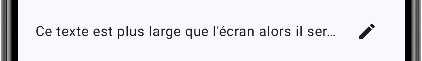


#### Pour plus d'information


* [« Texte dans Compose » - Android Developers](https://developer.android.com/jetpack/compose/text?hl=fr)


* [« Typography - Type scale » - Material Design 3](https://m3.material.io/styles/typography/type-scale-tokens)


* [« Appliquer un style au texte » - Android Developers](https://developer.android.com/develop/ui/compose/text/style-text?hl=fr)


### * [« Composing AnnotatedString — Poetry, Music, Code, Blogs, Expandables and Beyond » - Medium](https://proandroiddev.com/composing-annotatedstring-poetry-)
music-code-blogs-expandables-and-beyond-b5f7ec35a49b 5.2 Column()

## Column()

La fonction modulable Column permet de placer les composants en colonne, l'un sous l'autre.


```kotlin title="Jetpack Compose (Kotlin)"
import androidx.compose.foundation.layout.Column
...
@Composable
fun UneFonction() {
    Column {
        Text(text = "Première ligne")
        Text(text = "Deuxième ligne")
    }
}
```


### Centrage


Il est possible d'ajouter des modificateurs directement sur la colonne.


Par exemple, pour centrer le contenu de la colonne horizontalement et verticalement :


```kotlin title="Jetpack Compose (Kotlin)"
Column(
    modifier = Modifier.fillMaxSize(),
    horizontalAlignment = Alignment.CenterHorizontally,
    verticalArrangement = Arrangement.Center,
) {
    ...
}
```


### Espacement


Ici, on ajoute de l'espace autour du contenu de la colonne.


> **Attention :** le concept est différent du padding qu'on connaît en Web avec les feuilles de style. Dans JetPack compose, le padding est l'équivalent d'un margin en CSS. En effet, si la colonne avait une couleur de fond, l'espace créé par le padding ne prendrait pas la couleur de fond.


```kotlin title="Jetpack Compose (Kotlin)"
Column(
    modifier = Modifier
        .padding(all = 25.dp)
) {
    ...
}
```


Pour ajouter de l'espace entre les composables affichés dans la colonne :


```kotlin title="Jetpack Compose (Kotlin)"
Column(
    verticalArrangement = Arrangement.spacedBy(10.dp)
) {
    ...
}
```


### Défilement


Pour assurer que le contenu de la colonne puisse défiler à l'écran si jamais il est trop long, on peut lui ajouter un *verticalScroll*.


```kotlin title="Jetpack Compose (Kotlin)"
Column(
    modifier = Modifier
        .padding(all = 25.dp)
        .verticalScroll(rememberScrollState())
) {
    ...
}
```


#### Pour plus d'information


* [« Listes et grilles » - Android Developers](https://developer.android.com/jetpack/compose/lists?hl=fr)


* [« 07 Compose - Layout – Column + Row + Spacer » - DEV Community](https://dev.to/one_past_last_jedi/07-compose-layout-column-row-spacer-291j)


### * [« Principes de base de la mise en page dans Compose » - Android Developers](https://developer.android.com/jetpack/compose/layouts/basics?hl=fr)

## Row()


La fonction modulable Row permet de placer les composants en rangée, l'un à côté de l'autre.


```kotlin title="Kotlin"
import androidx.compose.foundation.layout.Row
...
@Composable
fun UneFonction() {
    Row {
        Text(text = "Texte de gauche")
        Text(text = "Texte de droite")
    }
}
```


### Centrage


Il est possible d'ajouter des modificateurs directement sur la ligne.


Par exemple, pour centrer le contenu de la ligne verticalement :


```kotlin title="Jetpack Compose (Kotlin)"
Row(
    verticalAlignment = Alignment.CenterVertically
) {
    ...
}
```


Pour centrer le contenu de la ligne horizontalement :


```kotlin title="Jetpack Compose (Kotlin)"
Row(
    horizontalArrangement = Arrangement.Center
) {
    ...
}
```


### Espacement


Ici, on ajoute de l'espace autour de chaque composable de la ligne de façon à remplir toute la largeur disponible.


```kotlin title="Jetpack Compose (Kotlin)"
Row(
    modifier = Modifier
        .fillMaxWidth(),
    horizontalArrangement = Arrangement.SpaceBetween
) {
    ...
}
```


Ici, on ajoute plutôt un espacement fixe entre les composables de la ligne.


```kotlin title="Jetpack Compose (Kotlin)"
Row(
    horizontalArrangement = Arrangement.spacedBy(16.dp)
) {
    ...
}
```


#### Pour plus d'information


* [« Listes et grilles » - Android Developers](https://developer.android.com/jetpack/compose/lists?hl=fr)


* [« 07 Compose - Layout – Column + Row + Spacer » - DEV Community](https://dev.to/one_past_last_jedi/07-compose-layout-column-row-spacer-291j)


### * [« Principes de base de la mise en page dans Compose » - Android Developers](https://developer.android.com/jetpack/compose/layouts/basics?hl=fr)

## Box()


La fonction modulable *Box* permet de placer les éléments en couches perpendiculaires à l'écran, l'un par-dessus l'autre.


```kotlin title="Jetpack Compose (Kotlin)"
import androidx.compose.foundation.layout.Box
...
@Composable
fun UneFonction() {
    Box {
        Text(text = "Texte du fond")
        Text(text = "Texte du dessus")
    }
}
```


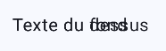


Il est également possible d'utiliser un Box pour dessiner des rectangles. Il faudra prendre soin de les placer dans un Column ou dans un Row pour ne pas qu'ils soient empilés l'un sur l'autre.


```kotlin title="Jetpack Compose (Kotlin)"
Column(
    modifier = Modifier
        .fillMaxSize(),
    horizontalAlignment = Alignment.CenterHorizontally,
    verticalArrangement = Arrangement.Center
) {
    Box(
        modifier = Modifier
        .size(100.dp)
        .background(Color.Blue)
    )
    Box(
        modifier = Modifier
        .size(100.dp)
        .background(Color.Red)
    )
}
```


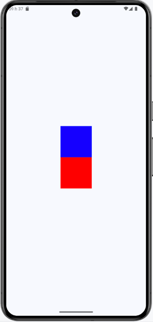


Un *Box* peut aussi servir à encadrer autre chose.


```kotlin title="Jetpack Compose (Kotlin)"
Box(
    modifier = Modifier
        .border(5.dp, Color.Cyan, RoundedCornerShape(15.dp))
        .padding(horizontal = 40.dp, vertical = 20.dp),
    contentAlignment = Alignment.Center
) {
    Text(
        text = "Hello world!",
        fontSize = 50.sp
    )
}
```


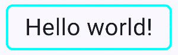


Une utilisation intéressante du box : réserver de l'espace pour des éléments graphiques qui ne sont affichés que lorsqu'une condition est remplie.


Ceci est intéressant dans un design centré verticalement sinon, tout l'écran « bouge » quand la condition est remplie et que de nouveaux éléments sont affichés.


```kotlin title="Jetpack Compose (Kotlin)"
Column(
    modifier = Modifier
        .fillMaxSize()
        .padding(innerPadding),
    horizontalAlignment = Alignment.CenterHorizontally,
    verticalArrangement = Arrangement.Center,
) {
    ...
    // pour réserver l'espace utilisé par la partie du bas même si rien n'est affiché
    Box(
        modifier = Modifier
            .size(200.dp)
            .padding(25.dp)
    ) {
        Column(
            horizontalAlignment = Alignment.CenterHorizontally,
        ) {
            if (...) {
                Text(...)
                Image(...)
            }
        }
    }
}
```


Comme beaucoup d'autres composables, un *Box* peut réagir à un clic.


```kotlin title="Jetpack Compose (Kotlin)"
Box(
    modifier = Modifier
        .clickable(
            onClick = {
                // ...
            },
        ),
    ...
) {
    ...
}
```


#### Pour plus d'information


* [« Listes et grilles » - Android Developers](https://developer.android.com/jetpack/compose/lists?hl=fr)


* [« 07 Compose - Layout – Column + Row + Spacer » - DEV Community](https://dev.to/one_past_last_jedi/07-compose-layout-column-row-spacer-291j)


### * [« Principes de base de la mise en page dans Compose » - Android Developers](https://developer.android.com/jetpack/compose/layouts/basics?hl=fr)

## Image()


Pour afficher une image dans une interface utilisateur, il faut d'abord **l'ajouter en tant que ressource**.


Les types d'images supportés sont JPG, PNG, GIF, BMP, WebP et HEIF.


L'image sera affichée à l'aide de l'élément *Image*.


```kotlin title="Jetpack Compose (Kotlin)"
import androidx.compose.foundation.Image
import androidx.compose.ui.res.painterResource
...
@Composable
fun UneFonction() {
    Image(
        painter = painterResource(R.drawable.nom_ressource),
        contentDescription = "Description",
    )
}
```


Il est possible d'appliquer des modificateurs pour changer l'apparence de l'image.


```kotlin title="Jetpack Compose (Kotlin)"
Image(
    painter = painterResource(R.drawable.nom_ressource),
    contentDescription = "Description",
    modifier = Modifier
       .fillMaxSize()
)
```


ou encore :


```kotlin title="Jetpack Compose (Kotlin)"
Image(
    painter = painterResource(R.drawable.nom_ressource),
    contentDescription = "Description",
    modifier = Modifier
        .size(75.dp)
        .clip(CircleShape)
        .border(2.dp, MaterialTheme.colorScheme.outline, CircleShape)
)
```


encore un exemple, cette fois le code affiche deux images côte-à-côte en remplissant la largeur de l'écran :


```kotlin title="Jetpack Compose (Kotlin)"
Row {
    Image(
        painter = painterResource(R.drawable.image_1),
        contentDescription = "Première image",
        contentScale = ContentScale.FillWidth,
        modifier = Modifier
            .weight(1f)
    )
    Image(
        painter = painterResource(R.drawable.image_2),
        contentDescription = "Deuxième image",
        contentScale = ContentScale.FillWidth,
        modifier = Modifier
            .weight(1f)
    )
}
```


### Image dont le nom est contenu dans une variable


Dans les exemples précédents, le nom de l'image, ou plutôt son identifiant, était une propriété de R.drawable. Ce n'était pas une chaîne de caractères.


Lorsque le nom de l'image est contenu dans une variable sous forme de chaîne de caractères, il faut utiliser une technique pour retrouver l'identifiant de la ressource à partir de cette chaîne.


> Attention : cette technique nuit à l'optimisation du code et devrait être réservée pour les cas où il n'est pas possible de fournir directement l'identifiant de l'image.


Android Studio générera d'ailleurs cet avertissement : « Use of this function is discouraged because resource reflection makes it harder to perform build optimizations and compile-time verification of code. It is much more efficient to retrieve resources by identifier (e.g. R.foo.bar) than by name (e.g. getIdentifier("bar", "foo", null)). ».


```kotlin title="Jetpack Compose (Kotlin)"
val context = LocalContext.current
val ressourceId = remember(nomImage) {
    context.resources.getIdentifier(
        nomImage,
        "drawable",
        context.packageName
    )
}
if (ressourceId != 0) {
    Image(
        painter = painterResource(ressourceId),
        contentDescription = "Description",
    )
}
```


#### Pour plus d'information


* [« Utiliser des images » - Android Developer](https://developer.android.com/jetpack/compose/graphics/images?hl=fr)


* [« Supported media formats - Image support » - Adroid Developers](https://developer.android.com/guide/topics/media/platform/supported-formats#image-formats)


### * [« Personnaliser une image » - Android Developers](https://developer.android.com/jetpack/compose/graphics/images/customize?hl=fr)

## AsyncImage()


Avec AsyncImage() , il est possible d'afficher une image à partir d'un URL.


D'abord, il faut ajouter une dépendance.


Cette ligne doit être ajoutée dans le fichier build.gradle.kts  qui se trouve dans le dossier app .


```kotlin title="Fichier app/build.gradle.kts"
...
dependencies {
    ...
    // pour image à partir d'un URL
    implementation("io.coil-kt:coil-compose:2.7.0")
}
```


Une fois la dépendance ajoutée, il faut **resynchroniser le projet pour qu'il tienne compte de l'ajout**.


Pour afficher l'image :


```kotlin title="Jetpack Compose (Kotlin)"
AsyncImage(
    model ="https://apical.xyz/Sourire.png",
    contentDescription = "Sourire",
    modifier = Modifier.size(300.dp)
)
```


### Icône avec la bibliothèque Material Symbols


La fonction modulable Icon permet d'afficher une icône à l'écran.


Les icônes disponibles par défaut sont tirées de la bibliothèque gratuite Material Icons .


```kotlin title="Jetpack Compose (Kotlin)"
Icon(imageVector = Icons.Default.Home, contentDescription = "home")
```


Pour connaître la liste des icônes disponibles par défaut, entrez Icons.Default. puis parcourez la liste de suggestions.


Chaque icône peut être affichée dans différents styles.


```kotlin title="Jetpack Compose (Kotlin)"
Row() {
    Icon(imageVector = Icons.Default.Home, contentDescription = "home")
    Icon(imageVector = Icons.Outlined.Home, contentDescription = "home")
    Icon(imageVector = Icons.Filled.Home, contentDescription = "home")
    Icon(imageVector = Icons.Rounded.Home, contentDescription = "home")
    Icon(imageVector = Icons.Sharp.Home, contentDescription = "home")
    Icon(imageVector = Icons.TwoTone.Home, contentDescription = "home")
}
```


Il est possible d'appliquer des attributs et des *modifiers* afin de mieux contrôler l'apparence de l'icône.


```kotlin title="Jetpack Compose (Kotlin)"
Icon(
    imageVector = Icons.Default.Home,
    contentDescription = "home",
    tint = MaterialTheme.colorScheme.secondary,
    modifier = Modifier.size(30.dp)
)
```


Autre exemple :


```kotlin title="Jetpack Compose (Kotlin)"
Icon(
    imageVector = Icons.Default.Info,
    contentDescription = "info",
    tint = Color.Blue
)
```


### Icône cliquable


Pour rendre l'icône cliquable, il faut l'intégrer dans un IconButton .


```kotlin title="Jetpack Compose (Kotlin)"
IconButton(onClick = {
    ...
}) {
    Icon(Icons.Filled.Edit, contentDescription = "Modifier")
}
```


### Pour avoir accès à plus d'icônes


Pour avoir accès à une plus grande quantité d'icônes, soit aux icônes de la bibliothèque Material Symbols , il faut ajouter une dépendance au projet.


Ajoutez cette ligne dans le fichier build.gradle.kts  qui se trouve dans le dossier app .


> Attention : ceci augmentera substantiellement la taille de l'application. Je vous conseille de vérifier parmi les icônes disponibles de base (il y en a près d'une cinquantaine) avant d'ajouter cette dépendance.


```kotlin title="Fichier app/build.gradle.kts"
...
dependencies {
    ...
    // pour avoir accès à plus d'icônes (alourdit l'application)
    implementation("androidx.compose.material:material-icons-extended")
}
```


Une fois la dépendance ajoutée, il faut **resynchroniser le projet pour qu'il tienne compte de l'ajout**.


Vous avez désormais accès à plus d'icônes.


```kotlin title="Jetpack Compose (Kotlin)"
Icon(imageVector = Icons.Default.SwipeUp, contentDescription = "Glisser vers le haut")
```


#### Pour plus d'information


### * [« Introducing Material Symbols » - Google](https://fonts.google.com/icons?hl=fr)
5.8 Les couleurs


La gestion des couleurs dans une application Android basée sur Jetpack Compose est réalisée à l'aide de la bibliothèque Material Design 3 .


### Constantes de couleur


Pour définir une couleur, Kotlin met à votre disposition des constantes pour identifier les principales couleurs , par exemple Color.Black.


Dans l'image qui suit, celle qui n'est pas visible s'appelle Color.Transparent ;-)


J'ai légèrement grisé le fond d'écran pour qu'on puisse voir le blanc.


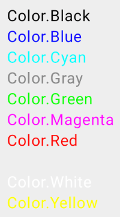


Pour utiliser une de ces constantes :


```kotlin title="Kotlin"
val couleur = Color.Black
```


### Code hexadécimal


Il est également possible d'utiliser un code hexadécimal pour définir une couleur. Il suffit d'ajouter 0xFF devant le code de couleur à 6 caractères.


Le 0x indique que c'est une valeur hexadécimale.


Le FF signifie aucune transparence.


```kotlin title="Kotlin"
val couleur = Color(0xFF20A1C9)
```


Autre technique équivalente : convertir une chaîne en couleur à l'aide de toColor().


```kotlin title="Kotlin"
val couleur = "#20A1C9".toColor()
```


### Couleurs du thème


Lorsque vous créez un projet basé sur Jetpack Compose, le projet est automatiquement basé sur un thème.


Les couleurs du thème par défaut sont illustrées sur le site de Material Design 3 . J'ai reproduit l'image ici pour plus de commodité.


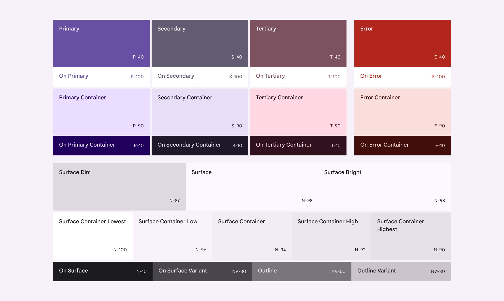


En utilisant le rôle d'une couleur (ex : MaterialTheme.colorScheme.primary) plutôt qu'un nom (ex : Color.Black) ou un code hexadécimal (ex : #000000), on laisse le soin au système d'adapter la couleur selon que l'appareil mobile utilise le thème clair ou foncé.


### Attention : avec Material Design 2, on utilisait la méthode color alors qu'avec Material Design 3, c'est plutôt
colorScheme.


```kotlin title="Kotlin"
Text(
    text = "Hello World!",
    color = MaterialTheme.colorScheme.primary
)
```


Il est possible de visualiser les couleurs du thème à l'aide de cet extrait de code :


```kotlin title="Kotlin"
Column(
    modifier = Modifier
        .padding(all = 25.dp)
        .verticalScroll(rememberScrollState())
) {
    Text(text = "primary", color = MaterialTheme.colorScheme.onPrimary, modifier = Modifier.background(color =
MaterialTheme.colorScheme.primary).padding(10.dp))
    Text(text = "onPrimary", color = MaterialTheme.colorScheme.primary, modifier = Modifier.background(color =
MaterialTheme.colorScheme.onPrimary).padding(10.dp))
    Text(text = "inversePrimary", color = MaterialTheme.colorScheme.primary, modifier = Modifier.background(color =
MaterialTheme.colorScheme.inversePrimary).padding(10.dp))
    Text(text = "primaryContainer ", color = MaterialTheme.colorScheme.onPrimaryContainer, modifier =
Modifier.background(color = MaterialTheme.colorScheme.primaryContainer).padding(10.dp))
    Text(text = "onPrimaryContainer", color = MaterialTheme.colorScheme.primaryContainer, modifier = Modifier.background(color
= MaterialTheme.colorScheme.onPrimaryContainer).padding(10.dp))
    Spacer(modifier = Modifier.height(30.dp))
    Text(text = "secondary", color = MaterialTheme.colorScheme.onSecondary, modifier = Modifier.background(color =
MaterialTheme.colorScheme.secondary).padding(10.dp))
    Text(text = "onSecondary", color = MaterialTheme.colorScheme.secondary, modifier = Modifier.background(color =
MaterialTheme.colorScheme.onSecondary).padding(10.dp))
    Text(text = "secondaryContainer ", color = MaterialTheme.colorScheme.onSecondaryContainer, modifier =
Modifier.background(color = MaterialTheme.colorScheme.secondaryContainer).padding(10.dp))
    Text(text = "onSecondaryContainer", color = MaterialTheme.colorScheme.secondaryContainer, modifier =
Modifier.background(color = MaterialTheme.colorScheme.onSecondaryContainer).padding(10.dp))
    Spacer(modifier = Modifier.height(30.dp))
    Text(text = "tertiary", color = MaterialTheme.colorScheme.onTertiary, modifier = Modifier.background(color =
MaterialTheme.colorScheme.tertiary).padding(10.dp))
    Text(text = "onTertiary", color = MaterialTheme.colorScheme.tertiary, modifier = Modifier.background(color =
MaterialTheme.colorScheme.onTertiary).padding(10.dp))
    Text(text = "tertiaryContainer ", color = MaterialTheme.colorScheme.onTertiaryContainer, modifier =
Modifier.background(color = MaterialTheme.colorScheme.tertiaryContainer).padding(10.dp))
    Text(text = "onTertiaryContainer", color = MaterialTheme.colorScheme.tertiaryContainer, modifier =
```


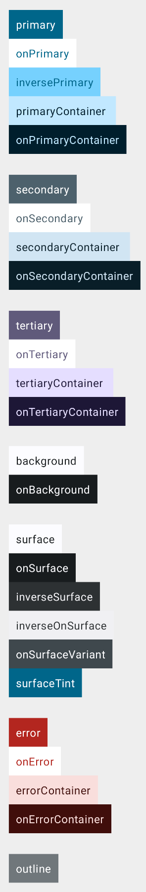


```kotlin
Modifier.background(color =
MaterialTheme.colorScheme.onTertiaryContainer).padding(10.dp))
    Spacer(modifier = Modifier.height(30.dp))
    Text(text = "background", color = MaterialTheme.colorScheme.onBackground,
modifier = Modifier.background(color =
MaterialTheme.colorScheme.background).padding(10.dp))
    Text(text = "onBackground", color = MaterialTheme.colorScheme.background,
modifier = Modifier.background(color =
MaterialTheme.colorScheme.onBackground).padding(10.dp))
    Spacer(modifier = Modifier.height(30.dp))
    Text(text = "surface", color = MaterialTheme.colorScheme.onSurface, modifier =
Modifier.background(color = MaterialTheme.colorScheme.surface).padding(10.dp))
    Text(text = "onSurface", color = MaterialTheme.colorScheme.surface, modifier =
Modifier.background(color = MaterialTheme.colorScheme.onSurface).padding(10.dp))
    Text(text = "inverseSurface", color =
MaterialTheme.colorScheme.inverseOnSurface, modifier = Modifier.background(color =
MaterialTheme.colorScheme.inverseSurface).padding(10.dp))
    Text(text = "inverseOnSurface", color =
MaterialTheme.colorScheme.inverseSurface, modifier = Modifier.background(color =
MaterialTheme.colorScheme.inverseOnSurface).padding(10.dp))
    Text(text = "onSurfaceVariant", color = MaterialTheme.colorScheme.surface,
modifier = Modifier.background(color =
MaterialTheme.colorScheme.onSurfaceVariant).padding(10.dp))
    Text(text = "surfaceTint", color = MaterialTheme.colorScheme.surface, modifier
= Modifier.background(color =
MaterialTheme.colorScheme.surfaceTint).padding(10.dp))
    Spacer(modifier = Modifier.height(30.dp))
    Text(text = "error", color = MaterialTheme.colorScheme.onError, modifier =
Modifier.background(color = MaterialTheme.colorScheme.error).padding(10.dp))
    Text(text = "onError", color = MaterialTheme.colorScheme.error, modifier =
Modifier.background(color = MaterialTheme.colorScheme.onError).padding(10.dp))
    Text(text = "errorContainer", color =
MaterialTheme.colorScheme.onErrorContainer, modifier = Modifier.background(color =
MaterialTheme.colorScheme.errorContainer).padding(10.dp))
    Text(text = "onErrorContainer", color =
MaterialTheme.colorScheme.errorContainer, modifier = Modifier.background(color =
MaterialTheme.colorScheme.onErrorContainer).padding(10.dp))
    Spacer(modifier = Modifier.height(30.dp))
    Text(text = "outline", color = Color.White, modifier =
Modifier.background(color = MaterialTheme.colorScheme.outline).padding(10.dp))
}
```


### Configurer les couleurs du thème


Les couleurs du thème peuvent être configurées pour répondre à vos besoins.


Il faut d'abord définir des couleurs dans le fichier *app/src/main/java/com/mondomaine/monprojet/ui/theme/Color.kt*.


```kotlin title="Fichier Color.kt"
val BleuPale = Color(0xFF36D8F4)
val BleuFonce = Color(0xFF20A1C9)
```


Il faut ensuite associer ces couleurs à un rôle dans le fichier


*app/src/main/java/com/mondomaine/monprojet/ui/theme/Theme.kt* .


```kotlin title="Fichier Theme.kt"
private val DarkColorScheme = darkColorScheme(
    primary = BleuPale,
    ...
)
private val LightColorScheme = lightColorScheme(
    primary = BleuFonce,
    ...
}
```


Par défaut, le thème utilise des couleurs dynamiques c'est-à-dire que les couleurs s'adaptent automatiquement aux couleurs du papier peint installé sur l'appareil mobile.


Si vous désirez imposer les couleurs que vous venez de configurer, vous devrez désactiver les couleurs dynamiques.


```kotlin title="Fichier Theme.kt"
@Composable
fun HelloWorldTheme(
    darkTheme: Boolean = isSystemInDarkTheme(),
    // Dynamic color is available on Android 12+
```


```kotlin
    dynamicColor: Boolean = false ,
    content: @Composable () -> Unit
) {...}
```


!!! warning "Attention : n'utilis" Attention : n'utilisez pas le gestionnaire de ressources pour configurer les couleurs du thème. Il permet de définir des couleurs qui seront synchronisées avec le fichier XML app/src/main/res/values/colors.xml . Ce fichier est utilisé avec l'approche traditionnelle pour définir des interfaces utilisateur. Jetpack Compose ne l'utilise pas. Il se sert plutôt du fichier Color.kt.


#### Pour plus d'information


* [« Color System - Tokens » - Material Design 3](https://m3.material.io/styles/color/the-color-system/tokens)


* [« Understanding Themes in Jetpack Compose » - SemicolonSpace](https://semicolonspace.com/jetpack-compose-theme/)


### * [« Using Hex Colors in Jetpack Compose » - DeveloperMemos](https://developermemos.com/posts/using-hex-colors-compose)
5.9 Spacer()


Un espaceur (Spacer) est un composable qui permet d'ajouter de l'espace entre des éléments à l'écran.


Pour ajouter de l'espace entre deux éléments dans un Column, on précisera la hauteur de l'espaceur.


Ici, l'unité .dp représente des pixels indépendants de la densité (density-independent pixels), aussi appelés pixels indépendants de l'appareil (device-independent pixels).


```kotlin title="Kotlin"
Column {
    Text(text = "Première ligne")
    Spacer(modifier = Modifier.height(4.dp))
    Text(text = "Deuxième ligne")
}
```


Dans le cas d'un Row, on précisera la largeur de l'espaceur.


```kotlin title="Kotlin"
Row {
    Text(text = "Texte de gauche")
    Spacer(modifier = Modifier.width(8.dp))
    Text(text = "Texte de droite")
}
```


Dans les deux cas, il est possible de spécifier la hauteur et la largeur à l'aide de size.


```kotlin title="Kotlin"
Column {
    Text("Hello")
    Spacer(modifier = Modifier.size(10.dp))
    Text("World")
}
```


### Remplir l'espace disponible


Plutôt que l'utiliser les unités .dp pour spécifier une taille, il est possible de spécifier un poids (weight).


Le poids sera un nombre de type float donc il sera suivi de la lettre f.


La valeur 1 signifie 1 fois l'espace restant. Dans cet exemple, le mot Hello sera dans le haut de l'écran et le mot World sera dans le bas puisque l'espaceur remplira l'espace disponible.


```kotlin title="Kotlin"
Column {
    Text("Hello")
    Spacer(modifier = Modifier.weight(1f))
    Text("World")
}
```


S'il y a plusieurs espaceurs, ils pourront se partager l'espace restant selon le poids de chaque espaceur.


Ici, le deuxième espaceur prend 2 fois plus d'espace que le premier.


```kotlin title="Kotlin"
Column {
    Text("Haut")
    Spacer(modifier = Modifier.weight(1f))
    Text("En bas du centre")
    Spacer(modifier = Modifier.weight(2f))
    Text("Bas")
}
```


#### Pour plus d'information


* [« Spacer » - Jetpack Compose Playground](https://foso.github.io/Jetpack-Compose-Playground/foundation/layout/spacer/)


### * [« Support different pixel densities » - Android Developers](https://developer.android.com/training/multiscreen/screendensities)
5.10 Surface()


Le composable Surface() représente une surface matérielle à laquelle on peut appliquer des modifieurs différents styles comme une forme, une couleur et même une élévation.


On placera d'autres composables à l'intérieur de la surface.


Notez qu'avec Material Design 2, on pouvait utiliser elevation(). Avec Material Design 3, on utilisera plutôt shadowElevation() ou tonalElevation().


```kotlin title="Kotlin"
Surface(
    shape = MaterialTheme.shapes.large,
    shadowElevation = 1.dp,
) {
    Text(
        text = "Bonjour",
        modifier = Modifier.padding(10.dp),
        style = MaterialTheme.typography.titleSmall
    )
}
```


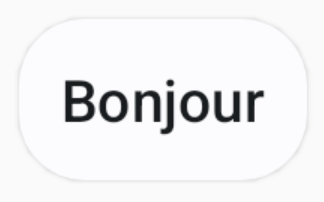


#### Pour plus d'information


* [« Beware of this pitfall in Jetpack Compose! » - Medium](https://medium.com/@theAndroidDeveloper/beware-of-this-pitfall-in-jetpack-compose-e39eb0949c6e)


### 5.11 Les formes


### Dessiner une forme


La fonction modulable Canvas permet de dessiner une forme.


Vous utiliserez une des méthodes proposées , par exemple drawRect, drawRoundRect, drawCircle, drawLine, drawOval, drawArc, drawPoints.


```kotlin title="Jetpack Compose (Kotlin)"
Canvas (
    modifier = Modifier
    .fillMaxSize()
) {
    drawRoundRect (
        color = Color.Red,
        size = Size(size.width, 200f),
        cornerRadius = CornerRadius(25f)
    )
}
```


### Forme d'une image


Jetpack Compose vous propose différents composables qui permettent notamment de délimiter une image : CircleShape, RectangleShape, RoundedCornerShape et CutCornerShape.


```kotlin title="Jetpack Compose (Kotlin)"
import androidx.compose.foundation.shape.CircleShape
...
Image(
    ...
    modifier = Modifier
        .clip( CircleShape )
        .border(1.5.dp, MaterialTheme.colorScheme.outline, CircleShape )
)
```


#### Pour plus d'information


* [« Canvas in Jetpack Compose » - Medium](https://blog.kotlin-academy.com/canvas-in-jetpack-compose-c6e7b651fd9b)


* [« Jetpack Compose in Many Shapes and Forms » - Cups of Code](https://cupsofcode.com/post/jetpack_compose_comes_in_many_shapes_path_forms/)


### 5.12 Button()


Avec Jetpack Compose, un bouton est défini à l'aide de la fonction modulable Button .


```kotlin title="Jetpack Compose (Kotlin)"
Button(
    onClick = {
        // ...
    }
) {
    Text(text = "Enregistrer")
}
```


Pour modifier la couleur de fond du bouton :


```kotlin title="Jetpack Compose (Kotlin)"
Button(
    colors = ButtonDefaults.buttonColors(containerColor = Color.Red),
    onClick = {
        // ...
    }
) {
    Text(text = "Enregistrer")
}
```


### Remarquez qu'avec Material Design 3, on utilise containerColor alors qu'avec Material Design 2, il fallait
utiliser backgroundColor.


Pour désactiver un bouton, par exemple quand les données ne sont pas valides, il suffit d'utiliser une variable d'état booléenne avec l'attribut enabled :


```kotlin title="Jetpack Compose (Kotlin)"
Button(
    enabled = donneesValides,
    onClick = {
        // ...
    }
) {
    Text(text = "Enregistrer")
}
```


#### Pour plus d'information


* [« Buttons in Jetpack Compose » - Jetpack Compose](https://www.jetpackcompose.net/buttons-in-jetpack-compose)


### 5.13 Popup()


La fonction modulable Popup permet d'afficher un composable à l'écran par-dessus ce qui y est déjà affiché.


Popup() servira généralement à afficher un message. Si vous avez besoin d'une confirmation, vous utiliserez plutôt **AlertDialog()**.


Pour utiliser Popup(), on travaillera avec **une variable d'état** (la variable d'état pourrait aussi faire partie d'un ViewModel) qui détermine si le popup doit être affiché ou non.


```kotlin title="Jetpack Compose (Kotlin)"
@Composable
fun MainScreen() {
     var afficherPopup: Boolean by remember { mutableStateOf(false) }
    // contenu de l'écran principal
    ...
    // bouton pour afficher le popup
    Button (
        onClick = {
            afficherPopup = true
        }
    ) {
        Text(text = "Afficher le popup")
    }
    if (afficherPopup) {
        Popup(
            alignment = Alignment.Center,   // centrer le Popup dans son parent
            onDismissRequest = { afficherPopup = false },   // le popup se refermera si on clique en dehors
        ) {
            // contenu du popup
            ...
            // bouton qui fait quelque chose puis referme le popup
            Button(
                onClick = {
                    ...
                    afficherPopup = false
                }
            ) {
                Text(text = "Faire quelque chose")
            }
        }
    }
}
```


Voici un exemple.


Remarquez que pour donner une couleur de fond au popup, j'ai utilisé un **Card()**.


```kotlin title="Jetpack Compose (Kotlin)"
Popup(
    alignment = Alignment.Center, // centrer le Popup dans son parent
    ...
) {
    Card (
        colors = CardDefaults.cardColors(
            containerColor = MaterialTheme.colorScheme.surfaceVariant,
        ),
        shape = RoundedCornerShape(10),
        border = BorderStroke(1.dp, Color.Black),
        elevation = CardDefaults.cardElevation(
            defaultElevation = 6.dp
        ),
    ) {
        Column(
            // centrer le contenu du Popup
            horizontalAlignment = Alignment.CenterHorizontally,
            verticalArrangement = Arrangement.Center,
            modifier = Modifier.padding(25.dp)
        ) {
            Text("Vous passez au niveau 3!")
            Spacer(modifier = Modifier.height(14.dp))
            Button(
                 onClick = {...}
            ) {
                 Text("OK")
            }
        }
    }
}
```


#### Pour plus d'information


### * [« Jetpack Compose Popup — Master It! » - Medium](https://medium.com/mobile-app-development-publication/jetpack-compose-popup-master-it-98accb23da36)
5.14 Card()


La fonction modulable Card permet de regrouper des composables en les plaçant par exemple dans un rectangle stylisé.


Voici un exemple de base du Card.


```kotlin title="Jetpack Compose (Kotlin)"
Card {
    Text("Première ligne")
    Text("Deuxième ligne")
}
```


Si on fait Ctrl +Clic sur le mot Card dans Android Studio, on voit que le Card est simplement un composable Surface qui contient un Column.


Dans les faits, on ajoutera souvent un Column ou un Row à l'intérieur du Card pour ajouter de l'espacement intérieur (padding).


```kotlin title="Jetpack Compose (Kotlin)"
Card {
    Column(
        modifier = Modifier.padding(24.dp)
    ) {
        Text("Première ligne")
        Text("Deuxième ligne")
    }
}
```


Il est possible de modifier l'apparence du Card à l'aide de ses propriétés, par exemple sa couleur, le rayon de ses coins et sa bordure.


```kotlin title="Jetpack Compose (Kotlin)"
Card (
    colors = CardDefaults.cardColors(
        containerColor = MaterialTheme.colorScheme.background,
    ),
    shape = RoundedCornerShape(25),
    border = BorderStroke(1.dp, Color.Black)
) {
    Column(
        modifier = Modifier.padding(24.dp)
    ) {
        Text("Première ligne")
        Text("Deuxième ligne")
    }
}
```


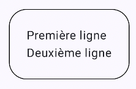


On peut aussi ajouter de l'élévation pour modifier légèrement le visuel.


```kotlin title="Jetpack Compose (Kotlin)"
Card (
    colors = CardDefaults.cardColors(
        containerColor = MaterialTheme.colorScheme.background,
    ),
    shape = RoundedCornerShape(25),
    border = BorderStroke(1.dp, Color.Black),
    elevation = CardDefaults.cardElevation(10.dp)
) {
    Column(
        modifier = Modifier.padding(24.dp)
    ) {
        Text("Première ligne")
        Text("Deuxième ligne")
    }
}
```


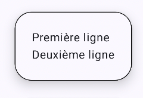


Il existe également le composable ElevatedCard qui contient une élévation par défaut.


Cette fois, pas possible de lui ajouter de bordure.


Vous remarquerez également que la couleur par défaut n'est pas la même qu'avec Card.


```kotlin title="Jetpack Compose (Kotlin)"
ElevatedCard  {
    Column(
        modifier = Modifier.padding(24.dp)
    ) {
        Text("Première ligne")
        Text("Deuxième ligne")
    }
}
```


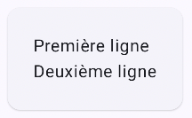


Je vous présente ici quelques exemples intéressants de configurations avec Card ou ElevatedCard.


```kotlin title="Jetpack Compose (Kotlin)"
Card(
    shape = CutCornerShape(topStart = 16.dp, bottomEnd = 8.dp) ,
) {
    Column(
        modifier = Modifier.padding(24.dp)
    ) {
        Text("Première ligne")
        Text("Deuxième ligne")
    }
}
```


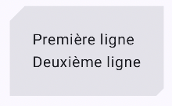


```kotlin title="Jetpack Compose (Kotlin)"
ElevatedCard(
    shape = RoundedCornerShape(
        topStart = 24.dp,
        topEnd = 0.dp,
        bottomStart = 0.dp,
        bottomEnd = 24.dp
    ),
    colors = CardDefaults.cardColors(
        containerColor = MaterialTheme.colorScheme.inverseSurface
    ),
) {
    Column(
        modifier = Modifier.padding(24.dp)
    ) {
        Text("Première ligne")
        Text("Deuxième ligne")
    }
}
```


```kotlin title="Jetpack Compose (Kotlin)"
Card(
    onClick = { faireQuelqueChose() } ,
    colors = CardDefaults.cardColors(
        containerColor = MaterialTheme.colorScheme.primaryContainer
    )
) {
    Row(
        modifier = Modifier.padding(20.dp),
        verticalAlignment = Alignment.CenterVertically
    ) {
        Icon(Icons.Default.Info, contentDescription = "info")
        Spacer(Modifier.width(16.dp))
        Text("Cliquez ici pour plus de détails.")
    }
}
```


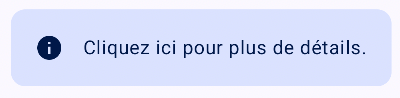


```kotlin title="Jetpack Compose (Kotlin)"
ElevatedCard(
    shape = RoundedCornerShape(20.dp),
    elevation = CardDefaults.elevatedCardElevation(defaultElevation = 8.dp),
    colors = CardDefaults.elevatedCardColors(
        containerColor = Color.Red
    ),
    modifier = Modifier.size(width = 200.dp, height = 150.dp)
) {
    Column(
        modifier = Modifier
            .fillMaxSize()
            .padding(16.dp),
        horizontalAlignment = Alignment.CenterHorizontally,
        verticalArrangement = Arrangement.Center
    ) {
        Icon(
            Icons.Default.Warning,
            contentDescription = "Alerte",
            tint = Color.White,
            modifier = Modifier.size(32.dp)
        )
        Spacer(Modifier.height(8.dp))
        Text(
            text = "Attention!",
            color = Color.White
        )
    }
}
```


```kotlin title="Jetpack Compose (Kotlin)"
ElevatedCard(
    elevation = CardDefaults.elevatedCardElevation(5.dp),
    modifier = Modifier.size(250.dp, 100.dp)
) {
    Box(
        modifier = Modifier.fillMaxSize()
    ) {
        Image(
            painter = painterResource(R.drawable.versailles),
            contentDescription = "fond",
            contentScale = ContentScale.Crop,
        )
        Box(
            modifier = Modifier
                 .fillMaxSize()
                 .background(
                      Brush.verticalGradient(
                          colors = listOf(Color.Transparent, Color.Black.copy(alpha = 0.6f)),
                      )
                 )
         )
         Text(
            "Notre vision",
            color = Color.White,
            style = MaterialTheme.typography.titleLarge,
            modifier = Modifier.align(Alignment.BottomStart).padding(12.dp)
         )
    }
}
```


#### Pour plus d'information


### * [« Card » - Android Developers](https://developer.android.com/jetpack/compose/components/card)

## TextField() et OutlinedTextField()


Une case de saisie peut être ajoutée à l'aide du composble TextField() ou de OutlinedTextField() .


Pour que le texte entré dans une boîte de saisie soit affiché dans la boîte, il faut que sa valeur provienne d'une variable d'état.


En lien avec les cases de saisie:


* TextField
* OutlinedTextField
* supportingText
* Type de clavier
* TextField ou OulinedTextField avec ViewModel


### TextField


Le TextField, dans sa plus simple expression, va comme suit :


```kotlin title="Jetpack Compose (Kotlin)"
var titre by rememberSaveable { mutableStateOf("") }   // la variable d'état pourrait aussi faire partie du ViewModel
 
TextField(
    value = titre ,
    onValueChange = { titre = it },
    label = { Text("Titre") }
)
```


Remarquez l'utilisation de **rememberSaveable**. Si vous débutez avec Jetpack Compose, vous aurez sans doute appris à déclarer les variables d'état avec remember. Dès que vous avancerez dans vos apprentissages, vous comprendrez pourquoi il est préférable d'utiliser *rememberSaveable* pour la valeur d'une case de saisie.


Voici le TextField vide puis avec focus ou rempli.


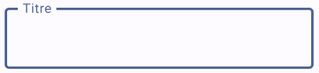


### OutlinedTextField


Voici le même exemple mais avec un OutlinedTextField.


```kotlin title="Jetpack Compose (Kotlin)"
var titre by rememberSaveable { mutableStateOf("") }
 
OutlinedTextField(
    value = titre,
    onValueChange = { titre = it },
    label = { Text("Titre") }
)
```


La différence entre TextField et OutlinedTextField est au niveau de l'apparence.


Voici le OutlinedTextField vide puis avec focus ou rempli.


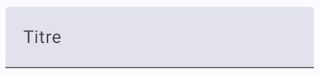


### supportingText


Depuis Jetpack Compose 1.3, il est possible d'ajouter un texte d'accompagnement sous la boîte de saisie.


Dans la forme la plus simple, un texte statique sera affiché. Mais puisque le code est entre accolades, ceci ouvre la porte à une panoplie de possibilités afin d'afficher un texte contextualisé.


```kotlin title="Jetpack Compose (Kotlin)"
var titre by rememberSaveable { mutableStateOf("") }
 
OutlinedTextField(
    value = titre,
    onValueChange = { titre = it },
    label = { Text("Titre") },
    supportingText = { Text("Max. 10 caractères") }
)
```


### Type de clavier


Afin d'améliorer l'expérience utilisateur, il est important de spécifier le type de clavier virtuel selon le rôle de la case de saisie.


Les principaux types de clavier sont :


* Text (par défaut)
* Number
* Decimal (dans derniers tests effectués, était identique à Number)
* Email (semblable à Text mais la virgule est remplacée par un @)
* Password (lettres et chiffres dans un même écran)
* Phone (chiffres avec lettres imprimées sur les touches correspondantes - ex : 2 ABC)
* Uri (semblable à Text mais la virgule est remplacée par un `/`)


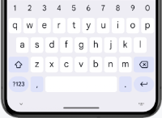


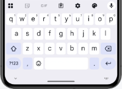


KeyboardType.Text KeyboardType.Number KeyboardType.Email KeyboardType.Password KeyboardType.Phone


Pour spécifier le type clavier désiré :


```kotlin title="Jetpack Compose (Kotlin)"
TextField(
    ...,
    keyboardOptions = KeyboardOptions
(keyboardType
 = KeyboardType.Number)
)
```


### TextField ou OulinedTextField avec ViewModel


Dans une application qui utilise un **ViewModel comme conteneur d'état**, la syntaxe d'une case de saisie sera légèrement différente.


Notez que j'ai utilisé ici un ViewModel de type HomeViewModel mais la classe du ViewModel pourrait porter un autre nom dans votre application.


```kotlin title="Fonction composable (Kotlin)"
@Composable
fun monComposable() {
    val viewModel: HomeViewModel = viewModel()
    val uiState by viewModel.uiState.collectAsState()
    ...
    TextField(
        value = uiState.nom ,
        onValueChange = {
             viewModel.ajusterNom(it)
        },
        ...
    )
    ...
}
```


Et dans le ViewModel (dans cet exemple, le uiState est un flux observable, d'où la nécessité d'utiliser _uiState.update) :


```kotlin title="ViewModel (Kotlin)"
class HomeViewModel: ViewModel() {
    ...
    fun ajusterNom(valeur: String) {
        _uiState.update {
            it.copy (
                _nom = valeur
            )
        }
    }
}
```


#### Pour plus d'information


* [« Handle user input » - Android Developers](https://developer.android.com/jetpack/compose/text/user-input)


* [« Jetpack Compose Basics - How to use text field composables to meet the Material design specification » - Good Request](https://www.goodrequest.com/blog/jetpack-compose-basics-text-input)


* [« Textfields » - Material Design 3](https://m3.material.io/components/text-fields/overview)


* [« androidx.compose.material3 - TextField » - Android Developers](https://developer.android.com/reference/kotlin/androidx/compose/material3/package-)
summary#textfield


### * [« androidx.compose.material3 - OutlinedTextField » - Android Developers](https://developer.android.com/reference/kotlin/androidx/compose/material3/package-)
summary 5.16 Alignement et espacement


Il existe plusieurs techniques pour spécifier l'alignement et l'espacement des composables dans Jetpack Compose.


Parfois, il s'agira d'appliquer des attributs sur la ligne ou la colonne, par exemple :


* horizontalAlignment = Alignment.Start
* horizontalAlignment = Alignment.CenterHorizontally
* horizontalAlignment = Alignment.End
* verticalArrangement = Arrangement.Top
* verticalArrangement = Arrangement.Center
* verticalArrangement = Arrangement.Bottom
* horizontalArrangement = Arrangement.SpaceEvenly
* horizontalArrangement = Arrangement.Center
* horizontalArrangement = Arrangement.End

Ici, on centre horizontalement tout le contenu d'une colonne :


```kotlin title="Jetpack Compose (Kotlin)"
Column (
    modifier = Modifier.fillMaxWidth(),
    horizontalAlignment = Alignment.CenterHorizontally,
) {
    ...
}
```


Parfois, il s'agira d'ajouter des modificateurs sur le composable à aligner, par exemple :


#### Modifier.align(Alignment.Start)


#### Modifier.align(Alignment.CenterHorizontally)


#### Modifier.align(Alignment.End)


Ceci est possible seulement si le composable auquel le *modifier* est appliqué se trouve dans un Row, un Column ou un Box.


Ici, on centre horizontalement un bouton :


```kotlin title="Jetpack Compose (Kotlin)"
Column(modifier = Modifier.fillMaxWidth()) {
    Button(
         modifier = Modifier.align(Alignment.CenterHorizontally),
        onClick = {
            ...
        }
    ) {
        Text(text = "Ok")
    }
{
```


Parfois, il s'agira d'ajouter des **espaceurs** (Spacer) à l'endroit approprié.


Ici encore, on centre horizontalement un bouton :


```kotlin title="Jetpack Compose (Kotlin)"
Row {
    Spacer(modifier = Modifier.weight(1f))
    Button(
        onClick = {
            ...
        }
    ) {
        Text(text = "Ok")
    }
     Spacer(modifier = Modifier.weight(1f))
}
```


Certains composables contiennent des attributs qui leur permettent de modifier leur propre alignement.


```kotlin title="Jetpack Compose (Kotlin)"
Text(
    text = "Ce texte est long et s'étend sur plus d'une ligne. Il sera centré.",
    textAlign = TextAlign.Center,
)
```


#### Pour plus d'information


* [« Column » - Jetpack Compose Playground](https://foso.github.io/Jetpack-Compose-Playground/layout/column/)


* [« Row » - Jetpack Compose Playground](https://foso.github.io/Jetpack-Compose-Playground/layout/row/)


* [« Composing Alignment & Arrangement » - Medium](https://zoewave.medium.com/composing-alignment-arrangement-4917d41640e9)


* [« Jetpack Compose: filling max width or height » - Medium](https://medium.com/rocknnull/jetpack-compose-filling-max-width-or-height-94e3af129a7b)


### * [« Cheatsheet for centering items in Jetpack Compose » - Medium](https://proandroiddev.com/cheatsheet-for-centering-items-in-jetpack-compose-1e3534415237)

## Changer le fond d'écran


Je vous présente ici quelques techniques pour modifier le fond de votre application Android avec Jetpack Compose.


* Configurer une couleur de fond d'écran avec le thème
* Couleur des barres d'application
* Configurer une couleur de fond d'écran par programmation
* Couleur des barres d'application - technique 1
* Couleur des barres d'application - technique 2
* Utiliser une image en fond d'écran
* Image sous les barres d'application
* Configurer une couleur de fond d'écran avec le thème


La technique la plus intéressante pour modifier la couleur de fond consiste à travailler avec le thème de l'application.


Les fichiers du thème sont situés dans le dossier ui/theme , que vous retrouverez au même niveau que MainActivity.kt .


```kotlin title="Fichier Color.kt"
val Purple80 = Color(0xFFD0BCFF)
val PurpleGrey80 = Color(0xFFCCC2DC)
val Pink80 = Color(0xFFEFB8C8)
val JaunePale = Color(0xFFFFFF33)
 
val Purple40 = Color(0xFF6650a4)
val PurpleGrey40 = Color(0xFF625b71)
val Pink40 = Color(0xFF7D5260)
val JauneFonce = Color(0xFFB57A0D)
```


```kotlin title="Fichier Theme.kt"
private val DarkColorScheme = darkColorScheme(
    primary = Purple80,
    secondary = PurpleGrey80,
    tertiary = Pink80,
    background = JauneFonce,
)
private val LightColorScheme = lightColorScheme(
    primary = Purple40,
    secondary = PurpleGrey40,
    tertiary = Pink40,
    background = JaunePale,
)
@Composable
fun MonApplicationTheme(
    darkTheme: Boolean = isSystemInDarkTheme(),
    // Dynamic color is available on Android 12+
    dynamicColor: Boolean = false,
    content: @Composable () -> Unit
) {
    ...
}
```


Sans rien changer de plus, le fond d'écran sera jaune pâle ou jaune foncé selon que l'appareil est en mode clair ou en mode sombre.


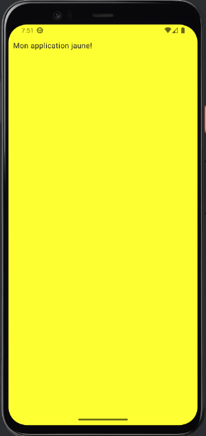


### Couleur des barres d'application


Dans le cas où l'application comprend une barre de titre ou une barre de navigation, il faudra préciser que leur couleur de fond est transparente pour que la couleur dictée par le thème les affecte.


```kotlin title="Jetpack Compose (Kotlin)"
Scaffold(
    modifier = Modifier
        .fillMaxSize(),
    topBar = {
        CenterAlignedTopAppBar(
            colors = TopAppBarDefaults.topAppBarColors(
                containerColor = Color.Transparent
            ),
            title = {
                Text(text = "Mon application")
            },
        )
    },
    bottomBar = {
        BottomAppBar(
            containerColor = Color.Transparent
        ) {
            //...
        }
    },
    content = {
        ...
    }
)
```


### Configurer une couleur de fond d'écran par programmation


Dans certaines applications, on voudra plutôt modifier la couleur dynamiquement. Ici, j'ai utilisé des couleurs codées en dur mais il serait facile d'adapter ce code pour que les couleurs proviennent de variables.


Puisque, dans cet exemple, la couleur est spécifiée dans le contenu de l'application (paramètre content du Scaffold ou partie entre accolades), la couleur de fond ne sera pas appliquée à la barre de titre ni à la barre de navigation.


Remarquez la condition pour spécifier la couleur en mode clair et en mode sombre.


```kotlin title="Jetpack Compose (Kotlin)"
Box(
    modifier = Modifier
        .fillMaxSize()
        .padding(innerPadding)
        .background(if (isSystemInDarkTheme()) Color.Gray else Color.LightGray)
) {
    Text(
        text = "Mon fond de couleur",
        modifier = Modifier
            .padding(10.dp)
    )
}
```


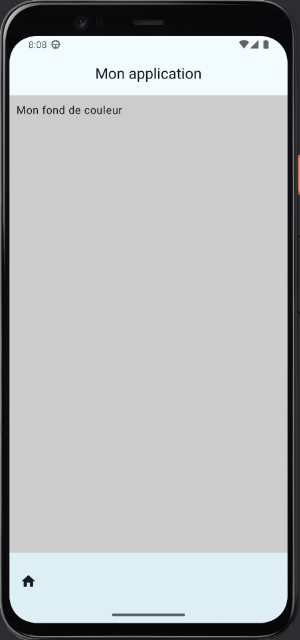


### Couleur des barres d'application - technique 1


Pour appliquer une couleur de fond partout, il faut placer le Scaffold à l'intérieur du Box et préciser que la couleur de fond du Scaffold, de la barre de titre et de la barre de navigation sont transparentes.


```kotlin title="Jetpack Compose (Kotlin)"
Box(
    modifier = Modifier
        .fillMaxSize()
        .background(if (isSystemInDarkTheme()) Color.Gray else Color.LightGray)
) {
    Scaffold(
        modifier = Modifier
            .fillMaxSize(),
         containerColor = Color.Transparent,
        topBar = {
            CenterAlignedTopAppBar(
                colors = TopAppBarDefaults.topAppBarColors(
                     containerColor = Color.Transparent
                ),
                title = {
                    Text(text = "Mon application")
                },
            )
        },
        bottomBar = {
            BottomAppBar(
                 containerColor = Color.Transparent
            ) {
                //...
            }
        },
        content = {
            ...
        }
    )
}
```


### Couleur des barres d'application - technique 2


Voici une autre technique qui permet de modifier le fond partout. Il s'agit de préciser la couleur directement dans les différentes sections du Scaffold.


Avec cette technique, on n'a plus besoin du Box.


```kotlin title="Jetpack Compose (Kotlin)"
Scaffold(
    modifier = Modifier
        .fillMaxSize(),
     containerColor = if (isSystemInDarkTheme()) Color.Gray else Color.LightGray,
    topBar = {
        CenterAlignedTopAppBar(
            colors = TopAppBarDefaults.topAppBarColors(
                containerColor = if (isSystemInDarkTheme()) Color.Gray else Color.LightGray,
            ),
            title = {
                Text(text = "Mon application")
            },
        )
    },
    bottomBar = {
        BottomAppBar(
            containerColor = containerColor = if (isSystemInDarkTheme()) Color.Gray else Color.LightGray,
        ) {
            //...
        }
    },
    content = {
        ...
    }
)
```


### Utiliser une image en fond d'écran


Ce code permet d'utiliser une image comme fond d'écran pour le contenu de l'application mais pas derrière la barre de titre ni la barre de navigation.


Remarquez que puisque l'image est la même en mode clair et en mode sombre, j'ai spécifié la couleur du texte afin qu'il soit toujours bien visible.


```kotlin title="Kotlin"
Box(
    modifier = Modifier
        .fillMaxSize()
        .padding(innerPadding)
        .paint(
            painterResource(id = R.drawable.coucher_soleil),
            contentScale = ContentScale.Crop
        )
) {
    Text(
        text = "Mon image de fond",
        color = Color.White,
        modifier = Modifier
            .padding(10.dp)
    )
}
```


### Image sous les barres d'application


Ici encore, si on veut que l'image soit également derrière la barre de titre et la barre de navigation, il faut travailler au niveau du Scaffold. Cette fois, j'ai placé le Scaffold dans un Box qui spécifie le fond d'écran et j'ai mis le fond en transparence pour le contenu, la barre de titre et la barre de navigation.


Plus besoin du Box dans le contenu.


Je n'ai pas modifié les couleurs dans la barre de titre ni dans la barre de navigation afin d'illustrer les dangers au niveau de la lisibilité lorsque l'image de fond couvre tout l'écran.


```kotlin title="Jetpack Compose (Kotlin)"
Box(
    modifier = Modifier
        .fillMaxSize()
        .paint(
            painterResource(id = R.drawable.coucher_soleil),
            contentScale = ContentScale.Crop
        )
) {
    Scaffold(
        modifier = Modifier
            .fillMaxSize(),
         containerColor = Color.Transparent,
        topBar = {
            CenterAlignedTopAppBar(
                colors = TopAppBarDefaults.topAppBarColors(
                     containerColor = Color.Transparent
                ),
                title = {
                    Text(text = "Mon application")
                },
            )
        },
        bottomBar = {
            BottomAppBar(
                 containerColor = Color.Transparent
            ) {
                //...
            }
        },
        content = {
            ...
        }
    )
}
```


<!--

### 5.18 Les fonctions expérimentales


Selon la version de Jetpack Compose que vous utilisez, certaines fonctions peuvent être marquées comme expérimentales.


Il est permis d'utiliser les fonctions expérimentales. Cependant, si vous ne prenez pas certaines précautions, vous obtiendrez le message d'erreur « This material API is experimental and is likely to change or to be removed in the future. ».


Par exemple, voici ce qu'on obtenais lorsque la fonction modulable Card était expérimentale.


Vous devez ajouter l'annotation ExperimentalMaterial3Api pour aviser Jetpack Compose que vous acceptez d'utiliser une fonction expérimentale.


```kotlin title="Jetpack Compose"
@OptIn(ExperimentalMaterial3Api::class) // pour retirer le message "This material API is experimental and is likely to
change or to be removed in the future"
@Composable
fun ...() {
    ...
}
```

-->
