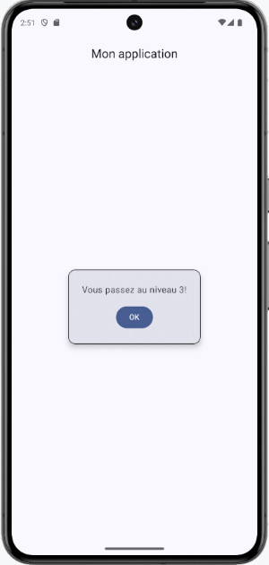
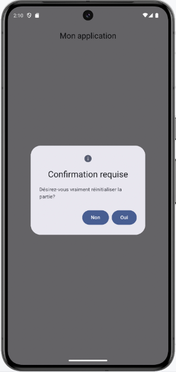
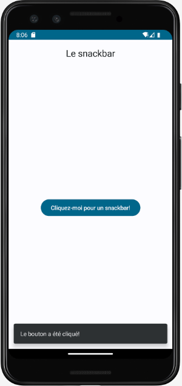
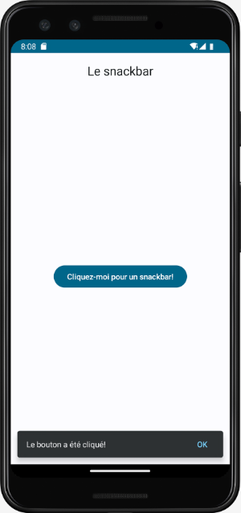
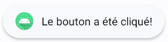

# Fenêtres popup et dialogues


### 39.1 Popup()


La fonction modulable Popup permet d'afficher un composable à l'écran par-dessus ce qui y est déjà affiché.


Popup() servira généralement à afficher un message. Si vous avez besoin d'une confirmation, vous utiliserez plutôt **AlertDialog()]**.


Pour utiliser Popup(), on travaillera avec **une variable d'état]** (la variable d'état pourrait aussi faire partie d'un ViewModel) qui détermine si le popup doit être affiché ou non.


```kotlin title="Jetpack Compose (Kotlin)"
@Composable
fun MainScreen() {
     var afficherPopup: Boolean by remember { mutableStateOf(false) }
    // contenu de l'écran principal
    ...
    // bouton pour afficher le popup
    Button (
        onClick = {
            afficherPopup = true
        }
    ) {
        Text(text = "Afficher le popup")
    }
    if (afficherPopup) {
        Popup(
            alignment = Alignment.Center,   // centrer le Popup dans son parent
            onDismissRequest = { afficherPopup = false },   // le popup se refermera si on clique en dehors
        ) {
            // contenu du popup
            ...
            // bouton qui fait quelque chose puis referme le popup
            Button(
                onClick = {
                    ...
                    afficherPopup = false
                }
            ) {
                Text(text = "Faire quelque chose")
            }
        }
    }
}
```


Voici un exemple.


Remarquez que pour donner une couleur de fond au popup, j'ai utilisé un **Card()]**.


```kotlin title="Jetpack Compose (Kotlin)"
Popup(
    alignment = Alignment.Center, // centrer le Popup dans son parent
    ...
) {
    Card (
        colors = CardDefaults.cardColors(
            containerColor = MaterialTheme.colorScheme.surfaceVariant,
        ),
        shape = RoundedCornerShape(10),
        border = BorderStroke(1.dp, Color.Black),
        elevation = CardDefaults.cardElevation(
            defaultElevation = 6.dp
        ),
    ) {
        Column(
            // centrer le contenu du Popup
            horizontalAlignment = Alignment.CenterHorizontally,
            verticalArrangement = Arrangement.Center,
            modifier = Modifier.padding(25.dp)
        ) {
            Text("Vous passez au niveau 3!")
            Spacer(modifier = Modifier.height(14.dp))
            Button(
                 onClick = {...}
            ) {
                 Text("OK")
            }
        }
    }
}
```





#### Pour plus d'information


### * [« Jetpack Compose Popup — Master It! » - Medium](https://medium.com/mobile-app-development-publication/jetpack-compose-popup-master-it-98accb23da36)
39.2 AlertDialog()


AlertDialog() permet d'afficher une fenêtre popup de confirmation.


Il est important de montrer clairement à l'usager qu'il peut accepter (ex : bouton OK ou Oui) ou refuser (ex : bouton Annuler ou Non) ce qui lui est demandé.


```kotlin title="Jetpack Compose (Kotlin)"
AlertDialog(
    icon = { ... },
    title = { ... },
    text = { ... },
    onDismissRequest = {
        ...    // ce qui se passe si on clique en dehors de la boîte de dialogue
    },
    confirmButton = {
        Button(
            onClick = {
                ...   // ne pas oublier de faire le nécessaire pour que la boîte ne soit plus affichée après avoir fait le
traitement
            }
        ) {
            ...
        }
    },
    dismissButton = {
        Button(
            onClick = {
                ...   // doit faire le nécessaire pour que la boîte ne soit plus affichée
            }
        ) {
            ...
        }
    }
)
```


Voici un exemple :


```kotlin title="Jetpack Compose (Kotlin)"
AlertDialog(
    icon = {
        Icon(imageVector = Icons.Default.Info, contentDescription = "info")
    },
    title = {
        Text("Confirmation requise")
    },
    text = {
        Text("Désirez-vous vraiment réinitialiser la partie?")
    },
    confirmButton = {
        Button(
            onClick = {
                ...
            }
        ) {
            Text("Oui")
        }
    },
    dismissButton = {
        Button(
            onClick = {
                ...
            }
        ) {
            Text("Non")
        }
    }
)
```





#### Pour plus d'information


### * [« Alert dialog » - Android Developers](https://developer.android.com/jetpack/compose/components/dialog#alert)
39.3 Snackbar : notification de courte durée avec possibilité d'action


Le snackbar est une notification qui apparaît au bas de l'écran pour informer l'usager du résultat d'une opération.


Le snackbar est préférable au **toast]** puisqu'il offre plus de possibilités, notamment la possibilité qu'il se referme de lui-même après un laps de temps ou sur un clic de l'usager ou les deux.


De plus, il se charge de gérer la file de notifications à afficher.


```kotlin title="Jetpack Compose (Kotlin)"
val scope = rememberCoroutineScope()
val snackbarHostState = remember { SnackbarHostState() }    // contrôle la file de snackbars à afficher
Scaffold (
    topBar = {
        ...
    },
    // composant responsable de l'affichage du snackbar
    snackbarHost = {
         SnackbarHost(hostState = snackbarHostState)
    },
    content = {
        MainContent(
            innerPadding = it,
            scope = scope,
            snackbarHostState = snackbarHostState
        )
    }
)
@Composable
fun MainContent(
    innerPadding: PaddingValues,
    scope: CoroutineScope,
    snackbarHostState: SnackbarHostState
) {
    Column(
        modifier = Modifier
            .padding(innerPadding)
    ) {
        Button(
            onClick = {
                // affiche le snackbar
                 scope.launch {
                     snackbarHostState.showSnackbar("Le bouton a été cliqué!")
                 }
            }
        ) {
            Text(text = "Cliquez-moi pour un snackbar!")
        }
    }
}
```





### Snackbar refermable


Il est possible d'ajouter un texte cliquable qui permet à l'usager de refermer le snackbar dès qu'il le désire plutôt que de le forcer à attendre que le snackbar s'efface de lui-même.


Il est même possible de configurer le snackbar pour qu'il ne s'efface jamais de lui-même.


```kotlin title="Jetpack Compose (Kotlin)"
val scope = rememberCoroutineScope()
val snackbarHostState = remember { SnackbarHostState() }   // contrôle la file de snackbars à afficher
Scaffold (
    topBar = {
        ...
    },
    // composant responsable de l'affichage du snackbar
    snackbarHost = {
        SnackbarHost(hostState = snackbarHostState)
    },
    content = {
        MainContent(
            innerPadding = it,
            scope = scope,
            snackbarHostState = snackbarHostState
        )
    }
)
@Composable
fun MainContent(
    innerPadding: PaddingValues,
    scope: CoroutineScope,
    snackbarHostState: SnackbarHostState
) {
    Column(
        modifier = Modifier
            .padding(innerPadding)
    ) {
        Button(
            onClick = {
                // affiche le snackbar
                 scope.launch {
                      val result = snackbarHostState
                          .showSnackbar(
                              message = "Le bouton a été cliqué!",
                              actionLabel = "OK",
                              duration = SnackbarDuration.Indefinite // ne s'effacera pas tant que le bouton OK n'est pas
pressé
                             //duration = SnackbarDuration.Short // s'effacera après un court laps de temps
                          )
                 }
            }
        ) {
            Text(text = "Cliquez-moi pour un snackbar!")
        }
    }
}
```





### Snackbar avec action


Si cela répond à votre besoin, le snackbar permet de réagir lorsqu'il est refermé par un clic ou après un laps de temps.


```kotlin title="Jetpack Compose (Kotlin)"
Button(
    onClick = {
        // affiche le snackbar
        scope.launch {
             val result = snackbarHostState
                 .showSnackbar(
                     message = "Le bouton a été cliqué!",
                     actionLabel = "OK",
                     duration = SnackbarDuration.Short
                 )
              when (result) {
                  SnackbarResult.ActionPerformed -> {
                    Log.d("*****", "Le snackbar a été effacé par un clic sur son bouton!")
                  }
                  SnackbarResult.Dismissed -> {
                    Log.d("*****", "Le snackbar s'est auto-effacé!")
                  }
              }
        }
    }
) {
    Text(text = "Cliquez-moi pour un snackbar!")
}
```


#### Pour plus d'information


* [« Snackbar » - Android Developers](https://developer.android.com/jetpack/compose/components/snackbar)


* [« How to show Snackbar in Jetpack Compose? » - Medium](https://medium.com/@jurajkunier/how-to-show-snackbar-in-jetpack-compose-3f2d81891f87)


* [« Snackbars » - Material Design](https://m2.material.io/components/snackbars/android)


* [« Advanced work with the Snackbar in the Jetpack Compose » - Medium](https://proandroiddev.com/advanced-work-with-the-snackbar-in-the-jetpack-compose-)
9bb7b7a30d60


### * [« How to Show Snackbars Across Multiple Screens in Jetpack Compose » - Medium](https://betterprogramming.pub/how-to-show-snackbars-across-multiple-)
screen-in-jetpack-compose-dd4b40c6829a 39.4 Toast : notification de courte durée


Tout comme le **snackbar]**, un toast est une petite fenêtre popup qui apparaît au bas de l'écran pour informer l'usager du résultat d'une opération.


Le toast se referme de lui-même après un laps de temps.


Selon la documentation officielle d'Android : 1


### Si votre application est exécutée au premier plan, envisagez d'utiliser un snackbar au lieu d'un


### toast.


Si vous êtes en train de développer une nouvelle application, suivez plutôt les exemples présentés sur cette fiche : « **snackbar** »


```kotlin title="Jetpack Compose (Kotlin)"
val context = LocalContext.current
...
Button(
    onClick = {
        Toast.makeText(context, "Le bouton a été cliqué!", Toast.LENGTH_SHORT).show()
    }
) {
    Text(text = "Cliquez-moi!")
}
```





> **Source** : 

### 1. * [« Présentation des notifications toast - Alternatives à l'utilisation des toasts » - Android Developers](https://developer.android.com/guide/topics/ui/notifiers/toasts?)
hl=fr#alternatives_to_using_toasts


#### Pour plus d'information


### * [« Présentation des notifications toast » - Android Developers](https://developer.android.com/guide/topics/ui/notifiers/toasts?hl=fr)
40. Exercice 5


---
