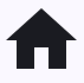
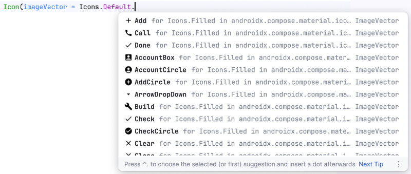
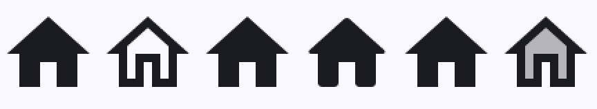

# Icônes et gestion d'images


### 31.1 Icône avec la bibliothèque Material Symbols


La fonction modulable Icon
 permet d'afficher une icône à l'écran.


Les icônes disponibles par défaut sont tirées de la bibliothèque gratuite Material Icons
.


```kotlin title="Jetpack Compose (Kotlin)"
Icon(imageVector = Icons.Default.Home, contentDescription = "home")
```


<div style="text-align: center; margin: 1.5em 0;">
  
</div>


Pour connaître la liste des icônes disponibles par défaut, entrez Icons.Default. puis parcourez la liste de suggestions.


<div style="text-align: center; margin: 1.5em 0;">
  
</div>


Chaque icône peut être affichée dans différents styles.


```kotlin title="Jetpack Compose (Kotlin)"
Row() {
    Icon(imageVector = Icons.Default.Home, contentDescription = "home")
    Icon(imageVector = Icons.Outlined.Home, contentDescription = "home")
    Icon(imageVector = Icons.Filled.Home, contentDescription = "home")
    Icon(imageVector = Icons.Rounded.Home, contentDescription = "home")
    Icon(imageVector = Icons.Sharp.Home, contentDescription = "home")
    Icon(imageVector = Icons.TwoTone.Home, contentDescription = "home")
}
```


<div style="text-align: center; margin: 1.5em 0;">
  
</div>


Il est possible d'appliquer des attributs et des modifieurs afin de mieux contrôler l'apparence de l'icône.


```kotlin title="Jetpack Compose (Kotlin)"
Icon(
    imageVector = Icons.Default.Home,
    contentDescription = "home",
    tint = MaterialTheme.colorScheme.secondary,
    modifier = Modifier.size(30.dp)
)
```


<div style="text-align: center; margin: 1.5em 0;">
  
</div>


Autre exemple :


```kotlin title="Jetpack Compose (Kotlin)"
Icon(
    imageVector = Icons.Default.Info,
    contentDescription = "info",
    tint = Color.Blue
)
```


### Icône cliquable


Pour rendre l'icône cliquable, il faut l'intégrer dans un IconButton
.


```kotlin title="Jetpack Compose (Kotlin)"
IconButton(onClick = {
    ...
}) {
    Icon(Icons.Filled.Edit, contentDescription = "Modifier")
}
```


### Pour avoir accès à plus d'icônes


Pour avoir accès à une plus grande quantité d'icônes, soit aux icônes de la bibliothèque Material Symbols
, il faut ajouter une dépendance au projet.


Ajoutez cette ligne dans le fichier build.gradle.kts  qui se trouve dans le dossier app .


### Attention : ceci augmentera substentiellement la taille de l'application. Je vous conseille de vérifier parmi les icônes
disponibles de base (il y en a près d'une cinquantaine) avant d'ajouter cette dépendance.


```kotlin title="Fichier app/build.gradle.kts"
...
dependencies {
    ...
    // pour avoir accès à plus d'icônes (alourdit l'application)
    implementation("androidx.compose.material:material-icons-extended")
}
```


Une fois la dépendance ajoutée, il faut **resynchroniser le projet pour qu'il tienne compte de
l'ajout**.


Vous avez désormais accès à plus d'icônes.


```kotlin title="Jetpack Compose (Kotlin)"
Icon(imageVector = Icons.Default.SwipeUp, contentDescription = "Glisser vers le haut")
```


#### Pour plus d'information


### « Introducing Material Symbols ». Google. https://fonts.google.com/icons?hl=fr
32. Les préférences utilisateur


---
