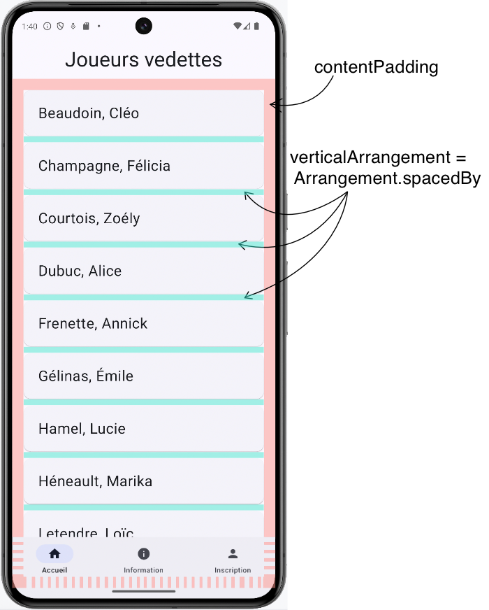
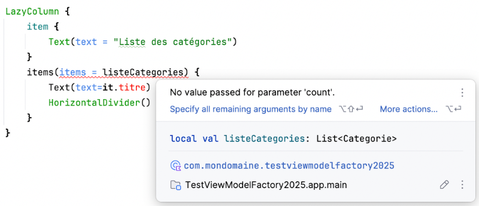

# Affichage de listes dynamiques (LazyColumn / LazyRow)


### 55.1 LazyColumn


Le composable LazyColumn() permet d'afficher une liste en composant seulement les éléments actuellement visibles à l'écran.


Ceci est efficace particulièrement dans le cas de listes qui peuvent contenir de nombreux éléments, par exemple une liste d'items tirés de la base de données.


```kotlin title="Jetpack Compose (Kotlin)"
import androidx.compose.foundation.lazy.LazyColumn
import androidx.compose.foundation.lazy.items
...
val listeCategories = categorieUiState.listeCategories
...
LazyColumn {
    // item permet d'ajouter des composables avant la liste
    item {
        Text(text = "Liste des catégories")
    }
    // items permet de boucler dans les données
    items(items = listeCategories) {
        Text(text=it.titre, modifier = Modifier.padding(15.dp))
        HorizontalDivider()
    }
}
```


### Gestion de l'espacement


Pour gérer les espaces dans la liste :


#### contentPadding : espace alentour du contenu, même si pas visible. Contrairement à un padding appliqué sur le
parent du LazyColumn, le contentPadding assure que si un item n'est visible qu'à moitié dans le bas de l'écran, il n'y aura pas de barre blanche entre ce qu'on voit et le bas de l'écran.


#### verticalArrangement = Arrangement.spacedBy : espace entre chaque élément


```kotlin title="Jetpack Compose (Kotlin)"
LazyColumn(
    contentPadding = PaddingValues(20.dp),
    verticalArrangement = Arrangement.spacedBy(12.dp)
) {
    ...
}
```





### Erreur No value passed for parameter 'count'


Si vous ajoutez un LazyColumn et que vous obtenez l'erreur « No value passed for parameter 'count' », c'est probablement dû à une erreur de import.





Pour corriger le problème, vous devez ajouter cette instruction import.


Il est possible qu'Android Studio ne l'ait pas fait même si vous avez configuré **l'ajout automatique des import**.


```kotlin title="Jetpack Compose (Kotlin)"
import androidx.compose.foundation.lazy.items
```


#### Pour plus d'information


### * [« Mises en page de base dans Compose - Grille de collections préférées : grilles différées » - Android Developers](https://developer.android.com/codelabs/jetpack-)
compose-layouts?hl=fr#7
56. Exercice 9


---
