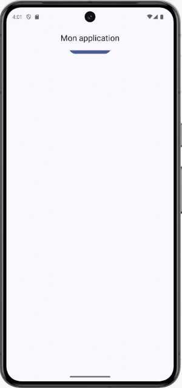
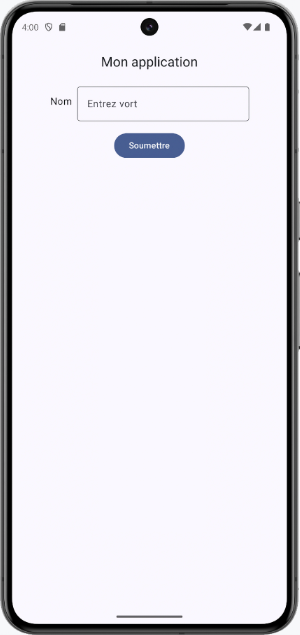
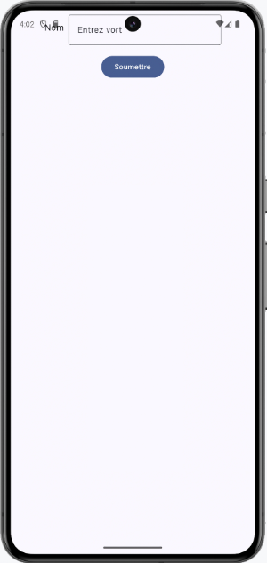
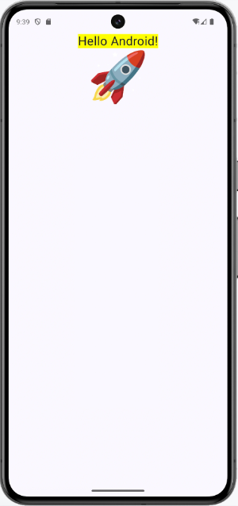
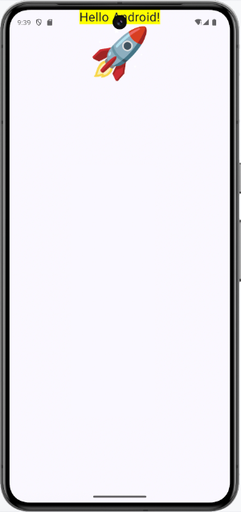
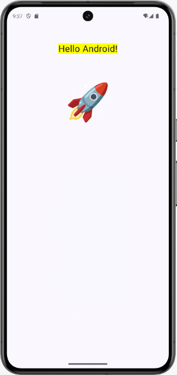
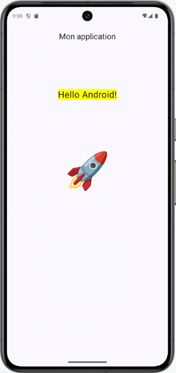

# Mise en page et Scaffold


### 27.1 Structure de l'écran avec Scaffold


Le composable Scaffold
 (qui peut être traduit par échafaud ou structure) offre des emplacement préprogrammés, notamment des barres d'application pour le
haut de l'écran (barre de titre) et pour le bas de l'écran (barre de navigation).


Dans cette fiche :


#### Emplacement du scaffold


#### Zones définies par le scaffold


#### Contenu de l'application dans un fonction modulable distincte


#### Paramètre innerPadding (ou it)


#### Modifier vs modifier


#### Un seul scaffold par application ou un scaffold par écran?


### Emplacement du scaffold


Lors de la création du projet initial, un scaffold est d'ailleurs déjà présent directement dans MainActivity.


```kotlin title="Jetpack Compose (Kotlin)"
class MainActivity : ComponentActivity() {
    override fun onCreate(savedInstanceState: Bundle?) {
        super.onCreate(savedInstanceState)
        enableEdgeToEdge()
        setContent {
            MyApplicationTheme {
                Scaffold(modifier = Modifier.fillMaxSize()) { innerPadding ->
                    Greeting(
                        name = "Android",
                        modifier = Modifier.padding(innerPadding)
                    )
                }
            }
        }
    }
}
```


Au besoin, il est possible de déplacer le Scaffold dans une fonction modulable.


```kotlin title="Jetpack Compose (Kotlin)"
class MainActivity : ComponentActivity() {
    override fun onCreate(savedInstanceState: Bundle?) {
        super.onCreate(savedInstanceState)
        enableEdgeToEdge()
        setContent {
            MyApplicationTheme {
                MainScreen()
            }
        }
    }
}
@Composable
fun MainScreen() {
    Scaffold(modifier = Modifier.fillMaxSize()) { innerPadding ->
        ...
    }
}
```


### Zones définies par le scaffold


Voici un exemple de scaffold qui définit différentes zones à l'écran.


```kotlin title="Jetpack Compose (Kotlin)"
Scaffold(
    modifier = Modifier
        ...,
    topBar = {
        ...
    },
    bottomBar = {
        ...
    },
    snackbarHost = {
        ...        
    },
    content = {
        ...
    }
)
```


Plutôt que de placer le contenu de l'application sous le paramètre content, il est possible d'ouvrir des accolades après les paramètres du scaffold pour y coder ce
contenu.


```kotlin title="Jetpack Compose (Kotlin)"
Scaffold(
    modifier = Modifier
        ...,
    topBar = {
        ...
    },
    bottomBar = {
        ...
    },
) {
    ...
}
```


### Contenu de l'application dans un fonction modulable distincte


Afin d'alléger le code, il est intéressant de placer le contenu dans sa propre fonction modulable.


Vous pouvez appeler cette fonction comme vous voulez.


Dans une application à un seul écran, MainContent est un nom intéressant.


```kotlin title="Jetpack Compose (Kotlin)"
@Composable
fun MainScreen() {
    Scaffold(
        ...
    ) {
         MainContent(...)
    }
}
@Composable
fun MainContent(...) { 
    ...
}
```


### Paramètre innerPadding (ou it)


Le contenu de l'application  (paramètre content ou partie entre accolades) reçoit automatiquement du scaffold un paramètre qui lui indique notamment la taille des
différentes  barres : barre de titre de l'application, barre de navigation de l'application et barre d'état du téléphone (celle où on retrouve l'heure et les icônes de
notification).


Ce paramètre est de type PaddingValues
.


Il est possible de nommer le paramètre comme bon vous semble, par exemple innerPadding.


```kotlin title="Jetpack Compose (Kotlin)"
Scaffold(
    ...
) { innerPadding ->
    MainContent(innerPadding)
}
```


S'il n'est pas nommé, on dira que c'est un **paramètre implicite]** et il s'appellera it.


```kotlin title="Jetpack Compose (Kotlin)"
Scaffold(
    ...
) {
    MainContent( it )
}
```


Ce paramètre, qu'il soit nommé ou non, doit obligatoirement être utilisé dans le contenu.


Dans cet exemple, il est passé en paramètre à une fonction modulable.


### Si la fonction modulable en fait bon usage, ceci assurera que le contenu de l'application ne soit pas caché sous une
des barres.


Il est à noter que même si une application n'a pas de barre de titre, ses composables pourraient être affichés sous la barre d'état du téléphone (celle où on retrouve
l'heure et les icônes de notification) si ce paramètre n'est pas correctement utilisé.


```kotlin title="Jetpack Compose (Kotlin)"
@Composable
fun MainScreen() {
    Scaffold(
        ...
    ) {
        MainContent( it )
    }
}
@Composable
fun MainContent( innerPadding: PaddingValues ) { 
    Column(
        modifier = Modifier
            .padding(innerPadding) ,
        ...
    ) {
        ...
    }
}
```


<div style="text-align: center; margin: 1.5em 0;">
  
</div>


<div style="text-align: center; margin: 1.5em 0;">
  
</div>


<div style="text-align: center; margin: 1.5em 0;">
  
</div>


Bonne utilisation du innerPadding
innerPadding pas utilisé
Aucune barre de titre et innerPadding pas utilisé


### Modifier vs modifier


Dans le code généré lors de la création d'un projet, le paramètre innerPadding n'est pas passé directement à la fonction modulable.


Plutôt, il est utilisé pour initialiser un modifieur qui, lui, est passé en paramètre.


```kotlin title="Jetpack Compose (Kotlin)"
Scaffold(modifier = Modifier.fillMaxSize()) { innerPadding ->
    Greeting(
        name = "Android",
        modifier = Modifier.padding(innerPadding)
    )
}
```


Si vous conservez cette approche dans votre projet, vous devez être conscients de la différence entre l'utilisation de Modifier (M majuscule) et modifier (m
minuscule) à l'intérieur de la fonction modulable.


Selon vous, laquelle de ces approche est correcte ?


Version A :


```kotlin title="Jetpack Compose (Kotlin)"
fun Greeting(name: String, modifier: Modifier = Modifier) {
    Column(
        modifier = modifier
            .fillMaxSize(),
        horizontalAlignment = Alignment.CenterHorizontally,
    ) {
        Text(
            text = "Hello $name!",
            modifier = modifier
                .background(Color.Yellow),
            fontSize = 25.sp
        )
        Text(
            text = "🚀",
            modifier = modifier
                .clickable {
                    // ...
                },
            fontSize = 100.sp
        )
    }
}
```


Version B :


```kotlin title="Jetpack Compose (Kotlin)"
fun Greeting(name: String, modifier: Modifier = Modifier) {
    Column(
        modifier = Modifier
            .fillMaxSize(),
        horizontalAlignment = Alignment.CenterHorizontally,
    ) {
        Text(
            text = "Hello $name!",
            modifier = Modifier
                .background(Color.Yellow),
            fontSize = 25.sp
        )
        Text(
            text = "🚀",
            modifier = Modifier
                .clickable {
                    // ...
                },
            fontSize = 100.sp
        )
    }
}
```


Version C :


```kotlin title="Jetpack Compose (Kotlin)"
fun Greeting(name: String, modifier: Modifier = Modifier) {
    Column(
        modifier = modifier
            .fillMaxSize(),
        horizontalAlignment = Alignment.CenterHorizontally,
    ) {
        Text(
            text = "Hello $name!",
            modifier = Modifier
                .background(Color.Yellow),
            fontSize = 25.sp
        )
        Text(
            text = "🚀",
            modifier = Modifier
                .clickable {
                    // ...
                },
            fontSize = 100.sp
        )
    }
}
```


Voici le visuel de chacune de ces versions.


<div style="text-align: center; margin: 1.5em 0;">
  
</div>


<div style="text-align: center; margin: 1.5em 0;">
  
</div>


<div style="text-align: center; margin: 1.5em 0;">
  
</div>


Version A
Version B
Version C


Dans la version A, chaque composable utilise le modifieur reçu en paramètre (celui avec un m minuscule). Il y a donc toujours un padding appliqué.


Le problème avec cette approche, c'est que le padding a été calculé par Jetpack Compose pour tenir compte des barres de l'application et de la barre d'état du
téléphone. Dans une application avec une barre de titre, par exemple, l'espacement devriendrait inutilement trop grand entre les composables.


Sur l'image qui suit, la fonction modulable est identique à la version A présentée plus haut. Seul le scaffold s'est vu ajouter un titre.


<div style="text-align: center; margin: 1.5em 0;">
  
</div>


Dans la version B, il n'y a aucune utilisation du modifieur reçu en paramètre. Chaque composable initialise un modifieur vierge (celui avec un M majuscule) sans tenir
compte du innerPadding calculé par Jetpack Compose. C'est pourquoi les composables se retrouvent sous la barre d'état du téléphone.


La version C est la plus intéressante. Le composable englobant (ici, c'est le Column) utilise le modifieur reçu en paramètre. Ceci assure que rien ne sera affiché sous
les barres. Les autres composables initialisent un modifieur vierge qu'ils sont libres de personnaliser selon le besoin.


### Un seul scaffold par application ou un scaffold par écran?


Il n'y pas de recommendation officielle quand au nombre de scaffold qu'on peut utiliser dans une application.


Cependant, gardez en tête que s'il n'y a qu'un seul scaffold dans l'application, la barre de titre et la barre de navigation seront définies à un seul endroit, ce qui
assurera une apparence constante entre les écrans.


#### Pour plus d'information


« Barres d'application ». Android Developer. https://developer.android.com/develop/ui/compose/components/app-bars?hl=fr


« Composants et mises en page Material - Barres d'application ». Android Developpers. https://developer.android.com/jetpack/compose/layouts/material?hl=fr#app-
bars


### « Should I use Scaffold in every screen ? what are best practices while using topBar, bottomBar, drawer, etc. in compose ». StackOverflow.
https://stackoverflow.com/questions/69060612/should-i-use-scaffold-in-every-screen-what-are-best-practices-while-using-topb
27.2 topBar


Il est possible de définir une barre de titre, située en haut de l'écran, à l'aide du **scaffold]**.


```kotlin title="Jetpack Compose (Kotlin)"
@OptIn(ExperimentalMaterial3Api::class)
@Composable
fun MainScreen() {
    Scaffold(
        topBar = {
            CenterAlignedTopAppBar (
                title = {
                    Text(text = "Mon application")
                },
            )
        }
    ) {
        MainContent(it)
    }
}
```


Notez qu'au moment d'écrire ces lignes, CenterAlignedTopAppBar et les autres fonctions pour définir la barre de titre **étaient encore expérimentales]** .


!!! warning "Attention : avec Mat"
    Attention : avec Material Design 2, la barre du haut utilisait TopAppBar. Avec Material Design 3, il faut utiliser CenterAlignedTopAppBar, SmallTopAppBar,
MediumTopAppBar ou LargeTopAppBar.


### Icônes dans une barre


La barre de titre peut également comprendre des icônes cliquables.


```kotlin title="Jetpack Compose (Kotlin)"
Scaffold(
    topBar = {
        CenterAlignedTopAppBar(
            title = {
                Text(text = "Mon application")
            },
            navigationIcon = {
                IconButton(
                    onClick = {
                        ...
                    }
                ) {
                    Icon(
                        Icons.Default.AddCircle,
                        contentDescription = "..."
                    )
                }
            },
        )
    }
) {
    MainContent(it)
}
```


<div style="text-align: center; margin: 1.5em 0;">
  
</div>


### Barre de titre en dehors d'un Scaffold?


Grâce au Scaffold, Jetpack Compose est capable de calculer l'espace qui doit être ajouté alentour du contenu principal (content) afin que ce dernier ne soit pas
caché par les barres de l'application. C'est d'ailleurs cette valeur qui apparaît comme paramètre implicite dans le contenu principal.


Si vous tentez de définir une barre de titre directement dans une application qui n'a pas de Scaffold, Jetpack Compose ne sera pas capable de calculer cet espace.


```kotlin title="Jetpack Compose (Kotlin)"
@Composable
fun MainScreen(innerPadding: PaddingValues) {
    // Si on met un CenterAlignedTopAppBar ici sans le placer dans un Scaffold,
    // il cache le texte même si le texte utilise le innerPadding puisque
    // le Scaffold n'a pas pu calculer le innerPadding nécessaire.
    CenterAlignedTopAppBar(
        title = {
            Text(text = "Mon application")
        },
    )
    Text(
        text = "Hello!",
        modifier = Modifier.padding(innerPadding)
    )
}
```


### C'est pourquoi il faut toujours définir les barres de l'application à l'intérieur d'un Scaffold.


#### Pour plus d'information


« Barres d'application ». Android Developer. https://developer.android.com/develop/ui/compose/components/app-bars?hl=fr


### « Composants et mises en page Material - Barres d'application ». Android Developpers. https://developer.android.com/jetpack/compose/layouts/material?hl=fr#app-
bars
28. Aller plus loin avec les variables d'état


---
