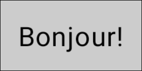
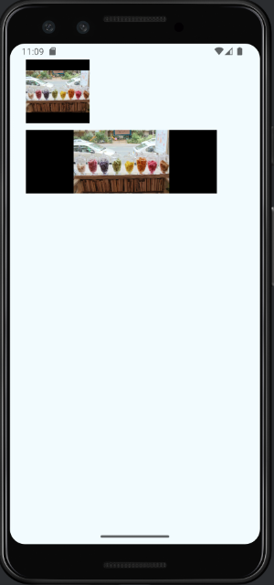
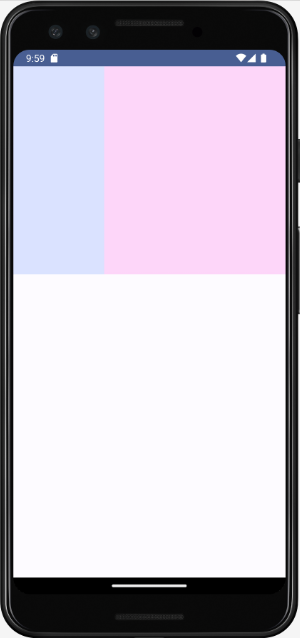
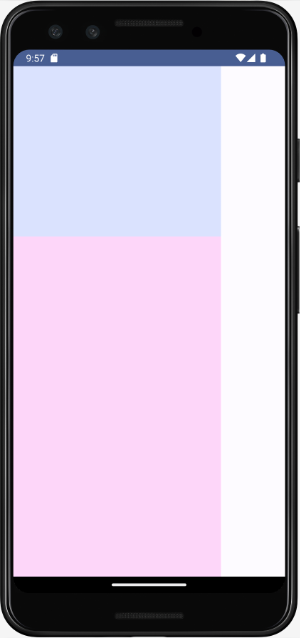

# Modificateurs (Modifiers)


### 6.1 padding()


Le modificateur .padding() est une autre façon d'ajouter de l'espace dans une interface utilisateur.


Contrairement à **Spacer()]**, qui est un composable en lui-même, .padding() est une méthode de la classe Modifier . Il doit être appliqué à un composable.


De plus, Spacer() ajoute de l'espace entre des éléments alors que .padding() ajoute de l'espace alentour de l'élément auquel il est appliqué.


.padding() doit être appliqué à la classe Modifier.


Voici quelques exemples d'utilisation.


```kotlin title="Kotlin"
Text(
    text = "Bonjour!",
    modifier = Modifier
        .background(color = Color.LightGray)
        .padding(10.dp)    // espacement égal tout autour du texte
)
```





```kotlin title="Kotlin"
Text(
    text = "Bonjour!",
    modifier = Modifier
        .background(color = Color.LightGray)
        .padding(start = 10.dp)    // espacement seulement à gauche
)
```


```kotlin title="Kotlin"
Text(
    text = "Bonjour!",
    modifier = Modifier
        .background(color = Color.LightGray)
        .padding(start = 10.dp, top = 15.dp)    // espacement à gauche et au-dessus
)
```


```kotlin title="Kotlin"
Text(
    text = "Bonjour!",
    modifier = Modifier
        .background(color = Color.LightGray)
        .padding(horizontal = 25.dp, vertical = 10.dp)
)
```


### 6.2 size()


Comme son nom l'indique, le modifieur size() permet de déterminer la taille d'un composable, par exemple une image.


Par défaut, l'image ne sera ni étirée, ni tronquée. J'ai ajouté un fond noir pour mieux illustrer comment la taille est calculée.


```kotlin title="Kotlin"
Column(
    verticalArrangement = Arrangement.spacedBy(10.dp),
    modifier = Modifier
        .padding(all = 25.dp)
) {
    Image(
        painter = painterResource(R.drawable.bonbons_paris),
        contentDescription = "Bonbons",
        modifier = Modifier
              .size(100.dp)
             .background(color = Color.Black)
     )
    Image(
        painter = painterResource(R.drawable.bonbons),
        contentDescription = "Bonbons",
        modifier = Modifier
             . size(300.dp, 100.dp)
             .background(color = Color.Black)
    )
}
```





#### Pour plus d'information


### * [« androidx.compose.foundation.layout - size » - Android Developer](https://developer.android.com/reference/kotlin/androidx/compose/foundation/layout/package-)
summary#size 6.3 style()


La méthode style() permet de préciser la typographie du texte.


Contrairement à .size(), .clip() ou .border(), pour ne nommer que ceux-là, style() ne doit pas être appliquée à la classe Modifier.


Tout comme les couleurs, la typographie peut être modifiée dans le thème.


```kotlin title="Kotlin"
Text(
    text = "Bonjour",
    style = MaterialTheme.typography.titleSmall
    modifier = Modifier(...)
)
```


### 6.4 .background()


Le modifieur .background() permet de spécifier la couleur de fond d'un composable.


.background() doit être appliqué à la classe Modifier.


```kotlin title="Kotlin"
Row(
    modifier = Modifier
        ...
        .background(color = MaterialTheme.colorScheme.tertiary)
) {
    Text(...)
}
```


### 6.5 .weight()


Le modifieur .weight() permet de spécifier le poids d'un composable dans une ligne ou une colonne.


S'il est utilisé dans une ligne, le poids aura une incidence sur la largeur du composable.


Je vous fais la démonstration ici à l'aide du composable Surface. Il aurait été possible d'appliquer le modifieur .weight() à d'autres composables, par exemple à une image.


Dans cet exemple, j'ai imposé une taille pour que chaque surface ait une certaine hauteur même si je n'y ai ajouté aucun contenu.


```kotlin title="Kotlin"
Row() {
    Surface(
        modifier = Modifier
            .weight(weight = 1f)
            .size(300.dp),
        color = MaterialTheme.colorScheme.primaryContainer,
    ) {
        // ...
    }
    Surface(
        modifier = Modifier
            .weight(weight = 2f)
            .size(300.dp),
        color = MaterialTheme.colorScheme.tertiaryContainer
    ) {
        // ...
    }
}
```





Si le poids est donné dans une colonne, il affectera la hauteur du composable.


```kotlin title="Kotlin"
Column() {
    Surface(
        modifier = Modifier
            .weight(weight = 1f)
            .size(300.dp),
        color = MaterialTheme.colorScheme.primaryContainer,
    ) {
        // ...
    }
    Surface(
        modifier = Modifier
            .weight(weight = 2f)
            .size(300.dp),
        color = MaterialTheme.colorScheme.tertiaryContainer
    ) {
        // ...
    }
}
```





### 6.6 .clickable()


Le modifieur clickable() permet de réagir à un clic sur différents éléments visuels, par exemple un texte ou une image.


```kotlin title="Jetpack Compose (Kotlin)"
Image(
    painter = painterResource(id = R.drawable.mon_image),
    modifier = Modifier.clickable {
        Log.d("*****", "L'image a été cliquée!")
    },
    contentDescription = "Mon image",
)
```


ou


```kotlin title="Jetpack Compose (Kotlin)"
Image(
    painter = painterResource(id = R.drawable.mon_image),
    modifier = Modifier.clickable(
        onClick = {
            Log.d("*****", "L'image a été cliquée!")
        },
        onClickLabel = "..."
    ),
    contentDescription = "Mon image",
)
```


#### Pour plus d'information


* [« Using the Clickable Modifier in Jetpack Compose » - DeveloperMemos](https://developermemos.com/posts/jetpack-compose-clickable)


### 6.7 Modifieur conditionnel


Avec Jetpack Compose, il est possible de déclarer un modifieur dont la valeur dépend d'une condition.


Malheureusement, l'opérateur ternaire n'existe pas en Kotlin. Qu'à cela ne tienne, il est possible de travailler avec un if régulier.


```kotlin title="Jetpack Compose (Kotlin)"
Box(
    modifier= Modifier
        .background( if (...) {Color.Blue} else {Color.Red} ),
)
```


La syntaxe suivante permet d'ajouter un modifieur seulement lorsqu'une condition est rencontrée sans avoir à répéter les autres modifieurs.


```kotlin title="Jetpack Compose (Kotlin)"
Box(
    modifier= Modifier
        .size(100.dp)
        .background(Color.Yellow)
        .let { modifier ->
            if (...) {
                modifier.clickable {   // le composable ne sera cliquable que si la condition est rencontrée
                    faireQuelqueChose()
                }
            }
            else {
                modifier // si la condition est fausse, on conserve le modifieur original
            }
        }
)
```


## 7. Dépannage (troubleshooting)


---
