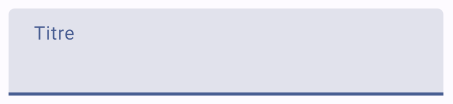
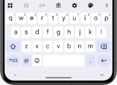
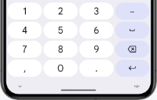
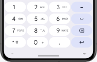
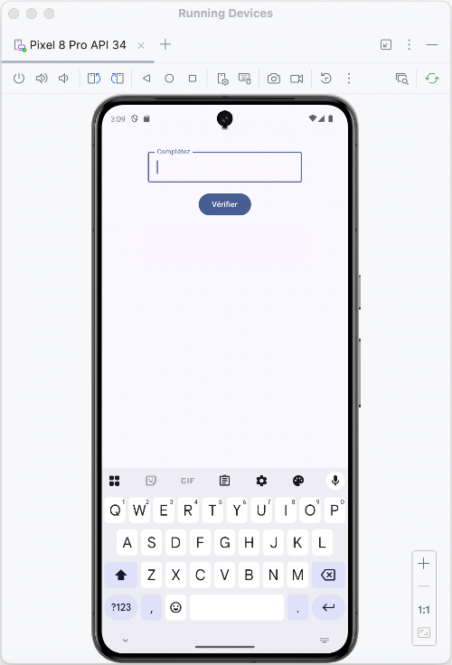

# Saisie de texte et clavier virtuel


### 22.1 TextField() et OutlinedTextField()


Une case de saisie peut être ajoutée à l'aide du composble TextField()
 ou de OutlinedTextField()
.


Pour que le texte entré dans une boîte de saisie soit affiché dans la boîte, il faut que sa valeur provienne d'une variable d'état.


Dans cette fiche :


#### TextField


#### OutlinedTextField


#### supportingText


#### Type de clavier


#### TextField ou OulinedTextField avec ViewModel


### TextField


Le TextField, dans sa plus simple expression, va comme suit :


```kotlin title="Jetpack Compose (Kotlin)"
var titre by rememberSaveable { mutableStateOf("") }   // la variable d'état pourrait aussi faire partie du ViewModel
 
TextField(
    value = titre ,
    onValueChange = { titre = it },
    label = { Text("Titre") }
)
```


Remarquez l'utilisation de **rememberSaveable]**. Si vous débutez avec Jetpack
Compose, vous aurez sans doute appris à déclarer les variables d'état avec remember. Dès que vous avancerez dans vos apprentissages, vous comprendrez
pourquoi il est préférable d'utiliser rememberSaveable pour la valeur d'une case de saisie.


Voici le TextField vide puis avec focus ou rempli.


### OutlinedTextField


Voici le même exemple mais avec un OutlinedTextField.


```kotlin title="Jetpack Compose (Kotlin)"
var titre by rememberSaveable { mutableStateOf("") }
 
OutlinedTextField(
    value = titre,
    onValueChange = { titre = it },
    label = { Text("Titre") }
)
```


La différence entre TextField et OutlinedTextField est au niveau de l'apparence.


Voici le OutlinedTextField vide puis avec focus ou rempli.





### supportingText


Depuis Jetpack Compose 1.3, il est possible d'ajouter un texte d'accompagnement sous la boîte de saisie.


Dans la forme la plus simple, un texte statique sera affiché. Mais puisque le code est entre accolades, ceci ouvre la porte à une panoplie de possibilités afin
d'afficher un texte contextualisé.


```kotlin title="Jetpack Compose (Kotlin)"
var titre by rememberSaveable { mutableStateOf("") }
 
OutlinedTextField(
    value = titre,
    onValueChange = { titre = it },
    label = { Text("Titre") },
    supportingText = { Text("Max. 10 caractères") }
)
```


### Type de clavier


Afin d'améliorer l'expérience utilisateur, il est important de spécifier le type de clavier virtuel selon le rôle de la case de saisie.


Les principaux types de clavier sont :


#### Text (par défaut)


#### Number


#### Decimal (dans derniers tests effectués, était identique à Number)


#### Email (semblable à Text mais la virgule est remplacée par un @)


#### Password (lettres et chiffres dans un même écran)


#### Phone (chiffres avec lettres imprimées sur les touches correspondantes - ex : 2 ABC)


#### Uri (semblable à Text mais la virgule est remplacée par un /)











KeyboardType.Text
KeyboardType.Number
KeyboardType.Email
KeyboardType.Password
KeyboardType.Phone


Pour spécifier le type clavier désiré :


```kotlin title="Jetpack Compose (Kotlin)"
TextField(
    ...,
    keyboardOptions = KeyboardOptions
(keyboardType
 = KeyboardType.Number)
)
```


### TextField ou OulinedTextField avec ViewModel


Dans une application qui utilise un **ViewModel comme conteneur d'état]**, la
syntaxe d'une case de saisie sera légèrement différente.


Notez que j'ai utilisé ici un ViewModel de type HomeViewModel mais la classe du ViewModel pourrait porter un autre nom dans votre application.


```kotlin title="Fonction composable (Kotlin)"
@Composable
fun monComposable() {
    val viewModel: HomeViewModel = viewModel()
    val uiState by viewModel.uiState.collectAsState()
    ...
    TextField(
        value = uiState.nom ,
        onValueChange = {
             viewModel.ajusterNom(it)
        },
        ...
    )
    ...
}
```


Et dans le ViewModel (dans cet exemple, le uiState est un flux observable, d'où la nécessité d'utiliser _uiState.update) :


```kotlin title="ViewModel (Kotlin)"
class HomeViewModel: ViewModel() {
    ...
    fun ajusterNom(valeur: String) {
        _uiState.update {
            it.copy (
                _nom = valeur
            )
        }
    }
}
```


#### Pour plus d'information


* [« Handle user input » - Android Developers](https://developer.android.com/jetpack/compose/text/user-input)


* [« Jetpack Compose Basics - How to use text field composables to meet the Material design specification » - Good Request](https://www.goodrequest.com/blog/jetpack-compose-basics-text-input)


* [« Textfields » - Material Design 3](https://m3.material.io/components/text-fields/overview)


* [« androidx.compose.material3 - TextField » - Android Developers](https://developer.android.com/reference/kotlin/androidx/compose/material3/package-)
summary#textfield


### * [« androidx.compose.material3 - OutlinedTextField » - Android Developers](https://developer.android.com/reference/kotlin/androidx/compose/material3/package-)
summary
23. Exercice 2


---


### 26.1 Clavier virtuel de l'émulateur


Quand vous lancez une application dans l'émulateur d'Android Studio, il peut arriver que le clavier virtuel ne soit pas visible. À ce moment, seul le clavier physique de
votre ordinateur peut interagir avec l'émulateur.


Je vous présente ici deux techniques pour faire apparaître le clavier virtuel dans l'émulateur.


!!! warning "Attention : quand vo"
    Attention : quand vous testez une application, le clavier virtuel disparaîtra dès que vous appuyez sur une touche du clavier. Pour tester comme sur un téléphone
physique, vous devez utiliser exclusivement le clavier virtuel.


### Afficher le clavier virtuel automatiquement


Si vous souhaitez toujours tester votre application telle qu'elle apparaîtrait sur un téléphone physique, vous pouvez ajouter une configuration dans le fichier


AndroidManifest.xml .


```xml title="Fichier app/src/main/AndroidManifest.xml"
<manifest ...>
    <application ...>
        <activity
            android:name=".MainActivity"
            android:windowSoftInputMode="stateAlwaysVisible|adjustResize"
            ...>
        </activity>
    </application>
</manifest>
```


Le clavier virtuel apparaîtra automatiquement lorsque requis, par exemple quand l'usager mettra le focus dans une case de saisie.





### Afficher le clavier virtuel manuellement


Si vous souhaitez faire apparaître le clavier virtuel seulement au besoin, n'ajoutez pas l'instruction windowSoftInputMode dans le fichier AndroidManifest.xml .


Plutôt, quand vous lancerez l'application dans l'émulateur, vous cliquerez sur le menu rond qui apparaît au centre gauche de l'écran quand une case de saisie a le
focus.


L'option Show on-screen keyboard fera apparaître le clavier virtuel.


#### Pour plus d'information


### * [« Gérer la visibilité du mode de saisie » - Android Developer](https://developer.android.com/develop/ui/views/touch-and-input/keyboard-input/visibility?hl=fr)
26.2 Cacher le clavier virtuel


Lorsqu'un usager clique sur une zone d'édition dans une application Android, le clavier virtuel apparaît automatiquement.


Si ce comportement est généralement souhaitable, il peut arriver que ce clavier cache une partie importante de l'écran. D'où l'importance de pouvoir le cacher
lorsqu'il n'est plus utile.


Une technique intéressante pour y arriver conciste à enlever le focus de la zone d'édition.


```kotlin title="Jetpack Compose (Kotlin)"
val focusManager = LocalFocusManager.current
Button(
    onClick = {
        ...
        focusManager.clearFocus()
    }
) {
    Text(text = "Terminer")
}
```


Il est également possible de travailler directement avec un contrôleur de clavier et de lui demander de cacher le clavier.


```kotlin title="Jetpack Compose (Kotlin)"
val keyboardController = LocalSoftwareKeyboardController.current
Button(
    onClick = {
        ...
        keyboardController?.hide()
    }
) {
    Text(text = "Terminer")
}
```


#### Pour plus d'information


* [« Keyboard handling in Jetpack Compose » - dev.to](https://dev.to/tkuenneth/keyboard-handling-in-jetpack-compose-2593)


### * [« Hide and Show Virtual Keyboard in Jetpack Compose » - Medium](https://medium.com/@RJnr6/hide-and-show-virtual-keyboard-in-jetpack-compose-)
11b0da3e862f
27. Scaffold


---
