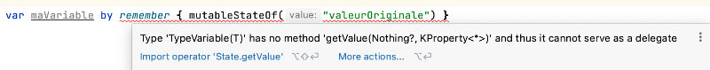

# Gestion de l'état dans Jetpack Compose


### 21.1 Les variables d'état


Dans un projet Android avec Jetpack Compose, la vue est rafraîchie à chaque fois qu'une variable d'état change de valeur. Ce concept s'appelle la programmation
réactive
.


Jetpack Compose est donc un cadre d'application réactif au même titre que React ou encore SwiftUI.


Pour déclarer une variable d'état dans Jetpack Compose :


```kotlin title="Kotlin"
var maVariable by remember { mutableStateOf("valeurOriginale") }
```


Il est possible de spécifier le type si désiré :


```kotlin title="Kotlin"
var maVariable: String by remember { mutableStateOf("valeurOriginale") }
```


Important : avec cette syntaxe qui utilise les mots by remember, vous devez ajouter deux instructions import.


```kotlin title="Kotlin"
import androidx.compose.runtime.getValue
import androidx.compose.runtime.setValue
```


Ceci est nécessaire puisque la syntaxe by remember vous permettra d'accéder directement à la variable par son nom.


Dans l'expression by remember, le mot-clé by s'appelle délégué de propriété (en anglais, delegated property
).


Il aurait également été possible d'omettre le mot-clé by.


À ce moment, plus besoin des deux import. Cependant, la variable créé serait alors de type MutableState<...> et pour accéder à sa valeur, il faudrait faire suivre
son nom par .value.


Si vous utilisez la syntaxe by remember et que vous oubliez les deux import, vous obtiendrez l'erreur « Type 'TypeVariable(T) has no method 'getValue(Nothing?,
KProperty<*>)' and thus it cannot serve as a delegate ».


<div style="text-align: center; margin: 1.5em 0;">
  
</div>


!!! warning "Attention : si vous "
    Attention : si vous désirez utiliser une liste d'objets comme variable d'état, vous devez apporter quelques ajustements à votre code comme démontré sur cette
fiche : « **mutablelistof_comme_variable_d_etat** ».


#### Pour plus d'information


« What does 'by' keyword do in Kotlin? ». StackOverflow. https://stackoverflow.com/questions/38250022/what-does-by-keyword-do-in-kotlin


### 21.2 Où déclarer les variables d'état?


Avec Jetpack Compose, si l'application n'utilise pas les **ViewModels]**, les
variables d'état doivent être déclarées dans une fonction modulable.


La plupart du temps, elles seront déclarées dans la toute première fonction modulable. Cette fonction peut porter n'importe quel nom. Cependant, on lui donnera
souvent le nom MainScreen.


```kotlin title="Kotlin"
class MainActivity : ComponentActivity() {
    override fun onCreate(savedInstanceState: Bundle?) {
        super.onCreate(savedInstanceState)
        setContent {
            MonApplicationTheme {
                Scaffold(
                    modifier = Modifier
                        .fillMaxSize(),
                    content = { innerPadding ->
                        MainScreen (innerPadding)
                    }
                )
            }
        }
    }
}
@Composable
fun MainScreen (innerPadding: PaddingValues) {
     var maVariableDEtat: String by remember { mutableStateOf("") }
    ...
}
```


### Dans le cas où une autre fonction modulable doit utiliser la même variable d'état, il faudra utiliser une technique nommée **hissage d'état]**.
21.3 Où peut-on modifier la valeur d'une variable d'état


Il faut faire attention à l'endroit où la modification d'une variable d'état est effectuée. Ceci ne doit jamais être fait directement dans un composable.


### Une variable d'état doit être modifiée en réponse à un événement, par exemple un clic sur un bouton.


Si vous effectuez la modification à un endroit inapproprié, l'application aura un fonctionnement erratique.


Selon la documentation officielle de Android Developers
 :


### La couche de l'UI ne doit jamais changer d'état en dehors d'un gestionnaire d'événements, car cela


### peut entraîner des incohérences et des bugs dans votre application.


Par exemple, dans l'application mal codée présentée plus bas, dès qu'un caractère est entré dans la boîte de saisie, l'heure est réinitialisée puis réaffichée dans une
boucle infinie. Ceci n'est pas acceptable :-o


Ce comportement s'explique comme suit :


#### L'entrée d'un caractère modifie la valeur de la variable d'état valeur, ce qui cause la recomposition du composable
qui lit cette variable d'état, soit MainScreen().


#### Ceci cause une nouvelle initialisation de l'heure.


#### Puisque l'heure est une variable d'état, ceci cause une recomposition du composable qui lit l'heure, soit
MainScreen(). Et voilà, la boucle est partie!


```kotlin title="Jetpack Compose (Kotlin)"
@Composable
fun MainScreen() {
    var valeur by remember { mutableStateOf("") }
    var heure by remember { mutableStateOf( "" ) }
    heure = LocalDateTime.now().toString()
    Column {
        TextField(
            value = valeur,
            onValueChange = { newText ->
                valeur = newText
            }
        )
        Text(text = heure)
    }
}
```


> **Source** : 

### 1. « Structurer votre interface utilisateur Compose - Les événements dans Compose ». Android Developers.
https://developer.android.com/jetpack/compose/architecture?hl=fr#architecture-events


## 22. Case de saisie


---


### 43.1 Survivre à la recréation de l'activité


Avez-vous déjà essayé de changer l'orientation du téléphone alors qu'une petite application qui utilise une variable d'état est en  cours d'exécution?


Prenons cet exemple :


```kotlin title="Jetpack Compose (Kotlin)"
class MainActivity : ComponentActivity() {
    override fun onCreate(savedInstanceState: Bundle?) {
        super.onCreate(savedInstanceState)
        enableEdgeToEdge()
        setContent {
            MonApplicationTheme {
                Scaffold(modifier = Modifier.fillMaxSize()) { innerPadding ->
                    MainScreen(
                        modifier = Modifier.padding(innerPadding)
                    )
                }
            }
        }
    }
}
@Composable
fun MainScreen(modifier: Modifier = Modifier) {
    var nombre by remember { mutableStateOf(0) }
    Column(
        modifier = modifier
            .fillMaxSize(),
        horizontalAlignment = Alignment.CenterHorizontally,
        verticalArrangement = Arrangement.Center
    ) {
        Row(
            verticalAlignment = Alignment.CenterVertically,
            horizontalArrangement = Arrangement.spacedBy(20.dp)
        ) {
            Button(
                onClick = { nombre = nombre + 1 }
            ) {
                Text("Incrémenter")
            }
            Text(
                text = "$nombre",
                fontSize = 40.sp,
            )
        }
    }
}
```


Quand on change l'orientation du téléphone pour le mettre en position horizontale, la variable d'état revient à sa valeur originale.


0:00 / 0:09


C'est parce que remember permet de survivre seulement aux recompositions.


Quand on change l'orientation du téléphone, c'est tout l'objet MainActivity qui est détruit puis recréé. Lors de la recréation, les variables d'état déclarées avec
remember sont réinitialisées.


### Survivre à la recréation de l'activité


Il existe différentes techniques pour survivre à la recréation d'une activité.


### rememberSaveable


Pour régler ce problème dans une petite application, il suffit de déclarer avec rememberSaveable
 les variables d'état qui doivent conserver leur valeur lors de la
recréation de l'activité.


```kotlin title="Jetpack Compose (Kotlin)"
var nombre by rememberSaveable { mutableStateOf(0) }
```


Lorsque vous voyez du code dans des notes de cours, sur le Web ou suggéré par une IA, il arrive fréquemment que les extraits de code soient donnés avec
remember plutôt que rememberSaveable.


La raison première est pédagogique : remember est un concept plus simple. Donc, rememberSaveable est généralement introduit plus tard pour aider à
comprendre ce que chacun fait.


### Contexte où l'utilisation de remember est correcte


Dans certains contextes, il est préférable d'utiliser remember, notamment parce qu'il est moins exigeant au niveau des ressources.


Voici des contextes où il est correct d'utiliser remember :


#### variable d'état qui retient si une initialisation est en cours ou non : l'initialisation devra être refaite lors du changement
d'orientation alors il est correct que la variable d'état reprenne sa valeur de départ.


#### snackbarHostState : on s'attend à ce qu'un Snackbar ne survive pas à un changement d'orientation.


#### objet non sérialisable : rememberSaveable requiert que la variable soit sérialisable afin de permettre sa conservation
lors de la destruction de l'activité. Certaines classes, par exemple ExoPlayer, ne sont pas sérialisables.


### Il est de votre responsabilité de choisir correctement entre remember et rememberSaveable selon le contexte.


### ViewModel


### Dès qu'une application prend un peu d'envergure, il est préférable de travailler avec un **ViewModel]**.
44. Le ViewModel


---
