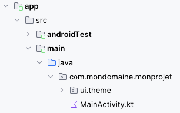
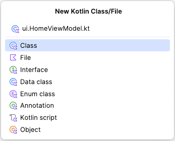
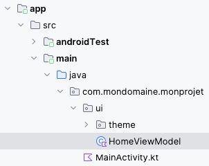

# Architecture avec ViewModel


### 44.1 Ajouter un fichier directement dans le dossier ui


Dans un projet Jetpack Compose de base, Android Studio montre les dossiers ui et theme fusionnés puisqu'il n'y a rien d'autre que le dossier theme sous ui .





Si vous désirez ajouter un fichier directement dans le dossier ui  :


#### Faites un clic droit sur le dossier parent ( monprojet )


#### Choisissez  New / Kotlin Class/File .


#### Nommez le fichier en débutant par ui suivi d'un point (ex : ui.HomeViewModel.kt).





Le fichier sera correctement créé sous le dossier ui .





### 44.2 class vs data class


Avec Kotlin, il est possible d’utiliser le mot-clé *data* pour déclarer une classe dont le but premier est de stocker des données.


```kotlin title="Kotlin"
data class MaClasse(
    var unChamp: Int,
    var unAutreChamp: String
)
```


L'avantage, c'est que certaines méthodes sont automatiquement créées pour vous aider à manipuler ces données, par exemple *hashcode(), equals(), copy() et toString()*.


Pour instancier un objet de cette classe :


```kotlin title="Kotlin"
val monObjet = MaClasse(1, "Une donnée")
```


#### Pour plus d'information


* [« Data classes » - Kotlin](https://kotlinlang.org/docs/data-classes.html)


### * [« Kotlin data class — Behind the mask » - Medium](https://proandroiddev.com/kotlin-data-class-behind-the-mask-51a05ad92ae9)

## 44.3 Le ViewModel comme conteneur d'état


Selon la documentation Android :


>La classe ViewModel est une logique métier ou un conteneur d'état au niveau de l'écran. Elle expose l'état au niveau de l'UI et encapsule la logique métier associée. Son principal avantage est qu'elle assure la mise en cache et la persistance de l'état en cas de modification de la configuration.

On dira que le ViewModel est la source unique de vérité ou source unique de référence ou, en anglais, *Single Source Of Truth* (SSOT).

L'utilisation d'un ViewModel dans une application Android facilitera notamment la gestion de données en provenance d'une base de données.

Mais avant de se lancer dans la gestion d'une base de données, regardons comment utiliser le ViewModel dans une application sans BD.


Dans cette fiche :


#### Création du ViewModel


#### Propriétés


#### Propriétés de support


#### Création de la classe UiState


#### Logique métier


#### Accéder à une variable d'état dans le ViewModel


#### Mise à jour de l'état


#### Accéder au ViewModel dans MainActivity


#### Instancier le ViewModel dans un composable plutôt que dans la classe MainActivity


#### Ajustements pour le Preview


### Création du ViewModel


Lorsqu'on travaille avec un ViewModel, on n'aura plus de variables d'état déclarées directement dans les composables.


Chacun des ViewModels de l'application sera placé dans un dossier nommé *ui*  et portera un nom qui se termine par ViewModel.


Le dossier *ui* est au même niveau que le fichier *MainActiviy.kt* , par exemple *app/src/main/java/com/monnom/monprojet/ui/HomeViewModel.kt* .


Un ViewModel est simplement une classe qui hérite de la classe *ViewModel*.

```kotlin title="Fichier ui/HomeViewModel.kt"
import androidx.lifecycle.ViewModel
class HomeViewModel : ViewModel() {
    ...
    // constructeur (à utiliser au besoin)
    init {
        ...
    }
}
```

### Propriétés


La classe comprendra une propriété pour chacune des informations qu'elle doit conserver.


Pour que la modification d'une propriété cause le rafraîchissement de la vue, il faut la déclarer en tant que **variable d'état**.

Ici, pas besoin du mot-clé *remember* puisque la classe ne sera pas réinstanciée à chaque recomposition ni lors de la recréation de l'activité.

Notez que lorsqu'il n'y a aucun spécificateur d'accès, une propriété est considérée publique.

> Ne pas prendre le Le code ci-dessous comme exemple, je vous présente une technique plus intéressante plus bas.

```kotlin title="Fichier ui/HomeViewModel.kt"

// Exemple à ne pas utiliser dans le cadre de ce cours. Voir plus bas pour la technique recommandée.
class HomeViewModel : ViewModel() {
    val points: MutableState<Int> = mutableStateOf(0)
    val partieTerminee: MutableState<Boolean> = mutableStateOf(false)
    ...
}

```


### Propriétés de support


Il est conseillé de créer des propriétés privées. Chaque propriété utilisera une propriété de support (*backing property*) pour fournir une valeur au monde extérieur.


### Par convention, le nom d'une propriété privée débute par une barre en bas (_). Son vis-à-vis public porte le même nom mais sans la barre en bas.


Ici encore, on préférera utiliser la technique présentée plus bas.


```kotlin title="Fichier ui/HomeViewModel.kt"
// Exemple à ne pas utiliser dans le cadre de ce cours. Voir plus bas pour la technique recommandée.
class HomeViewModel : ViewModel() {
    private val _points: MutableState<Int> = mutableStateOf(0)
    val points: Int
        get() {
            if (_points.value >= 0) {
                return _points.value
            }
            else {
                return 0
            }
        }
    ...
} 
```


### Création de la classe UiState


La technique recommandée pour déclarer les variables d'état du ViewModel consiste à utiliser une classe spécialisée pour gérer ces valeurs.


Puisque ces valeurs sont rattachées à l'état de l'interface utilisateur (UiState), la classe portera un nom qui se termine par *UiState*.


Le ViewModel utilisera une instance de cette classe comme variable d'état.

> Dans le cadre de ce cours, un ViewModel qui n'utilise pas le UiState de façon appropriée ne sera pas accepté.

Cette classe, qui est en fait une **classe de données** peut être déclarée dans le même fichier que le ViewModel.


Afin d'améliorer les performances de l'application , les propriétés de la classe UiState doivent être déclarées avec *val* (lecture seulement) et non avec *var*.


```kotlin title="Fichier ui/HomeViewModel.kt"
class HomeViewModel : ViewModel() {
    ...
}
data class HomeUiState (
    private val _points: Int = 0,
    private val _partieTerminee: Boolean = false,
    private val _autreVariable: String = ""
) {
    val points: Int
        get() {
            if (_points >= 0) {
                return _points
            } else {
                return 0
            }
        }
    val partieTerminee: Boolean
        get() {
            return _points >= 5
        }
    val autreVariable: String
        get() {
            return _autreVariable
        }
}
```


Notez que dans le UiState, les variables peuvent avoir un get() mais pas de set() car ce sont les méthodes de logique métier du ViewModel qui sont en charge de modifier l'état de façon sûre (thread safe).

On peut désormais ajouter au ViewModel une propriété, nommée ici *_uiState*, qui fait référence à une instance de cette classe plutôt qu'une liste de propriétés distinctes.

Cette propriété est de type *MutableStateFlow*, c'est-à-dire un **flux observable** dont la valeur peut être modifiée.

La propriété privée *_uiState* pourra être modifiée à l'intérieur de la classe HomeViewModel à l'aide de _uiState.update().

Le ViewModel comprend une seconde propriété, nommée ici *uiState*. Cette fois, il s'agit d'une propriété publique.

La propriété uiState est immuable grâce à l'utilisation de .asStateFlow(). Il s'agit donc d'un flux en lecture seule. Sa valeur est toujours basée sur celle de _uiState.

Important : sans le .asStateFlow(), l'objet sous-jacent serait toujours un MutableStateFlow donc il pourrait être modifié ailleurs que dans le ViewModel.

```kotlin title="Fichier ui/HomeViewModel.kt"
class HomeViewModel : ViewModel() {
    private val _uiState = MutableStateFlow(HomeUiState())
    val uiState: StateFlow<HomeUiState> = _uiState.asStateFlow()
    ...
}
```

Remarque : il n'est pas toujours requis de travailler avec un flux. J'ai utilisé cette approche ici puisque prochainement, nous aurons besoin d'un flux lorsque nous créerons un **ViewModel qui interagit avec une base de données**.

Dans un projet qui n'a pas besoin de flux pour les variables d'état, le ViewModel pourrait faire référence au uiState comme suit :


```kotlin title="Fichier ui/HomeViewModel.kt"
// Incorrecte : ne pas utiliser dans le cadre de ce cours
var uiState by mutableStateOf(HomeUiState())
    private set
```


Étant donné qu'on utilisera prochainement le ViewModel avec Room pour accéder à une base de données et qu'on désire être réactif quand les données de la BD changent, il est plus simple d'utiliser la syntaxe avec flux tout de suite.

> Le travail avec uiState sans flux n'est pas accepté dans le cadre de ce cours à moins d'avis contraire.

### Logique métier

Grâce aux ViewModels, il est possible de coder au même endroit toute la logique métier, séparément du code qui gère l'interface utilisateur.

On ajoutera au ViewModel (et non au UiState) une méthode pour chaque opération sur les données.

Ces méthodes sont le seul endroit où les variables d'état peuvent être modifiées.

Évidemment, il ne doit pas y avoir de composables dans le ViewModel. Le ViewModel gère des données mais ne fait pas d'affichage.


### Accéder à une variable d'état dans le ViewModel


Si le ViewModel a besoin de connaître la valeur d'une propriété du UiState, il doit utiliser uiState.value.nomPropriete.


Le mot-clé value est requis puisque la variable uiState est un flux. C'est un flux et non la valeur qu'il contient. uiState.value permet d'obtenir la valeur courante de ce flux.


```kotlin title="Fichier ui/HomeViewModel.kt"
class HomeViewModel : ViewModel() {
    private val _uiState = MutableStateFlow(HomeUiState())
    val uiState: StateFlow<HomeUiState> = _uiState.asStateFlow()
    
    fun jouer() {
        if (! uiState.value.partieTerminee ) {
            ...
        }
    }
}
```


### Mise à jour de l'état

Ce sont les méthodes du ViewModel qui doivent se charger de modifier la variable d'état _uiState.

Pour mettre à jour l'état de façon sécuritaire dans un environnement avec plusieurs fils d'exécution, il faut utiliser _uiState.update.

À l'intérieur de cette méthode, il faudra effectuer une copie du UiState pour que Jetpack Compose soit informé de la modification de l'état.

La copie utilisera un paramètre implicite nommé *it*, qui représente l'objet *_uiState*.

On peut d'ailleurs voir ce paramètre dans l'IDE :


Voici un exemple de logique métier qui met à jour l'état :


```kotlin title="Fichier ui/HomeViewModel.kt"
class HomeViewModel : ViewModel() {
    private val _uiState = MutableStateFlow(HomeUiState())
    val uiState: StateFlow<HomeUiState> = _uiState.asStateFlow()
    
     fun jouer() {
        // technique thread-safe pour mettre à jour l'état
        // Attention : le update ne suspend pas l'exécution du thread.
        // Il n'est pas garanti qu'il soit terminé avant l'exécution des lignes de code qui viennent après.
        if (...) {
             _uiState.update {
                it.copy (
                    _points = it.points + 1
                )
            }
        }
    }
}
```


### Modifier un tableau


Dans le cas particulier d'un tableau déclaré avec List<...> dans ale UiState, il faudra prendre une précaution supplémentaire car à la base, il est immuable.

On le transformera en tableau modifiable auquel on applique une instruction.


```kotlin title="Fichier ui/HomeViewModel.kt"
class HomeViewModel : ViewModel() {
    ...
    _uiState.update {
        it.copy (
             _monTableau = it.monTableau.toMutableList().apply { this[indice] = ... }
        )
    }
}
data class HomeUiState(
    private val _monTableau: List<String> = listOf(...),
    ...
}
```


>Attention : pour ajouter un élément au tableau, la méthode il n'est pas possible de faire  _monTableau = it.monTableau.toMutableList.add(...)  puisque la méthode add() retourne un booléen. et non le tableau modifié. Il faut plutôt utiliser la méthode apply{} pour effectuer l'ajout et retourner le tableau modifié.


Vous devrez plutôt faire ceci :


```kotlin title="Fichier ui/HomeViewModel.kt"
_uiState.update {
    it.copy (
        _monTableau = it.monTableau.toMutableList().apply { add(...) }
    )
}
```


### Modifier plusieurs variables


Pour modifier plusieurs variables, il faut faire le traitement dans un seul it.copy() et ajouter une virgule entre les instructions.


```kotlin title="Fichier ui/HomeViewModel.kt"
_uiState.update {
    it.copy (
        _points = it.points + 1 ,
        _autreChose = autreValeur
    )
}
```


### Accéder au ViewModel dans MainActivity


L'application peut désormais travailler avec le conteneur d'état.

Il doit y avoir une seule instance du ViewModel dans l'application.

Une variable, nommée ici viewModel, sera instanciée dans la classe MainActivity et elle sera passée en paramètre à ses descendants.

Notez qu'il est déconseillé de passer un ViewModel en paramètre à des fonctions modulables . Cependant, dans le cadre de ce cours, cette pratique est autorisée afin de faciliter votre travail.

Une variable *uiState* sera initialisée dans chacun des composables où elle est requise, en utilisant le ViewModel reçu en paramètre. Avant de pouvoir l'utiliser, il faut lui appliquer la méthode *collectAsState()* qui se charge recueillir les valeurs d'un flux (Flow ) et de représenter la dernière valeur émise en tant que variable d'état.


```kotlin title="Fichier MainActivity.kt"
class MainActivity : ComponentActivity() {
    // instanciation du ViewModel
    private val _viewModel: HomeViewModel by viewModels()
    override fun onCreate(savedInstanceState: Bundle?) {
        super.onCreate(savedInstanceState)
        setContent {
            MonProjetTheme {
                MainScreen( _viewModel )
            }
        }
    }
}
@Composable
fun MainScreen( viewModel: HomeViewModel ) {
    // création d'un observateur de l'état
    val uiState by viewModel.uiState.collectAsState()
    ...
    Button(
        onClick = {
            viewModel.jouer()
        }
    ) {
        Text(text = "Jouer")
    }
    Text(text = "points: " + uiState.points )
    ...
}
```


Grâce à collectAsState(), l'interface utilisateur (UI) sera rafraîchie quand une variable du ViewModel est mise à jour.


Le code qui suit est réservé aux fonctions non composables, par exemple dans une méthode du cycle de vie (onStop, onPause, ...). Il permet de connaître les valeurs du uiState au moment actuel mais ne demeure pas à l'écoute pour les actualiser lorsqu'elles sont modifiées.


Si on avait utilisé ce code dans un composable, on n'aurait vu aucun changement à l'écran. De plus, on aurait reçu l'avertissement « StateFlow.value should not be called within composition ».


```kotlin title="Fichier MainActivity.kt"
@Composable
fun MonComposable(viewModel: HomeViewModel) {
    val uiState = viewModel.uiState.value
    ...
}
```


### Instancier le ViewModel dans un composable plutôt que dans la classe MainActivity


Pour éviter de passer le ViewModel en paramètre à une foule de fonctions, il est possible de l'instancier dans le plus petit ancêtre commun, c'est-à-dire dans la fonction composable qui est le plus proche parent des composables qui en ont besoin.


Pour instancier le ViewModel dans un composable, il faudra apporter quelques ajustements au projet.


### Attention : il ne doit y avoir qu'une seule instance du ViewModel dans l'application. Dans les extraits de code qui
suivent, le ViewModel est instancié dans une fonction composable mais pas dans MainActivity.


D'abord, il faut ajouter une dépendance.


Cette ligne doit être ajoutée dans le fichier build.gradle.kts  qui se trouve dans le dossier app .


```kotlin title="Fichier app/build.gradle.kts"
...
dependencies {
    ...
    // Pour instancier le ViewModel dans un composable
    implementation("androidx.lifecycle:lifecycle-viewmodel-compose:2.8.5")
}
```


Une fois la dépendance ajoutée, il faut **resynchroniser le projet pour qu'il tienne compte de l'ajout**.


Pour instancier le ViewModel dans une fonction composable, procédez comme suit.


```kotlin title="Jetpack Compose (Kotlin)"
@Composable
fun MonComposable() {
    val viewModel: HomeViewModel = viewModel()
    ...
}
```


Grâce à la dépendance ajoutée plus tôt, Android Studio sera capable de suggérer le import requis pour permettre l'utilisation de la fonction composable viewModel().


```kotlin title="Jetpack Compose (Kotlin)"
import androidx.lifecycle.viewmodel.compose.viewModel
```


Remarquez l'absence du mot-clé by (délégué de propriété ) lorsque le ViewModel est instancié dans un composable alors qu'il était obligatoire quand il était instancié dans la classe.


### Ajustements pour le Preview


Dans le cas où la fonction composable principale (souvent nommée MainScreen) reçoit le ViewModel en paramètre, il faut faire un petit ajustement si vous désirez utiliser la fonctionnalité de prévisualisation dans votre IDE.


```kotlin title="Fichier MainActivity.kt"
@Preview(showBackground = true)
@Composable
fun DefaultPreview() {
    MonProjetTheme {
        val previewViewModel = viewModel<HomeViewModel>()    // cette ligne nécessite l'ajout de dépendance dans
build.gradle.kts (voir plus haut)
        MainScreen( viewModel = previewViewModel )
    }
}
```


> **Source** : 

## 1. * [« Présentation de ViewModel » - Android Developers](https://developer.android.com/topic/libraries/architecture/viewmodel?hl=fr)


#### Pour plus d'information


* [« ViewModel et l'état dans Compose » - Android Developers](https://developer.android.com/codelabs/basic-android-kotlin-compose-viewmodel-and-state?)
hl=fr#0


* [« ViewModel Jetpack Compose Android Simple Example » - Bigknol](https://bigknol.com/jetpack-compose/viewmodel-jetpack-compose-android-simple-example/)


* [« Make sure to update your StateFlow safely in Kotlin! » - Droidcon](https://www.droidcon.com/2021/08/25/make-sure-to-update-your-stateflow-safely-in-kotlin/)


* [« View Model Creation in Jetpack Compose » - dev.to](https://dev.to/vtsen/view-model-creation-in-jetpack-compose-2b9e)


### * [« Getting started with Jetpack Compose - StateFlow » - Sentry](https://blog.sentry.io/getting-started-with-jetpack-compose/#stateflow)
44.4 Plus petit ancêtre commun des fonctions qui ont besoin du ViewModel


Je vous illustre ici comment déterminer quel est le plus petit ancêtre commun des composables qui ont besoin du ViewModel.


```kotlin title="Jetpack Compose (Kotlin)"
class MainActivity : ComponentActivity() {
    // instanciation du ViewModel
    private val _viewModel: HomeViewModel by viewModels()
    // *** 1 : Le ViewModel n'est pas utilisé ici, il est seulement instancié
    // puis passé en paramètre à un composable.
    // Sommes-nous dans le plus petit ancêtre commun?
    override fun onCreate(savedInstanceState: Bundle?) {
        super.onCreate(savedInstanceState)
        enableEdgeToEdge()
        setContent {
            TestPlusPetitAncetreCommunTheme {
                MainScreen(_viewModel)
            }
        }
    }
}
@OptIn(ExperimentalMaterial3Api::class)
@Composable
fun MainScreen(viewModel: HomeViewModel) {
    // *** 2 : Le ViewModel n'est pas utilisé ici, il est seulement reçu en paramètre
    // puis repassé à un composable.
    // Sommes-nous dans le plus petit ancêtre commun?
    Scaffold(
        modifier = Modifier
            .fillMaxSize(),
        topBar = {
            CenterAlignedTopAppBar(
                title = {
                    Text(text = "Test plus petit ancêtre commun")
                },
            )
        }
    ) { innerPadding ->
        MainContent(innerPadding, viewModel)
    }
}
@Composable
fun MainContent(innerPadding: PaddingValues, viewModel: HomeViewModel) {
    // *** 3 : Le ViewModel est utilisé ici pour initialiser le uiState
    // afin de passer le uiState en paramètre.
    // Ceci est le plus petit ancêtre commun des composables qui ont besoin du ViewModel (ou du UiState).
    // Le ViewModel aurait dû être instancié ici.
    // création d'un observateur de l'état 
    val uiState by viewModel.uiState.collectAsState()
    Column(
        modifier = Modifier
            .padding(innerPadding)
            .fillMaxWidth().fillMaxHeight(),
        horizontalAlignment = Alignment.CenterHorizontally,
        verticalArrangement = Arrangement.Top,
    ) {
        MonBouton(viewModel, uiState)
        MaListe(uiState)
    }
}
@Composable
fun MonBouton(viewModel: HomeViewModel, uiState: HomeUiState) {
    Button(
        onClick = {
            viewModel .ajouterHeure()
        },
        enabled = ! uiState .partieTerminee
    ) {
        Text(text = "Enregistrer")
    }
}
@Composable
fun MaListe(uiState: HomeUiState) {
    val dateTimeFormatter = DateTimeFormatter.ofPattern("H:mm:ss.SSS")
    Column(
        modifier = Modifier
            .padding(all = 25.dp)
            .verticalScroll(rememberScrollState())
    ) {
        uiState .heures.forEach { heure ->
            Text(heure.format(dateTimeFormatter))
        }
    }
    if ( uiState .partieTerminee) {
        Text("Bravo!")
    }
}
```


### 69.1 ViewModelFactory


L'instantiation d'un ViewModel peut être réalisée de différentes façons selon les besoins de l'application.


### Application sans base de données


Quand on instancie un ViewModel dans une application sans base de données, le ViewModel n'a pas besoin de recevoir de paramètre.


On peut procéder comme suit :


```kotlin title="Jetpack Compose (Kotlin)"
class MainActivity : ComponentActivity() {
    private val _viewModel: HomeViewModel by viewModels()
    ...
}
```


ou, pour instancier le ViewModel dans un composable :


```kotlin title="Jetpack Compose (Kotlin)"
@Composable
fun MonComposable() {
    val viewModel: HomeViewModel = viewModel()   // requiert l'ajout d'une **dépendance au projet**
    ...
}
```


L'utilisation de viewModels() ou de viewModel() assure que le ViewModel ne sera pas recréé lors de la prochaine recomposition.


### Application avec base de données


Dans le **modèle proposé jusqu'ici pour un ViewModel qui interagit avec la base de données**, le constructeur a besoin de recevoir l'application en paramètre. Pas de problème, les fonctions viewModels() et  viewModel() se chargeront d'injecter l'objet de type Application dans le constructeur.


Mais si le ViewModel avait besoin d'un autre paramètre?


Il faut savoir que viewModels() et viewModel() ne  permettent pas de passer des paramètres personnalisés. Il faut donc trouver une technique pour y arriver.


L'approche suivante fonctionne mais elle a un défaut de taille : le ViewModel sera recréé à chaque fois que l'activité est recréée. Ce sera le cas notamment quand le téléphone passe du mode portrait au mode paysage et vice-versa.


```kotlin title="Jetpack Compose (Kotlin)"
@Composable
fun MainScreen() {
    val categorieViewModel = CategorieViewModel(monParametre)
    ...
}
```


Pour régler ce problème, il faudra travailler avec un ViewModelFactory, qui permet de passer des paramètres personnalisés au ViewModel.


Cette classe peut être codée dans le même fichier que le ViewModel correspondant.


```kotlin title="Fichier ui/CategorieViewModel.kt"
class CategorieViewModelFactory(
    private val _monParametre: MonType
) : ViewModelProvider.Factory {
    override fun <T : ViewModel> create(modelClass: Class<T>): T { // T représente le type du ViewModel (ex :
CategorieViewModel)
        // Vérifie si la classe reçue en paramètre est de type CategorieViewModel ou un de ses ancêtres
        if (modelClass.isAssignableFrom(CategorieViewModel::class.java)) {
            @Suppress("UNCHECKED_CAST") // pour ne pas avoir le message "Warning: Unchecked cast: CategorieViewModel to T"
            return CategorieViewModel( _monParametre ) as T // crée le CategorieViewModel avec le paramètre requis et retourne
cette instance
        }
        throw IllegalArgumentException("La classe n'est pas du bon type.")
    }
}
```


Il est désormais possible de créer le ViewModel avec viewModel() avec des paramètres personnalisés.


```kotlin title="Jetpack Compose (Kotlin)"
val categorieViewModel: CategorieViewModel = viewModel( factory = CategorieViewModelFactory(monParametre) )
```


### Exemples d'application


Il est possible de coder une application mobile sans utiliser de ViewModelFactory.


Par contre, cette technique pourrait être intéressante des différentes situations :


- Le ViewModel travaille avec un contexte quelconque plutôt qu'avec celui de l'application
- Le ViewModel reçoit un id en paramètre afin d'aller chercher les données d'un enregistrement dès son instanciation
- Le ViewModel a besoin de connaître l'identifiant de l'usager actif dans une application multi-usagers


#### Pour plus d'information


* [« Créer des ViewModels avec des dépendances » - Android Developers](https://developer.android.com/topic/libraries/architecture/viewmodel/viewmodel-factories?)
hl=fr


### * [« Why Use ViewModel Factory? Understanding Parameterized ViewModels » - Medium](https://medium.com/@dilip2882/why-use-viewmodel-factory-understanding-)
parameterized-viewmodels-2dbfcf92a11d
