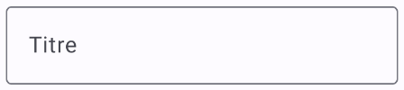
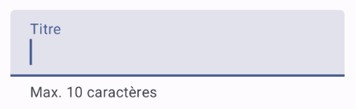

# Formulaires de données (Ajout, Modification, Suppression)


### 66.1 TextField() et OutlinedTextField()


Une case de saisie peut être ajoutée à l'aide du composble TextField() ou de OutlinedTextField() .


Pour que le texte entré dans une boîte de saisie soit affiché dans la boîte, il faut que sa valeur provienne d'une variable d'état.


Dans cette fiche :


#### TextField


#### OutlinedTextField


#### supportingText


#### Type de clavier


#### TextField ou OulinedTextField avec ViewModel


### TextField


Le TextField, dans sa plus simple expression, va comme suit :


```kotlin title="Jetpack Compose (Kotlin)"
var titre by rememberSaveable { mutableStateOf("") }   // la variable d'état pourrait aussi faire partie du ViewModel
 
TextField(
    value = titre ,
    onValueChange = { titre = it },
    label = { Text("Titre") }
)
```


Remarquez l'utilisation de **rememberSaveable**. Si vous débutez avec Jetpack Compose, vous aurez sans doute appris à déclarer les variables d'état avec remember. Dès que vous avancerez dans vos apprentissages, vous comprendrez pourquoi il est préférable d'utiliser rememberSaveable pour la valeur d'une case de saisie.


Voici le TextField vide puis avec focus ou rempli.





### OutlinedTextField


Voici le même exemple mais avec un OutlinedTextField.


```kotlin title="Jetpack Compose (Kotlin)"
var titre by rememberSaveable { mutableStateOf("") }
 
OutlinedTextField(
    value = titre,
    onValueChange = { titre = it },
    label = { Text("Titre") }
)
```


La différence entre TextField et OutlinedTextField est au niveau de l'apparence.


Voici le OutlinedTextField vide puis avec focus ou rempli.


### supportingText


Depuis Jetpack Compose 1.3, il est possible d'ajouter un texte d'accompagnement sous la boîte de saisie.


Dans la forme la plus simple, un texte statique sera affiché. Mais puisque le code est entre accolades, ceci ouvre la porte à une panoplie de possibilités afin d'afficher un texte contextualisé.


```kotlin title="Jetpack Compose (Kotlin)"
var titre by rememberSaveable { mutableStateOf("") }
 
OutlinedTextField(
    value = titre,
    onValueChange = { titre = it },
    label = { Text("Titre") },
    supportingText = { Text("Max. 10 caractères") }
)
```





### Type de clavier


Afin d'améliorer l'expérience utilisateur, il est important de spécifier le type de clavier virtuel selon le rôle de la case de saisie.


Les principaux types de clavier sont :


#### Text (par défaut)


#### Number


#### Decimal (dans derniers tests effectués, était identique à Number)


#### Email (semblable à Text mais la virgule est remplacée par un @)


#### Password (lettres et chiffres dans un même écran)


#### Phone (chiffres avec lettres imprimées sur les touches correspondantes - ex : 2 ABC)


#### Uri (semblable à Text mais la virgule est remplacée par un /)


KeyboardType.Text KeyboardType.Number KeyboardType.Email KeyboardType.Password KeyboardType.Phone


Pour spécifier le type clavier désiré :


```kotlin title="Jetpack Compose (Kotlin)"
TextField(
    ...,
    keyboardOptions = KeyboardOptions
(keyboardType
 = KeyboardType.Number)
)
```


### TextField ou OulinedTextField avec ViewModel


Dans une application qui utilise un **ViewModel comme conteneur d'état**, la syntaxe d'une case de saisie sera légèrement différente.


Notez que j'ai utilisé ici un ViewModel de type HomeViewModel mais la classe du ViewModel pourrait porter un autre nom dans votre application.


```kotlin title="Fonction composable (Kotlin)"
@Composable
fun monComposable() {
    val viewModel: HomeViewModel = viewModel()
    val uiState by viewModel.uiState.collectAsState()
    ...
    TextField(
        value = uiState.nom ,
        onValueChange = {
             viewModel.ajusterNom(it)
        },
        ...
    )
    ...
}
```


Et dans le ViewModel (dans cet exemple, le uiState est un flux observable, d'où la nécessité d'utiliser _uiState.update) :


```kotlin title="ViewModel (Kotlin)"
class HomeViewModel: ViewModel() {
    ...
    fun ajusterNom(valeur: String) {
        _uiState.update {
            it.copy (
                _nom = valeur
            )
        }
    }
}
```


#### Pour plus d'information


* [« Handle user input » - Android Developers](https://developer.android.com/jetpack/compose/text/user-input)


* [« Jetpack Compose Basics - How to use text field composables to meet the Material design specification » - Good Request](https://www.goodrequest.com/blog/jetpack-compose-basics-text-input)


* [« Textfields » - Material Design 3](https://m3.material.io/components/text-fields/overview)


* [« androidx.compose.material3 - TextField » - Android Developers](https://developer.android.com/reference/kotlin/androidx/compose/material3/package-)
summary#textfield


### * [« androidx.compose.material3 - OutlinedTextField » - Android Developers](https://developer.android.com/reference/kotlin/androidx/compose/material3/package-)
summary 66.2 Validation


C'est dans un ViewModel que la logique de validation sera codée.


Les bonnes pratiques de programmations demandent d'utiliser un ViewModel propre à la page du formulaire.


Ceci permet de mieux séparer les responsabilités (Single Responsibility Principle) :


#### Un ViewModel gère la liste et les opérations CRUD avec la base de données.


#### L'autre gère l'état du formulaire et sa validation (il n'accèdera pas à la base de données donc pas de référence au
Repository)


Je vous suggère d'ajouter la validation à la méthode qui met à jour la valeur saisie. En effet, si vous travaillez avec deux méthodes séparées, vous n'aurez pas de garantie que le _uiState.update qui met à jour la valeur saisie soit terminé avant qu'une autre méthode, telle la validation, tente d'utiliser cette valeur.


Voici un exemple simple :


```kotlin title="ViewModel"
class FormulaireCategorieViewModel : ViewModel() {
    ...
    fun ajusterEtValiderTitre(titre: String) {
        var messageErreur= ""
        if (titre.length > 100) {
            messageErreur = "Le titre doit comporter 100 caractères ou moins."
        }
        _uiState.update {
            it.copy (
                _titre = titre,
                _messageErreurTitre = messageErreur
            )
        }
    }
}
```


```kotlin title="Jetpack Compose (Kotin)"
OutlinedTextField(
    value = ...,
    onValueChange = {
        formulaireCategorieViewModel.ajusterEtValiderTitre(it)
    },
    label = { Text("Titre") },
    ...,   // autres configurations, par exemple choix du clavier
    isError = formulaireCategorieUiState.messageErreurTitre != "",
)
```


Pour afficher le message, vous pouvez utiliser l'attribut supportingText si votre projet est bâti sous Compose 1.3 ou plus récent.


Sinon, un simple Text() fera l'affaire.


```kotlin title="Jetpack Compose (Kotin)"
OutlinedTextField(
    value = ...,
    onValueChange = {
       formulaireCategorieViewModel.validerEtAjusterTitre(it)
    },
    label = { Text("Titre") },
    ...,   // autres configurations, par exemple choix du clavier
    isError = formulaireCategorieUiState.messageErreurTitre != "",
    supportingText = {
        if (formulaireCategorieUiState.messageErreurTitre != "") {
            Text(formulaireCategorieUiState.messageErreurTitre)
        }
    }
)
```


!!! warning "Attention : ceci fai" Attention : ceci fait en sorte que la validation n'aura lieu que lorsque le texte est modifié.


À vous de vous assurer que la validation ait lieu même si rien n'est entré dans la case de saisie alors que cette information est obligatoire.


### Internationaliser les messages d'erreur


Je vous propose une technique pour internationaliser les message d'erreur de validation dans le ViewModel.


On sait que pour **retrouver une chaîne internationalisée**, il est possible d'utiliser stringResource.


```kotlin title="Composable (Kotlin)"
val message = stringResource(R.string.le_titre_est_requis)
```


Ceci ne fonctionne cependant que dans un composable, ce qui n'est pas le cas des méthodes du ViewModel.


On peut alors utiliser un contexte avec getString().


Dans le cas où le ViewModel hérite de AndroidViewModel et reçoit une référence à l'application en paramètre, on pourra faire ceci :


```kotlin title="ViewModel (Kotlin)"
val message = application.applicationContext.getString(R.string.le_titre_est_requis)
```


Mais, lorsque possible, il est préférable de créer un ViewModel qui hérite de ViewModel plutôt que de AndroidViewModel afin de faciliter les tests unitaires. Le contexte de l'application n'est alors plus disponible.


Pour internationaliser les messages d'erreur, une solution intéressante consiste à initialiser dans le ViewModel seulement l'identifiant de la chaîne.


On changera le UIState comme suit.


L'annotation @StringRes agit comme un garde-fou pour assurer qu'on n'entre pas une valeur qui ne correspond pas à une chaîne internationalisée.


```kotlin title="UIState (Kotlin)"
@StringRes private var _erreurTitreId: Int? = null,
```


Et on initialisera cette variable dans le ViewModel :


```kotlin title="ViewModel (Kotlin)"
var messageErreurId: Int? = null
if (titre.isBlank()) {
    messageErreurId = R.string.le_titre_est_requis
}
...
_uiState.update {
    it.copy (
        ...,
        _erreurTitreId = messageErreurId
    )
}
```


C'est le composable qui se chargera de charger la chaîne à l'aide du contexte.


```kotlin title="Composable (Kotlin)"
Text(stringResource(formulaireCategorieUiState.erreurTitreId!!))
```


### 66.3 Enregistrement


Dans un formulaire pour ajouter ou éditer des données, un bouton permettra de traiter les données saisies.


Dans cet exemple, les données sont insérées dans la base de données à l'aide d'une méthode du ViewModel.


```kotlin title="Jetpack Compose (Kotlin)"
@Composable
fun FormulaireCategorie(viewModel: CategorieViewModel) {
    val coroutineScope = rememberCoroutineScope()
    ...
    Button(
        onClick = {
            enregistrer(...)
        },
    ) {
        Text(text = "Enregistrer")
    }
    ...
}
fun enregistrer(...) {
    coroutineScope.launch {
        viewModel.insererCategorie(...)
    }
    ...
}
```


Une fois l'enregistrement terminé, il est intéressant de retourner à la page qui liste les données.


```kotlin title="Jetpack Compose (Kotlin)"
coroutineScope.launch {
    categorieViewModel.insererCategorie(...)
        .join()
 // attend la fin de l'insertion
       ...    // on pourrait par exemple réinitialiser les données du formulaire
        navController.navigate("...")
}
```


## 67. Effets secondaires (side effects)


---


### 68.1 Retrouver les données de l'enregistrement à modifier


Avant 2025, la documentation officielle d'Android énonçait clairement qu'il faut passer un id en paramètre à une route plutôt qu'un objet.


Le texte a depuis été mis à jour mais cette affirmation demeure pertinente :


### La transmission de structures de données complexes sur des arguments est considérée comme un anti-modèle. Chaque destination doit être responsable de charger les données de l'interface
utilisateur en fonction des informations minimales nécessaires, telles que les ID des éléments. Cela simplifie la recréation des processus et évite d'éventuelles incohérences dans les données.


En effet, si on voulait passer un objet complet :


#### On serait confrontés à une limite de taille puisque l'objet sera **passé en paramètre
à la route**.


#### Les données pourraient être obsolètes si modifiées ailleurs.


Pour ces raisons, on ne passera pas une instance du modèle en paramètre à la route. On travaillera plutôt avec un identifiant.


Les données seront retrouvées dans la base de données à l'aide du ViewModel.


Vous devrez :


#### **Dans le DAO** :
ajouter une annotation @Query pour spécifier la requête à effectuer pour retrouver les données à partir d'un identifiant. La requête travaillera avec un paramètre id, identifié par :id. L'annotation @Query sera suivie par une fonction qui retourne un Flow<T>.


Remarquez que cette fonction n'a pas besoin d'être suspendue car le mécanisme de flux gère l'exécution asynchrone.


#### **Dans le dépôt de données** : définir une fonction qui
fait appel à la fonction du Dao pour retrouver les données.


#### **Dans le ViewModel** :
définir une fonction qui fait appel au dépôt de données.


Remarquez que cette fonction utilise firstOrNull() pour retrouver le premier élément émis par le flux puis arrêter le flux. Si elle utilisait collect(), la fonction demeurerait suspendue tant que le flux n'aurait pas terminé d'émettre des éléments. À moins d'être initialisées dans un **LaunchedEffect**, les informations recherchées pourraient donc ne pas encore être disponibles au moment où elles doivent être utilisées.


Cette fois, la fonction doit être suspendue car elle utilise la fonction suspendue firstOrNull().


```kotlin title="Fichier ui/CategorieViewModel.kt"
suspend fun retrouverCategorie(id: Int) : Categorie? {
    return _repository.retrouverCategorie(id).firstOrNull()
}
```


#### La fonction modulable qui affiche le formulaire recevra l'identifiant en paramètre et retrouvera les données dans la
base de données comme suit :


```kotlin title="Fichier ui/FormulaireCategorie.kt"
@Composable
fun FormulaireCategorie( categorieId: Int , ...) {
    // initialiser les variables d'état du ViewModel dès que categorieId change
    **LaunchedEffect**(categorieId) {
        val categorie = categorieViewModel.retrouverCategorie(categorieId)
        ...
    } 
    ...
}
```


## 69. Amélioration du ViewModel


---
