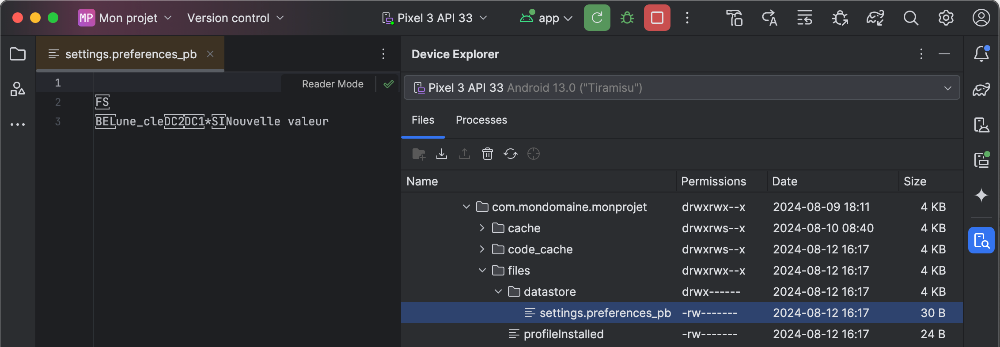

# Préférences utilisateur


### 32.1 Preferences DataStore


Une préférence utilisateur est une configuration qui est choisie par l'utilisateur et enregistrée dans l'application de sorte qu'elle est toujours active lors du prochain démarrage de l'application.


Il s'agit d'une information simple représentée par une paire clé-valeur.


Dans cette fiche :


#### Dépendance


#### Classe pour gérer la lecture et l'enregistrement


#### Supprimer une paire clé-valeur


#### Consulter les données du Preferences DataStore


#### Ajustements pour le Preview


### Dépendance


Avant de vous lancer dans l'enregistrement de préférences utilisateur, il faut ajouter une dépendance à votre projet.


Cette ligne doit être ajoutée dans le fichier build.gradle.kts  qui se trouve dans le dossier app .


```kotlin title="Fichier app/build.gradle.kts"
...
dependencies {
    ...
    // pour enregistrer des paires clé-valeur (préférences utilisateur)
    implementation("androidx.datastore:datastore-preferences:1.1.7")
}
```


Notez que la version de la dépendance pourrait être différente. Android Studio vous le fera savoir si une version plus récente est disponible.


Une fois la dépendance ajoutée, il faut **resynchroniser le projet pour qu'il tienne compte de l'ajout**.


### Classe pour gérer la lecture et l'enregistrement


Les instructions pour gérer les préférences utilisateur seront codées dans leur propre classe.


Cette classe devra être dans son propre fichier et le fichier portera le même nom que la classe.


Toutes les classes qui servent à gérer des données seront placées dans un dossier nommé  data .


Ce dossier sera au même niveau que le fichier  MainActiviy.kt .


Le chemin complet de la classe sera donc au format : app/src/main/java/com/mondomaine/monprojet/data/PreferencesUtilisateur.kt .


Pour créer un dossier dans Android Studio :


#### Assurez-vous que l'affichage soit en mode Projet  (cliquez sur la liste déroulante dans le haut de la zone qui affiche


#### les fichiers du projet puis sélectionnez  Project ).


#### Effectuez un clic droit sur le dossier parent /  New  /  Package .


Voici le contenu de cette classe pour gérer deux préférences utilisateur : une de type String ainsi qu'une autre de type Int.


À vous de l'adapter à vos besoins.


### Vous ne devez surtout pas conserver les noms uneCle et autreCle ;-)


```kotlin title="Fichier data/PreferencesUtilisateur.kt (Kotlin)"
import androidx.datastore.core.DataStore
import androidx.datastore.preferences.core.Preferences
import androidx.datastore.preferences.core.edit
import androidx.datastore.preferences.core.intPreferencesKey
import androidx.datastore.preferences.core.stringPreferencesKey
import kotlinx.coroutines.flow.Flow
import kotlinx.coroutines.flow.map
/**
 * Gestion des préférences utilisateur.
 *
 * @author Christiane Lagacé, inspiré de https://medium.com/@rowaido.game/persistent-data-storage-using-datastore-preferences-
in-jetpack-compose-90c481bfed12
 *
 * @property dataStore DataStore qui stocke les préférences utilisateur.
 */
class PreferencesUtilisateur(private val dataStore: DataStore<Preferences>) {
    private companion object {
        val UNE_CLE = stringPreferencesKey("une_cle")
        val AUTRE_CLE = intPreferencesKey("autre_cle")
    }
    val uneCleFlow: Flow<String> =
        dataStore.data.map { preferences ->
        preferences[UNE_CLE] ?: "Inconnu"
    }
    suspend fun saveUneCle(valeur: String) {
        dataStore.edit { preferences ->
            preferences[UNE_CLE] = valeur
        }
    }
    val autreCleFlow: Flow<Int> =
        dataStore.data.map { preferences ->
        preferences[AUTRE_CLE] ?: -1
    }
    suspend fun saveAutreCle(valeur: Int) {
        dataStore.edit { preferences ->
            preferences[AUTRE_CLE] = valeur
        }
    }
}
```


Quelques explications :


#### Le companion object
en Kotlin est semblable aux propriétés statiques dans d'autres langages. On pourra accéder à ces propriétés directement à l'aide du nom de la classe.


#### La lecture et l'écriture sont réalisées de façon asynchrone. C'est pourquoi la lecture retourne un Flow<String> plutôt
que directement un String.


#### Lors de la lecture et de l'écriture, on utilise une constante (ex : UNE_CLE) pour référer au nom physique de la clé (ex :
une_cle). Ceci assure qu'on utilise le bon nom de clé pour lire et pour  écrire la valeur d'une préférence utilisateur.


Pour utiliser cette classe, ajoutez ceci à votre code.


```kotlin title="Fichier MainActivity.kt"
// propriété d'extension de la classe Context
private val Context.dataStore: DataStore<Preferences> by preferencesDataStore(
    name = "settings"
)
class MainActivity : ComponentActivity() {
     lateinit
 var preferencesUtilisateur: PreferencesUtilisateur
    override fun onCreate(savedInstanceState: Bundle?) {
        super.onCreate(savedInstanceState)
        preferencesUtilisateur = PreferencesUtilisateur(dataStore)
        ...
        setContent {
            ...
            MainScreen(
                 preferencesUtilisateur = preferencesUtilisateur,
                ...
            )
        }
    }
}
@Composable
fun MainScreen( preferencesUtilisateur: PreferencesUtilisateur , ...) {
    val scope = rememberCoroutineScope()
    val uneCle by preferencesUtilisateur.uneCleFlow.collectAsState(initial = "")
    ...
    
     Text(text = uneCle)
    Button(
        onClick = {
            scope.launch {
                preferencesUtilisateur.saveUneCle("Nouvelle valeur");
            }
        }
    ) {
        Text(text = "Test")
    }
}
```


Quelques explications :


#### Pour accéder aux préférences utilisateur stockées dans un conteneur que l'on a choisi de nommer settings, on ajoute
une propriété d'extension (extension property) à la classe Context.


#### Le by preferencesDataStore fait beaucoup de travail. C'est lui qui crée le DataStore, gère le fichier, etc.


#### Puisque la lecture et l'écriture des préférences utilisateur sont asynchrones, il n'est pas possible d'appeler
directement les méthodes codées dans la classe PreferencesUtilisateur.


#### Pour la lecture, on créera une variable d'état qui écoute en tout temps pour connaître la valeur de la préférence
utilisateur. On utilisera collectAsState qui se charge de collecter un flux (Flow) et de le transformer en état (State).


#### Cette variable est ici simplement affichée dans un Text().


#### Dans cette application, j'ai choisi de modifier la valeur de la préférence utilisateur sur le clic d'un bouton.


#### Pour enregistrer la valeur, il faut utiliser scope.launch()
afin de ne pas bloquer le fil d'exécution lors de l'appel asynchrone.


### Supprimer une paire clé-valeur


Il est possible d'ajouter des méthodes dans la classe PreferencesUtilisateur pour effectuer différentes tâches, par exemple supprimer une paire clé-valeur.


```kotlin title="Fichier data/PreferencesUtilisateur.kt (Kotlin)"
class PreferencesUtilisateur(private val dataStore: DataStore<Preferences>) {
    ...
    suspend fun supprimerUneCle() {
        dataStore.edit { preferences ->
            preferences.remove(UNE_CLE)
        }
    }
}
```


Pour tout réinitialiser :


```kotlin title="Fichier data/PreferencesUtilisateur.kt (Kotlin)"
class PreferencesUtilisateur(private val dataStore: DataStore<Preferences>) {
    ...
    suspend fun supprimerTout() {
        dataStore.edit { preferences ->
           preferences.clear()
        }
    }
}
```


### Consulter les données du Preferences DataStore


Il est possible de consulter le contenu du Preferences DataStore à l'aide d'Android Studio.


#### Lancez votre projet dans l'émulateur.


#### Dans Android Studio, faites afficher le Device Explorer : View / Tool Windows / Device Explorer .


#### Rendez-vous dans le dossier data/data .


#### Retrouvez le nom de domaine inversé de votre projet (ex : com.mondomaine.monprojet).


#### Dans le dossier files/datastore , le fichier settings.preferences_pb contient les paires clé-valeur enregistrées. Le fichier
n'est pas un fichier texte mais on peut tout de même y voir certaines valeurs.





#### Dans tous les cas, il est toujours possible de vérifier la si une clé existe et quelle est sa valeur à l'aide
du **Logcat**, en autant qu'on ait une variable d'état qui écoute pour connaître la valeur.


```kotlin title="Jetpack Compose (Kotlin)"
Log.d("MainActivity", uneCle ?: "Il n'y a aucune clé nommée uneCle")
```


### Ajustements pour le Preview


Si vous désirez utiliser la fonctionnalité de prévisualisation dans votre IDE, vous devrez instancier un dataStore factice.


Ici, la propriété d'extension Context.dataStore créée plus haut n'est pas disponible puisque la prévisualisation n'utilise pas un contexte complet.


De plus, il n'est pas possible de créer une nouvelle propriété d'extension puisque nous sommes dans une fonction.


Nous allons donc créer un DataStore factice à la main.


*** NOTE : je n'ai pas pris le temps d'optimiser ce code puisqu'il n'est utilisé que pour la prévisualisation. ***


```kotlin title="Fichier MainActivity.kt"
@Preview(showBackground = true)
@Composable
fun MainsScreenPreview() {
    val context = LocalContext.current
    // source : https://developer.android.com/kotlin/multiplatform/datastore?hl=fr
    fun createDataStore(producePath: () -> String): DataStore<Preferences> =
        PreferenceDataStoreFactory.createWithPath(
            produceFile = { producePath().toPath() }
        )
    val dataStore: DataStore<Preferences> = createDataStore(
        producePath = {
context.filesDir.resolve("settings.preferences_pb").absolutePath }
    )
    val preferencesUtilisateur = PreferencesUtilisateur(dataStore)
    MonProjetTheme {
        MainScreen(
            preferencesUtilisateur = preferencesUtilisateur,
            ...
        )
    }
}
```


#### Pour plus d'information


* [« DataStore » - Android Developer](https://developer.android.com/topic/libraries/architecture/datastore?hl=fr#kts)


* [« Utiliser Preferences DataStore - 4. DataStore : principes de base » - Android Developers](https://developer.android.com/codelabs/android-preferences-datastore?)
hl=fr#3


* [« Persistent Data Storage Using DataStore (Preferences) in Jetpack Compose » - Medium](https://medium.com/@rowaido.game/persistent-data-storage-using-)
datastore-preferences-in-jetpack-compose-90c481bfed12


* [« Demystifying DataStore: A Comprehensive Guide to Using DataStore with Jetpack Compose » - Medium](https://proandroiddev.com/demystifying-datastore-a-)
comprehensive-guide-to-using-datastore-with-jetpack-compose-d89c813232d7


* [« If use Jetpack compose don't use Shared Preference » - dev.to](https://dev.to/thecoder93/if-use-jetpack-compose-dont-use-shared-preference-p8p)


* [« Preference DataStore (The Generic Way) » - Medium](https://proandroiddev.com/preference-datastore-the-generic-way-d26b11f1075f)


### * [« Consuming flows safely in Jetpack Compose » - Manuel.vivo.dev](https://manuelvivo.dev/consuming-flows-compose)
32.2 Travailler avec le Preferences DataStore dans une fonction non composable


La façon dont vous structurez votre application a un impact important sur la technique à utiliser pour travailler avec le **Preferences DataStore**.


Par exemple, si vous choisissez de placer tout le code d'un gestionnaire d'événement dans une fonction, les instructions qui requièrent d'être appelées dans une fonction modulable ne pourront pas être placées dans cette fonction.


```kotlin title="Jetpack Compose (Kotlin)"
@Composable
fun MainScreen(..., preferencesUtilisateur : PreferencesUtilisateur) {
    Column(...) {
        ...
        Button(
            onClick = {
                traiter()
            }
        ) {
            Text(text = "Soumettre")
        }
    }
}
fun traiter() {
    val scope = rememberCoroutineScope()    // erreur : @Composable invocations can only happen from the context of a
@Composable function
    ...
}
```


Premier réflexe (mais pas le bon) : rendre la fonction composable. Mais ceci empêchera d'appeler scope.launch.


```kotlin title="Jetpack Compose (Kotlin)"
@Composable
fun MainScreen(..., preferencesUtilisateur : PreferencesUtilisateur) {
    Column(...) {
        ...
        Button(
            onClick = {
                traiter(preferenceUtilisateur)
            }
        ) {
            Text(text = "Soumettre")
        }
    }
}
@Composable
fun traiter(preferencesUtilisateur : PreferencesUtilisateur) {
    val scope = rememberCoroutineScope()
    ...
    scope.launch {   // erreur : Calls to launch should happen inside a LaunchedEffect and not composition
        preferencesUtilisateur.saveUneCle("Nouvelle valeur");
    }
}
```


Il y aura donc un jeu de passage de paramètres à réaliser.


```kotlin title="Jetpack Compose (Kotlin)"
@Composable
fun MainScreen(..., preferencesUtilisateur : PreferencesUtilisateur) {
    val scope = rememberCoroutineScope()
    ...
    Column(...) {
        ...
        Button(
            onClick = {
                traiter( preferencesUtilisateur, scope )
            }
        ) {
            Text(text = "Soumettre")
        }
    }
}
fun traiter(
    preferencesUtilisateur : PreferencesUtilisateur,
    scope: CoroutineScope
){   
    ...
     scope.launch {
        preferencesUtilisateur.saveUneCle("Nouvelle valeur");
    }
}
```


### 32.3 SharedPreferences


Selon la documentation officielle de Android Developers :


### Si vous utilisez actuellement SharedPreferences pour stocker des données, nous vous


### recommandons d'effectuer une migration vers DataStore.


> **Source** : 

## 1. * [« DataStore » - Android Developers](https://developer.android.com/topic/libraries/architecture/datastore?hl=fr)


#### Pour plus d'information


### * [« Enregistrer des données simples avec SharedPreferences » - Android Developers](https://developer.android.com/training/data-storage/shared-preferences?hl=fr)
33. Publier une application


---
