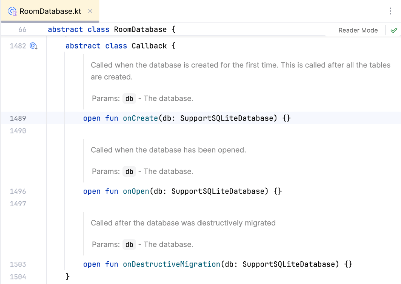

# Room avancé et requêtes réactives


### 58.1 Ajouter des données initiales


Il est rare qu'une application soit installée avec une base de données vide. Généralement, il y aura des données initiales, par exemple des pays, des devises, des couleurs, des catégories.


Pour insérer des données initiales dans une application qui utilise Room, ajoutez ceci dans la classe qui hérite de RoomDatabase :


```kotlin title="Fichier data/MonprojetDatabase.kt"
fun getDatabase(context: Context): MonprojetDatabase {
    return Instance ?: synchronized(this) {
        Room.databaseBuilder(context, MonprojetDatabase::class.java, "monprojet_database")
            .addCallback( DatabaseCallback() )
            .build()
            .also { Instance = it }
    }
}
```


Au bas de cette classe, définissez la classe DatabaseCallback, qui contiendra les requêtes INSERT désirées.


Notez que si une donnée doit contenir un apostrophe, il faudra doubler l'apostrophe dans la requête.


Cette fonction sera exécutée lors de la création de la base de données (voir conditions au bas de l'extrait de code).


```kotlin title="Fichier data/MonprojetDatabase.kt"
abstract class MonprojetDatabase : RoomDatabase() {
    ...
}
class DatabaseCallback : RoomDatabase.Callback() {
    override fun onCreate(db: SupportSQLiteDatabase) = db.run {
        beginTransaction()
        try {
            execSQL("INSERT INTO categories(titre, description) VALUES('catégorie 1', 'la catégorie no 1')")
            ...
            setTransactionSuccessful()
        } finally {
            endTransaction()
        }
    }
}
```


!!! warning "Attention : la métho" Attention : la méthode onCreate() n'est exécutée que lors de la CRÉATION DE LA BASE DE DONNÉES (et non des tables), c'est-à-dire :


#### la première fois que l'application est lancée sur un périphérique


OU


#### en forçant la recréation de la base de données à l'aide d'une de ces méthodes :


#### en effectuant une suppression manuelle de la BD **dans le système de fichiers de l'émulateur]**


#### en désinstallant l'application et en la réinstallant (sur l'émulateur : cercle (Home) / faire glisser l'écran vers
le haut / Settings / Apps )


#### en supprimant toutes les données de l'émulateur ( Device Manager / points verticaux / Wipe Data )


#### en lançant l'application dans un nouvel émulateur


En preuve de ce que j'avance, la documentation de la classe Callback spécifie :


### onCreate: Called when the database is created for the first time. This is called after all the tables


### are created.





### 58.2 Modifier la structure de la base de données en phase de développement


Pendant le développement d'une application, il arrive que la structure de la base de données soit changée. Il peut s'agir de l'ajout d'une table, de l'ajout d'un champ ou même de la modification d'un champ existant.


Si vous ne prenez pas les précautions nécessaires, vous obtiendrez ce message quand vous lancez l'application avec la nouvelle structure de BD alors que la BD a déjà été créée avec l'ancienne structure « Looks like you've changed schema but forgot to update the version number. You can simply fix this by increasing the version number. Expected identity hash: fc52a3aea54e62ca9d025b65d3f27132, found: c9a7d3438fa6436ca51c76b3571e7cd7 ».


### Ajustement des classes d'entité


Dans une application Jetpack Compose avec Room, les modifications à la structure de la base de données seront réalisées dans les  **classes d'entité]**.


Ces classes doivent refléter la  base de données avec la nouvelle structure.


Il est ensuite possible de spécifier si on désire que la base de données soit recrée à partir de zéro ou si on désire effectuer une migration afin de conserver les données existantes.


### Recréation complète de la base de données


Pendant la phase de développement, il y a une technique simple pour que l'application prenne en compte la nouvelle structure de la base de données. il suffit de supprimer manuellement la base de données dans le **Device Explorer]**.


Avant Room 2.7, sorti en 2025, il était possible d'utiliser l'instruction .fallbackToDestructiveMigration() . Cette instruction est désormais obsolète.


```kotlin title="Fichier data/MonprojetDatabase.kt"
fun getDatabase(context: Context): MonprojetDatabase {
    return Instance ?: synchronized(this) {
        Room.databaseBuilder(context, MonprojetDatabase::class.java, "monprojet_database")
        .fallbackToDestructiveMigration()
        .build()
        .also { Instance = it }
    }
}
```


### Migration vers la nouvelle structure


Une fois l'application en production, la suppression de la base de données n'est plus une option,. Il faut donc effectuer une migration en bonne et due forme des données.


### La procédure de migration est présentée sur la fiche « **gerer_les_versions_de_la_base_de_donnees** ».
58.3 Gérer les versions de la base de données


Il est très rare que pendant la vie utile d'une application, sa base de données ne subisse aucun changement.


Une fois que l'application a été déployée, il n'est pas possible de simplement supprimer l'ancienne base de données pour que l'application tienne compte de la nouvelle structure puisque la base de données est présente physiquement sur chaque téléphone qui utilise l'application.


Il faut donc procéder à une migration de la base de données.


### Avant de modifier une classe d'entité


Les étapes suivantes doivent être réalisées avant de modifier une classe d'entité.


### Demander la génération du fichier json


Si, dans votre fichier MonprojetDatabase.kt , vous avez demandé à ne pas générer le fichier json de la BD, vous devez corriger la situation.


Room aura besoin de ce fichier pour effectuer une migration automatique.


```kotlin title="Fichier data/MonprojetDatabase.kt"
@Database(
    entities = [
        Categorie::class,
        Item::class,
    ],
    version = 1,
    exportSchema = true
)
```


### Ajouter une dépendance pour la sérialisation


Pour que Room sache comment travailler avec les fichiers JSON, vous devez ajouter une dépendance pour la sérialistion JSON.


Notez qu'au moment d'écrire ces lignes, la version 1.7.3 de cette dépendance est compatible avec Room 2.6.1. Si vous utilisez une version de Room plus récente, vous devrez modifier la version de Room.


```kotlin title="Fichier app/build.gradle.kts"
...
dependencies {
    ...
     val room_version = " 2.6.1 "
    ...
    // pour la sérialisation JSON (nécessaire pour migrations)
    implementation("org.jetbrains.kotlinx:kotlinx-serialization-json:1.7.3")
}
```


N'oubliez pas de **resynchroniser le projet**.


### Définir comment migrer la base de données


Pour que l'application puisse travailler avec une nouvelle structure de données, il faut indiquer à Room comment modifier la base de données pour qu'elle corresponde à la nouvelle version.


Pour plusieurs modifications à la base de données, par exemple l'ajout d'une colonne, Room est capable de déterminer lui-même comment ajuster la BD selon les informations présentes dans les fichiers JSON.


Il faut indiquer à Room à quel endroit il pourra trouver les schémas des différentes versions de votre base de données.


Nous verrons sous peu comment générer ces schémas. Mais d'abord, il faut ajouter une configuration pour indiquer l'emplacement de ces schémas.


Une bonne pratique consiste à les placer dans le dossier app/schemas . Vous devrez créer le dossier schemas manuellement.


Cette configuration sera effectuée dans le fichier  build.gradle.kts  qui se trouve dans le dossier  app .


```kotlin title="Fichier app/build.gradle.kts"
...
dependencies {
    ...
}
// pour migrations
ksp {
    arg("room.schemaLocation", "$projectDir/schemas")
}
```


### Génération du schéma


La génération du schéma sera réalisée au prochain lancement de l'application. Vous verrez la présence d'un fichier nommé 1.json dans le dossier app/schemas de votre projet.


### Nouvelle structure de la base de données


Quand vous avez en main le fichier JSON de l'ancienne version de la BD, vous pouvez modifier les classes d'entité pour répondre à vos besoins.


### Modification des classes d'entité


Notez que lors de l'ajout d'un champ, il faut donner une valeur par défaut à l'aide d'une instruction @ColumnInfo .


Il faut savoir que la valeur données par défaut lors de la déclaration de la colonne est utilisée par le constructeur de Kotlin alors que @ColumnInfo est utilisé par SQLite dans l'instruction CREATE TABLE ou ALTER TABLE.


```kotlin title="Fichier data/Categorie.kt"
@Entity(tableName = "categories")
data class Categorie(
    @PrimaryKey(autoGenerate = true)
    val id: Int = 0,
    val titre: String = "",
    val description: String = "",
    @ColumnInfo(defaultValue = "1")
    val actif: Boolean = true,
)
```


### Demander la migration automatisée


Il est maintenant temps de changer le numéro de version puis de demander la migration automatisée.


```kotlin title="Fichier data/MonprojetDatabase.kt"
@Database(
    entities = [
        Categorie::class,
        Item::class,
    ],
    version = 2 ,
    exportSchema = true,
     autoMigrations = [
        AutoMigration (from = 1, to = 2)
    ]
)
```


Lors du prochain lancement de l'application :


#### Room générera le schéma JSON de la dernière version de la base de données.


#### Les modifications seront apportées à la base de données pour répondre aux changements.


!!! warning "Attention : si vous " Attention : si vous obtenez un message du genre « AutoMigration Failure: Please declare an interface extending 'AutoMigrationSpec' », c'est parce que les modifications aux classes d'entité ne permettent pas à Room d'effectuer une migration automatique.


Ce sera le cas, par exemple, si vous renommez ou supprimez une colonne ou une table.


Vous devrez à ce moment définir des spécifications de migration automatiques .


#### Pour plus d'information


### * [« Migrer votre base de données Room » - Android Developer](https://developer.android.com/training/data-storage/room/migrating-db-versions?hl=fr)
59. Internationalisation


---
