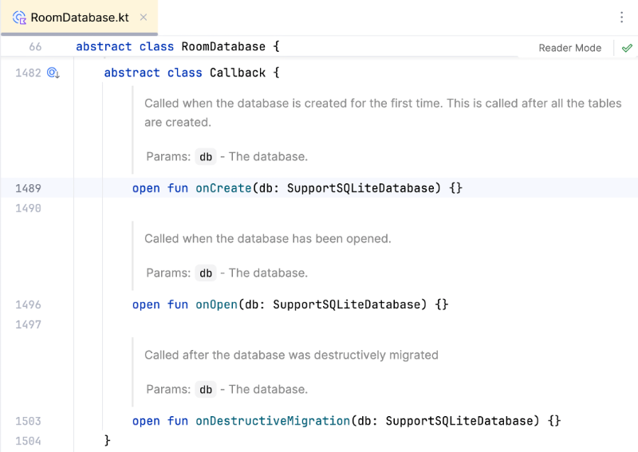

# Room avancé et requêtes réactives


## Ajouter des données initiales


Il est rare qu'une application soit installée avec une base de données vide. Généralement, il y aura des données initiales, par exemple des pays, des devises, des couleurs, des catégories.


Pour insérer des données initiales dans une application qui utilise Room, ajoutez ceci dans la classe qui hérite de `RoomDatabase` :


```kotlin title="Fichier data/MonprojetDatabase.kt"
fun getDatabase(context: Context): MonprojetDatabase =
    synchronized(this) {
        instance ?: Room.databaseBuilder(
            context,
            MonprojetDatabase::class.java,
            "monprojet_database"
        )
            .addCallback(DatabaseCallback())
            .build()
            .also { instance = it }
    }
```


Au bas de cette classe, définissez la classe `DatabaseCallback`, qui contiendra les requêtes *INSERT* désirées.


Utilisez la surcharge de `execSQL` qui accepte les paramètres séparément du texte SQL. Placez un `?` à l'emplacement de chaque valeur, puis passez les valeurs dans un tableau, dans le même ordre. Les paramètres sont traités comme des données; concaténer directement une valeur non fiable au SQL pourrait permettre une injection SQL.


Cette fonction sera exécutée lors de la création de la base de données (voir conditions au bas de l'extrait de code).


```kotlin title="Fichier data/MonprojetDatabase.kt"
abstract class MonprojetDatabase : RoomDatabase() {
    ...
}
class DatabaseCallback : RoomDatabase.Callback() {
    override fun onCreate(db: SupportSQLiteDatabase) = db.run {
        execSQL(
            "INSERT INTO categories(titre, description) VALUES(?, ?)",
            arrayOf("catégorie 1", "description de la catégorie")
        )
        ...
    }
}
```

    Attention : la méthode onCreate() n'est exécutée que lors de la CRÉATION DE LA BASE DE DONNÉES (et non des tables), c'est-à-dire :

* la première fois que l'application est lancée sur un périphérique

OU

* en forçant la recréation de la base de données à l'aide d'une de ces méthodes :
    * en effectuant une suppression manuelle de la BD **dans le système de fichiers de l'émulateur**
    * en désinstallant l'application et en la réinstallant (sur l'émulateur : cercle (Home) / faire glisser l'écran vers
le haut / Settings / Apps )
   * en supprimant toutes les données de l'émulateur ( Device Manager / points verticaux / Wipe Data )
   * en lançant l'application dans un nouvel émulateur


La documentation de la classe Callback spécifie :

    onCreate: Called when the database is created for the first time. This is called after all the tables are created.





## Modifier la structure de la base de données en phase de développement (*migration*)

Pendant le développement d'une application, il arrive que la structure de la base de données soit changée. Il peut s'agir de l'ajout d'une table, de l'ajout d'un champ ou même de la modification d'un champ existant.


Si vous ne prenez pas les précautions nécessaires, vous obtiendrez ce message quand vous lancez l'application avec la nouvelle structure de BD alors que la BD a déjà été créée avec l'ancienne structure 

    « Looks like you've changed schema but forgot to update the version number. You can simply fix this by increasing the version number. Expected identity hash: fc52a3aea54e62ca9d025b65d3f27132, found: c9a7d3438fa6436ca51c76b3571e7cd7 ».


### Ajustement des classes d'entité


Dans une application Jetpack Compose avec Room, les modifications à la structure de la base de données seront réalisées dans les **classes d'entité**.


Ces classes doivent refléter la base de données avec la nouvelle structure.


Il est ensuite possible de spécifier si on désire que la base de données soit recréée à partir de zéro ou si on désire effectuer une migration afin de conserver les données existantes.


### Recréation complète de la base de données


Pendant la phase de développement, pour que l'application prenne en compte la nouvelle structure de la base de données, il suffit d'utiliser `fallbackToDestructiveMigration(dropAllTables = true)` dans le constructeur de la base de données.


```kotlin title="Fichier data/MonprojetDatabase.kt"
fun getDatabase(context: Context): MonprojetDatabase {
    return Instance ?: synchronized(this) {
        Room.databaseBuilder(context, MonprojetDatabase::class.java, "monprojet_database")
        .fallbackToDestructiveMigration(dropAllTables = true)
        .build()
        .also { Instance = it }
    }
}
```

On peut aussi supprimer manuellement la base de données dans le **Device Explorer**, à l'emplacement `/data/data/<nom_du_package>/databases`.

**La définition de migrations afin de conserver les données existantes n'est pas couverte dans le cadre de ce cours.**
