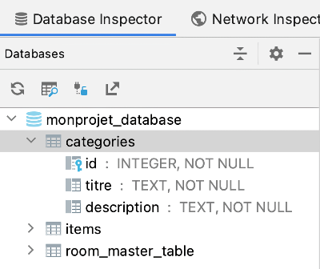
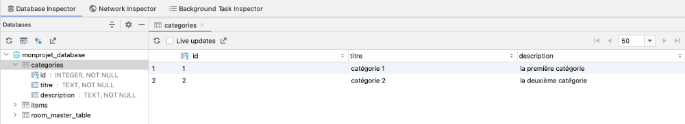
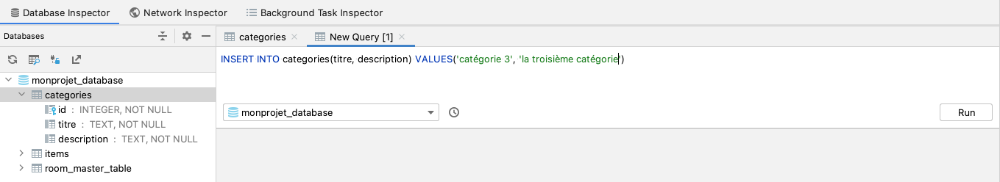
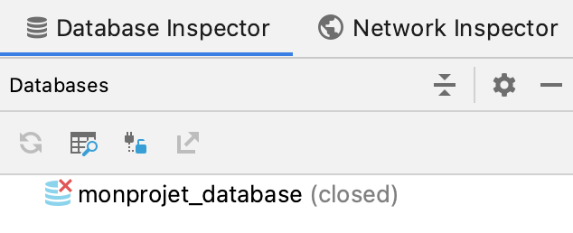
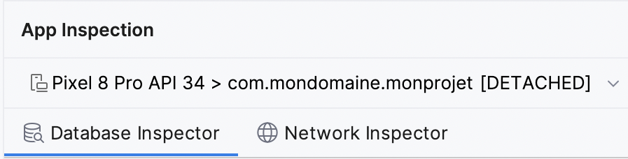
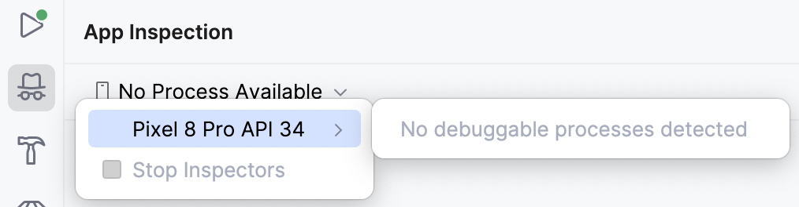
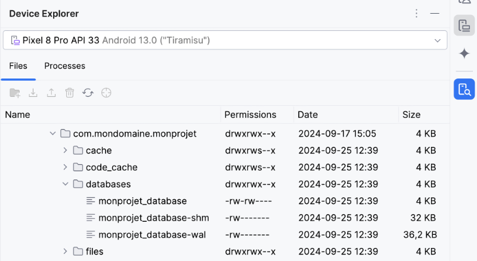

# Système de fichiers de l'émulateur

### 54.1 Database Inspector pour voir la base de données dans l'émulateur

Dans Android Studio, l'outil Inspection de bases de données (Database Inspector) vous permet de voir le contenu de la base de données SQLite présente sur l'émulateur.

Pour voir votre base de données :

#### Lancez l'application dans l'émulateur. Le périphérique sélectionné doit tourner sur l'API 26 (Oreo) ou plus récent.

#### Si vous travaillez avec une application avec plusieurs écrans, assurez-vous que l'écran affiché dans l'émulateur utilise
la base de données.

#### Rendez-vous dans le menu View / Tool Windows / App Inspection / onglet Database Inspector .

!!! warning "Note : si vous voyez" Note : si vous voyez le message « No devices detected », rendez-vous dans le menu  File / Invalidate Caches .

#### Au besoin, cliquez sur le nom de l'émulateur et sélectionnez votre application parmi les processus disponibles.

#### Cliquez sur le nom d'une table pour voir sa structure.

#### Double-cliquez sur le nom d'une table pour voir ses données.

#### Cliquez sur l'icône Open New Query Tab pour pouvoir entrer une requête SQL. Vous pouvez ensuite faire des requête

#### SELECT, INSERT, UPDATE ou DELETE afin d'affecter les données de la base de données.

### Database closed

Si vous voyez la mention (closed) à côté de la base de données, c'est que l'application qui roule dans l'émulateur n'a pas encore fait appel à la base de données.

Effectuez une opération qui requiert une requête à la base de données, par exemple afficher la liste des enregistrements d'une table, puis vous aurez accès à la base de données dans l'outil Inspection de bases de données.

### [DETACHED]

Dans le cas où vous voyez [DETACHED] à côté du nom de votre application dans l'inspecteur d'applications, les requêtes SQL que vous tenterez d'exécuter dans l'inspecteur demeureront sans effet sur la base de données.

Un redémarrage de l'émulateur pourrait régler le problème :

#### Rendez-vous dans le menu View / Tool Windows / Device Manager .

#### Cliquez sur l'icône Stop vis-à-vis l'émulateur que vous utilisez.

#### Cliquez ensuite sur l'icône Start pour le redémarrer.

Si cette technique ne fonctionne pas, un redémarrage de Android Studio pourrait faire l'affaire.

### No debuggable processes detected

Dans le cas où l'inspecteur d'application ne vous donne pas du tout accès à votre projet (message No debuggable processes detected), un redémarrage de l'émulateur pourrait également régler le problème (procédure ci-haut).

#### Pour plus d'information

* [« Déboguer votre base de données avec l'outil d'inspection de bases de données » - Android Developers](https://developer.android.com/studio/inspect/database?)
hl=fr

### * [« Afficher le contenu de la base de données à l'aide de l'outil d'inspection » - Android Developers](https://developer.android.com/codelabs/basic-android-kotlin-)
compose-persisting-data-room?hl=fr#9 54.2 Voir les fichiers stockés sur un émulateur Android

Pour voir les fichiers stockés sur l'émulateur dans Android Studio :

#### Rendez-vous dans View / Tool Windows / Device Explorer .

#### Sélectionnez l'émulateur qui a été utilisé pour exécuter l'application.

#### Retrouvez votre application sous le dossier data/data .

#### Vous y retrouverez les fichiers utilisés par l'application, notamment la base de données.

#### Un clic droit vous permettra de télécharger le fichier de votre choix sur votre ordinateur, de le supprimer de
l'émulateur, etc.

#### Pour plus d'information

### * [« Afficher les fichiers stockés sur l'appareil à l'aide de l'Explorateur de l'appareil » - Android Developers](https://developer.android.com/studio/debug/device-file-)
explorer?hl=fr
55. Lister des données

---
