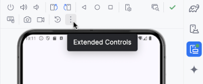
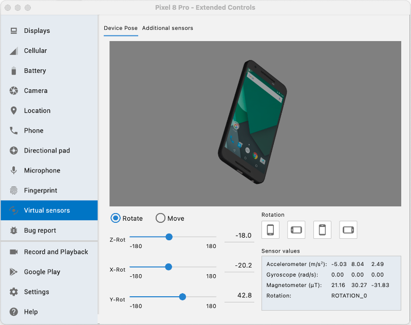
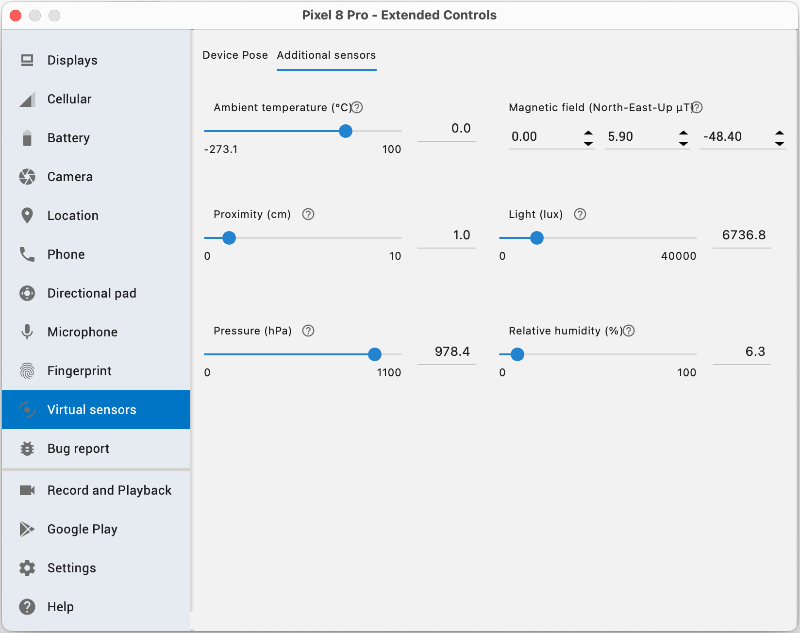

# Utilisation des capteurs (Sensors)


### 75.1 Les capteurs d'un téléphone Android


Un téléphone Android peut être muni de capteur physiques et de capteur logiques. Les capteur logiques sont ceux  dont les valeurs sont calculées à partir des valeurs d'un ou de plusieurs autres capteurs.


Parmi les capteurs qui peuvent être disponibles sur un téléphone Android, notons :


#### Accéléromètre


#### Gyroscope


#### Thermomètre


#### Magnétomètre


#### Capteur de proximité


#### Capteur de luminosité


#### Capteur de pression


#### Capteur d'humidité


Fait intéressant, depuis l'API 14, l'émulateur dans Android Studio permet de simuler les capteurs d'un téléphone.


Pour y arriver, cliquez sur les trois points verticaux dans le coin supérieur droit de la fenêtre de l'émulateur, là où on retrouve le bouton Power , afin d'ouvrir la fenêtre Extended Controls .





L'onglet Virtual Sensors est celui qui nous intéresse ici.


Remarquez qu'il y a deux onglets dans le haut de la page : Device Pose et Additional sensors .








#### Pour plus d'information


### * [« Sensors overview » - Android Developers](https://developer.android.com/guide/topics/sensors/sensors_overview)
75.2 Déclarer l'utilisation des capteurs


Lorsqu'une application utilise un capteur, elle doit en faire la déclaration dans le fichier AndroidManifest.xml que l'on retrouve dans le dossier app/src/main .


Et si ce capteur utilise des données sensibles, elle doit en plus demander une permission dans ce même fichier.


### uses-feature


La balise uses-feature permet de préciser à Google Play que l'application utilise un capteur.


L'attribut required, s'il est à true, fera en sorte que l'application ne sera proposée que si l'appareil est équipé de ce capteur.


Si l'utilisation du capteur n'est pas requise pour que l'application fonctionne, on pourra laisser l'attribut required à false.


```xml title="Fichier AndroidManifest.xml"
<?xml version="1.0" encoding="utf-8"?>
<manifest xmlns:android="http://schemas.android.com/apk/res/android"
          xmlns:tools="http://schemas.android.com/tools">
    <uses-feature android:name="android.hardware.sensor.accelerometer" android:required="false" />
    <application
            ...
    </application>
</manifest>
```


### uses-permission


La balise uses-permission permet de demander la permission à l'usager afin d'avoir accès à une fonctionnalité.


Si l'application utilise un capteur qui fournit des données sensibles, par exemple des données de localisation, il est requis de demander une permission d'exécution.


```xml title="Fichier AndroidManifest.xml"
<uses-permission android:name="android.permission.ACCESS_COARSE_LOCATION" />
```


#### Pour plus d'information


* [« Demander l'autorisation d'accéder à la position » - Android Developers](https://developer.android.com/training/location/permissions?hl=fr)


* [« Understanding Sensor Rate Limitations in Android 13 » - Geeks for Geeks](https://www.geeksforgeeks.org/understanding-sensor-rate-limitations-in-android-13/)


### 75.3 Utiliser un capteur sur un téléphone Android


Voici les grandes lignes qui vous permettront de réagir aux changements de valeur d'un capteur.


N'oubliez pas de **déclarer l'utilisation des capteurs]**.


Dans cette fiche :


#### Instancier le SensorManager


#### Enregistrer le listener lorsque l'application prend le focus


#### Initialiser une variable d'état à partir de la valeur du capteur


#### Désenregistrer le SensorManager


#### Économiser la batterie


### Instancier le SensorManager


Un objet de type SensorManager doit être instancié pour accéder aux valeurs d'un capteur.


Ce travail sera effectué dans un ViewModel qui doit implémenter l'interface SensorEventListener .


Le ViewModel devra également implémenter l'interface DefaultLifecycleObserver afin de permettre de gérer les méthodes onPause et onResume (voir plus bas).


Le SensorManager sera déclaré directement dans le ViewModel et non dans le uiState puisqu'il ne s'agit pas d'une variable en lien direct avec l'interface utilisateur.


L'instanciation sera réalisée dans le constructeur (init). Ceci permet notamment de réagir si le capteur n'est pas disponible.


Notez qu'il existe d'autres techniques pour travailler avec un SensorManager. Sachez cependant que si le travail était réalisé sans prendre les précautions appropriées, on obtiendrait tôt ou tard le message d'erreur « the sensor listeners size has exceeded the maximum limit 128 », dû au fait que les variables seraient recréées à chaque fois que la vue est recomposée.


### Dans le cadre de ce cours, la déclaration du SensorManager doit être réalisée dans un ViewModel.


Dans cet exemple, le code travaille avec le capteur de luminosité.


```kotlin title="ViewModel (Kotlin)"
class SensorViewModel(application: Application) : AndroidViewModel(application), SensorEventListener ,
DefaultLifecycleObserver {
    ...
     private val _sensorManager: SensorManager
    private val _lightSensor: Sensor?
    
    init {
        val context = application.applicationContext
        _sensorManager = context.getSystemService(Context.SENSOR_SERVICE) as SensorManager
        _lightSensor = _sensorManager.getDefaultSensor(Sensor.TYPE_LIGHT)
        if (_lightSensor == null) {
            Log.w("SensorViewModel", "Capteur de lumière non disponible sur cet appareil.")
        }
        ...
    }
    ...
}
data class SensorUiState(
    ...   // on conservera ici la ou les valeurs fournies par le capteur
) {
    ...
}
```


### Enregistrer le listener lorsque l'application prend le focus


Puisque le ViewModel implémente l'interface SensorEventListener, il est possible d'enregistrer un listener qui permettra à l'application de recevoir les notifications du SensorManager lorsque les valeur du capteur changent.


De plus, puisqu'il implémente l'interface DefaultLifecycleObserver, on pourra le faire seulement lorsque l'application prend le focus et ainsi économiser la batterie de l'appareil mobile. Sans gestion du cycle de vie, ceci aurait pu être réalisé dans le init.


!!! warning "Attention : il pourr" Attention : il pourrait arriver que le capteur ne soit pas disponible sur l'appareil. C'est pourquoi le code utilise un bloc let précédé d'un **opérateur d'appel sécurisé** (?.). À l'intérieur de ce bloc, Kotlin est certain que l'exécution n'a eu lieu que si _lightSensor n'est pas null.


```kotlin title="ViewModel (Kotlin)"
override fun onResume(owner: LifecycleOwner) {
    _lightSensor?.let {
        _sensorManager.registerListener(this, it, SensorManager.SENSOR_DELAY_NORMAL)
    }
}
```


!!! warning "Attention : pour que" Attention : pour que la méthode onResume soit exécutée, un composable devra être enregistré comme observateur du cycle de vie (voir plus bas).


### Initialiser une variable d'état à partir de la valeur du capteur


L'interface SensorEventListener exige que la fonction onSensorChanged soit définie.


C'est dans cette fonction que la ou les valeurs du capteur seront lues puis utilisées pour initialiser des propriétés du uiState.


Quant à la fonction onAccuracyChanged, elle aussi requise, on la laissera généralement à blanc.


```kotlin title="ViewModel (Kotlin)"
// Attention : si vous laissez Android Studio générer ces fonctions pour vous,
// vous aurez un paramètre de type SensorEvent ?  mais ce paramètre ne doit pas être nullable.
override fun onSensorChanged(event: SensorEvent) {
    val luminosite: Float
    if (event.sensor.type == Sensor.TYPE_LIGHT) {
        luminosite = event.values[0]
        ...
    }
}
override fun onAccuracyChanged(sensor: Sensor, accuracy: Int) {
    // si on voulait réagir à un changement de précision du capteur, on mettrait le code ici.
}
```


### Désenregistrer le SensorManager


Il est important de désenregistrer le SensorManager lorsque le ViewModel est détruit afin d'éviter les fuites de mémoire.


```kotlin title="ViewModel (Kotlin)"
override fun onCleared() {
  super.onCleared()
  _sensorManager.unregisterListener(this)
}
```


### Économiser la batterie


Afin d'économiser la batterie de l'appareil mobile, on s'assurera que le capteur cesse ses activités quand l'application n'est pas en avant-plan.


En effet, selon la documentation officielle d'Android :


### Si un écouteur de capteur est enregistré et que son activité est suspendue, le capteur continuera


### d'acquérir des données et d'utiliser les ressources de la batterie, sauf si vous le désenregistrez.


Puisque le ViewModel implémente l'interface DefaultLifecycleObserver, il est possible d'arrêter d'écouter quand l'application passe en arrière-plan puis de recommencer quand elle redevient active (le onResume a déjà été présenté plus haut).


```kotlin title="ViewModel (Kotlin)"
override fun onPause(owner: LifecycleOwner) {
    _sensorManager.unregisterListener(this)
}
```


Mais pour que les méthodes onPause et onResume soient exécutées, un composable devra être enregistré comme observateur du cycle de vie.


Remarquez l'utilisation de l'effet secondaire DisposableEffect qui permet d'effectuer du nettoyage lorsque le composable quitte l'écran.


Il se charge de passer des informations du cycle de vie vers l'objet qui a été passé en paramètre à lifecycleOwner.lifecycle.addObserver (ici : sensorViewModel).


```kotlin title="Jetpack Compose (Kotlin)"
import androidx.lifecycle.compose.LocalLifecycleOwner
...
@Composable
fun MonComposable() {
    val sensorViewModel: SensorViewModel = viewModel()
    val sensorUiState ...
    // ce bloc permet d'exécuter les méthodes onPause et onResume du ViewModel
    val lifecycleOwner = LocalLifecycleOwner.current
    DisposableEffect(lifecycleOwner) {
        lifecycleOwner.lifecycle.addObserver(sensorViewModel)
        onDispose {
            lifecycleOwner.lifecycle.removeObserver(sensorViewModel)
        }
    }
    // fin du bloc
    ...
}
```


> **Source** : 

### 1. * [« Présentation des capteurs » - Android Developer](https://developer.android.com/develop/sensors-and-location/sensors/sensors_overview?hl=fr#unregister-)
sensor-listeners


#### Pour plus d'information


* [« How to Implement Motion Sensor in a Kotlin App » - JetRuby Agency JetRuby Agency](https://expertise.jetruby.com/how-to-implement-motion-sensor-in-a-kotlin-)
app-b70db1b5b8e5


### * [« How to Use Device Sensors the Right Way in Android - Android Studio Tutorial » - YouTube](https://www.youtube.com/watch?v=IU-EAtITRRM)
76. Exercice 14


---
