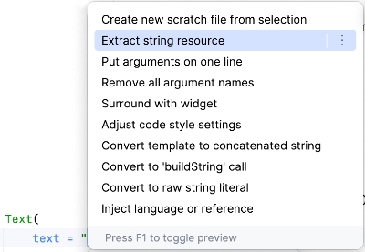
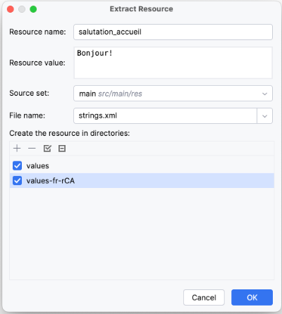
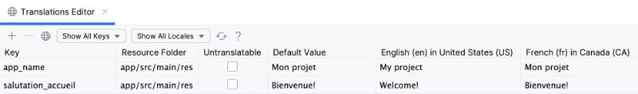

# Internationalisation et localisation


### 59.1 Internationalisation et localisation d'une application Android


L'internationalisation est constituée des techniques à mettre en place pour assurer que le texte, les images, les symboles monétaires, voire même les couleurs et les images puissent être adaptés à différentes langues et régions.


La localisation, quant-à-elle, est l'adaptation qui a été faite pour une langue et une région précise.


Illustrons ceci avec des chaînes de caractères :


#### Internationaliser une chaîne consiste à créer une ressource pour cette chaîne et à utiliser cette ressource dans le
code.


#### Localiser une chaîne consiste à inscrire dans un fichier de ressources la traduction de cette chaîne dans une langue
et région donnée.


### Principe de base : il ne faut jamais écrire une chaîne en dur dans le code si elle est destinée à être affichée
directement ou indirectement.


Dans une application correctement internationalisée, au lieu d'écrire ceci :


```kotlin title="Jetpack Compose (Kotlin)"
Text(text = "Bonjour!" )
```


On écrira ceci :


```kotlin title="Jetpack Compose (Kotlin)"
Text(text = stringResource(R.string.salutation_accueil))
```


Mais pour que ça fonctionne, il faut que la chaîne ait été internationalisée puis localisée.


### Choisir les localisations supportées par l'application


Une application peut supporter une ou plusieurs langues et régions, par exemple fr_CA, fr_FR, en_US, etc.


Pour ajouter une langue et région dans un projet dans Android Studio :


#### Faites un clic droit sur le fichier  MonProjet/app/src/main/res/values/strings.xml  puis choisissez Open Translations Editor .


#### Cliquez sur l'icône de planète ( Add Locale ) dans le haut de l'écran.


#### Sélectionnez la langue et région désirée. Ceci a pour effet :


#### d'ajouter une colonne dans le tableau des chaînes à localiser pour y entrer la traduction;


#### d'ajouter un dossier dont le nom débute par values et se termine par le code de localisation avec un r
devant le code de région (ex : values-fr-rCA ). C'est dans ce dossier que le fichier de ressources pour cette langue et région sera enregistré.


### Extraire les chaînes à internationaliser (internationaliser l'application)


Il est intéressant de se préoccuper de l'internationalisation dès le début d'un projet car, avec Android Studio ou IntelliJ, il faut créer manuellement une ressource pour chacune des chaînes à localiser.


Heureusement, un petit raccourci permet de nous sauver du travail :


#### Dans le code, repérez une chaîne codée en dur.


#### Sélectionnez la chaîne. Vous pouvez sélectionner les guillemets ou pas. Si la chaîne est un **modèle de chaîne]** et donc qu'elle
contient une variable, Android saura gérer.


#### Appuyez sur Alt + Entrée (Windows) ou  ⌥ Option + Entrée (Mac).


#### Cliquez sur Extract string resource .





#### Donnez un nom à la ressource. Les normes de programmation demandent d'utiliser la **casse serpent]** pour nommer les ressources.


#### La ressource doit être ajoutée au fichier strings.xml pour chacune des localisations supportées par l'application.
Cochez donc chacun des dossiers de ressource présentés au bas de la fenêtre.





#### Lorsque vous cliquez sur OK, il se passe deux choses :


#### la chaîne est ajoutée aux fichiers strings.xml cochés;


#### le code est automatiquement modifié pour utiliser cette ressource.


```kotlin title="Jetpack Compose (Kotlin)"
Text(text = stringResource(R.string.salutation_accueil))
```


#### Pour voir la nouvelle ressource dans Translations Editor, vous devrez peut-être cliquer sur l'icône de rafraîchissement.


### Localiser les chaînes


Pour entrer les textes qui seront effectivement utilisés par l'application selon la langue configurée sur l'appareil mobile :


#### Faites un clic droit sur le fichier  MonProjet/app/src/main/res/values/strings.xml  puis choisissez Open Translations Editor .


#### Pour chacune des ressources, la valeur par défaut est celle qui avait été sélectionnée lors de l'extraction de la chaîne.
Vous pouvez la changer au besoin. C'est cette valeur qui sera utilisée si aucune des langues configurées sur l'appareil n'est pas supportée par l'application.


#### Entrez la chaîne à utiliser pour chacune des localisations supportées par l'application.





#### Cette traduction sera automatiquement transposée dans le fichier strings.xml de la localisation correspondante. Pas
besoin d'éditer manuellement les fichiers de ressources!


```xml title="Fichier MonProjet/app/main/res/values-fr-rCA/strings.xml"
<?xml version="1.0" encoding="utf-8"?>
<resources>
    <string name="app_name">Mon projet</string>
    <string name="salutation_accueil">Bienvenue!</string>
</resources>
```


#### Pour plus d'information


* [« Localiser votre application » - Android Developers](https://developer.android.com/guide/topics/resources/localization?hl=fr)


* [« Localiser l'interface utilisateur avec l'éditeur de traductions » - Android Developers](https://developer.android.com/studio/write/translations-editor?hl=fr)


### * [« A Deep Dive into Internationalizing Jetpack Compose Android Apps » - Phrase](https://phrase.com/blog/posts/internationalizing-jetpack-compose-android-apps/)
59.2 Retrouver la configuration de localisation par programmation


Si votre application Jetpack Compose a besoin de réagir différemment selon la langue configurée sur l'appareil mobile, ou simplement d'afficher cette configuration, vous pouvez faire ceci :


```kotlin title="Jetpack Compose (Kotlin)"
val configuration = LocalConfiguration.current
val codeLocalisation = configuration.locales.get(0)   // chaîne du genre fr_CA ou en_US
Text("Langue: $codeLocalisation")   
```


## 60. Liens hypertexte


---
