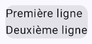
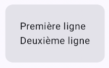
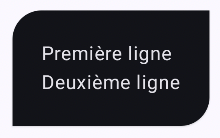
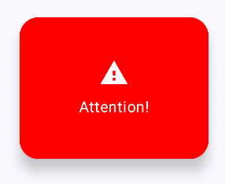
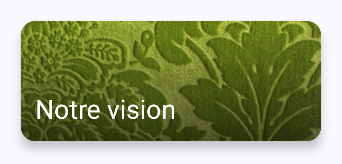

# Liens hypertexte


### 60.1 Lien hypertexte avec buildAnnotatedString()


Dans une application Android avec Jetpack Compose, il est possible de créer un lien hypertexte qui permettra d'ouvrir l'URL dans un navigateur.


```kotlin title="Jetpack Compose (Kotlin)"
Text(
    buildAnnotatedString {
        withLink(
            LinkAnnotation.Url(
                "https://apical.xyz",
            )
        ) {
            append("Apical")
        }
    }
)
```


Et pour styler le texte du lien :


```kotlin title="Jetpack Compose (Kotlin)"
Text(
    buildAnnotatedString {
        withLink(
            LinkAnnotation.Url(
                "https://apical.xyz",
                styles = TextLinkStyles(
                    style = SpanStyle(
                        fontSize = 25.sp,
                    )
                ),
            )
        ) {
            append("Apical")
        }
    }
)
```


Notez qu'auparavant, on utilisait un texte enrichi avec un addStringAnnotation et le composable ClickableText. Ce composable est obsolète depuis la sortie de
Compose Foundation 1.7.0
 en 2024.


```kotlin title="Jetpack Compose (Kotlin)"
val texteAvecHyperlien = buildAnnotatedString {
    append("Source : Android Developers")
    addStringAnnotation(
        tag = "URL",
        annotation = "https://developer.android.com/jetpack/compose",
        start = 9, // le caractère à l'indice 9 sera le premier cliquable
        end = 27 // le caractère à l'indice 27 ne sera plus cliquable (la fin de la chaîne est à la position 26)
    )
}
ClickableText(
    text = texteAvecHyperlien,
    onClick = { offset ->
        texteAvecHyperlien.getStringAnnotations(tag = "URL", start = offset, end = offset)
            .firstOrNull()?.let { annotation ->
                val intent = Intent(Intent.ACTION_VIEW, Uri.parse(annotation.item))
                    context.startActivity(intent)    // Ouvre le lien dans un navigateur
            }
    }
)
```


### 60.2 Card()


La fonction modulable Card
 permet de regrouper des composables en les plaçant par exemple dans un rectangle stylisé.


Voici un exemple de base du Card.


```kotlin title="Jetpack Compose (Kotlin)"
Card {
    Text("Première ligne")
    Text("Deuxième ligne")
}
```


<div style="text-align: center; margin: 1.5em 0;">
  
</div>


Si on fait Ctrl +Clic sur le mot Card dans Android Studio, on voit que le Card est simplement un composable Surface qui contient un Column.


Dans les faits, on ajoutera souvent un Column ou un Row à l'intérieur du Card pour ajouter de l'espacement intérieur (padding).


```kotlin title="Jetpack Compose (Kotlin)"
Card {
    Column(
        modifier = Modifier.padding(24.dp)
    ) {
        Text("Première ligne")
        Text("Deuxième ligne")
    }
}
```


<div style="text-align: center; margin: 1.5em 0;">
  
</div>


Il est possible de modifier l'apparence du Card à l'aide de ses propriétés, par exemple sa couleur, le rayon de ses coins et sa bordure.


```kotlin title="Jetpack Compose (Kotlin)"
Card (
    colors = CardDefaults.cardColors(
        containerColor = MaterialTheme.colorScheme.background,
    ),
    shape = RoundedCornerShape(25),
    border = BorderStroke(1.dp, Color.Black)
) {
    Column(
        modifier = Modifier.padding(24.dp)
    ) {
        Text("Première ligne")
        Text("Deuxième ligne")
    }
}
```


<div style="text-align: center; margin: 1.5em 0;">
  
</div>


On peut aussi ajouter de l'élévation pour modifier légèrement le visuel.


```kotlin title="Jetpack Compose (Kotlin)"
Card (
    colors = CardDefaults.cardColors(
        containerColor = MaterialTheme.colorScheme.background,
    ),
    shape = RoundedCornerShape(25),
    border = BorderStroke(1.dp, Color.Black),
    elevation = CardDefaults.cardElevation(10.dp)
) {
    Column(
        modifier = Modifier.padding(24.dp)
    ) {
        Text("Première ligne")
        Text("Deuxième ligne")
    }
}
```


<div style="text-align: center; margin: 1.5em 0;">
  
</div>


Il existe également le composable ElevatedCard qui contient une élévation par défaut.


Cette fois, pas possible de lui ajouter de bordure.


Vous remarquerez également que la couleur par défaut n'est pas la même qu'avec Card.


```kotlin title="Jetpack Compose (Kotlin)"
ElevatedCard  {
    Column(
        modifier = Modifier.padding(24.dp)
    ) {
        Text("Première ligne")
        Text("Deuxième ligne")
    }
}
```


<div style="text-align: center; margin: 1.5em 0;">
  
</div>


Je vous présente ici quelques exemples intéressants de configurations avec Card ou ElevatedCard.


```kotlin title="Jetpack Compose (Kotlin)"
Card(
    shape = CutCornerShape(topStart = 16.dp, bottomEnd = 8.dp) ,
) {
    Column(
        modifier = Modifier.padding(24.dp)
    ) {
        Text("Première ligne")
        Text("Deuxième ligne")
    }
}
```


<div style="text-align: center; margin: 1.5em 0;">
  
</div>


```kotlin title="Jetpack Compose (Kotlin)"
ElevatedCard(
    shape = RoundedCornerShape(
        topStart = 24.dp,
        topEnd = 0.dp,
        bottomStart = 0.dp,
        bottomEnd = 24.dp
    ),
    colors = CardDefaults.cardColors(
        containerColor = MaterialTheme.colorScheme.inverseSurface
    ),
) {
    Column(
        modifier = Modifier.padding(24.dp)
    ) {
        Text("Première ligne")
        Text("Deuxième ligne")
    }
}
```


<div style="text-align: center; margin: 1.5em 0;">
  
</div>


```kotlin title="Jetpack Compose (Kotlin)"
Card(
    onClick = { faireQuelqueChose() } ,
    colors = CardDefaults.cardColors(
        containerColor = MaterialTheme.colorScheme.primaryContainer
    )
) {
    Row(
        modifier = Modifier.padding(20.dp),
        verticalAlignment = Alignment.CenterVertically
    ) {
        Icon(Icons.Default.Info, contentDescription = "info")
        Spacer(Modifier.width(16.dp))
        Text("Cliquez ici pour plus de détails.")
    }
}
```


<div style="text-align: center; margin: 1.5em 0;">
  
</div>


```kotlin title="Jetpack Compose (Kotlin)"
ElevatedCard(
    shape = RoundedCornerShape(20.dp),
    elevation = CardDefaults.elevatedCardElevation(defaultElevation = 8.dp),
    colors = CardDefaults.elevatedCardColors(
        containerColor = Color.Red
    ),
    modifier = Modifier.size(width = 200.dp, height = 150.dp)
) {
    Column(
        modifier = Modifier
            .fillMaxSize()
            .padding(16.dp),
        horizontalAlignment = Alignment.CenterHorizontally,
        verticalArrangement = Arrangement.Center
    ) {
        Icon(
            Icons.Default.Warning,
            contentDescription = "Alerte",
            tint = Color.White,
            modifier = Modifier.size(32.dp)
        )
        Spacer(Modifier.height(8.dp))
        Text(
            text = "Attention!",
            color = Color.White
        )
    }
}
```


<div style="text-align: center; margin: 1.5em 0;">
  
</div>


```kotlin title="Jetpack Compose (Kotlin)"
ElevatedCard(
    elevation = CardDefaults.elevatedCardElevation(5.dp),
    modifier = Modifier.size(250.dp, 100.dp)
) {
    Box(
        modifier = Modifier.fillMaxSize()
    ) {
        Image(
            painter = painterResource(R.drawable.versailles),
            contentDescription = "fond",
            contentScale = ContentScale.Crop,
        )
        Box(
            modifier = Modifier
                 .fillMaxSize()
                 .background(
                      Brush.verticalGradient(
                          colors = listOf(Color.Transparent, Color.Black.copy(alpha = 0.6f)),
                      )
                 )
         )
         Text(
            "Notre vision",
            color = Color.White,
            style = MaterialTheme.typography.titleLarge,
            modifier = Modifier.align(Alignment.BottomStart).padding(12.dp)
         )
    }
}
```


<div style="text-align: center; margin: 1.5em 0;">
  
</div>


#### Pour plus d'information


### « Card ». Android Developers. https://developer.android.com/jetpack/compose/components/card
61. Exercice 10


---
