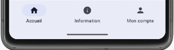

# Navigation multi-écrans


### 63.1 La navigation


Beaucoup d'applications mobiles nécessitent un système de navigation pour gérer comment l'application passe d'un écran à l'autre.


Je vous propose ici une technique à appliquer dans une application mobile Android avec JetPack Compose qui utilise l'API NavController
.


Dans cette fiche :


#### Ajout de dépendances


#### NavController


#### NavHost


#### Affichage de la page actuelle


#### Naviguer vers une page


#### Passer des paramètres à une route


#### Route avec paramètres de types différents


#### Route avec paramètres optionnels


### Ajout de dépendances


Pour ajouter une fonctionnalité de navigation dans votre application, vous devez d'abord ajouter une dépendance au projet.


Dans le fichier build.gradle.kts qui se trouve dans le dossier app , ajoutez ceci :


```kotlin title="Fichier app/build.gradle.kts"
dependencies {
    ...
     // pour la navigation
    implementation("androidx.navigation:navigation-compose:2.9.5")
}
```


Une fois la dépendance ajoutée, il faut **resynchroniser le projet pour qu'il tienne compte de
l'ajout**.


### NavController


Votre application doit avoir accès à une instance de NavController.


L'instanciation doit avoir lieu dans un composable. Il faut choisir l'endroit le plus près de où on en aura besoin.


Dans cet exemple, le Scaffold est le premier composable qui a besoin du NavController.


```kotlin title="Jetpack Compose (Kotlin)"
import androidx.navigation.compose.rememberNavController
...
val navController = rememberNavController()
Scaffold(
    ...
)
```


### NavHost


La liste des composables qui peuvent être rejoints par navigation sera définie dans un NavHost
. Cette liste est en fait une liste des routes possibles dans
l'application. Ces routes sont parfois appelées itinéraires ou destinations.


Le NavHost sera placé dans une fonction modulable que l'on codera dans son propre fichier, placé au même niveau que MainActivity.kt .


Pour chaque route, on spécifiera le nom qui sera utilisé pour la rejoindre puis le nom de la fonction modulable à appeler.


Lorsque l'application contient une **barre de navigation]**, la route passera le navController en paramètre
seulement si la fonction modulable a besoin de travailler avec cette variable.


```kotlin title="Fichier NavigationHost.kt"
import androidx.navigation.NavHostController
import androidx.navigation.compose.NavHost
...
@Composable
fun NavigationHost (navController: NavHostController) {
    NavHost(navController = navController, startDestination = "home") {
        composable("home") {
            HomeScreen (...)
        }
        composable(" pageUn ") {
              PageUn (...)
        }
        composable("pageDeux") {
              PageDeux (...)
        }
    }
}
```


### Il est d'usage de placer chaque fonction modulable de cette liste dans son propre fichier, sous le dossier ui .
Le nom du fichier sera le même que le nom de la fonction.


```kotlin title="Fichier ui/ HomeScreen .kt"
@Composable
fun HomeScreen(...) {
    ...
}
```


```kotlin title="Fichier ui/ PageUn .kt"
@Composable
fun PageUn(...) {
    ...
}
```


```kotlin title="Fichier ui/ PageDeux .kt"
@Composable
fun PageDeux(...) {
    ...
}
```


### Affichage de la page actuelle


Dans le Scaffold, c'est le NavigationHost qui indiquera quelle page doit être affichée.


Remarquez l'utilisation du Column qui permet de spécifier une fois pour toutes les espacements à utiliser.


D'autres configurations peuvent y être apportées au besoin.


```kotlin title="Jetpack Compose (Kotlin)"
val navController = rememberNavController()
Scaffold(
    ...
) {
    Column(
        modifier = Modifier
            .padding(it)
    ) {
         NavigationHost (navController = navController)
    }
}
```


### Naviguer vers une page


La méthode navController.navigate permet d'atteindre la page souhaitée et de l'ajouter à la pile des pages affichées.


```kotlin title="Jetpack Compose (Kotlin)"
Button(
    onClick = {
        navController.navigate(" pageUn ")
    }
) {
    Text(text = "Page un")
}
```


Pour revenir à la page d'avant et ainsi la sortir de la pile, on utilisera .popBackStack()
.


```kotlin title="Jetpack Compose (Kotlin)"
navController.popBackStack()
```


### Passer des paramètres à une route


Pour définir une route qui peut recevoir un paramètre :


```kotlin title="Fichier NavigationHost.kt"
NavHost(navController = navController, startDestination = "home") {
    ...
    composable("rechercherItem/{texte}") { navBackStackEntry ->
        // extraire le paramètre à partir de la route
        val texte: String? = navBackStackEntry.arguments?.getString("texte")
        // passer le paramètre à la fonction modulable
        RechercherItem(navController, texte)
    }
}
```


Le composable qui recevra un paramètre devra le déclarer comme pouvant être nul. Sachez cependant que si vous ne passez pas de paramètre lorsque vous
naviguez vers cette route, le programme plantera.


```kotlin title="Jetpack Compose (Kotlin)"
@Composable
fun RechercherItem(navController: NavController, texte: String?) {
    ...
}
```


Pour naviguer vers une route avec paramètre :


```kotlin title="Jetpack Compose (Kotlin)"
navController.navigate("rechercherItem/$variable")
```


### Route avec paramètres de types différents


Par défaut, les paramètres sont des chaînes de caractères.


Si vous avez besoin d'un paramètre d'un autre type, par exemple un entier, vous devez le spécifier comme suit :


```kotlin title="Fichier NavigationHost.kt"
NavHost(navController = navController, startDestination = "home") {
    ...
    composable(
        route = "editerItem/{itemId}",
        arguments = listOf(
             navArgument("itemId") { type = NavType.IntType }
        )
    ) { navBackStackEntry ->
        // extraire le paramètre à partir de la route
        val itemId: Int = navBackStackEntry.arguments?. getInt ("itemId") ?: -1
        // passer le paramètre à la fonction modulable
        EditerItem(navController, itemId)
    }
}
```


Pour naviguer vers cette route :


```kotlin title="Jetpack Compose (Kotlin)"
navController.navigate("editerItem/${item.id}")
```


### Route avec paramètres optionnels


Si le paramètre est optionnel :


```kotlin title="Fichier NavigationHost.kt"
NavHost(navController = navController, startDestination = "home") {
    ...
    composable("detailsItem ? {itemId}") { navBackStackEntry ->
        // extraire le paramètre à partir de la route
        val itemId: String? = navBackStackEntry.arguments?.getString("itemId") ?: ""
        // passer le paramètre à la fonction modulable
        DetailsItem(navController, itemId)
    }
}
```


Cette fois, il sera possible de ne pas passer de paramètre au besoin.


```kotlin title="Jetpack Compose (Kotlin)"
navController.navigate("detailsItem")
```


#### Pour plus d'information


* [« Naviguer avec Compose » - Android Developers](https://developer.android.com/jetpack/compose/navigation?hl=fr)


### « Navigation et pile "Retour* [«  » - Android Developers](https://developer.android.com/guide/navigation/backstack?hl=fr)
63.2 Le ViewModel et la navigation


On sait que dans une application, le ViewModel ne doit exister qu'en un seul exemplaire. Il doit donc être instancié à l'endroit approprié puis passé en paramètre aux
fonctions modulables qui en ont besoin.


Dans le cas où une application qui travaille avec un ViewModel a besoin de navigation, une solution consiste à déclarer le ViewModel dans le NavigationHost puis à
le passer en paramètre aux composables dans les routes où c'est nécessaire.


```kotlin title="Fichier NavigationHost.kt"
@Composable
fun NavigationHost(navController: NavHostController) {
     val categorieViewModel: CategorieViewModel = viewModel()
    NavHost(navController = navController, startDestination = "home") {
        ...
        composable("listeCategories") {
            ListeCategories( categorieViewModel , ...)
        }
    }
}
```


Une autre technique consiste à déclarer le ViewModel au même endroit que le navController et à le passer en paramètre au NavigationHost.


```kotlin title="Jetpack Compose(Kotlin)"
@Composable
fun MainScreen() {
    val navController = rememberNavController()
     val categorieViewModel: CategorieViewModel = viewModel()
    Scaffold(
        ...,
        content = {
            ...
            NavigationHost(navController, categorieViewModel )
        }
    )
}
```


```kotlin title="Fichier NavigationHost.kt"
@Composable
fun NavigationHost(navController: NavHostController, categorieViewModel: CategorieViewModel ) {
    NavHost(navController = navController, startDestination = "home") {
        ...
        composable("listeCategories") {
            ListeCategories( categorieViewModel , ...)
        }
    }
}
```


### 63.3 BottomAppBar


La classe BottomAppBar
 permet de définir ce qui apparaîtra dans le bas de l'écran.


La barre de navigation ainsi obtenue est très versatile.


Typiquement, on y ajoutera des icônes ou du texte pour effectuer des tâches ou pour atteindre différents écrans de l'application.


```kotlin title="Jetpack Compose (Kotlin)"
val navController = rememberNavController()
Scaffold(
    ...
    bottomBar = {
        BottomAppBar() {
            IconButton(onClick = {
                navController.navigate("home")
            }) {
                Icon(Icons.Filled.Home, contentDescription = "Accueil")
            }
            ...
        }
    }
) {
    ...
}
```


Et voici le résultat.


Notez que l'espacement entre les icônes doit être effectué manuellement.


Voici un exemple de barre de navigation qui utilise des Button plutôt que des icônes.


#### Pour plus d'information


* [« Barres d'application » - Android Developer](https://developer.android.com/develop/ui/compose/components/app-bars?hl=fr)


### * [« Composants et mises en page Material - Barres d'application » - Android Developpers](https://developer.android.com/jetpack/compose/layouts/material?hl=fr#app-)
bars
63.4 NavigationBar


Lorsqu'une application Android avec Jetpack Compose comprend de 3 à 5 icônes de navigation, il est possible d'utiliser un NavigationBar
 plutôt que de styliser
manuellement les liens de navigation.


Cette limite du nombre d'icônes provient de la documentation du NavigationBar
 :


### NavigationBar should contain three to five NavigationBarItems, each representing a singular


### destination.


Si votre application ne répond pas à cette exigence, vous devrez **configurer la barre de navigation avec BottomAppBar]**.


Voici un exemple d'application qui utilise un NavigationBar pour afficher trois icônes dans sa barre de navigation.


```kotlin title="Jetpack Compose (Kotlin)"
val navController = rememberNavController()
val currentBackStackEntry = navController.currentBackStackEntryAsState().value?.destination?.route
Scaffold(
    ...
    bottomBar = {
        NavigationBar() {
            NavigationBarItem(
                icon = {
                    Icon(
                         imageVector = Icons.Default.Home,
                         contentDescription = "Accueil"
                    )
                 },
                 label = {
                    Text("Accueil")
                 },
                 selected = currentBackStackEntry == "home",
                 onClick = {
                    navController.navigate("home")
                }
            )
            NavigationBarItem(
                icon = {
                    Icon(
                         imageVector = Icons.Default.Info,
                         contentDescription = "Information"
                    )
                 },
                 label = {
                    Text("Information")
                 },
                 selected = currentBackStackEntry == "information",
                 onClick = {
                    navController.navigate("information")
                }
            )
            NavigationBarItem(
                icon = {
                    Icon(
                         imageVector = Icons.Default.Person,
                         contentDescription = "Mon compte"
                    )
                 },
                 label = {
                    Text("Mon compte")
                 },
                 selected = currentBackStackEntry == "compte",
                 onClick = {
                    navController.navigate("compte")
                }
            )
        }
    }
) {
    ...
}
```


Voici la barre de navigation obtenue.


Remarquez que les icônes sont automatiquement espacés pour prendre toute la largeur de l'écran.


De plus, un indicatif visuel marque l'icône qui correpond à la page active.





> **Source** : 

### 1. * [« androidx.compose.material3 - NavigationBar » - Android Developers](https://developer.android.com/reference/kotlin/androidx/compose/material3/package-)
summary#navigationbar
64. Exercice 11


---
