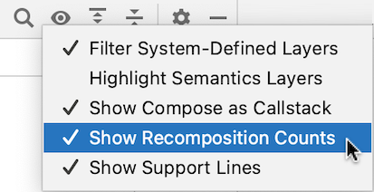
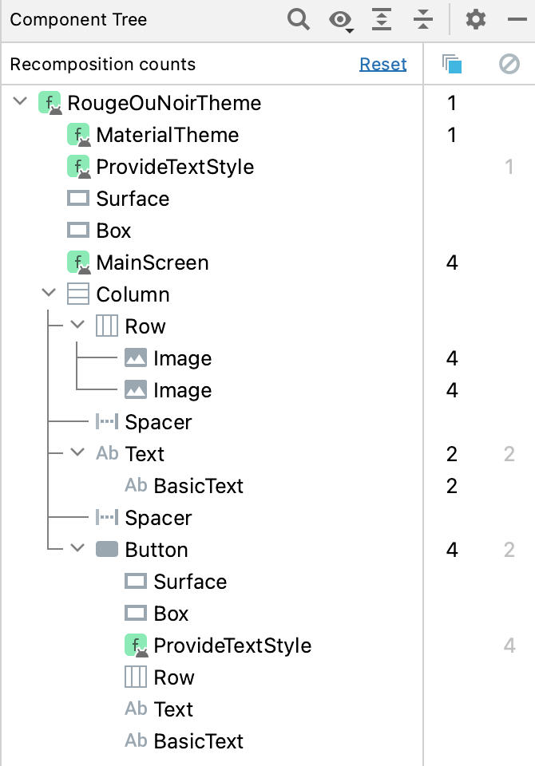

# Optimisation des performances Compose

### 80.1 Quelques principes d'optimisation

...

#### Pour plus d'information

* [« Suivez les bonnes pratiques - Reporter les lectures le plus longtemps possible » - Android Developers](https://developer.android.com/jetpack/compose/performance/bestpractices?hl=fr#defer-reads)

### 80.2 Afficher le nombre de recompostion de chaque fonction modulable

Avec IntelliJ, il est possible d'afficher le nombre de fois qu'une fonction modulable est recomposée. Ceci est utile pour cibler les endroits où il y a perte de performance.

Pour afficher le nombre de recompositions de chaque fonction modulable :

#### Ouvrez l'inspecteur de mise en page (Layout Inspector) : View / Tool Windows / Layout Inspector .

#### Dans la fenêtre Layout Inspector, cliquez sur l'icône View Options for Component Tree (en forme d'oeil) puis choisissez

#### Show Recomposition Counts .

#### Lancez votre application **dans un émulateur]**.

#### Naviguez dans votre application et voyez au fur et à mesure :

#### en rouge dans l'aperçu : les zones recomposées

#### à droite du nom de chaque module composable : le nombre de recompositon effectives

#### en gris : le nombre de recompositions ignorées

## 81. La programmation asynchrone

---
