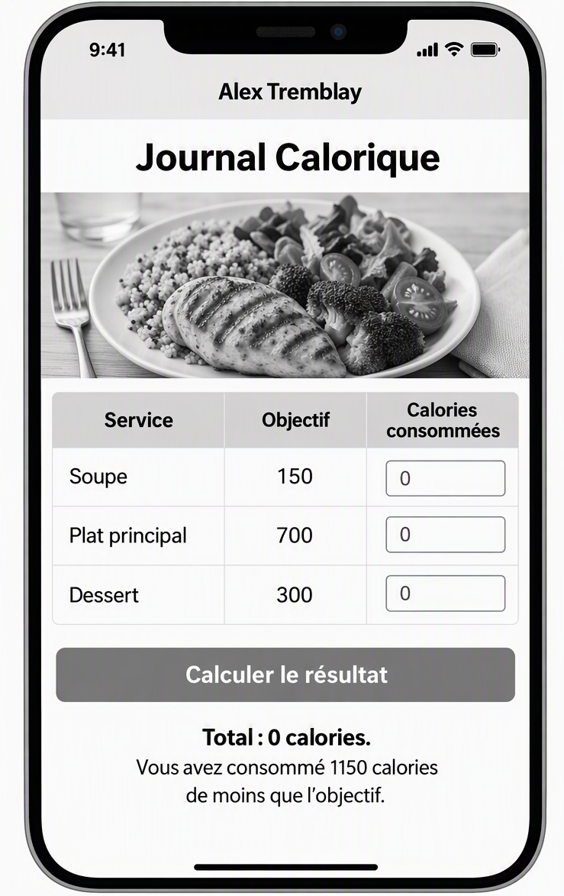

# Applications Mobiles 2 - Examen Sommatif 1 Jetpack Compose : Journal Calorique

*	Cet examen pratique est noté sur 25 points et compte pour 25% de la note finale.
*	Vous disposez de deux périodes de 50 minutes pour effectuer le travail demandé.
*	Vous devez réaliser seul les étapes demandées.
*	Vous avez droit à toutes vos notes, exercices et à la consultation de documents sur Internet, incluant recherches via udm14.org
*	Vous n’avez pas droit aux outils de communication ni à l'IA.
*   La surveillance d'écran via Exam.net est obligatoire - le lien à suivre est fourni via Teams. Déconnectez-vous seulement après avoir remis votre travail sur Teams.
*   Ne fermez pas l'onglet du navigateur contenant la surveillance d'écran. Faire `Alt-Tab` pour passer aux autres applications sur votre portable.

## Remise du travail

* Remettre le travail demandé sur Teams dans un fichier .zip nommé *NomPrenom_Examen1.zip*.
* Le fichier doit contenir le projet Android Studio complet *sauf* le dossier 'app/build'.

# Énoncé du travail

Vous devez développer une application mobile Android avec Jetpack Compose. Cette application, dont le nom du dossier principal est au format `NomPrenom_Examen1`, permet à un utilisateur d’inscrire les calories consommées pour chaque service d’un repas : soupe, plat principal et dessert.

## Présentation de l’écran

L’écran de l’application doit respecter les consignes suivantes. L’impression d’écran fournie est présentée à titre indicatif.

- La barre de titre doit afficher **votre nom**.
- Sous la barre de titre, l’application doit afficher le texte **« Journal Calorique »**.
- Ce texte doit être centré.
- L’image fournie sur Teams représentant une assiette équilibrée doit être affichée sous le titre.
- L’image doit occuper toute la largeur de l’écran.

## Carte des services

Sous l’image, l’application doit présenter une carte des services contenant les informations suivantes :

- Soupe, objectif 150 calories
- Plat principal, objectif 700 calories
- Dessert, objectif 300 calories

La carte des services doit être organisée en trois colonnes :

- **Service**
- **Objectif**
- **Calories consommées**

Chaque ligne doit contenir, pour un même service (soupe, plat principal ou dessert) :

- le nom du service;
- l’objectif calorique du service;
- une case de saisie permettant d’inscrire le nombre de calories consommées pour ce service.

Les cases de saisie doivent :

- être alignées l’une sous l’autre;
- accepter une valeur numérique;
- utiliser le clavier numérique;
- avoir une largeur raisonnable.

## Calcul du résultat

L’objectif calorique total du repas est de **1150 calories**.

Un bouton portant le texte **« Calculer le résultat »** doit être affiché sous la carte des services.

Lorsque l’utilisateur appuie sur ce bouton :

- le clavier doit disparaître;
- l’application doit calculer le nombre total de calories consommées;
- l’application doit comparer le total obtenu à l’objectif calorique total;
- un message doit présenter clairement le résultat.

### Exemples de messages

> **Total : 1050 calories.**  
> Vous avez consommé 100 calories de moins que l’objectif.

> **Total : 1150 calories.**  
> Vous avez atteint exactement l’objectif.

> **Total : 1350 calories.**  
> Vous avez consommé 200 calories de plus que l’objectif.

Le message doit être centré sous le bouton.

Aucune validation de saisie n’est requise. Vous pouvez considérer que l’utilisateur entre toujours un nombre valide dans chaque case.

## Apparence de l’application

Vous devez soigner l’apparence générale de l’application, notamment :

- les alignements
- les espacements
- les marges

## Gestion de l’état

Toutes les variables d’état doivent être gérées par un `ViewModel` associé à un `UiState`.

Le `UiState` doit contenir les propriétés suivantes :

- le nombre de calories de la soupe;
- le nombre de calories du plat principal;
- le nombre de calories du dessert;
- le message de résultat.

Le `ViewModel` doit permettre :

- de modifier le nombre de calories de la soupe;
- de modifier le nombre de calories du plat principal;
- de modifier le nombre de calories du dessert;
- de calculer le résultat et mettre à jour le message de résultat.

Les composables ne doivent pas calculer directement le total ni le résultat du repas. Ces calculs doivent être effectués par le `ViewModel`.

## Organisation du code

- L’écran doit utiliser un `Scaffold`.
- Le contenu du `Scaffold` doit être réalisé dans sa propre fonction composable.
- Le calcul du résultat doit être effectué par le `ViewModel`.
- La fonction composable principale doit observer le `UiState` fourni par le `ViewModel`.
